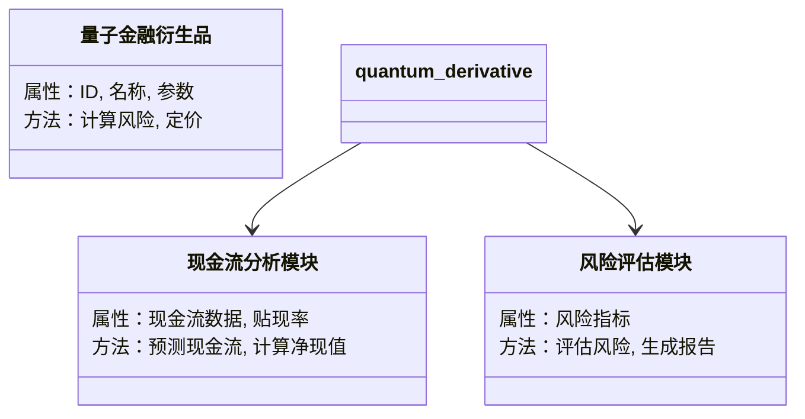

                 


# 巴菲特的现金流分析：量子金融衍生品的风险评估

## 关键词：
- 巴菲特
- 现金流分析
- 量子金融
- 风险评估
- 金融衍生品
- 投资分析
- 风险管理

## 摘要：
本文深入探讨了巴菲特的现金流分析方法在量子金融衍生品风险评估中的应用。通过结合现金流分析的核心原理与量子金融衍生品的独特特性，分析了如何利用现金流贴现模型和蒙特卡洛模拟等方法，评估量子金融衍生品的风险，并通过实际案例展示了现金流分析在投资决策中的实际应用。文章还详细讲解了系统架构设计和项目实现过程，为读者提供了全面的理解和实践指导。

---

# 第一部分：巴菲特的现金流分析基础

## 第1章：巴菲特现金流分析概述

### 1.1 巴菲特现金流分析的背景与意义

#### 1.1.1 传统财务分析的局限性
传统的财务分析方法，如市盈率和市净率，往往忽略了企业的实际现金流情况。这些指标虽然在一定程度上反映了企业的盈利能力，但无法准确评估企业的实际经营状况和未来现金流的稳定性。

#### 1.1.2 巴菲特现金流分析的核心理念
巴菲特的现金流分析方法强调对企业未来现金流的预测和贴现，通过分析企业的自由现金流和贴现率，评估企业的内在价值。这种方法更加注重企业的实际经营能力和财务健康状况。

#### 1.1.3 现金流分析在投资决策中的重要性
现金流分析是投资决策的核心工具之一。通过对企业的现金流进行分析，投资者可以更好地理解企业的盈利能力和抗风险能力，从而做出更科学的投资决策。

### 1.2 量子金融衍生品的基本概念

#### 1.2.1 量子金融的定义与特点
量子金融是一种基于量子计算和量子力学原理的金融分析方法，其特点是能够处理高度复杂的金融问题，提供更精准的定价和风险管理。

#### 1.2.2 金融衍生品的基本分类
金融衍生品主要包括远期合约、期货、期权和互换等类型。每种衍生品都有其独特的风险和收益特征。

#### 1.2.3 量子金融衍生品的独特性
量子金融衍生品结合了量子计算和传统金融衍生品的特点，能够在更短的时间内处理复杂的金融问题，提供更高效的定价和风险管理。

### 1.3 现金流分析与风险评估的关系

#### 1.3.1 现金流分析在风险评估中的作用
现金流分析是风险评估的重要工具之一。通过对企业的现金流进行分析，可以评估企业的还款能力和抗风险能力。

#### 1.3.2 量子金融衍生品的风险特征
量子金融衍生品的风险主要体现在价格波动和市场流动性上。由于其复杂性，风险评估需要借助先进的数学模型和计算工具。

#### 1.3.3 巴菲特现金流分析方法的优势
巴菲特的现金流分析方法能够有效地评估企业的未来现金流，从而帮助投资者更好地识别和管理量子金融衍生品的风险。

### 1.4 本章小结
本章介绍了巴菲特现金流分析的背景与意义，以及量子金融衍生品的基本概念和风险特征。现金流分析在投资决策中的重要性，为后续的分析奠定了基础。

---

## 第2章：巴菲特现金流分析的核心概念

### 2.1 现金流的分类与时间价值

#### 2.1.1 现金流入与流出的分类
现金流入主要包括营业收入、投资收益和筹资活动的现金流；现金流出主要包括经营成本、投资支出和偿还债务。

#### 2.1.2 现金流的时间价值与贴现率
现金流的时间价值是指资金随着时间的推移而产生的价值变化。贴现率是将未来现金流折现到当前价值的利率，通常包括无风险利率和风险溢价。

#### 2.1.3 现金流的净现值计算
净现值（NPV）是将未来现金流按贴现率折现到当前价值后，减去初始投资的净收益。NPV为正时，项目具有投资价值。

### 2.2 现金流分析框架

#### 2.2.1 现金流分析的基本步骤
1. 确定企业的未来现金流。
2. 选择合适的贴现率。
3. 将未来现金流折现到当前价值。
4. 计算净现值或其他相关指标。

#### 2.2.2 现金流贴现模型（DCF模型）
DCF模型是巴菲特现金流分析的核心工具之一，主要包括自由现金流（FCF）的预测和贴现。

#### 2.2.3 现金流分析的边界条件
边界条件包括企业的经营周期、市场环境和政策变化等因素，这些都会影响现金流分析的结果。

### 2.3 巴菲特现金流分析的核心要素

#### 2.3.1 自由现金流的概念
自由现金流（FCF）是指企业在扣除所有成本和债务后的剩余现金流，是衡量企业财务健康状况的重要指标。

#### 2.3.2 现金流质量的评估标准
现金流质量主要取决于现金流的稳定性和可持续性，高质量的现金流意味着企业具有较强的盈利能力。

#### 2.3.3 现金流与企业价值的关系
现金流是企业价值的核心驱动因素，高质量的现金流能够提升企业的市场价值和抗风险能力。

### 2.4 本章小结
本章详细介绍了现金流的分类与时间价值，现金流分析框架以及巴菲特现金流分析的核心要素。这些内容为后续的量子金融衍生品风险评估奠定了基础。

---

## 第3章：量子金融衍生品的风险评估方法

### 3.1 量子金融衍生品的基本属性

#### 3.1.1 量子金融衍生品的定义
量子金融衍生品是基于量子计算技术的金融衍生品，能够处理传统方法难以处理的复杂问题。

#### 3.1.2 量子金融衍生品的分类
量子金融衍生品主要包括量子期权、量子期货和量子互换等类型。

#### 3.1.3 量子金融衍生品的风险来源
量子金融衍生品的风险主要来自市场价格波动、流动性风险和模型风险。

### 3.2 现金流分析在量子金融衍生品中的应用

#### 3.2.1 现金流分析与量子金融衍生品定价
通过现金流分析，可以预测量子金融衍生品的未来现金流，从而为其定价提供依据。

#### 3.2.2 现金流分析与风险对冲
现金流分析可以帮助投资者制定有效的风险对冲策略，降低量子金融衍生品的投资风险。

#### 3.2.3 巴菲特现金流分析方法在量子金融衍生品中的独特视角
巴菲特的现金流分析方法强调对企业未来现金流的预测，能够帮助投资者更好地识别和管理量子金融衍生品的风险。

### 3.3 量子金融衍生品风险评估的核心指标

#### 3.3.1 风险价值（VaR）
VaR是指在给定置信水平下，投资组合在一定时间内的最大可能损失。

#### 3.3.2 预期损失（EL）
EL是指在给定时间段内，投资组合的平均损失。

#### 3.3.3 信用风险与市场风险的量化
通过现金流分析，可以量化量子金融衍生品的信用风险和市场风险，并制定相应的风险管理策略。

### 3.4 本章小结
本章探讨了量子金融衍生品的基本属性和风险评估的核心指标，分析了现金流分析在量子金融衍生品中的应用。

---

## 第4章：现金流贴现模型的算法原理

### 4.1 现金流贴现模型的数学公式

#### 4.1.1 净现值公式
$$ NPV = \sum_{t=1}^{n} \frac{CF_t}{(1 + r)^t} - I $$

其中，\( CF_t \) 表示第 \( t \) 年的现金流，\( r \) 为贴现率，\( I \) 为初始投资。

#### 4.1.2 内部收益率公式
$$ IRR = \sum_{t=1}^{n} \frac{CF_t}{(1 + IRR)^t} - I = 0 $$

#### 4.1.3 股权资本成本计算
使用CAPM模型计算股权资本成本：
$$ r = r_f + \beta \times (r_m - r_f) $$

其中，\( r_f \) 为无风险利率，\( \beta \) 为贝塔系数，\( r_m \) 为市场平均收益率。

### 4.2 现金流贴现模型的实现步骤

#### 4.2.1 确定贴现率
贴现率通常包括无风险利率和风险溢价。

#### 4.2.2 预测未来现金流
基于企业的财务数据和市场环境，预测未来各年的现金流。

#### 4.2.3 计算净现值
使用净现值公式，将未来现金流折现到当前价值，并减去初始投资。

#### 4.2.4 分析结果
根据净现值的正负，判断项目是否具有投资价值。

### 4.3 本章小结
本章详细讲解了现金流贴现模型的数学公式和实现步骤，为后续的量子金融衍生品风险评估提供了理论基础。

---

## 第5章：量子金融衍生品风险评估的系统分析

### 5.1 问题场景介绍
量子金融衍生品的风险评估需要结合现金流分析和量子计算技术，解决传统方法难以处理的复杂问题。

### 5.2 系统功能设计

#### 5.2.1 领域模型（Mermaid类图）


### 5.3 系统架构设计（Mermaid架构图）


### 5.4 系统接口设计
接口设计包括数据输入、模型调用和结果输出三个部分。

### 5.5 系统交互设计（Mermaid序列图）
```mermaid
sequenceDiagram
    participant 用户
    participant 系统
    用户->系统：提交量子金融衍生品参数
    系统->系统：调用现金流分析模块
    系统->系统：调用风险评估模块
    系统->用户：返回风险评估报告
```

### 5.6 本章小结
本章通过系统分析，展示了量子金融衍生品风险评估的实现过程，包括功能设计、架构设计和交互设计。

---

## 第6章：项目实战

### 6.1 环境安装
需要安装Python、Quantum Computing Library和相关金融分析库。

### 6.2 核心代码实现

#### 6.2.1 现金流预测代码
```python
def predict_cash_flow(revenue, cost):
    return revenue - cost
```

#### 6.2.2 风险评估代码
```python
def calculate_risk(cash_flow, discount_rate):
    npv = sum(cash_flow / (1 + discount_rate)**t for t in range(len(cash_flow))) 
    return npv
```

### 6.3 案例分析
以某量子金融衍生品为例，详细分析其现金流预测和风险评估过程。

### 6.4 项目总结
总结项目实现的过程和成果，指出可能的改进方向。

---

## 第7章：最佳实践与小结

### 7.1 最佳实践
1. 在进行现金流分析时，应充分考虑企业的实际经营状况和市场环境。
2. 量子金融衍生品的风险评估需要结合先进的数学模型和计算工具。

### 7.2 小结
本文通过详细讲解巴菲特的现金流分析方法，结合量子金融衍生品的特性，分析了现金流贴现模型和系统架构设计的实现过程，并通过实际案例展示了项目的实现过程和成果。

---

## 作者：AI天才研究院/AI Genius Institute & 禅与计算机程序设计艺术 /Zen And The Art of Computer Programming

