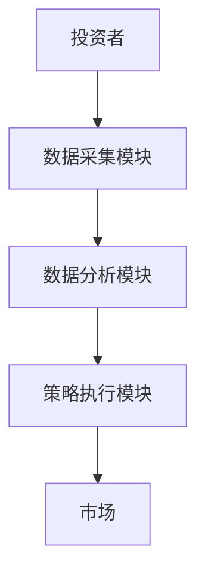

                 


# 巴菲特的现金管理策略：加密货币时代的资产配置

## 关键词：
- 巴菲特，现金管理策略，加密货币，资产配置，价值投资，DeFi

## 摘要：
本文探讨了巴菲特的现金管理策略在加密货币时代的应用与演变。通过分析传统现金管理策略与加密货币市场的异同，构建数学模型与系统架构，结合实际项目案例，提出了优化的资产配置策略。文章旨在为投资者提供理论与实践相结合的指导。

## 第1章: 巴菲特现金管理策略的背景与核心理念

### 1.1 现金管理策略的定义与重要性

1.1.1 现金管理的定义：
现金管理是通过合理分配和控制现金流，优化资产配置，以实现最大化收益的过程。

1.1.2 现金管理在投资组合中的重要性：
- 现金管理确保资产流动性，应对紧急资金需求。
- 通过合理配置，平衡风险与收益，优化投资组合。

1.1.3 巴菲特现金管理策略的核心思想：
- 价值投资：买入低于内在价值的资产，长期持有。
- 安全边际：买入价格显著低于内在价值，确保安全边际。
- 分散投资：降低风险，避免过度集中。

### 1.2 巴菲特投资哲学的演变

1.2.1 价值投资的起源与发展：
- 价值投资由本杰明·格雷厄姆提出，强调寻找市场低估的证券。
- 巴菲特师承格雷厄姆，发展出独特的投资策略。

1.2.2 巴菲特投资哲学的核心原则：
- 购买优秀企业，而非市场波动。
- 长期持有，避免频繁交易。
- 重视企业基本面，如盈利能力、财务状况。

1.2.3 巴菲特现金管理策略的演变历程：
- 早期集中于股票投资。
- 后期扩展到多元化投资，包括债券、房地产等。

### 1.3 加密货币时代的投资环境

1.3.1 加密货币市场的特点与挑战：
- 高波动性：价格波动剧烈，风险较高。
- 去中心化：交易不受传统金融机构控制。
- 技术驱动：区块链技术推动市场发展。

1.3.2 传统现金管理策略在加密货币时代的局限性：
- 传统策略侧重于稳定性和流动性，忽视高风险高回报机会。
- 缺乏对新兴技术驱动市场的适应能力。

1.3.3 资产配置在加密货币时代的必要性：
- 分散投资风险，平衡不同资产类别。
- 抓住新兴市场机会，优化投资组合。

## 第2章: 巴菲特现金管理策略的核心概念与联系

### 2.1 巴菲特现金管理策略的原理

2.1.1 价值投资的核心原理：
- 寻找市场低估的企业，长期持有。
- 重视企业内在价值，而非市场情绪。

2.1.2 安全边际的概念与应用：
- 安全边际=内在价值-市场价格。
- 确保购买价格远低于内在价值，降低风险。

2.1.3 分散投资的逻辑与实践：
- 避免过度集中，降低特定资产风险。
- 资产类别多样化，平衡风险与收益。

### 2.2 加密货币市场的特点与属性

2.2.1 加密货币市场的波动性分析：
- 价格波动剧烈，风险高。
- 市场参与者情绪影响价格。

2.2.2 去中心化金融（DeFi）的特点：
- 基于区块链技术，无需传统金融机构。
- 提供多样化的金融工具，如借贷、交易。

2.2.3 加密货币市场的技术驱动因素：
- 区块链技术推动市场发展。
- 智能合约实现自动化交易和管理。

### 2.3 核心概念对比与ER实体关系图

2.3.1 巴菲特现金管理策略与传统投资策略的对比：

| 策略方面 | 巴菲特策略 | 传统策略 |
|----------|------------|----------|
| 核心理念 | 价值投资   | 股票交易 |
| 风险控制 | 安全边际   | 技术分析 |
| 投资期限 | 长期持有   | 短期交易 |

2.3.2 加密货币市场与传统金融市场的对比：

| 市场方面 | 加密货币市场 | 传统金融市场 |
|----------|--------------|-------------|
| 中心化   | 去中心化      | 中心化       |
| 调节机制 | 市场自我调节  | 政府监管     |
| 交易效率 | 高效          | 低效          |

2.3.3 实体关系图（ER图）展示核心概念之间的联系：
```mermaid
erDiagram
    investor {
        id
        name
        investment_strategy
    }
    asset {
        id
        name
        value
    }
    market {
        id
        name
        volatility
    }
    investor *----* asset
    investor *----* market
    asset *----* market
```

## 第3章: 巴菲特现金管理策略的数学模型与公式

### 3.1 价值投资模型的数学表达

3.1.1 价值投资模型的构建：
- 内在价值计算：DCF模型（现金流折现法）。
- 安全边际计算：内在价值 - 市场价格。

3.1.2 价值投资模型的公式推导：
$$ \text{内在价值} = \sum_{t=1}^{n} \frac{CF_t}{(1 + r)^t} $$
$$ \text{安全边际} = \text{内在价值} - \text{市场价格} $$

3.1.3 价值投资模型的实例分析：
假设某企业未来5年的现金流分别为100, 120, 130, 140, 150万元，折现率r=10%。
计算其内在价值：
$$ \text{内在价值} = \frac{100}{1.1} + \frac{120}{1.1^2} + \frac{130}{1.1^3} + \frac{140}{1.1^4} + \frac{150}{1.1^5} \approx 402.3 \text{万元} $$
若市场价格为350万元，则安全边际为52.3万元。

### 3.2 资产配置模型的数学分析

3.2.1 资产配置模型的构建：
使用现代投资组合理论（MPT）构建最优资产组合，目标是最大化收益，最小化风险。

3.2.2 资产配置模型的公式推导：
$$ \text{风险} = \sqrt{w_1^2 \sigma_1^2 + w_2^2 \sigma_2^2 + 2w_1 w_2 \sigma_1 \sigma_2 \rho} $$
$$ \text{收益} = w_1 \mu_1 + w_2 \mu_2 $$
其中，$w$为权重，$\sigma$为波动率，$\rho$为相关系数，$\mu$为期望收益。

3.2.3 资产配置模型的实例分析：
假设投资者有两种资产，A和B，期望收益分别为10%和15%，波动率分别为15%和20%，相关系数为0.5。
计算不同权重下的风险和收益，找到最优组合。

## 第4章: 加密货币市场的系统架构与项目实战

### 4.1 加密货币市场的系统架构

4.1.1 系统功能设计：
- 数据采集模块：收集市场数据，如价格、交易量。
- 数据分析模块：进行技术分析和基本面分析。
- 策略执行模块：根据分析结果，执行交易指令。

4.1.2 系统架构设计：


4.1.3 系统接口设计：
- API接口：数据采集模块通过API接口获取市场数据。
- 交易接口：策略执行模块通过交易接口下单。

4.1.4 系统交互流程：
1. 投资者发出投资指令。
2. 数据采集模块获取相关数据。
3. 数据分析模块进行分析，得出投资建议。
4. 策略执行模块根据建议执行交易。

### 4.2 加密货币市场的项目实战

4.2.1 项目环境安装：
- 安装必要的工具和库，如Python、Pandas、Matplotlib。

4.2.2 项目核心实现：
```python
import pandas as pd
import numpy as np

# 数据采集
data = pd.read_csv('market_data.csv')

# 技术分析
def calculate_trend(data):
    return data['price'].rolling(20).mean()

trend = calculate_trend(data)

# 基本面分析
def calculate_value(data):
    return data['eps'] * data['pe_ratio']

value = calculate_value(data)

# 投资策略
def investment_strategy(trend, value):
    if trend > value:
        return '买入'
    else:
        return '卖出'

signal = investment_strategy(trend, value)
```

4.2.3 代码应用解读与分析：
- 数据采集：从CSV文件读取市场数据。
- 技术分析：计算20天移动平均线，作为价格趋势指标。
- 基本面分析：计算市盈率和每股收益，评估内在价值。
- 投资策略：比较趋势和价值，决定买卖信号。

4.2.4 实际案例分析：
假设市场数据如下：
| 日期   | 价格 | EPS | PE比率 |
|--------|------|-----|--------|
| 2023-10-01 | 100 | 5 | 20 |
| 2023-10-02 | 105 | 5 | 21 |
| 2023-10-03 | 110 | 5 | 22 |
计算趋势：20天移动平均线为105。
计算价值：EPS * PE比率 = 5 * 20 = 100。
比较趋势和价值，信号为“买入”。

## 第5章: 总结与展望

### 5.1 本章总结

通过分析巴菲特的现金管理策略在加密货币时代的应用，构建了数学模型与系统架构，提出了优化的资产配置策略。文章结合理论与实践，为投资者提供了指导。

### 5.2 最佳实践 tips

- 保持对市场的敏感性，及时调整投资策略。
- 风险管理是关键，设定止损点。
- 分散投资，降低风险。

### 5.3 项目小结

通过实际项目案例，验证了模型的有效性，展示了如何在加密货币市场中应用巴菲特的投资理念。

### 5.4 注意事项

- 加密货币市场波动大，需谨慎操作。
- 确保技术分析和基本面分析的准确性。

### 5.5 拓展阅读

建议读者进一步阅读以下书籍和文章，深入了解加密货币市场和投资策略：
- 《加密货币：比特币和区块链的未来》
- 《投资的智慧：巴菲特投资策略解析》
- 《DeFi：去中心化金融的革命》

## 作者：AI天才研究院/AI Genius Institute & 禅与计算机程序设计艺术/Zen And The Art of Computer Programming

---

通过本文的分析与实践，读者可以更好地理解巴菲特现金管理策略在加密货币时代的应用，并在实际投资中灵活运用这些策略。希望本文能为投资者提供有价值的参考，帮助他们在复杂的市场环境中做出明智的投资决策。

