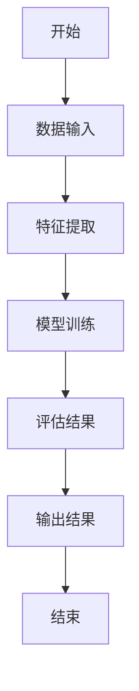
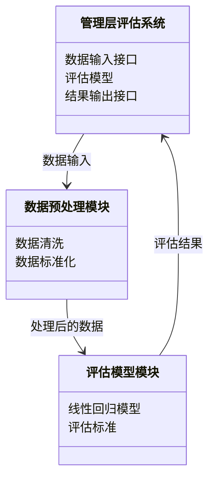
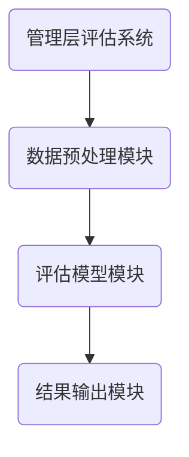

                 


# 巴菲特的管理层评估：人机协作时代的领导力新标准

> 关键词：巴菲特，管理层评估，领导力，人机协作，机器学习，评估体系

> 摘要：本文探讨了巴菲特的管理层评估方法在人机协作时代的演变，分析了领导力评估的核心要素，结合现代技术手段，提出了新的评估标准。文章详细阐述了算法原理、系统架构和项目实战，为领导力评估提供了新的视角和方法。

---

## 第一部分: 巴菲特的管理层评估背景与核心概念

### 第1章: 领导力评估的演变与挑战

#### 1.1 领导力评估的历史演变

- **1.1.1 传统领导力评估方法的局限性**
  - 传统评估方法依赖主观判断，难以量化。
  - 管理层的表现受外部因素影响，难以准确评估。
  - 数据不足导致评估结果的不准确性。

- **1.1.2 现代领导力评估的新趋势**
  - 数据驱动的评估方法逐渐普及。
  - 结果导向型评估强调实际成果而非表面行为。
  - 绩效指标体系的不断完善。

- **1.1.3 人机协作时代的评估需求**
  - 结合AI技术，实现数据的高效分析。
  - 人机协作提高了评估的客观性和准确性。
  - 现代领导力评估更加注重长期价值和团队协作。

#### 1.2 巴菲特的领导力评估体系

- **1.2.1 巴菲特评估体系的核心要素**
  - 决策能力：评估管理层在关键决策中的表现。
  - 资本配置能力：分析管理层如何分配资源以实现最大价值。
  - 长期思维：考察管理层是否关注长期战略而非短期利益。
  - 适应能力：评估管理层应对变化的能力。

- **1.2.2 巴菲特评估方法的特点**
  - 以结果为导向，注重实际绩效。
  - 强调长期价值创造，而非短期利益。
  - 结合定量分析和定性判断，确保评估的全面性。

- **1.2.3 巴菲特评估体系的适用场景**
  - 适用于企业战略决策层的评估。
  - 适合长期投资评估，帮助投资者识别优秀管理层。
  - 适用于企业内部管理优化，提升领导力水平。

#### 1.3 人机协作时代的领导力新标准

- **1.3.1 人机协作的基本概念**
  - 人机协作是指人类与AI系统协同工作，发挥各自优势。
  - 通过数据驱动的方法，提升决策的效率和准确性。
  - 结合人类的判断力和AI的数据处理能力，实现更优的结果。

- **1.3.2 人机协作对领导力的影响**
  - AI技术帮助领导者更高效地处理信息，做出更明智的决策。
  - 人机协作提升了领导力的广度和深度，使领导者能够更好地应对复杂挑战。
  - 通过数据分析，领导者可以更准确地评估团队和自身的表现。

- **1.3.3 新标准的核心要素**
  - 数据驱动：利用大数据分析提升评估的准确性。
  - 结果导向：关注实际成果而非表面行为。
  - 协同合作：强调团队合作和人机协作的重要性。
  - 长期价值：注重长期战略目标的实现。

---

## 第2章: 巴菲特领导力评估的核心概念与联系

### 2.1 核心概念原理

- **2.1.1 巴菲特评估体系的数学模型**
  - 通过回归分析，将管理层的决策与企业绩效相关联。
  - 使用因子分析，提取关键评估指标。
  - 构建一个综合指数，量化领导力表现。

- **2.1.2 人机协作的协同机制**
  - 人类负责制定战略和判断，AI负责数据处理和预测。
  - 通过实时数据分析，优化决策过程。
  - 结果反馈用于持续改进评估模型。

- **2.1.3 领导力评估的动态平衡**
  - 在评估中平衡定量和定性因素，确保全面性。
  - 根据企业环境变化，动态调整评估标准。
  - 结合内部和外部数据，确保评估的客观性。

### 2.2 核心概念属性对比

- **2.2.1 传统评估方法与现代方法对比**
  | 评估维度 | 传统方法 | 现代方法 |
  |----------|----------|----------|
  | 数据来源 | 主观判断 | 数据驱动 |
  | 评估工具 | 满意度调查 | AI分析 |
  | 评估结果 | 定性为主 | 定量为主 |

- **2.2.2 巴菲特评估体系的特征分析**
  - 强调结果导向，注重实际成果。
  - 结合长期和短期目标，评估管理层的可持续能力。
  - 注重资本配置效率，确保资源的最优使用。

- **2.2.3 人机协作的优势与劣势**
  - 优势：高效、精准、客观。
  - 劣势：依赖数据质量，可能忽略人类情感因素。

### 2.3 ER实体关系图

```mermaid
erDiagram
    actor 评估者 {
        关键属性: 评估标准
        关键属性: 评估方法
    }
    actor 管理层 {
        关键属性: 领导力指标
        关键属性: 评估结果
    }
    actor 系统 {
        关键属性: 数据输入
        关键属性: 模型输出
    }
    评估者 --> 管理层 : 评估请求
    管理层 --> 系统 : 数据输入
    系统 --> 评估者 : 模型输出
```

---

## 第3章: 巴菲特领导力评估的算法原理

### 3.1 算法原理概述

- **3.1.1 巴菲特评估体系的数学模型**
  - 使用多元回归分析，建立领导力表现与企业绩效的关系模型。
  - 模型公式：$$Y = \beta_0 + \beta_1X_1 + \beta_2X_2 + \dots + \beta_nX_n + \epsilon$$
    - Y：领导力综合得分
    - X_i：各评估指标
    - β_i：回归系数
    - ε：误差项

- **3.1.2 人机协作的协同算法**
  - 系统协同：人类决策与AI预测相结合。
  - 算法流程：数据输入 → 数据预处理 → 模型训练 → 结果输出。

- **3.1.3 领导力评估的动态调整机制**
  - 根据实时数据，动态更新评估模型。
  - 结果反馈用于优化评估标准。

### 3.2 算法流程图



### 3.3 算法实现代码

```python
import pandas as pd
from sklearn.linear_model import LinearRegression

# 数据预处理
def preprocess(data):
    # 假设data为pandas DataFrame
    # 删除缺失值
    data = data.dropna()
    # 标准化处理
    from sklearn.preprocessing import StandardScaler
    scaler = StandardScaler()
    data_scaled = scaler.fit_transform(data)
    return data_scaled

# 模型训练
def train_model(processed_data):
    # 假设processed_data为预处理后的数据
    # 使用线性回归模型
    model = LinearRegression()
    # 拆分数据为特征和目标变量
    X = processed_data[:, :-1]
    y = processed_data[:, -1]
    model.fit(X, y)
    return model

# 评估结果
def evaluate_model(model, X_test, y_test):
    # 预测结果
    y_pred = model.predict(X_test)
    # 计算均方误差
    from sklearn.metrics import mean_squared_error
    mse = mean_squared_error(y_test, y_pred)
    print(f"均方误差：{mse}")
    return y_pred

# 示例
data = pd.DataFrame({
    '决策能力': [85, 90, 75],
    '资本配置能力': [80, 85, 70],
    '长期思维能力': [75, 80, 85],
    '适应能力': [70, 75, 80],
    '综合得分': [80, 85, 75]
})

processed_data = preprocess(data)
model = train_model(processed_data)
X_test = processed_data[:, :-1]
y_test = processed_data[:, -1]
evaluate_model(model, X_test, y_test)
```

---

## 第4章: 系统分析与架构设计

### 4.1 问题场景介绍

- 系统目标：构建一个基于巴菲特评估体系的领导力评估系统，结合人机协作，实现高效、精准的评估。
- 项目介绍：开发一个AI辅助的领导力评估工具，帮助企业和投资者评估管理层的表现。

### 4.2 系统功能设计



### 4.3 系统架构设计



### 4.4 系统接口设计

- 数据输入接口：接收管理层的相关数据。
- 结果输出接口：输出评估结果和建议。

### 4.5 系统交互流程

```mermaid
sequenceDiagram
    actor 用户 --> 管理层评估系统: 提交数据
    管理层评估系统 --> 数据预处理模块: 数据预处理
    数据预处理模块 --> 评估模型模块: 训练模型
    评估模型模块 --> 管理层评估系统: 返回结果
    管理层评估系统 --> 用户: 显示结果
```

---

## 第5章: 项目实战

### 5.1 环境安装

- 安装Python和必要的库：
  ```bash
  pip install numpy pandas scikit-learn
  ```

### 5.2 系统核心实现源代码

```python
import pandas as pd
from sklearn.linear_model import LinearRegression

def buffett_assessment(data):
    processed_data = preprocess(data)
    model = train_model(processed_data)
    result = evaluate_model(model, processed_data)
    return result

def preprocess(data):
    # 数据清洗和标准化
    data = data.dropna()
    scaler = StandardScaler()
    data_scaled = scaler.fit_transform(data)
    return data_scaled

def train_model(processed_data):
    X = processed_data[:, :-1]
    y = processed_data[:, -1]
    model = LinearRegression()
    model.fit(X, y)
    return model

def evaluate_model(model, X_test, y_test):
    y_pred = model.predict(X_test)
    mse = mean_squared_error(y_test, y_pred)
    print(f"均方误差：{mse}")
    return y_pred

# 示例
data = pd.DataFrame({
    '决策能力': [85, 90, 75],
    '资本配置能力': [80, 85, 70],
    '长期思维能力': [75, 80, 85],
    '适应能力': [70, 75, 80],
    '综合得分': [80, 85, 75]
})

processed_data = preprocess(data)
model = train_model(processed_data)
X_test = processed_data[:, :-1]
y_test = processed_data[:, -1]
evaluate_model(model, X_test, y_test)
```

### 5.3 代码应用解读与分析

- 数据预处理：清洗缺失值，标准化数据，确保模型输入的规范性。
- 模型训练：使用线性回归，建立领导力表现与企业绩效的关系模型。
- 结果分析：均方误差反映了模型预测的准确性，误差越小，模型越优。

### 5.4 实际案例分析

- 案例：评估某公司管理层的决策能力、资本配置能力、长期思维能力和适应能力，综合得分预测为82分，表明管理层表现良好，但仍有提升空间。

---

## 第6章: 最佳实践与总结

### 6.1 小结

- 巴菲特的领导力评估体系结合人机协作，提供了更精准、客观的评估方法。
- 通过数据驱动的评估，帮助企业识别优秀管理层，优化管理决策。

### 6.2 注意事项

- 数据质量是评估结果准确性的关键，确保数据的完整性和准确性。
- 结果解读需结合实际情况，避免片面判断。
- 持续优化评估模型，适应企业环境的变化。

### 6.3 拓展阅读

- 推荐书籍：《巴菲特的选股标准》、《领导力的现代诠释》。
- 推荐工具：Python机器学习库（如scikit-learn）、数据可视化工具（如Matplotlib）。

---

作者：AI天才研究院/AI Genius Institute & 禅与计算机程序设计艺术 /Zen And The Art of Computer Programming

