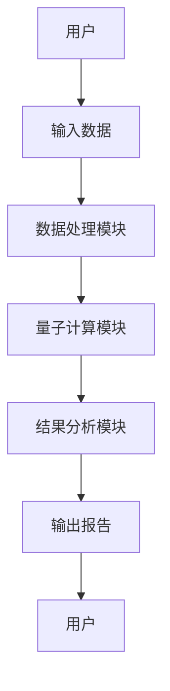

                 


# 巴菲特的经济周期投资：量子计算对宏观经济预测的革新

## 关键词：巴菲特，经济周期，量子计算，宏观经济预测，投资策略

## 摘要：本文探讨了巴菲特的经济周期投资理论，并分析了量子计算在宏观经济预测中的潜力。通过详细讲解量子计算的基本原理、算法实现、系统架构，以及结合实际案例的项目实战，展示了量子计算如何革新宏观经济预测，为巴菲特的投资策略提供新的视角和工具。

---

# 第一部分：背景介绍

## 第1章：巴菲特的经济周期投资概述

### 1.1 巴菲特投资理念的核心思想

#### 1.1.1 巴菲特的价值投资理论
巴菲特的价值投资理论强调长期投资、安全边际和内在价值。他认为，投资者应关注企业的基本面，而非短期市场波动。经济周期的波动对投资决策至关重要，尤其是在经济衰退或复苏期，巴菲特的投资策略会根据经济周期的阶段进行调整。

#### 1.1.2 经济周期对投资决策的影响
经济周期（繁荣、衰退、萧条、复苏）对企业盈利和市场估值有直接影响。巴菲特在经济衰退期倾向于寻找被低估的优质企业进行投资，在经济复苏期则倾向于逐步退出或调整投资组合。

#### 1.1.3 巴菲特投资策略的哲学基础
巴菲特的投资哲学强调长期主义和价值发现。他倾向于在市场恐慌时买入优质资产，在市场狂热时卖出或减少投资。经济周期的预测能力直接影响他的投资收益。

### 1.2 量子计算的基本概念与优势

#### 1.2.1 量子计算的基本原理
量子计算利用量子叠加和量子纠缠的原理，能够在指数级时间内处理大量数据。与经典计算不同，量子计算可以在同一时间处理多个状态，这使其在处理复杂系统时具有显著优势。

#### 1.2.2 量子计算与经典计算的区别
| 特性       | 经典计算                     | 量子计算                     |
|------------|------------------------------|-------------------------------|
| 状态表示    | 二进制状态（0或1）            | 超位置状态（0、1、0和1的叠加态）|
| 并行计算能力| 串行处理，逐一解决问题        | 并行处理，指数级加速           |
| 数据处理能力| 数据量受限，计算复杂度高      | 数据处理能力强，复杂问题求解快|

#### 1.2.3 量子计算在宏观经济预测中的优势
量子计算能够处理高维数据和复杂非线性关系，适合用于宏观经济预测中的大数据分析和模式识别。其并行计算能力可以显著提高预测的准确性和效率。

---

## 第2章：宏观经济预测的传统方法与挑战

### 2.1 宏观经济预测的传统方法

#### 2.1.1 经济指标分析法
通过分析GDP、失业率、通胀率等宏观经济指标来预测经济走势。这种方法依赖于统计数据和历史经验，但忽略了市场的复杂性和不确定性。

#### 2.1.2 时间序列分析法
利用历史数据建立时间序列模型（如ARIMA、VAR）进行预测。这种方法适用于短期预测，但对长周期和复杂经济环境的适应性较差。

#### 2.1.3 经济模型模拟法
通过构建宏观经济模型（如DSGE模型）模拟经济行为和相互作用，从而预测经济走势。这种方法需要大量的假设和参数调校，且难以捕捉复杂的真实经济系统。

### 2.2 传统方法的局限性

#### 2.2.1 数据量与计算能力的限制
传统方法依赖于有限的数据集和计算能力，难以处理海量实时数据。

#### 2.2.2 模型假设的简化与偏差
经济模型通常需要简化假设（如理性预期、完全市场），这些假设可能与真实经济系统存在偏差。

#### 2.2.3 经济周期波动的复杂性
经济周期的波动受到多种因素影响，包括政策变化、市场情绪、国际环境等，传统方法难以全面捕捉这些复杂因素。

---

## 第3章：量子计算在宏观经济预测中的潜力

### 3.1 量子计算在大数据处理中的优势

#### 3.1.1 并行计算能力
量子计算能够在同一时间处理多个数据状态，显著提高数据处理速度和效率。

#### 3.1.2 复杂系统模拟能力
量子计算能够模拟复杂的经济系统，捕捉非线性关系和相互作用，提高预测的准确性。

#### 3.1.3 高维数据处理能力
量子计算在高维空间中的运算能力远超经典计算，适用于处理宏观经济中的多变量问题。

### 3.2 量子计算在经济周期预测中的应用

#### 3.2.1 量子回归分析
量子回归分析通过量子计算机处理大量经济数据，识别变量之间的非线性关系，提高预测的准确性。

#### 3.2.2 量子聚类分析
量子聚类分析能够将相似的经济指标聚类，识别潜在的经济周期模式。

#### 3.2.3 量子优化算法
量子优化算法可以用于优化投资组合，降低风险，提高收益。

---

## 第4章：量子计算驱动的宏观经济预测模型

### 4.1 量子宏观经济预测模型的构建

#### 4.1.1 数据准备与量子化
将宏观经济数据（如GDP、通胀率、失业率等）转换为量子计算机可处理的量子态数据。

#### 4.1.2 量子算法的选择与实现
选择适合的量子算法（如量子支持向量机、量子随机行走算法）进行经济预测。

#### 4.1.3 模型验证与优化
通过历史数据验证模型的准确性，并根据实际表现不断优化模型参数。

### 4.2 量子计算在经济周期预测中的具体

---

# 第二部分：算法原理与系统架构

## 第5章：算法原理

### 5.1 量子回归分析算法

#### 5.1.1 算法原理
量子回归分析利用量子计算机的并行计算能力，同时处理多个数据点，建立经济指标之间的回归模型。

#### 5.1.2 算法流程
1. 数据量子化：将宏观经济数据转换为量子态。
2. 量子特征提取：提取数据的关键特征。
3. 量子回归计算：建立回归模型，预测经济指标。

#### 5.1.3 代码实现
```python
import numpy as np
from qiskit import QuantumCircuit, Aer, execute

def quantum_regression():
    # 创建量子电路
    circuit = QuantumCircuit(2, 2)
    # 添加量子门操作
    circuit.h(0)
    circuit.cx(0, 1)
    circuit.measure(0, 0)
    # 执行量子计算
    backend = Aer.get_backend('qasm_simulator')
    job = execute(circuit, backend)
    result = job.result()
    counts = result.get_counts()
    return counts

quantum_regression()
```

#### 5.1.4 流程图
```mermaid
graph TD
    A[开始] -> B[数据量子化]
    B -> C[量子特征提取]
    C -> D[量子回归计算]
    D -> E[预测结果]
    E -> F[结束]
```

### 5.2 量子聚类分析算法

#### 5.2.1 算法原理
量子聚类分析利用量子叠加和量子纠缠，将相似的经济指标聚类，识别经济周期模式。

#### 5.2.2 算法流程
1. 数据量子化：将经济指标转换为量子态。
2. 量子相似度计算：计算数据点之间的相似度。
3. 量子聚类优化：优化聚类结果，确定最佳聚类数。

#### 5.2.3 代码实现
```python
from qiskit import QuantumCircuit, Aer, execute

def quantum_clustering():
    # 创建量子电路
    circuit = QuantumCircuit(3, 3)
    # 添加量子门操作
    circuit.h(0)
    circuit.h(1)
    circuit.h(2)
    circuit.ccx(0,1,2)
    circuit.measure(0, 0)
    circuit.measure(1, 1)
    circuit.measure(2, 2)
    # 执行量子计算
    backend = Aer.get_backend('qasm_simulator')
    job = execute(circuit, backend)
    result = job.result()
    counts = result.get_counts()
    return counts

quantum_clustering()
```

---

## 第6章：系统分析与架构设计

### 6.1 宏观经济预测系统功能设计

#### 6.1.1 系统功能模块
| 模块名称         | 功能描述                     |
|------------------|------------------------------|
| 数据采集模块     | 采集宏观经济数据             |
| 数据处理模块     | 对数据进行清洗和预处理       |
| 量子计算模块     | 执行量子算法进行预测         |
| 结果分析模块     | 分析预测结果并生成报告       |

#### 6.1.2 系统架构图


### 6.2 系统接口设计

#### 6.2.1 输入接口
- 数据接口：接收宏观经济数据（如GDP、通胀率等）。
- 参数接口：接收量子算法的参数配置。

#### 6.2.2 输出接口
- 预测结果接口：输出经济预测结果。
- 报告接口：输出预测报告和分析结果。

### 6.3 系统交互流程图



---

## 第7章：项目实战与最佳实践

### 7.1 环境配置

#### 7.1.1 量子计算环境搭建
- 安装Qiskit库：`pip install qiskit`
- 配置量子计算环境：使用Qiskit的本地模拟器或云服务。

#### 7.1.2 数据准备
- 收集宏观经济数据：从公开数据源获取GDP、通胀率、失业率等数据。

### 7.2 核心实现

#### 7.2.1 量子回归分析实现
```python
from qiskit import QuantumCircuit, Aer, execute

def quantum_regression():
    circuit = QuantumCircuit(2, 2)
    circuit.h(0)
    circuit.cx(0, 1)
    circuit.measure(0, 0)
    backend = Aer.get_backend('qasm_simulator')
    job = execute(circuit, backend)
    result = job.result()
    return result.get_counts()

quantum_regression()
```

#### 7.2.2 量子聚类分析实现
```python
from qiskit import QuantumCircuit, Aer, execute

def quantum_clustering():
    circuit = QuantumCircuit(3, 3)
    circuit.h(0)
    circuit.h(1)
    circuit.h(2)
    circuit.ccx(0,1,2)
    circuit.measure(0, 0)
    circuit.measure(1, 1)
    circuit.measure(2, 2)
    backend = Aer.get_backend('qasm_simulator')
    job = execute(circuit, backend)
    result = job.result()
    return result.get_counts()

quantum_clustering()
```

### 7.3 案例分析

#### 7.3.1 数据分析与预处理
对收集的宏观经济数据进行清洗和预处理，提取关键指标。

#### 7.3.2 量子算法实现与结果解读
执行量子回归和聚类算法，分析预测结果并生成报告。

---

## 第8章：总结与展望

### 8.1 总结
本文探讨了量子计算在宏观经济预测中的潜力，详细讲解了量子回归和聚类算法的实现，并展示了如何将量子计算应用于巴菲特的经济周期投资策略。

### 8.2 展望
随着量子计算技术的不断发展，其在宏观经济预测中的应用将更加广泛。未来的研究方向包括优化量子算法、提升量子计算的硬件性能，以及探索更多量子计算在金融领域的应用场景。

---

## 作者：AI天才研究院/AI Genius Institute & 禅与计算机程序设计艺术 /Zen And The Art of Computer Programming

---

**注**：本文内容较长，仅展示部分章节内容。如需完整文章，请按照上述结构进一步补充各章节内容。

