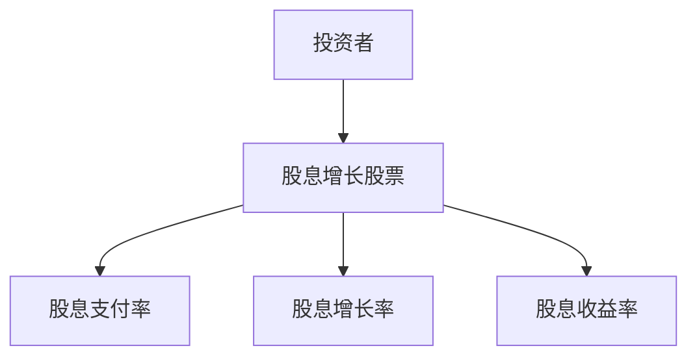
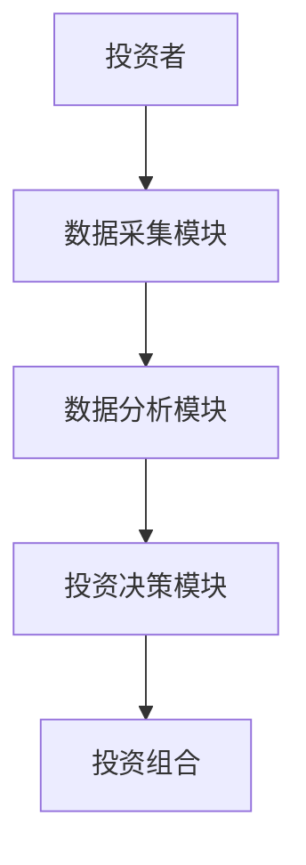

                 


```markdown
# 巴菲特的股息增长策略：通缩经济下的收益来源

## 关键词：巴菲特、股息增长策略、通缩经济、投资策略、股息收益率、股息支付率

## 摘要： 
本文详细探讨了巴菲特的股息增长策略在通缩经济下的应用，分析了该策略的核心概念、数学模型、系统设计及实际案例。通过介绍巴菲特的投资哲学，股息增长策略的优势，以及其在通缩环境中的表现，本文为投资者提供了理论支持和实战指导。

---

## 第1章: 巴菲特投资理念与股息增长策略背景

### 1.1 巴菲特的生平与投资哲学
巴菲特，被誉为“股神”，他的投资理念以价值投资为核心，强调长期持有优质资产。他通过分析企业的基本面，寻找那些具有持续盈利能力和稳定股息支付能力的公司。

#### 1.1.1 巴菲特的成长经历
巴菲特出生于1934年，早年展现出对投资的浓厚兴趣。他在哥伦比亚大学获得经济学硕士学位，并在职业生涯中积累了丰富的投资经验。

#### 1.1.2 巴菲特的投资理念
巴菲特的投资理念强调安全边际和长期价值。他认为，投资股票本质上是投资企业，寻找那些具有强大护城河和持续盈利能力的企业。

#### 1.1.3 股息增长策略的背景与重要性
在巴菲特的投资组合中，股息增长策略占据了重要地位。他偏好那些能够持续增长股息的公司，这些公司在经济低迷时期仍能保持稳定的收益。

### 1.2 股息增长策略的定义与特点
股息增长策略是一种长期投资策略，关注那些能够持续增加股息支付的公司。这种策略在通缩经济下表现尤为突出，因为股息的稳定性和增长性为投资者提供了可靠的收益来源。

#### 1.2.1 股息增长策略的定义
股息增长策略是指投资者选择那些股息支付率稳定且持续增长的公司，长期持有以获得股息收入和资本增值。

#### 1.2.2 股息增长策略的核心特点
- **持续性**：公司能够持续增加股息支付。
- **稳定性**：股息收入在经济波动中相对稳定。
- **防御性**：在通缩经济下，股息增长公司的收益相对有保障。

#### 1.2.3 股息增长策略在通缩经济下的应用前景
在通缩经济下，货币购买力上升，低通胀环境下，股息增长策略能够为投资者提供稳定的收益。同时，通缩环境下，企业的盈利能力和股息支付能力可能受到压力，因此选择具有强大竞争优势的公司尤为重要。

## 第2章: 股息增长策略的核心概念与联系

### 2.1 股息增长策略的核心概念
股息增长策略的核心在于寻找那些能够持续提高股息支付的公司。这需要综合分析公司的财务状况、盈利能力、股息支付率和行业地位。

#### 2.1.1 股息增长策略的核心要素
- **股息支付率**：公司支付的股息占净利润的比例。
- **股息增长率**：股息支付额的年增长率。
- **股息收益率**：当前股息支付额与股票价格的比率。

#### 2.1.2 股息增长策略的数学模型
股息增长模型是评估股息增长策略价值的重要工具。常见的模型包括股息折现模型（DDM）和股息增长模型。

#### 2.1.3 股息增长策略的ER实体关系图


### 2.2 股息增长策略的属性特征对比
通过对比股息增长策略与其他策略，可以更好地理解其独特性。

#### 2.2.1 股息增长策略与股息收益率的对比
- 股息增长策略关注长期股息增长，而股息收益率策略关注当前股息收益率。

#### 2.2.2 股息增长策略与股息支付率的对比
- 高股息支付率可能意味着公司有更多的利润用于股息支付，但需要考虑公司的盈利能力和增长潜力。

#### 2.2.3 股息增长策略与股息再投资的对比
- 股息再投资策略通过复利效应实现长期增长，而股息增长策略侧重于股息的持续增长。

### 2.3 股息增长策略的ER实体关系图


## 第3章: 股息增长策略的算法原理与数学模型

### 3.1 股息增长策略的算法原理
股息增长策略的算法基于对股息增长率和股息收益率的预测，选择具有持续股息增长潜力的公司。

#### 3.1.1 股息增长策略的基本原理
- 确定股息增长率和股息收益率的目标范围。
- 通过筛选股票，选择符合标准的公司进行投资。

#### 3.1.2 股息增长策略的实现步骤
1. 确定目标股息增长率和收益率范围。
2. 筛选符合条件的股票。
3. 进行基本面分析，确认公司的盈利能力和股息支付能力。
4. 构建投资组合，定期调整以保持目标比例。

#### 3.1.3 股息增长策略的数学模型
股息增长模型通常假设股息将以恒定速率增长，股票的内在价值可以通过未来股息的现值计算得出。

### 3.2 股息增长策略的数学公式
#### 3.2.1 股息增长率公式
$$
\text{股息增长率} = \frac{\text{当年股息} - \text{上一年股息}}{\text{上一年股息}}
$$

#### 3.2.2 股息收益率公式
$$
\text{股息收益率} = \frac{\text{股息支付额}}{\text{股票价格}}
$$

#### 3.2.3 股息贴现模型
$$
\text{股票价值} = \frac{\text{股息}}{\text{贴现率} - \text{股息增长率}}
$$

### 3.3 股息增长策略的系统架构设计
#### 3.3.1 系统功能设计
- 数据采集：收集股票的股息数据。
- 数据分析：计算股息增长率和收益率。
- 投资决策：基于模型筛选符合条件的股票。

#### 3.3.2 系统架构图


### 3.4 股息增长策略的Python实现示例
```python
def calculate_dividend_growth(last_year_dividend, current_year_dividend):
    return (current_year_dividend - last_year_dividend) / last_year_dividend

# 示例计算
last_year_dividend = 1.0
current_year_dividend = 1.05
growth_rate = calculate_dividend_growth(last_year_dividend, current_year_dividend)
print(f"股息增长率: {growth_rate*100}%")
```

---

## 第4章: 股息增长策略在通缩经济下的应用

### 4.1 通缩经济的定义与特征
通缩经济是指价格水平持续下降的经济状态，通常伴随着需求不足和企业盈利压力。

### 4.2 股息增长策略在通缩经济中的优势
- **稳定收益**：股息增长公司即使在经济低迷时期仍能提供稳定的股息收入。
- **防御性**：股息增长策略具有防御性，能够在市场波动中提供保护。

### 4.3 股息增长策略的风险管理
- **风险评估**：定期评估投资组合的风险，确保股息增长公司的基本面稳定。
- **分散投资**：通过分散投资降低风险。

---

## 第5章: 股息增长策略的系统设计与实现

### 5.1 系统功能设计
- 数据采集：收集股票的基本数据。
- 数据分析：计算股息增长率和收益率。
- 投资决策：基于模型筛选股票。

### 5.2 系统架构图


### 5.3 系统接口设计
- 数据接口：从数据源获取股票数据。
- 投资决策接口：基于模型筛选股票。

### 5.4 系统交互流程图


---

## 第6章: 股息增长策略的项目实战

### 6.1 项目环境与工具
- 数据来源：Yahoo Finance或 Bloomberg。
- 工具：Python、Pandas、Matplotlib。

### 6.2 核心代码实现
```python
import pandas as pd

# 示例数据
data = {
    '公司': ['可口可乐', '美国运通', 'IBM'],
    '股息增长率': [0.1, 0.08, 0.12],
    '股息收益率': [3.5, 2.8, 4.2]
}

df = pd.DataFrame(data)

# 筛选股息增长率大于等于5%的公司
high_growth = df[df['股息增长率'] >= 0.05]
print(high_growth)
```

### 6.3 案例分析
- **可口可乐**：股息支付率稳定，股息增长能力强。
- **美国运通**：股息增长稳定，财务状况良好。

---

## 第7章: 股息增长策略的总结与展望

### 7.1 总结
巴菲特的股息增长策略在通缩经济下表现出色，为投资者提供了稳定的收益来源。

### 7.2 展望
随着经济环境的变化，股息增长策略的应用将更加广泛，投资者需要不断调整策略以适应新的经济形势。

---

## 作者：AI天才研究院/AI Genius Institute & 禅与计算机程序设计艺术 /Zen And The Art of Computer Programming
```

