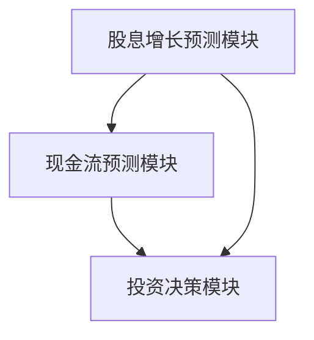
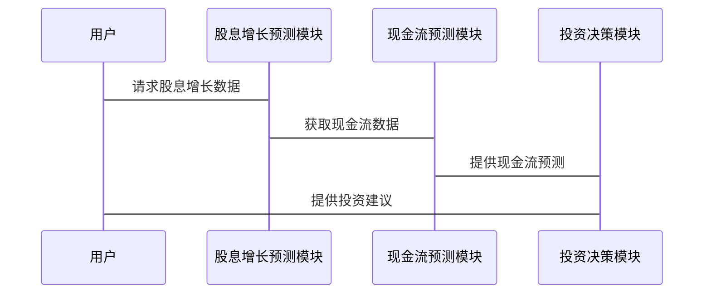
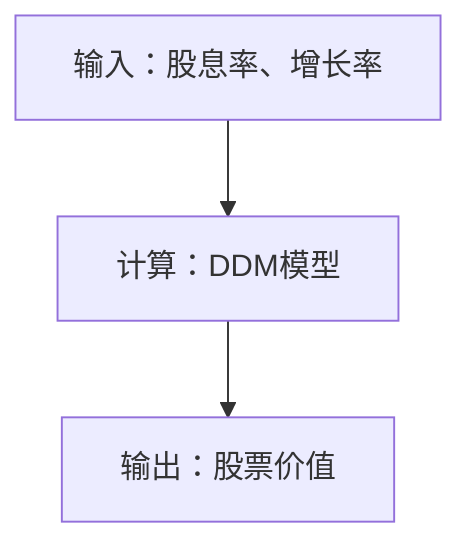
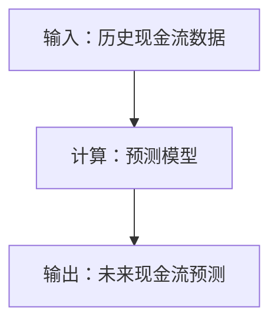

                 


```markdown
# 巴菲特的股息增长策略：量子科技公司的现金流管理

## 关键词：巴菲特，股息增长策略，量子科技，现金流管理，投资策略，系统架构

## 摘要：本文探讨了巴菲特的股息增长策略在量子科技公司中的应用，分析了现金流管理的重要性，并通过系统架构设计和项目实战展示了如何将股息增长策略与现金流管理相结合，实现长期投资回报。

---

## 第一部分：背景介绍

### 第1章：股息增长策略的背景与应用

#### 1.1 股息增长策略的定义与核心概念
- 股息的定义：股东从公司利润中获得的分配。
- 股息增长策略：通过投资于能够持续增长股息的公司，实现长期收益的增长。

#### 1.2 巴菲特的投资哲学与股息增长策略
- 巴菲特的长期投资理念：寻找具有持续盈利能力和稳定股息增长的公司。
- 股息增长策略的核心：选择股息率合理且能够持续增长的公司。

#### 1.3 股息增长策略的背景
- 股票市场的波动性：股息增长提供稳定性。
- 经济周期：股息增长在不同周期的表现。

### 第2章：量子科技公司的特点与现金流管理

#### 2.1 量子科技公司的定义与特点
- 量子计算的定义：利用量子力学原理进行计算。
- 量子科技公司的核心特征：高研发投入、高技术壁垒、长期亏损。

#### 2.2 现金流管理的重要性
- 现金流管理的核心目标：确保公司运营的流动性。
- 现金流管理的关键指标：现金流预测、净现金流。

#### 2.3 量子科技公司的现金流挑战
- 高研发投入导致的现金流压力。
- 量子科技公司的市场波动性对现金流的影响。

---

## 第二部分：股息增长策略与现金流管理的核心概念

### 第3章：股息增长策略的核心概念

#### 3.1 股息增长模型
- 股息增长模型的数学公式：
  $$ DDM模型：P = \frac{D_1}{k - g} $$
  其中，D1是第一年的股息，k是折现率，g是股息增长率。
- 股息增长模型的假设：股息增长率恒定。

#### 3.2 股息增长策略的属性特征
| 属性         | 特征                       |
|--------------|----------------------------|
| 股息率       | 合理，通常在2%到5%之间    |
| 股息增长率   | 稳定增长，通常3%到10%     |
| 股东价值     | 长期增长，股息再投资收益  |

### 第4章：现金流管理的核心概念

#### 4.1 现金流管理的定义与目标
- 现金流管理的定义：通过规划和控制现金的流入和流出，确保企业财务健康。
- 现金流管理的目标：保持流动性，支持企业运营和投资。

#### 4.2 现金流管理的关键指标
| 指标         | 定义与作用               |
|--------------|--------------------------|
| 现金流量表   | 记录企业现金流入和流出   |
| 现金净流量   | 企业现金流入减流出      |
| 现金周转率   | 现金循环周期             |

#### 4.3 现金流管理的策略
- 现金储备：保持足够的现金储备应对突发事件。
- 现金投资：合理分配现金用于投资和研发。
- 现金分配：合理分配股息，平衡股东回报和公司发展。

---

## 第三部分：股息增长策略与现金流管理的系统架构设计

### 第5章：系统分析与架构设计

#### 5.1 系统功能设计
- 股息增长预测模块：预测股息增长率和股息金额。
- 现金流预测模块：预测公司未来的现金流情况。
- 投资决策模块：基于股息增长和现金流预测，做出投资决策。

#### 5.2 系统架构设计


#### 5.3 系统接口设计
- 股息增长预测接口：提供股息增长率和股息金额。
- 现金流预测接口：提供未来现金流数据。

#### 5.4 系统交互流程


---

## 第四部分：股息增长策略与现金流管理的算法实现

### 第6章：股息增长模型的算法实现

#### 6.1 股息增长模型的算法


#### 6.2 现金流预测的算法


#### 6.3 股息增长与现金流预测的Python实现
```python
import numpy as np

def ddm_model(dividend, growth_rate, discount_rate):
    return dividend / (discount_rate - growth_rate)

# 示例数据
dividend = 1.0  # 初始股息
growth_rate = 0.05  # 股息增长率
discount_rate = 0.10  # 折现率

value = ddm_model(dividend, growth_rate, discount_rate)
print(f"股票价值：{value}")
```

---

## 第五部分：项目实战与最佳实践

### 第7章：项目实战

#### 7.1 量子科技公司现金流管理的案例分析
- 案例选择：一家量子计算公司。
- 数据收集：收集过去5年的现金流数据。
- 数据分析：使用DDM模型计算股息增长率。

#### 7.2 投资决策分析
- 股息增长潜力：分析股息增长率是否合理。
- 现金流健康：评估现金流的稳定性。

### 第8章：最佳实践与总结

#### 8.1 小结
- 股息增长策略与现金流管理的结合是量子科技公司投资的关键。
- 通过系统架构设计和算法实现，可以更准确地进行投资决策。

#### 8.2 注意事项
- 数据的准确性：现金流预测需要准确的历史数据。
- 模型的适用性：股息增长模型假设股息增长率恒定，需根据实际情况调整。

#### 8.3 拓展阅读
- 推荐书籍：《巴菲特投资哲学》、《量子计算入门》。
- 在线资源：相关投资策略的学术论文。

---

## 作者：AI天才研究院 & 禅与计算机程序设计艺术
```

