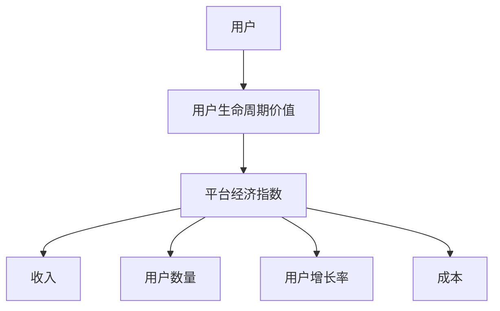

                 

# 巴菲特的财务报表分析：解读平台经济的新指标

## 关键词：
- 财务报表分析
- 巴菲特投资策略
- 平台经济
- 新型财务指标
- 技术分析方法

## 摘要：
本文深入探讨了巴菲特的财务报表分析方法，并结合平台经济的特点，提出了新的财务指标。通过分析传统指标的局限性，我们引入了适用于平台经济的新指标，结合算法原理和系统架构，展示了如何在实际项目中应用这些指标进行分析，为投资者和企业管理者提供了新的视角和工具。

---

## 第一部分: 背景介绍

### 第1章: 财务报表分析的背景与重要性

#### 1.1 财务报表分析的基本概念
- **1.1.1 什么是财务报表分析**
  - 财务报表分析是对企业财务状况、经营成果和现金流量的系统分析，旨在评估企业的财务健康状况和投资价值。
  - 通过分析财务报表，投资者可以了解企业的盈利能力、偿债能力和发展潜力。

- **1.1.2 财务报表分析的必要性**
  - 投资决策的基础：财务报表分析是投资者评估企业价值的重要工具。
  - 企业管理的参考：帮助企业识别财务问题，优化经营策略。
  - 信息传递的桥梁：通过财务报表，企业向利益相关者传递经营信息。

- **1.1.3 财务报表分析的核心要素**
  - 收入与利润：评估企业的盈利能力和收入质量。
  - 成本与费用：分析企业的经营效率和成本控制能力。
  - 现金流：衡量企业的财务健康状况和流动性。

#### 1.2 巴菲特的财务报表分析方法
- **1.2.1 巴菲特投资理念概述**
  - 巴菲特是一位价值投资的倡导者，注重长期投资和企业内在价值的评估。
  - 他强调企业基本面分析，尤其是财务报表分析，作为评估企业价值的核心工具。

- **1.2.2 财务报表分析在巴菲特投资中的地位**
  - 巴菲特认为财务报表是评估企业价值的关键，尤其是利润表、资产负债表和现金流量表。
  - 他关注企业的盈利能力、负债情况和现金流健康状况，以识别具有长期投资价值的企业。

- **1.2.3 巴菲特分析财务报表的独特视角**
  - 注重企业的持续盈利能力：巴菲特关注企业的ROE（净资产收益率）和ROA（资产回报率），以评估企业的盈利能力。
  - 关注企业的财务健康状况：通过分析资产负债表，评估企业的偿债能力和资本结构。
  - 重视现金流：巴菲特认为现金流是企业的血液，健康的现金流是企业长期发展的保障。

#### 1.3 平台经济的特点与挑战
- **1.3.1 平台经济的定义与模式**
  - 平台经济是指通过数字平台连接供需双方，提供撮合交易或服务的商业模式。
  - 典型案例包括电子商务平台、共享经济平台和社交媒体平台。

- **1.3.2 平台经济中的财务特点**
  - 轻资产模式：平台企业通常通过技术和服务而非实体资产创造价值。
  - 收入来源多样化：平台企业可能通过佣金、订阅费、广告等多种方式获得收入。
  - 用户规模与网络效应：平台的价值往往与用户数量和网络效应密切相关。

- **1.3.3 平台经济面临的财务挑战**
  - 用户获取成本高：平台企业通常需要大量投入吸引用户。
  - 收入模型不确定性：平台企业的收入来源可能不稳定，尤其是在竞争激烈的市场中。
  - 规模经济与边际成本：平台企业需要在扩大规模的同时控制边际成本，这对财务管理和分析提出了更高要求。

#### 1.4 传统财务指标的局限性
- **1.4.1 传统财务指标的定义与局限**
  - 传统财务指标如ROE、ROA、毛利率等，适用于传统制造业和实体企业，但在平台经济中可能无法准确反映企业的价值。
  - 例如，传统的盈利能力指标可能无法衡量平台企业的用户增长和网络效应带来的潜在价值。

- **1.4.2 平台经济中传统指标的适用性问题**
  - 用户增长与收入增长的不匹配：平台企业可能在用户增长的同时，收入增长并不明显，传统指标可能无法捕捉这一现象。
  - 资产负债结构差异：平台企业通常轻资产，传统资产负债表分析可能不适用。
  - 现金流波动性大：平台企业可能面临季节性或周期性的现金流波动，传统现金流分析方法可能不够灵活。

- **1.4.3 新型指标的提出与意义**
  - 针对平台经济的特点，我们需要引入新的财务指标，以更准确地评估平台企业的价值。
  - 新型指标可能包括用户生命周期价值（CLV）、平台经济指数（PEI）等，这些指标能够更全面地反映平台企业的财务状况和潜在价值。

---

## 第2章: 平台经济中的新指标

#### 2.1 新指标的核心概念
- **2.1.1 新指标的定义与特点**
  - 新型财务指标是针对平台经济的特点设计的，旨在更准确地评估平台企业的价值。
  - 与传统指标相比，新型指标更关注用户增长、网络效应和长期盈利能力。

- **2.1.2 新指标与传统指标的对比**
  - 传统指标如ROE、ROA主要关注企业的财务回报和资产效率，而新型指标如用户生命周期价值（CLV）关注用户的长期贡献和平台的网络效应。
  - 传统指标适用于实体企业，而新型指标更适用于平台经济中的企业。

- **2.1.3 新指标的数学模型与公式**
  - 用户生命周期价值（CLV）模型：
    \[
    CLV = \frac{ARPU \times (1 - \frac{1}{1 + g})}{g}
    \]
    其中，ARPU是每用户平均收入，g是用户流失率。
  - 平台经济指数（PEI）：
    \[
    PEI = \frac{收入}{用户数量} \times \frac{用户增长率}{成本}
    \]
    PEI反映了平台的收入效率、用户增长潜力和成本控制能力。

#### 2.2 新指标的计算与应用
- **2.2.1 新指标的计算方法**
  - 用户生命周期价值（CLV）计算：
    1. 确定用户的平均收入（ARPU）。
    2. 估计用户流失率（g）。
    3. 使用CLV公式计算用户的生命周期价值。
  - 平台经济指数（PEI）计算：
    1. 收集企业的收入数据。
    2. 统计用户数量和用户增长率。
    3. 计算企业的成本数据。
    4. 使用PEI公式进行计算。

- **2.2.2 新指标在平台经济中的应用场景**
  - 评估平台的用户增长潜力和收入效率。
  - 识别高增长的平台企业，为投资者提供决策依据。
  - 帮助企业管理层优化运营策略，提升用户生命周期价值。

- **2.2.3 新指标的优缺点分析**
  - 优点：
    - 更准确地反映平台企业的价值。
    - 能够捕捉用户增长和网络效应带来的潜在收益。
    - 为投资者和企业管理者提供新的分析工具。
  - 缺点：
    - 计算复杂，需要大量数据支持。
    - 新指标的适用性和准确性可能因平台类型和市场环境而异。

#### 2.3 新指标的实体关系图

---

## 第3章: 平台经济中的新指标

#### 3.1 新指标的核心概念
- **3.1.1 新指标的定义与特点**
  - 新型财务指标是针对平台经济的特点设计的，旨在更准确地评估平台企业的价值。
  - 与传统指标相比，新型指标更关注用户增长、网络效应和长期盈利能力。

- **3.1.2 新指标与传统指标的对比**
  - 传统指标如ROE、ROA主要关注企业的财务回报和资产效率，而新型指标如用户生命周期价值（CLV）关注用户的长期贡献和平台的网络效应。
  - 传统指标适用于实体企业，而新型指标更适用于平台经济中的企业。

- **3.1.3 新指标的数学模型与公式**
  - 用户生命周期价值（CLV）模型：
    \[
    CLV = \frac{ARPU \times (1 - \frac{1}{1 + g})}{g}
    \]
    其中，ARPU是每用户平均收入，g是用户流失率。
  - 平台经济指数（PEI）：
    \[
    PEI = \frac{收入}{用户数量} \times \frac{用户增长率}{成本}
    \]
    PEI反映了平台的收入效率、用户增长潜力和成本控制能力。

#### 3.2 新指标的计算与应用
- **3.2.1 新指标的计算方法**
  - 用户生命周期价值（CLV）计算：
    1. 确定用户的平均收入（ARPU）。
    2. 估计用户流失率（g）。
    3. 使用CLV公式计算用户的生命周期价值。
  - 平台经济指数（PEI）计算：
    1. 收集企业的收入数据。
    2. 统计用户数量和用户增长率。
    3. 计算企业的成本数据。
    4. 使用PEI公式进行计算。

- **3.2.2 新指标在平台经济中的应用场景**
  - 评估平台的用户增长潜力和收入效率。
  - 识别高增长的平台企业，为投资者提供决策依据。
  - 帮助企业管理层优化运营策略，提升用户生命周期价值。

- **3.2.3 新指标的优缺点分析**
  - 优点：
    - 更准确地反映平台企业的价值。
    - 能够捕捉用户增长和网络效应带来的潜在收益。
    - 为投资者和企业管理者提供新的分析工具。
  - 缺点：
    - 计算复杂，需要大量数据支持。
    - 新指标的适用性和准确性可能因平台类型和市场环境而异。

#### 3.3 新指标的实体关系图

---

## 第4章: 平台经济中的新指标

#### 4.1 新指标的核心概念
- **4.1.1 新指标的定义与特点**
  - 新型财务指标是针对平台经济的特点设计的，旨在更准确地评估平台企业的价值。
  - 与传统指标相比，新型指标更关注用户增长、网络效应和长期盈利能力。

- **4.1.2 新指标与传统指标的对比**
  - 传统指标如ROE、ROA主要关注企业的财务回报和资产效率，而新型指标如用户生命周期价值（CLV）关注用户的长期贡献和平台的网络效应。
  - 传统指标适用于实体企业，而新型指标更适用于平台经济中的企业。

- **4.1.3 新指标的数学模型与公式**
  - 用户生命周期价值（CLV）模型：
    \[
    CLV = \frac{ARPU \times (1 - \frac{1}{1 + g})}{g}
    \]
    其中，ARPU是每用户平均收入，g是用户流失率。
  - 平台经济指数（PEI）：
    \[
    PEI = \frac{收入}{用户数量} \times \frac{用户增长率}{成本}
    \]
    PEI反映了平台的收入效率、用户增长潜力和成本控制能力。

#### 4.2 新指标的计算与应用
- **4.2.1 新指标的计算方法**
  - 用户生命周期价值（CLV）计算：
    1. 确定用户的平均收入（ARPU）。
    2. 估计用户流失率（g）。
    3. 使用CLV公式计算用户的生命周期价值。
  - 平台经济指数（PEI）计算：
    1. 收集企业的收入数据。
    2. 统计用户数量和用户增长率。
    3. 计算企业的成本数据。
    4. 使用PEI公式进行计算。

- **4.2.2 新指标在平台经济中的应用场景**
  - 评估平台的用户增长潜力和收入效率。
  - 识别高增长的平台企业，为投资者提供决策依据。
  - 帮助企业管理层优化运营策略，提升用户生命周期价值。

- **4.2.3 新指标的优缺点分析**
  - 优点：
    - 更准确地反映平台企业的价值。
    - 能够捕捉用户增长和网络效应带来的潜在收益。
    - 为投资者和企业管理者提供新的分析工具。
  - 缺点：
    - 计算复杂，需要大量数据支持。
    - 新指标的适用性和准确性可能因平台类型和市场环境而异。

#### 4.3 新指标的实体关系图

---

## 结语

平台经济的崛起对传统的财务报表分析提出了新的挑战，传统的财务指标在评估平台企业时显得力不从心。通过引入用户生命周期价值（CLV）和平台经济指数（PEI）等新型指标，我们可以更准确地评估平台企业的价值，捕捉用户增长和网络效应带来的潜在收益。未来，随着平台经济的进一步发展，新型财务指标的应用将变得更加广泛和重要。投资者和企业管理者需要不断学习和适应，以更好地利用这些工具，做出更明智的决策。

---

## 作者：AI天才研究院/AI Genius Institute & 禅与计算机程序设计艺术 /Zen And The Art of Computer Programming

---

这篇文章通过详细分析平台经济的特点，提出了适用于平台经济的新型财务指标，并结合巴菲特的财务报表分析方法，为投资者和企业管理者提供了新的视角和工具。希望这篇文章能够为读者在平台经济的财务分析领域提供有价值的见解和指导。

