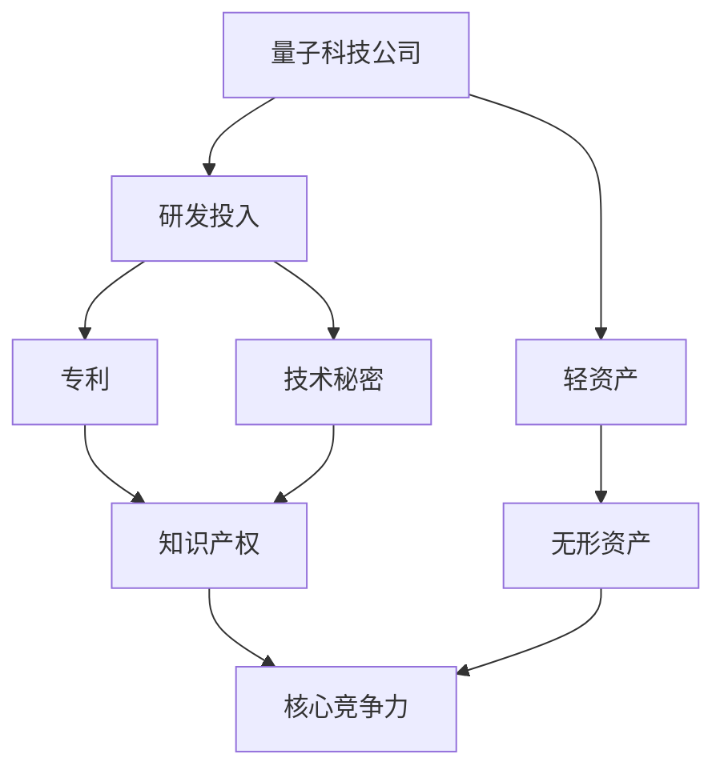
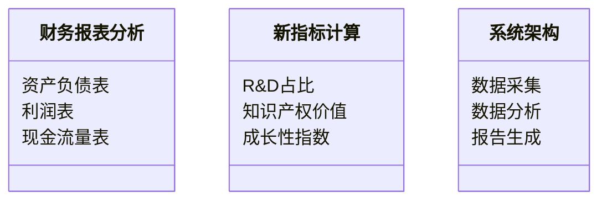
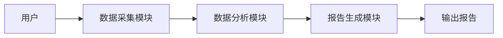

                 


# 巴菲特的财务报表分析：解读量子科技公司的新指标

## 关键词：巴菲特，财务报表分析，量子科技，财务指标，投资分析

## 摘要：本文深入探讨巴菲特的财务报表分析方法在量子科技公司中的应用，提出并解读了一系列新指标，帮助投资者更好地评估量子科技公司的财务健康状况和投资价值。

---

## 第一部分：背景介绍

### 1.1 核心概念术语说明

- **财务报表分析**：通过对资产负债表、利润表和现金流量表的分析，评估企业的财务状况、盈利能力和未来前景。
- **巴菲特的分析方法**：注重企业的基本面分析，尤其是企业的盈利能力和财务健康状况。
- **量子科技公司**：从事量子计算、量子通信等前沿科技的企业，具有高研发投入、轻资产、高成长性的特点。
- **新指标**：针对量子科技公司特点，提出的特殊财务分析指标，如研发投入占收入比例、知识产权价值等。

### 1.2 问题背景

传统财务报表分析方法主要适用于制造业和服务业等传统行业，但在分析量子科技公司时显得力不从心。量子科技公司的研发投入高、资产轻、技术更新快，传统指标如市盈率和市净率难以准确反映其价值。

### 1.3 问题描述

量子科技公司具有以下特点：
- 高研发投入：研发投入占收入比例远高于传统行业。
- 轻资产：固定资产较少，研发投入多为无形资产。
- 高成长性：市场前景广阔，但不确定性高。
- 知识产权密集：核心竞争力主要体现在专利和技术储备上。

传统财务报表分析方法难以准确评估这些特点，因此需要引入新的分析指标。

### 1.4 问题解决

本文提出以下新指标：
1. 研发投入占收入比例（R&D to Revenue Ratio）
2. 知识产权价值占比（IP Value Ratio）
3. 量子科技公司成长性指数（QGrowth Index）
4. 现金流与研发投入匹配度（Cash Flow to R&D Match）

### 1.5 边界与外延

本文仅关注量子科技公司的财务分析，不涉及技术实现细节。分析范围包括量子计算、量子通信领域的企业。

### 1.6 概念结构与核心要素

| 概念 | 定义 | 重要性 |
|------|------|--------|
| 研发投入 | 公司在研究与开发方面的支出 | 反映企业创新能力 |
| 知识产权 | 专利、商标等无形资产 | 体现企业核心竞争力 |
| 轻资产 | 固定资产较少 | 反映行业特点 |
| 高成长性 | 收入增长快 | 表现企业市场潜力 |

---

## 第二部分：核心概念与联系

### 2.1 核心概念原理

#### 研发投入分析

- 研发投入是量子科技公司的核心支出，通常占收入的30%-50%。
- 研发投入的用途包括基础研究、产品开发和测试。

#### 知识产权评估

- 知识产权是量子科技公司的核心资产，主要包括专利、技术秘密和商标。
- 知识产权的价值需要通过评估其未来盈利能力来确定。

#### 成长性分析

- 量子科技公司的收入增长通常快于传统行业，但也伴随着高风险。
- 成长性分析需要结合行业趋势和公司管理层战略。

---

### 2.2 概念属性对比

| 概念 | 属性 | 传统行业 | 量子科技公司 |
|------|------|----------|---------------|
| 资产结构 | 资产类型 | 以固定资产为主 | 以无形资产为主 |
| 研发投入 | 占收入比例 | 5%-10% | 30%-50% |
| 成长性 | 收入增长率 | 个位数 | 十位数 |
| 风险 | 技术风险 | 低 | 高 |

---

### 2.3 实体关系图



---

## 第三部分：算法原理

### 3.1 算法原理

#### 研发投入占收入比例

公式：$$ R&D\text{占比} = \frac{\text{研发投入}}{\text{收入}} $$

#### 知识产权价值评估

公式：$$ \text{知识产权价值} = \sum (\text{专利价值} + \text{技术秘密价值}) $$

#### 量子科技公司成长性指数

公式：$$ QGrowth = \frac{\text{收入增长率} \times \text{净利润增长率}}{\text{行业平均增长率}} $$

---

### 3.2 算法实现

```python
def calculate_rd_ratio(revenue, r_d):
    return r_d / revenue

def calculate_ip_value(assets, liabilities):
    return assets - liabilities

def calculate_qgrowth(revenue_growth, net_profit_growth, industry_growth):
    return (revenue_growth * net_profit_growth) / industry_growth
```

---

## 第四部分：系统分析与架构设计

### 4.1 问题场景介绍

本文构建了一个量子科技公司财务分析系统，帮助投资者快速评估公司价值。

### 4.2 项目介绍

- 项目目标：开发一个基于新指标的量子科技公司财务分析系统。
- 项目范围：包括数据采集、分析和报告生成。

---

### 4.3 系统功能设计

#### 领域模型



---

### 4.4 系统架构设计



---

## 第五部分：项目实战

### 5.1 环境安装

需要安装Python和相关数据分析库（Pandas、Matplotlib）。

### 5.2 核心实现

```python
import pandas as pd
import matplotlib.pyplot as plt

# 数据采集
data = pd.read_csv('quantum_company.csv')

# 计算新指标
rd_ratio = data['R&D'] / data['Revenue']
ip_value = data['Assets'] - data['Liabilities']
qgrowth = (data['Revenue Growth'] * data['Net Profit Growth']) / data['Industry Growth']

# 可视化
plt.figure(figsize=(10,6))
plt.plot(rd_ratio, label='R&D Ratio')
plt.plot(ip_value, label='IP Value')
plt.legend()
plt.show()
```

---

### 5.3 应用解读

以一家量子计算公司为例，计算其研发投入占比、知识产权价值和成长性指数，评估其投资价值。

---

## 第六部分：总结

### 6.1 小结

本文提出了适用于量子科技公司的新财务指标，帮助投资者更好地评估其价值。

### 6.2 最佳实践

- 动态调整分析指标，关注行业变化。
- 结合技术趋势和市场前景进行综合分析。

### 6.3 注意事项

- 数据来源必须可靠。
- 指标计算需要结合行业特点。

### 6.4 拓展阅读

推荐阅读巴菲特的经典著作《聪明的投资者》和量子科技相关的学术论文。

---

## 作者：AI天才研究院/AI Genius Institute & 禅与计算机程序设计艺术 /Zen And The Art of Computer Programming

