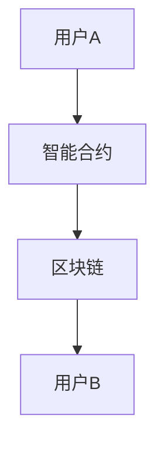
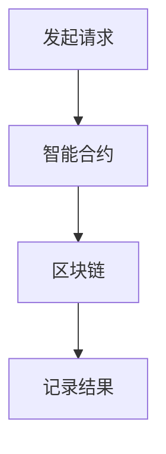

                 

# 巴菲特的资产负债表分析：数字资产和智能合约的影响

## 关键词：巴菲特，资产负债表，数字资产，智能合约，会计分析，投资策略

## 摘要：
本文深入探讨了巴菲特的资产负债表分析方法，并结合数字资产和智能合约的影响，分析了这些新兴技术对传统财务分析的改变。通过详细分析数字资产的分类、智能合约的原理，以及它们如何影响资产、负债和所有者权益，本文提供了从理论到实践的全面解读。结合实际案例和最佳实践，本文为投资者和财务分析人员提供了新的视角和工具，以应对数字资产时代的新挑战。

---

## 第1章: 巴菲特的资产负债表分析概述

### 1.1 巴菲特的资产负债表分析的重要性

#### 1.1.1 资产负债表的基本概念
资产负债表是反映企业在某一特定时点的财务状况的重要报表，主要包括资产、负债和所有者权益三部分。资产是企业拥有的资源，负债是企业需要偿还的债务，所有者权益是企业净资产的体现。巴菲特认为，资产负债表是评估企业财务健康状况的核心工具。

#### 1.1.2 巴菲特分析资产负债表的独特视角
巴菲特注重企业的基本面分析，尤其是资产的质量和负债的结构。他倾向于投资那些资产质量高、负债可控、盈利能力稳定的企业。他的分析方法强调长期价值，而非短期市场波动。

#### 1.1.3 数字资产与智能合约对传统资产负债表的影响
数字资产（如比特币、以太坊等）和智能合约的兴起，为企业财务管理带来了新的挑战和机遇。数字资产的无形性和去中心化特性，使得传统的会计处理方式需要重新思考。智能合约的自动执行和透明性，也为资产负债表的记录和审计提供了新的可能性。

---

### 1.2 数字资产与智能合约的背景

#### 1.2.1 数字资产的定义与分类
数字资产是指以数字形式存在的资产，主要包括加密货币（如比特币）、代币（如ERC-20代币）、NFTs（非同质化代币）等。数字资产具有去中心化、匿名性、不可篡改等特点。

**数字资产分类表：**

| 类别              | 描述                                   |
|-------------------|--------------------------------------|
| 加密货币          | 可用于支付的数字货币，如比特币、以太坊 |
| 代币              | 具有特定用途的数字资产，如ERC-20代币  |
| NFTs             | 非同质化代币，用于表示独特艺术品或权益  |

#### 1.2.2 智能合约的基本原理
智能合约是基于区块链技术的自动执行合同，其核心是通过代码实现合同条款的自动履行。智能合约的特点是无需信任中介，自动执行，且记录在区块链上，具有透明性和不可篡改性。

**智能合约的流程图（mermaid）：**

智能合约的执行流程包括发起请求、验证合法性、执行操作和记录结果。

#### 1.2.3 数字资产与智能合约的法律与技术挑战
数字资产的法律地位尚未完全明确，不同国家和地区对加密货币的监管政策差异较大。此外，智能合约的代码错误或漏洞可能导致严重问题，如资金损失或合同纠纷。

---

### 1.3 本书的核心内容与目标

#### 1.3.1 探讨数字资产与智能合约对资产负债表的影响
本文将分析数字资产和智能合约如何改变资产负债表的结构和内容，特别是对资产、负债和所有者权益的影响。

#### 1.3.2 分析巴菲特投资策略中的资产负债表逻辑
结合巴菲特的投资理念，本文将探讨如何利用数字资产和智能合约的特性，优化企业的财务管理和投资决策。

#### 1.3.3 提供实际案例与最佳实践
通过实际案例分析，本文将提供数字资产和智能合约在资产负债表分析中的最佳实践，帮助读者更好地理解和应用这些新技术。

---

## 第2章: 巴菲特的资产负债表分析方法论

### 2.1 巴菲特的资产分析策略

#### 2.1.1 资产的分类与评估
巴菲特注重资产的质量和流动性。他倾向于投资那些资产质量高、流动性强的企业，例如铁路、能源公司等。数字资产的出现为资产多样化提供了新选择，但也带来了新的挑战，如波动性和安全性问题。

#### 2.1.2 流动资产与非流动资产的区分
流动资产是指能够在一年内变现的资产，如现金、应收账款等。非流动资产是指无法在一年内变现的资产，如固定资产、长期投资等。数字资产多属于流动资产，但其价值波动较大。

#### 2.1.3 资产质量与资产回报率的评估
资产质量是巴菲特分析的核心。他关注资产的盈利能力、周转能力和偿债能力。数字资产的回报率受市场波动影响较大，因此需要结合技术分析和基本面分析。

---

### 2.2 负债分析与偿债能力评估

#### 2.2.1 负债的分类与影响
负债分为流动负债和非流动负债。流动负债包括短期借款、应付账款等，非流动负债包括长期借款、债券发行等。智能合约的使用可以简化负债的记录和管理，提高透明度。

#### 2.2.2 偿债能力的指标分析
常见的偿债能力指标包括流动比率、速动比率和债务-to- equity比率。数字资产的引入可能改变这些指标的计算方式，例如将数字资产视为流动资产的一部分。

#### 2.2.3 巴菲特对负债结构的偏好
巴菲特倾向于选择负债结构简单、可控的企业。智能合约的应用可以减少负债的管理成本，提高企业的偿债能力。

---

### 2.3 所有者权益与资本结构分析

#### 2.3.1 所有者权益的构成
所有者权益包括股本、资本公积、盈余公积等。数字资产的引入可能改变所有者权益的构成，例如通过发行代币进行融资。

#### 2.3.2 资本结构的优化
资本结构是指企业资本中债务与股权的比例。智能合约的应用可以优化资本结构，降低融资成本，提高企业的财务灵活性。

#### 2.3.3 巴菲特对资本结构的长期视角
巴菲特注重企业的长期盈利能力，而非短期资本结构的优化。数字资产和智能合约的应用可以为企业提供新的融资方式，但需要谨慎评估其风险和收益。

---

## 第3章: 数字资产与智能合约的核心概念

### 3.1 数字资产的定义与分类

#### 3.1.1 数字资产的基本概念
数字资产是指以数字形式存在的资产，主要包括加密货币、代币和NFTs等。数字资产的特性包括去中心化、匿名性和不可篡改性。

#### 3.1.2 数字资产的主要分类
数字资产可以分为加密货币、代币和NFTs。加密货币主要用于支付，代币具有特定用途，NFTs用于表示独特资产。

#### 3.1.3 数字资产的特性对比表
以下是对数字资产特性的对比：

| 特性     | 加密货币   | 代币     | NFTs    |
|----------|------------|----------|---------|
| 用途     | 支付       | 特定用途 | 独特资产 |
| 区块链   | 去中心化   | 去中心化 | 去中心化 |
| 可分割性 | 可分割     | 可分割   | 不可分割 |

### 3.2 智能合约的原理与实现

#### 3.2.1 智能合约的定义与特点
智能合约是基于区块链的自动执行合同，其特点包括自动化、透明性和不可篡改性。

#### 3.2.2 智能合约的执行流程
智能合约的执行流程包括发起请求、验证合法性、执行操作和记录结果。

**智能合约执行流程图（mermaid）：**

#### 3.2.3 智能合约的法律与技术挑战
智能合约的法律地位尚未完全明确，技术实现中可能存在漏洞和错误。

---

## 第4章: 数字资产与智能合约对资产负债表的影响

### 4.1 数字资产对资产的影响

#### 4.1.1 数字资产的会计处理
数字资产的会计处理需要考虑其价值波动和法律风险。通常，数字资产被视为流动资产的一部分。

#### 4.1.2 数字资产对流动资产的影响
数字资产的引入增加了流动资产的种类，但也带来了更高的波动性和风险管理需求。

#### 4.1.3 数字资产对非流动资产的影响
非流动资产如固定资产的价值相对稳定，数字资产的引入可能影响企业的资本结构。

### 4.2 智能合约对负债的影响

#### 4.2.1 智能合约对负债结构的改变
智能合约的使用可以简化负债的记录和管理，提高企业的偿债能力。

#### 4.2.2 智能合约对偿债能力的影响
智能合约的应用可以实时监控企业的偿债能力，提高财务透明度。

#### 4.2.3 智能合约对负债透明度的提升
智能合约的透明性和不可篡改性提高了负债记录的准确性，降低了舞弊风险。

### 4.3 数字资产与智能合约对所有者权益的影响

#### 4.3.1 数字资产对所有者权益的直接影响
数字资产的引入可能改变所有者权益的构成，例如通过发行代币进行融资。

#### 4.3.2 智能合约对资本结构的优化
智能合约的应用可以优化资本结构，降低融资成本，提高企业的财务灵活性。

#### 4.3.3 数字资产与智能合约的法律与税务影响
数字资产的税务处理和智能合约的法律地位是当前研究的热点问题。

---

## 第5章: 智能合约在会计中的应用

### 5.1 智能合约的会计处理方法

#### 5.1.1 智能合约的分类与记录
智能合约可以分为支付型合约和执行型合约。支付型合约用于支付款项，执行型合约用于自动执行合同条款。

#### 5.1.2 智能合约的会计处理流程
智能合约的会计处理流程包括识别、确认、记录和报告。

#### 5.1.3 智能合约的财务影响
智能合约的应用可以提高会计处理的效率和准确性，减少人为错误和舞弊风险。

### 5.2 数字资产与智能合约的协同效应

#### 5.2.1 数字资产与智能合约的协同效应
数字资产和智能合约的结合可以实现自动化的财务管理和会计处理，提高企业的运营效率。

#### 5.2.2 协同效应的实际案例
例如，企业可以通过智能合约自动管理数字资产的支付和结算，减少人工干预。

---

## 第6章: 数字资产与智能合约的法律与监管挑战

### 6.1 数字资产的法律框架

#### 6.1.1 数字资产的法律定义
不同国家和地区对数字资产的法律定义和监管政策存在差异。

#### 6.1.2 数字资产的监管框架
包括反洗钱（AML）、税务申报和投资者保护等方面的监管要求。

### 6.2 智能合约的法律与合规要求

#### 6.2.1 智能合约的法律挑战
智能合约的法律地位尚未完全明确，存在合同履行和争议解决的法律问题。

#### 6.2.2 智能合约的合规要求
包括代码审计、用户隐私保护和合规性审查等方面的要求。

---

## 第7章: 数字资产与智能合约的未来发展趋势

### 7.1 数字资产的未来发展

#### 7.1.1 数字资产的技术创新
包括Layer 2解决方案、侧链技术等，以提高交易速度和降低交易成本。

#### 7.1.2 数字资产的金融应用
数字资产的金融应用包括支付、融资和投资等领域。

### 7.2 智能合约的未来发展趋势

#### 7.2.1 智能合约的普及与应用
智能合约的应用将更加广泛，涵盖金融、法律和商业等多个领域。

#### 7.2.2 智能合约的技术创新
包括智能合约的安全性、可扩展性和互操作性等方面的技术创新。

---

## 小结

数字资产和智能合约的兴起为资产负债表分析带来了新的挑战和机遇。通过分析数字资产的分类、智能合约的原理，以及它们对资产、负债和所有者权益的影响，本文为投资者和财务分析人员提供了新的视角和工具。未来，随着技术的进步和监管政策的完善，数字资产和智能合约将在财务管理中发挥更大的作用。

---

## 注意事项

1. 数字资产和智能合约的应用需要谨慎评估其风险和收益。
2. 智能合约的法律地位和监管政策尚未完全明确，需要密切关注相关法规变化。
3. 数字资产的会计处理和税务申报需要遵守相关法律法规。

---

## 最佳实践 Tips

1. **数字资产的管理**：企业应建立完善的数字资产管理制度，包括资产分类、价值评估和风险管理。
2. **智能合约的应用**：在实际应用中，企业应选择可靠的智能合约平台，并进行充分的代码审计。
3. **财务分析的结合**：投资者和财务分析人员应结合数字资产和智能合约的特点，优化资产负债表分析方法。

---

## 作者：AI天才研究院/AI Genius Institute & 禅与计算机程序设计艺术 /Zen And The Art of Computer Programming

---

通过以上思考，我们可以看到，数字资产和智能合约对资产负债表分析的影响是深远的。它们不仅改变了传统的财务处理方式，还为企业提供了新的价值创造和风险管理工具。未来，随着技术的进步和法规的完善，数字资产和智能合约将在财务管理中发挥更大的作用，为企业创造更多的价值。

