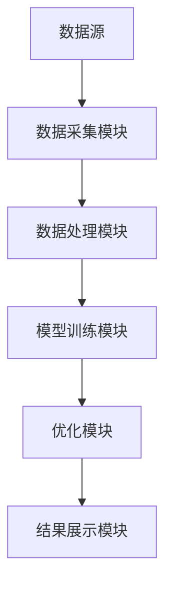

                 

# 巴菲特的资本配置艺术：数字化转型中的资源优化

## 关键词：资本配置，数字化转型，资源优化，投资组合，动态规划，系统架构

## 摘要：本文探讨了巴菲特的资本配置艺术在数字化转型中的应用，结合技术手段优化资源分配，分析了资本配置的核心理论、数学模型、算法实现，以及系统架构设计，并通过案例展示了数字化优化的实际应用。

---

## 第一部分：资本配置艺术与数字化转型的背景

### 第1章：资本配置艺术概述

#### 1.1 资本配置的核心概念

##### 1.1.1 资本配置的定义与内涵
资本配置是指将资源分配到不同的资产或项目中，以实现最大化的价值或收益。它关注如何在有限的资源中进行最优分配，以满足战略目标。

##### 1.1.2 资本配置的基本原则
资本配置应遵循风险与收益的平衡、分散化原则、长期视角和动态调整等基本原则。

##### 1.1.3 资本配置的分类与特点
资本配置可以分为短期和长期配置，主动和被动配置，以及集中和分散配置，每种配置方式都有其特点和适用场景。

#### 1.2 数字化转型的背景与趋势

##### 1.2.1 数字化转型的定义与特征
数字化转型是指利用数字技术（如人工智能、大数据等）对业务流程、组织结构和文化进行重构，以创造新的价值。其核心特征包括数据驱动、智能化和敏捷性。

##### 1.2.2 数字化转型的核心驱动力
数字化转型的核心驱动力包括技术进步、市场竞争压力和客户需求变化，这些因素促使企业必须通过数字化手段优化资源分配。

##### 1.2.3 数字化转型对资源优化的影响
数字化转型通过数据驱动的决策、自动化工具和预测模型，显著提升了资源优化的效率和效果。

#### 1.3 资本配置与数字化转型的关联

##### 1.3.1 资本配置在数字化转型中的作用
资本配置在数字化转型中起到了关键作用，它决定了哪些技术、项目或部门将获得更多的资源支持。

##### 1.3.2 数字化转型对资本配置的影响
数字化转型使得资本配置更加数据化和精准化，通过分析大量数据，企业能够更准确地识别高回报项目。

##### 1.3.3 资本配置与资源优化的结合
资本配置与资源优化的结合使得企业能够在数字化转型中更高效地分配资源，从而实现更高的投资回报。

#### 1.4 本章小结
本章介绍了资本配置的核心概念和数字化转型的基本背景，探讨了两者之间的关联，为后续的深入分析奠定了基础。

---

### 第2章：资本配置的核心理论与模型

#### 2.1 资本配置的理论基础

##### 2.1.1 资本资产定价模型（CAPM）

CAPM是一种用于评估资产预期收益的模型，其公式为：
$$ E(r_i) = r_f + β_i (E(r_m) - r_f) $$

其中，$E(r_i)$ 是资产i的预期收益率，$r_f$ 是无风险利率，$β_i$ 是资产i的贝塔系数，$E(r_m)$ 是市场预期收益率。

##### 2.1.2 投资组合理论
投资组合理论强调通过分散投资来降低风险，其核心是通过优化投资组合来最大化收益并最小化风险。

##### 2.1.3 资本预算约束
资本预算约束是指企业在分配资本时必须考虑可用资金的限制，这影响了资本配置的决策过程。

#### 2.2 数字化转型中的资本配置模型

##### 2.2.1 数字化转型的资源分配模型
资源分配模型在数字化转型中用于确定哪些项目应获得更多的资源支持。这通常基于项目的预期收益、风险和战略重要性。

##### 2.2.2 数字化项目评估与优先级排序
通过评估项目的净现值（NPV）、内部收益率（IRR）和风险等级，企业可以对数字化项目进行优先级排序。

##### 2.2.3 数字化投资组合优化
投资组合优化模型（如线性规划）用于确定最优的投资组合，以实现最大化收益和最小化风险。

#### 2.3 资本配置模型的数学表达

##### 2.3.1 CAPM的公式推导
$$ E(r_i) = r_f + β_i (E(r_m) - r_f) $$
该公式展示了资产i的预期收益与市场收益之间的关系。

##### 2.3.2 投资组合优化的数学模型
$$ \text{Maximize } \mu_p \text{ subject to } \sigma_p^2 \leq \text{target variance} $$
该模型旨在在给定风险水平下最大化预期收益。

#### 2.4 本章小结
本章介绍了资本配置的核心理论和相关模型，强调了这些理论在数字化转型中的应用价值。

---

### 第3章：资本配置的数字化优化方法

#### 3.1 数字化转型中的资源优化问题

##### 3.1.1 资源分配的复杂性
数字化转型中的资源分配问题通常涉及多个变量和复杂的关系，需要借助先进的算法和工具来解决。

##### 3.1.2 数字化工具在资源优化中的应用
工具如机器学习算法、大数据分析和优化软件可以帮助企业更高效地进行资源分配。

##### 3.1.3 数据驱动的资源优化方法
通过收集和分析大量数据，企业可以更准确地预测项目收益和风险，从而优化资源分配。

#### 3.2 资本配置的算法实现

##### 3.2.1 线性规划模型在资本配置中的应用
线性规划模型用于解决资本配置中的资源分配问题，例如：
$$ \text{Minimize } c^T x \text{ subject to } A x \leq b, x \geq 0 $$

##### 3.2.2 非线性规划的资本配置问题
非线性规划模型用于处理复杂的投资组合优化问题，例如：
$$ \text{Maximize } x^T Q x \text{ subject to } 1^T x = 1 $$

##### 3.2.3 动态规划在长期资本配置中的应用
动态规划用于处理长期资本配置问题，通过分解问题为子问题来实现优化。

#### 3.3 资本配置算法的数学推导

##### 3.3.1 线性规划的标准形式
线性规划的标准形式为：
$$ \text{Minimize } c^T x \text{ subject to } A x \leq b, x \geq 0 $$

##### 3.3.2 动态规划的资本配置模型
动态规划模型可以表示为：
$$ V(t, w) = \max_{a} \left( r_a(t, w) + V(t+1, w') \right) $$

#### 3.4 本章小结
本章详细探讨了资本配置的数字化优化方法，包括线性规划和动态规划的应用，以及相关的数学模型。

---

### 第4章：资本配置的系统架构与实现

#### 4.1 数字化转型中的系统架构设计

##### 4.1.1 系统功能模块划分
系统功能模块包括数据采集、模型训练、优化计算和结果展示。

##### 4.1.2 系统数据流设计
数据流从数据源流向数据处理模块，再流向优化模块，最终生成优化结果。

##### 4.1.3 系统交互流程图
系统交互流程图展示了用户与系统之间的交互过程，包括数据输入、处理和结果输出。

#### 4.2 资本配置系统的实现方案

##### 4.2.1 数据采集与处理
数据采集模块负责收集市场数据和企业内部数据，数据处理模块进行清洗和转换。

##### 4.2.2 模型训练与优化
模型训练模块利用机器学习算法训练预测模型，优化模块基于训练结果进行资本配置优化。

##### 4.2.3 系统接口设计
系统接口设计包括API接口和用户界面，确保系统与其他模块的无缝集成。

#### 4.3 系统架构的Mermaid图

#### 4.4 本章小结
本章设计了资本配置系统的整体架构，并详细描述了各模块的功能和交互流程。

---

## 第五部分：总结与展望

### 第5章：总结与展望

#### 5.1 最佳实践 tips
- 数据驱动决策是优化资本配置的关键。
- 结合机器学习和大数据技术可以显著提升优化效果。

#### 5.2 小结
本文探讨了巴菲特的资本配置艺术在数字化转型中的应用，结合技术手段优化资源分配，分析了资本配置的核心理论、数学模型、算法实现，以及系统架构设计，并通过案例展示了数字化优化的实际应用。

#### 5.3 注意事项
- 数据质量和完整性直接影响优化结果，需谨慎处理。
- 系统的实时性和可扩展性是未来优化的重要方向。

#### 5.4 拓展阅读
建议读者进一步阅读关于投资组合优化的专著，以及相关的机器学习和大数据技术书籍。

---

## 作者：AI天才研究院 & 禅与计算机程序设计艺术

---

这篇文章通过系统地分析资本配置的核心理论、数字化优化方法和系统架构设计，为读者提供了全面的视角来理解如何在数字化转型中优化资源分配。结合实际案例和数学模型，文章不仅理论严谨，而且具有很强的实践指导意义。

