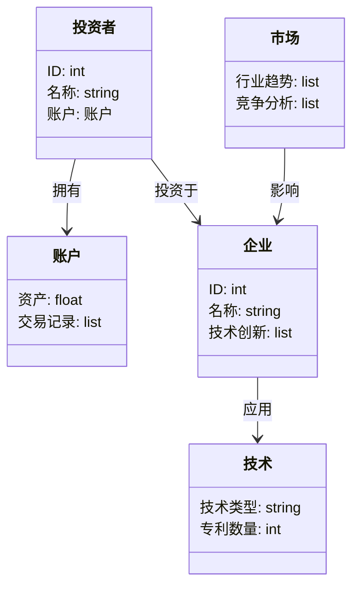
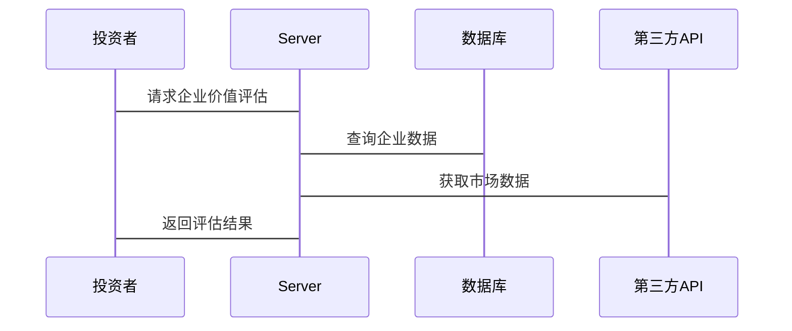

                 


# 巴菲特的长期主义在快速迭代的数字经济中的调整

> 关键词：长期主义、数字经济、投资策略、系统架构、算法原理

> 摘要：本文探讨了巴菲特的长期主义投资理念在快速迭代的数字经济环境中的调整与应用。通过分析长期主义的核心要素、数字经济的特点及其相互作用，结合数学模型和系统架构设计，提出了适应数字经济的长期投资策略。文章还通过具体案例分析，展示了如何在实际项目中应用这些策略，为投资者和企业管理者提供了实践指导。

---

## 第一部分：长期主义与数字经济的背景介绍

### 1.1 长期主义的定义与核心要素

长期主义是一种投资和管理理念，强调关注长期目标而非短期利益。其核心要素包括价值评估、风险控制、持续学习和适应能力。巴菲特的长期主义以基本面分析为基础，注重企业的内在价值和竞争优势。

### 1.2 数字经济的特点与发展趋势

数字经济以数字化技术为核心驱动力，具有快速迭代、数据驱动、网络效应强等特点。其发展趋势包括技术革新、商业模式创新和全球化扩展。

### 1.3 长期主义在数字经济中的重要性

在数字经济中，长期主义有助于投资者识别具备持续竞争优势的企业，应对快速变化的技术和市场环境，实现稳健投资回报。

---

## 第二部分：核心概念与联系

### 2.1 长期主义与数字经济的内在联系

长期主义关注企业的长期价值，而数字经济强调技术创新和数据驱动，两者在追求可持续增长方面存在协同效应。

### 2.2 核心概念原理

长期主义通过基本面分析评估企业价值，数字经济通过技术创新和数据驱动提升企业竞争力。两者的结合需要在价值评估模型中考虑技术迭代和市场变化。

### 2.3 核心概念对比表格

| 比较维度 | 长期主义 | 数字经济 |
|----------|----------|----------|
| 核心要素 | 价值评估、风险控制 | 技术创新、数据驱动 |
| 目标     | 长期稳定收益 | 数字化转型与创新 |
| 应用领域 | 投资与管理 | 技术与商业模式创新 |

### 2.4 ER实体关系图架构的 Mermaid 流程图

```mermaid
erDiagram
    customer[投资者] 
    company[企业] 
    investment[投资]
    technology[技术]
    market[市场]
    value[价值]

    customer --> investment: 进行投资
    investment --> company: 投资目标企业
    company --> technology: 应用技术创新
    technology --> market: 影响市场
    value --> customer: 产生价值
```

---

## 第三部分：算法原理讲解

### 3.1 算法原理概述

结合长期主义和数字经济的评估模型，使用改进的DCF（Discounted Cash Flow）模型，考虑技术迭代对企业价值的影响。

### 3.2 算法的数学模型与公式

DCF模型的基本公式：
$$
V = \sum_{t=1}^{n} \frac{CF_t}{(1 + r)^t} + \frac{TV}{(1 + r)^n}
$$
其中，$CF_t$为第t年的现金流，$r$为折现率，$TV$为终值。

改进模型考虑技术迭代带来的额外现金流：
$$
CF_t = 基础现金流 + 技术改进带来的增量现金流
$$

### 3.3 算法实现的 Python 源代码

```python
def discounted_cash_flow(cash_flows, discount_rate, terminal_value):
    n = len(cash_flows)
    present_value = 0
    for t in range(n):
        if t == n-1:
            cf = cash_flows[t] + terminal_value
        else:
            cf = cash_flows[t]
        present_value += cf / (1 + discount_rate) ** (t + 1)
    return present_value

# 示例
cash_flows = [100, 200, 300]
discount_rate = 0.1
terminal_value = 500
value = discounted_cash_flow(cash_flows, discount_rate, terminal_value)
print(f"企业价值：{value:.2f}")
```

### 3.4 算法的优缺点分析

优点：考虑了技术迭代对企业价值的影响，提供更准确的估值。缺点：需要准确预测技术改进带来的现金流，增加了模型的复杂性和不确定性。

---

## 第四部分：系统分析与架构设计方案

### 4.1 问题场景介绍

在数字经济中，投资者需要实时跟踪企业技术创新和市场变化，动态调整投资策略。

### 4.2 项目介绍

开发一个基于长期主义的数字经济投资分析系统，提供实时数据采集、分析和决策支持功能。

### 4.3 系统功能设计（领域模型 Mermaid 类图）



### 4.4 系统架构设计（Mermaid 架构图）


### 4.5 系统接口设计

- API接口：`GET /api/company/{id}/valuation`，返回企业价值评估结果。
- 数据格式：JSON，包含现金流、折现率、终值等信息。

### 4.6 系统交互 Mermaid 序列图



---

## 第五部分：项目实战

### 5.1 环境安装与配置

安装Python和相关库（如Pandas、NumPy）用于数据分析和建模。

### 5.2 系统核心实现源代码

```python
import pandas as pd

def calculate_market_trend(data):
    # 示例：计算市场趋势
    return data['价格'].rolling(3).mean()

# 示例数据加载
data = pd.read_csv('market_data.csv')
trend = calculate_market_trend(data)
print(trend)
```

### 5.3 代码应用解读与分析

通过数据滚动平均计算市场趋势，辅助投资者判断市场方向，优化投资策略。

### 5.4 实际案例分析

以某科技公司为例，分析其技术创新对企业价值的影响，应用改进的DCF模型进行估值。

### 5.5 项目小结

通过系统实现，展示了如何将长期主义与数字经济结合，提供实时数据分析和投资决策支持。

---

## 第六部分：最佳实践与总结

### 6.1 最佳实践 tips

- 定期更新模型参数，适应市场变化。
- 结合技术专家意见，评估技术创新对企业价值的影响。
- 风险管理：设置止损点，控制投资风险。

### 6.2 本书小结

本文系统地探讨了长期主义在数字经济中的调整与应用，通过理论分析和项目实战，提供了实用的投资策略和系统架构设计方案。

### 6.3 注意事项与风险提示

- 技术模型依赖于数据质量和准确性，需谨慎处理数据来源。
- 市场变化快，模型需定期更新和调整。

### 6.4 未来研究方向与拓展阅读

- 研究人工智能在投资决策中的应用。
- 探讨区块链技术对数字经济投资的影响。

---

## 附录

### 附录 A：相关术语解释

- 技术创新：企业采用新技术以提升产品和服务。
- 数字经济：以数字技术驱动的经济活动。

### 附录 B：参考文献与资料

- 巴菲特投资哲学
- 数字经济发展趋势报告

### 附录 C：工具与资源推荐

- Python数据分析工具：Pandas、NumPy
- 项目管理工具：Jira
- 数据可视化工具：Matplotlib

---

## 索引

### 索引 A：主题索引

- 长期主义
- 数字经济
- 投资策略
- 系统架构
- 算法原理

### 索引 B：术语索引

- 投资者
- 企业价值
- 技术创新
- 数据驱动
- 数字经济

---

## 作者

作者：AI天才研究院/AI Genius Institute & 禅与计算机程序设计艺术 /Zen And The Art of Computer Programming

---

本文通过系统化的分析和实践，展示了如何在快速迭代的数字经济中调整和应用长期主义投资策略，为投资者和企业管理者提供了理论与实践相结合的指导。

