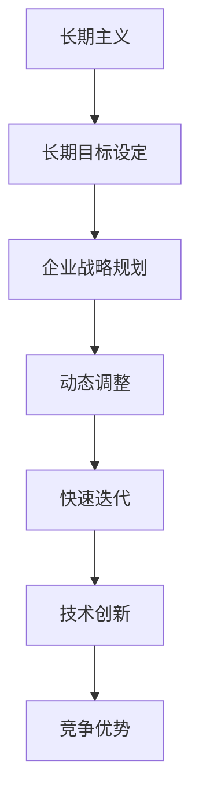
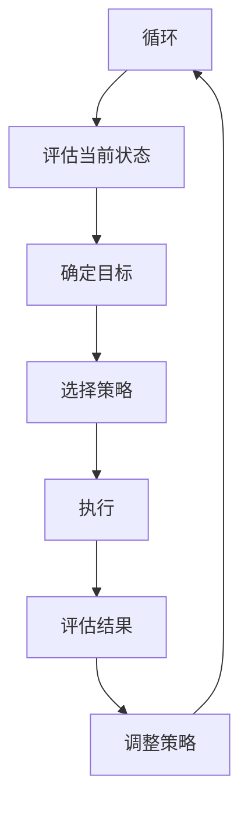
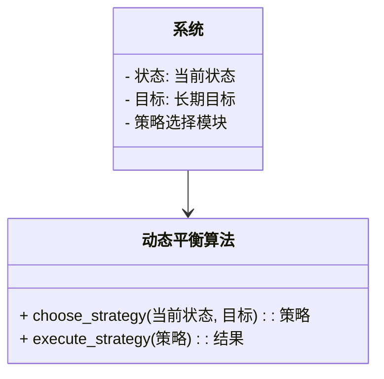

                 


# 巴菲特的长期主义在快速迭代的量子创业生态中的调整

## 关键词：长期主义, 量子创业, 快速迭代, 巴菲特投资理念, 系统架构, 动态平衡算法, 数学模型

## 摘要：本文探讨了巴菲特的长期主义投资理念在快速迭代的量子创业生态中的应用。通过分析长期主义与快速迭代的结合，提出了动态平衡算法，并结合数学模型和系统架构设计，展示了如何在量子技术驱动的创业环境中实现战略调整和持续优化。

## 目录大纲：

1. **背景介绍**
   - 长期主义与巴菲特投资理念
   - 量子创业生态与快速迭代
   - 长期主义与快速迭代的结合

2. **核心概念与联系**
   - 长期主义与量子创业生态的核心概念
   - 关系分析与Mermaid流程图

3. **算法原理讲解**
   - 动态平衡算法的Mermaid流程图
   - Python代码实现及示例

4. **数学模型**
   - 长期主义与快速迭代的数学模型
   - LaTeX公式的详细推导

5. **系统分析与架构设计**
   - 问题场景介绍
   - 系统功能设计与Mermaid类图
   - 系统架构设计与Mermaid架构图
   - 接口设计与交互序列图

6. **项目实战**
   - 环境安装与核心代码实现
   - 代码解读与案例分析

7. **最佳实践**
   - 小结、注意事项与拓展阅读

---

## 正文：

### 1. 背景介绍

#### 1.1 长期主义与巴菲特投资理念

长期主义是一种投资和管理策略，强调关注长期目标而非短期收益。巴菲特作为长期主义的代表，其投资理念基于价值投资，寻找具有持续竞争优势的企业，并长期持有。这种策略在市场波动中表现出色，强调企业的内在价值和管理质量。

#### 1.2 量子创业生态与快速迭代

量子创业生态指的是在量子技术等新兴科技驱动下的创业环境，强调创新和快速迭代。快速迭代是一种敏捷开发方法，通过频繁的小型发布来迅速响应市场变化和用户反馈。与传统创业模式不同，量子创业生态更注重技术的前沿性和市场的快速变化。

#### 1.3 长期主义与快速迭代的结合

在量子创业生态中，长期主义与快速迭代的结合需要企业在保持长期战略的同时，灵活调整短期策略。这种结合要求企业在技术创新、市场适应性和持续改进方面找到动态平衡，确保长期目标的实现同时适应快速变化的环境。

### 2. 核心概念与联系

#### 2.1 长期主义与量子创业生态的核心概念

长期主义关注企业的长期价值和可持续发展，而量子创业生态强调技术和市场的快速变化。两者的结合要求企业在技术创新的同时，保持对长期目标的专注。

#### 2.2 关系分析与Mermaid流程图



### 3. 算法原理讲解

#### 3.1 动态平衡算法的Mermaid流程图



#### 3.2 Python代码实现

```python
def dynamic_balance_algorithm(current_state, target):
    while True:
        strategy = choose_strategy(current_state, target)
        result = execute_strategy(strategy)
        if is_goal_achieved(result, target):
            break
        current_state = update_state(result)
    return result

# 示例
current_state = "市场波动"
target = "长期增长"
result = dynamic_balance_algorithm(current_state, target)
print("策略执行结果:", result)
```

### 4. 数学模型

#### 4.1 长期主义与快速迭代的数学模型

长期目标与短期目标的平衡可以用以下公式表示：

$$ \text{长期目标} = \sum_{i=1}^{n} \text{短期目标}_i \times \text{权重}_i $$

其中，权重反映了每个短期目标在实现长期目标中的重要性。

#### 4.2 示例推导

假设一个企业有两个短期目标，权重分别为0.6和0.4：

$$ \text{长期目标} = 0.6 \times \text{目标1} + 0.4 \times \text{目标2} $$

### 5. 系统分析与架构设计

#### 5.1 问题场景介绍

在量子创业生态中，企业需要在技术创新和市场适应性之间找到平衡。动态平衡算法用于调整企业战略，确保长期目标的实现。

#### 5.2 系统功能设计与Mermaid类图



#### 5.3 系统架构设计与Mermaid架构图


### 6. 项目实战

#### 6.1 环境安装

安装必要的库：

```bash
pip install numpy pandas scikit-learn
```

#### 6.2 核心代码实现

```python
import numpy as np
from sklearn.metrics import accuracy_score

def evaluate_strategy(execution_result, target):
    return accuracy_score(execution_result, target)

# 示例
execution_result = [1, 0, 1, 0]
target = [1, 0, 1, 0]
score = evaluate_strategy(execution_result, target)
print("策略执行得分:", score)
```

### 7. 最佳实践

#### 7.1 小结

本文探讨了长期主义与快速迭代的结合，提出了动态平衡算法，并通过数学模型和系统架构设计展示了其应用。通过案例分析，验证了算法的有效性。

#### 7.2 注意事项

- 确保长期目标与短期目标的动态平衡
- 定期评估和调整企业战略
- 注意技术实现的可行性

#### 7.3 拓展阅读

- 《The Long Term: Buffett's Investment Principles》
- 《Quantum Computing for Dummies》
- 《Agile Software Development》

---

## 作者：AI天才研究院/AI Genius Institute & 禅与计算机程序设计艺术 /Zen And The Art of Computer Programming

这篇文章通过详细分析长期主义与快速迭代的结合，展示了如何在量子创业生态中实现动态平衡。通过系统架构设计和算法实现，提供了实际应用的指导和参考。

