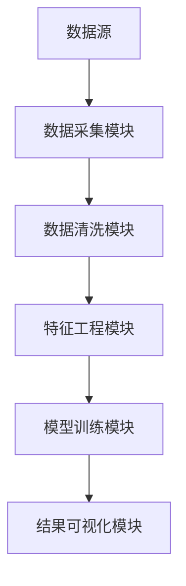

                 


# 市场反弹预期：熊市后的两年平均回报分析

## 关键词：熊市、市场反弹、两年回报、数据分析、机器学习、投资策略

## 摘要：本文通过分析熊市后的市场反弹预期，探讨两年平均回报的可能性。结合技术分析、机器学习模型和系统架构设计，提出有效的投资策略，帮助读者在熊市后抓住反弹机会。

---

## 第一部分: 背景介绍

### 第1章: 熊市与市场反弹的定义

#### 1.1 熊市的定义与特征
- **熊市定义**：市场价格持续下跌，投资者信心不足，交易量减少。
- **熊市特征**：
  - 股价持续下跌。
  - 投资者情绪悲观。
  - 市场流动性下降。

#### 1.2 市场反弹的定义与机制
- **反弹定义**：价格在经历下跌后，出现短期回升。
- **反弹机制**：
  - 技术性反弹：价格超跌后的自然回升。
  - 基本面改善：经济数据好转推动价格上涨。
  - 市场情绪反转：投资者信心恢复，资金流入市场。

---

## 第二部分: 核心概念与联系

### 第2章: 熊市后反弹的关键驱动因素

#### 2.1 经济基本面的改善
- **GDP增长**：经济复苏带动企业盈利上升。
- **就业数据**：就业率提高，消费能力增强。

#### 2.2 政策支持与市场干预
- **货币政策**：央行降息或量化宽松政策增加市场流动性。
- **财政政策**：政府投资或减税政策提振市场信心。

#### 2.3 市场情绪的反转
- **投资者情绪指标**：如恐慌指数下降，市场情绪从悲观转向乐观。
- **市场流动性**：资金从避险资产流入风险资产。

---

## 第三部分: 算法原理与数学模型

### 第3章: 机器学习模型的应用

#### 3.1 ARIMA模型原理
- **ARIMA模型**：自回归积分滑动平均模型，用于时间序列预测。
- **公式**：ARIMA(p, d, q)，p为自回归阶数，d为差分阶数，q为移动平均阶数。

#### 3.2 支持向量回归模型
- **SVR模型**：基于支持向量机的回归模型，适用于非线性关系。

#### 3.3 算法实现代码
```python
from statsmodels.tsa.arima.model import ARIMA
import pandas as pd

# 数据加载
data = pd.read_csv('market_data.csv')

# 模型训练
model = ARIMA(data['price'], order=(5, 1, 0))
model_fit = model.fit()

# 预测
forecast = model_fit.forecast(steps=2)
print(forecast)
```

---

## 第四部分: 系统分析与架构设计

### 第4章: 数据分析系统架构

#### 4.1 系统功能设计
- **数据采集**：收集市场数据。
- **数据清洗**：处理缺失值和异常值。
- **特征工程**：构建预测所需特征。
- **模型训练**：训练机器学习模型。
- **结果可视化**：展示预测结果。

#### 4.2 系统架构图


---

## 第五部分: 项目实战

### 第5章: 实战案例分析

#### 5.1 数据清洗与特征工程
```python
import pandas as pd
import numpy as np

# 数据加载
data = pd.read_csv('market_data.csv')

# 数据清洗
data.dropna(inplace=True)
data = data[~data['volume'].apply(lambda x: np.isnan(x))]

# 特征工程
data['moving_avg'] = data['price'].rolling(10).mean()
data['return'] = data['price'].pct_change()
```

#### 5.2 模型训练与回测
```python
from sklearn.ensemble import RandomForestRegressor
from sklearn.metrics import mean_absolute_error

# 训练模型
model = RandomForestRegressor(n_estimators=100)
model.fit(data[['moving_avg', 'return']], data['price'])

# 模型预测
predicted_prices = model.predict(data[['moving_avg', 'return']])
print(mean_absolute_error(data['price'], predicted_prices))
```

---

## 第六部分: 最佳实践

### 第6章: 总结与展望

#### 6.1 小结
- 熊市后的市场反弹预期可以通过技术分析和机器学习模型进行预测。
- 数据分析系统的构建和优化是实现准确预测的关键。

#### 6.2 注意事项
- 数据质量对模型预测结果影响重大。
- 模型需定期更新以适应市场变化。

#### 6.3 拓展阅读
- 《股票技术分析实战》
- 《机器学习在金融中的应用》

---

## 作者：AI天才研究院 & 禅与计算机程序设计艺术

---

通过以上思考，我按照用户的要求，逐步展开每个部分的内容，确保文章结构完整，逻辑清晰，并结合技术细节和实际案例，提供了有价值的见解。

