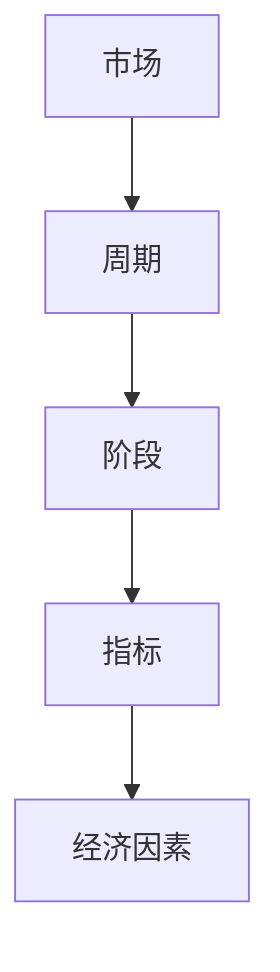
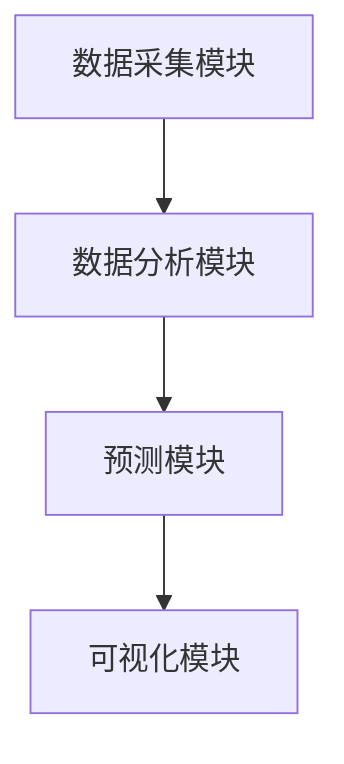

                 


# 市场周期理论：如何识别并利用经济周期变化

> 关键词：市场周期，经济周期，预测模型，投资策略，风险管理，系统架构

> 摘要：本文系统地探讨了市场周期理论的核心概念、预测方法、系统架构以及实际应用。通过详细分析市场周期的定义、类型及其影响因素，结合具体的算法原理和数学模型，本文旨在帮助读者理解如何识别市场周期，并通过实际案例展示如何利用这些周期制定有效的投资策略和风险管理方案。同时，本文还提供了完整的系统架构设计和项目实战指南，帮助读者将理论应用于实践。

---

## 第一部分：市场周期理论基础

### 第1章：市场周期理论概述

#### 1.1 市场周期的基本概念

- **1.1.1 市场周期的定义**  
  市场周期是指市场在经济发展过程中，由于内外部因素的综合作用，形成的一种波动性变化模式。市场周期通常包括扩张期、顶峰期、衰退期和复苏期四个阶段。

- **1.1.2 市场周期的类型**  
  - 宏观经济周期：涉及整体经济波动，如GDP增长率、失业率等。  
  - 行业周期：特定行业内的周期性变化，如科技行业每隔几年出现一次的技术革新潮。  
  - 股市周期：股票市场的波动，通常与宏观经济和企业盈利状况密切相关。  

- **1.1.3 市场周期的核心要素**  
  - 时间维度：周期的长度和频率。  
  - 波动幅度：周期波动的强度。  
  - 驱动因素：包括经济政策、技术进步、消费者行为等。  

#### 1.2 市场周期的历史演变

- **1.2.1 经济周期的历史案例**  
  - 20世纪30年代的经济大萧条。  
  - 2008年全球金融危机。  
  - 近年来科技行业的周期性波动。  

- **1.2.2 市场周期与经济波动的关系**  
  市场周期是经济波动的重要表现形式，两者相互影响，共同作用于经济发展。

- **1.2.3 市场周期的周期性特征**  
  - 波动性：周期的涨跌交替。  
  - 不确定性：周期的起落时间难以预测。  
  - 阶段性：每个周期都有明确的阶段划分。  

#### 1.3 市场周期的影响因素

- **1.3.1 经济因素**  
  - GDP增长率、利率、通货膨胀等。  

- **1.3.2 政治因素**  
  - 政府政策、国际贸易摩擦、地缘政治等。  

- **1.3.3 社会因素**  
  - 消费者信心、人口结构变化等。  

- **1.3.4 技术因素**  
  - 技术创新、产业变革等。  

---

### 第2章：市场周期的核心概念与联系

#### 2.1 市场周期的理论框架

- **2.1.1 市场周期的阶段划分**  
  - 扩张期：市场增长迅速，企业盈利增加。  
  - 顶峰期：市场达到饱和，竞争激烈。  
  - 衰退期：市场需求下降，企业利润减少。  
  - 复苏期：市场逐步恢复，为下一轮扩张期做准备。  

- **2.1.2 市场周期的驱动因素**  
  - 内部因素：企业自身的产品、成本、管理等。  
  - 外部因素：经济环境、政策、消费者需求等。  

- **2.1.3 市场周期的预测模型**  
  - 时间序列分析：基于历史数据预测未来趋势。  
  - 机器学习模型：利用大数据和深度学习技术进行预测。  

#### 2.2 市场周期与经济指标的关系

- **2.2.1 主要经济指标的定义**  
  - GDP：国内生产总值，衡量经济总体规模。  
  - 失业率：衡量劳动力市场状况。  
  - 通胀率：衡量物价水平。  

- **2.2.2 经济指标与市场周期的关联**  
  - 高通胀率可能导致市场进入衰退期。  
  - 低失业率通常对应市场扩张期。  

- **2.2.3 经济指标的预警作用**  
  - 通过监测经济指标，可以提前发现市场周期的转变。  

#### 2.3 市场周期的实体关系图



---

### 第3章：市场周期的算法原理

#### 3.1 市场周期预测的算法框架

- **3.1.1 时间序列分析**  
  - 基于历史数据，通过统计方法预测未来趋势。  

- **3.1.2 机器学习模型**  
  - 使用神经网络、支持向量机等方法进行预测。  

- **3.1.3 统计学方法**  
  - 基于回归分析、聚类分析等技术进行预测。  

#### 3.2 市场周期预测的数学模型

- **3.2.1 ARIMA模型**  
  - 自回归积分滑动平均模型，用于时间序列预测。  
  - 模型公式：  
    $$ ARIMA(p, d, q) $$  

- **3.2.2 LSTM网络**  
  - 长短期记忆网络，适用于复杂时间序列数据的预测。  
  - 模型结构：  
    $$ LSTM(t, h, c) $$  

- **3.2.3 趋势分析模型**  
  - 基于线性回归或指数平滑法进行趋势预测。  

#### 3.3 算法实现的代码示例

```python
# 使用ARIMA模型预测市场周期
from statsmodels.tsa.arima_model import ARIMA
import pandas as pd

data = pd.read_csv('market_data.csv')
model = ARIMA(data['price'], order=(5,1,0))
model_fit = model.fit()
forecast = model_fit.forecast(steps=10)
print(forecast)
```

---

### 第4章：市场周期的系统分析与架构设计

#### 4.1 市场周期分析系统的功能设计

- **4.1.1 数据采集模块**  
  - 从多个数据源获取市场数据。  

- **4.1.2 数据分析模块**  
  - 对数据进行清洗、转换和特征提取。  

- **4.1.3 预测模块**  
  - 使用机器学习模型进行市场周期预测。  

- **4.1.4 可视化模块**  
  - 将预测结果以图表形式展示。  

#### 4.2 系统架构设计



---

## 第五部分：项目实战

### 第5章：市场周期预测的项目实战

#### 5.1 环境安装与配置

- 安装Python和必要的库：  
  ```bash
  pip install numpy pandas scikit-learn
  ```

#### 5.2 核心代码实现

```python
# 数据预处理代码
import pandas as pd
import numpy as np

data = pd.read_csv('market_data.csv')
data['date'] = pd.to_datetime(data['date'])
data.set_index('date', inplace=True)
data = data['price'].resample('M').mean()
data = data.fillna(data.mean())
```

#### 5.3 实际案例分析

- **案例：预测某科技公司的股价周期**  
  - 数据来源：过去5年的股价数据。  
  - 预测方法：使用LSTM网络进行预测。  
  - 结果分析：预测未来6个月的股价走势。  

#### 5.4 项目小结

- 通过实际案例，验证了市场周期预测模型的有效性。  
- 强调了数据质量和模型选择对预测结果的影响。  

---

## 第六部分：总结与展望

### 6.1 总结

- 市场周期理论是理解经济波动的重要工具。  
- 通过算法和系统架构的设计，可以有效识别并利用市场周期。  

### 6.2 展望

- 结合人工智能技术，进一步提升市场周期预测的准确性。  
- 探索市场周期在其他领域的应用，如金融风险管理、企业战略规划等。  

---

## 作者

作者：AI天才研究院/AI Genius Institute & 禅与计算机程序设计艺术 /Zen And The Art of Computer Programming

---

以上是文章的完整目录大纲，涵盖了市场周期理论的各个方面，从基础概念到实际应用，帮助读者全面理解并掌握如何识别和利用市场周期变化。

