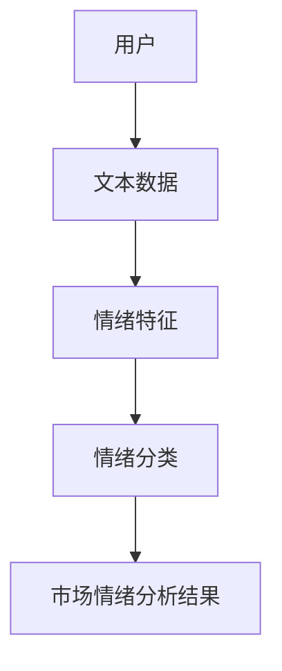
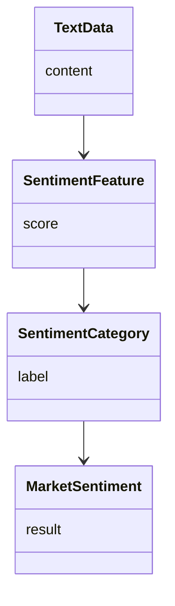
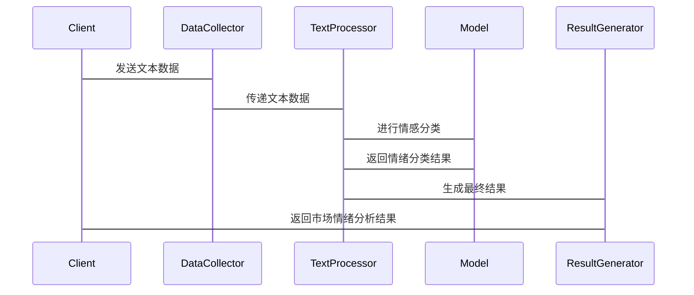

                 


# 市场情绪分析

> 关键词：市场情绪分析、情感计算、文本挖掘、机器学习、深度学习

> 摘要：本文将详细探讨市场情绪分析的核心概念、算法原理、系统架构以及实际应用。通过分析情感计算、文本挖掘和机器学习等技术，结合实际案例，帮助读者理解市场情绪分析的实现过程和应用场景。本文适合对自然语言处理和金融市场分析感兴趣的技术人员和研究人员。

---

# 第一部分: 市场情绪分析概述

# 第1章: 市场情绪分析的背景与概念

## 1.1 市场情绪分析的定义与背景

### 1.1.1 市场情绪分析的定义  
市场情绪分析（Market Sentiment Analysis）是指通过分析文本数据（如新闻、社交媒体评论、论坛讨论等）来判断市场参与者的情绪状态，进而预测市场走势的一种技术。它是自然语言处理（NLP）和情感计算的结合应用。

### 1.1.2 市场情绪分析的背景与重要性  
随着互联网的普及，海量的市场相关信息通过文本形式传播。市场情绪分析能够帮助投资者、企业等从这些非结构化数据中提取有价值的信息，辅助决策。例如，社交媒体上的用户评论可以反映市场对某一股票或产品的看法，从而影响其价格波动。

### 1.1.3 市场情绪分析的应用场景  
- 金融领域：股票价格预测、市场趋势分析  
- 零售领域：消费者情绪分析、产品口碑分析  
- 社交媒体分析：热点事件的情绪追踪  

## 1.2 市场情绪分析的核心概念  

### 1.2.1 情绪分类与情感计算  
情绪分类是将文本划分为不同情绪类别（如正面、负面、中性）的过程。情感计算则是通过计算文本的情感倾向来量化市场情绪。

### 1.2.2 文本挖掘与自然语言处理  
文本挖掘是从非结构化文本中提取信息的技术，而自然语言处理（NLP）则是理解和生成人类语言的技术。两者结合可以提取文本中的情感信息。

### 1.2.3 数据驱动与模型驱动的市场情绪分析  
数据驱动方法依赖于大量的标注数据进行训练，而模型驱动方法则依赖于特定的算法和模型结构。

## 1.3 市场情绪分析的边界与外延  

### 1.3.1 市场情绪分析的边界  
市场情绪分析仅关注文本中的情感信息，不涉及其他类型的数据（如价格、成交量等）。

### 1.3.2 市场情绪分析与其他领域的联系  
- 金融领域：与时间序列分析、机器学习结合  
- 零售领域：与用户行为分析结合  

## 1.4 市场情绪分析的核心要素组成  

### 1.4.1 数据来源与特征提取  
- 数据来源：社交媒体、新闻、评论等  
- 特征提取：关键词提取、情感倾向分析  

### 1.4.2 情绪分类与预测模型  
- 分类模型：朴素贝叶斯、支持向量机（SVM）  
- 预测模型：时间序列模型、深度学习模型  

### 1.4.3 应用场景与反馈机制  
- 应用场景：实时监控、舆情分析  
- 反馈机制：根据市场情绪调整策略  

## 1.5 本章小结  
本章介绍了市场情绪分析的定义、背景、核心概念以及应用场景，为后续章节的深入分析奠定了基础。

---

# 第二部分: 市场情绪分析的核心概念与联系

# 第2章: 市场情绪分析的核心概念原理  

## 2.1 情感计算与文本挖掘的原理  

### 2.1.1 情感计算的基本原理  
情感计算的核心是将文本中的情感信息转化为可量化的指标。常用的情感计算方法包括词袋模型和词嵌入模型。

### 2.1.2 文本挖掘的核心原理  
文本挖掘通过提取文本中的关键词、主题等信息，帮助分析市场情绪。

## 2.2 核心概念的属性特征对比  

### 2.2.1 情感计算与文本挖掘的对比分析  
| 特性 | 情感计算 | 文本挖掘 |
|------|----------|----------|
| 目标 | 分析情感倾向 | 提取文本信息 |
| 方法 | 依赖情感词典 | 依赖关键词提取 |

### 2.2.2 数据驱动与模型驱动的对比  
| 特性 | 数据驱动 | 模型驱动 |
|------|----------|----------|
| 依赖 | 大量标注数据 | 特定算法模型 |
| 优点 | 高精度 | � 强大的泛化能力 |

## 2.3 ER实体关系图架构  



---

# 第三部分: 市场情绪分析的算法原理

# 第3章: 市场情绪分析的算法原理  

## 3.1 情感分析算法  

### 3.1.1 基于规则的情感分析算法  
基于规则的算法依赖于预定义的情感词典。

```python
def sentiment_score(text):
    positive_words = ["好", "优秀"]
    negative_words = ["差", "糟糕"]
    score = 0
    for word in text.split():
        if word in positive_words:
            score += 1
        elif word in negative_words:
            score -= 1
    return score
```

### 3.1.2 基于统计的情感分析算法  
基于统计的算法通常使用朴素贝叶斯模型。

```python
from sklearn.naive_bayes import MultinomialNB

# 假设X是文本特征向量，y是情绪标签
model = MultinomialNB()
model.fit(X, y)
```

### 3.1.3 基于机器学习的情感分析算法  
深度学习模型如LSTM和Transformer（如BERT）在情感分析中表现优异。

```python
import tensorflow as tf
from tensorflow.keras import layers

model = tf.keras.Sequential()
model.add(layers.Embedding(input_dim=10000, output_dim=64))
model.add(layers.LSTM(64))
model.add(layers.Dense(1, activation='sigmoid'))
model.compile(optimizer='adam', loss='binary_crossentropy', metrics=['accuracy'])
```

## 3.2 文本分类算法  

### 3.2.1 朴素贝叶斯分类器  
```python
from sklearn.naive_bayes import MultinomialNB

# 假设X是文本特征向量，y是情绪标签
model = MultinomialNB()
model.fit(X, y)
```

### 3.2.2 支持向量机（SVM）  
```python
from sklearn.svm import SVC

model = SVC()
model.fit(X, y)
```

### 3.2.3 深度学习模型（如CNN、RNN）  
```python
import tensorflow as tf
from tensorflow.keras import layers

model = tf.keras.Sequential()
model.add(layers.Embedding(input_dim=10000, output_dim=64))
model.add(layers.Conv1D(32, 5, padding='valid', activation='relu'))
model.add(layers.MaxPooling1D(pool_size=4))
model.add(layers.Dense(1, activation='sigmoid'))
model.compile(optimizer='adam', loss='binary_crossentropy', metrics=['accuracy'])
```

---

# 第四部分: 市场情绪分析的系统架构与实现

# 第4章: 市场情绪分析的系统架构与实现  

## 4.1 问题场景介绍  
市场情绪分析系统通常需要实时处理大量文本数据，提供情绪预测结果。

## 4.2 系统功能设计  

### 4.2.1 领域模型  


### 4.2.2 系统架构设计  
```mermaid
client --> DataCollector: 发送请求
DataCollector --> TextProcessor: 处理文本数据
TextProcessor --> Model: 情感分类
Model --> ResultGenerator: 生成结果
ResultGenerator --> Client: 返回结果
```

## 4.3 系统接口设计  
- 数据接口：文本数据输入接口  
- 情感分类接口：接受文本数据，返回情绪分类结果  

## 4.4 系统交互设计  


---

# 第五部分: 项目实战

# 第5章: 项目实战  

## 5.1 环境安装  

### 5.1.1 安装Python和相关库  
```bash
pip install numpy pandas scikit-learn tensorflow
```

## 5.2 系统核心实现  

### 5.2.1 数据预处理  
```python
import pandas as pd

df = pd.read_csv('data.csv')
X = df['text'].values
y = df['label'].values
```

### 5.2.2 特征提取  
```python
from sklearn.feature_extraction.text import TfidfVectorizer

vectorizer = TfidfVectorizer()
X_features = vectorizer.fit_transform(X)
```

### 5.2.3 模型训练  
```python
from sklearn.model_selection import train_test_split
from sklearn.naive_bayes import MultinomialNB

X_train, X_test, y_train, y_test = train_test_split(X_features, y, test_size=0.2)
model = MultinomialNB()
model.fit(X_train, y_train)
```

### 5.2.4 模型预测  
```python
y_pred = model.predict(X_test)
print(classification_report(y_test, y_pred))
```

## 5.3 代码实现与解读  
- 数据预处理：读取数据并提取文本特征  
- 特征提取：使用TF-IDF进行特征提取  
- 模型训练：使用朴素贝叶斯进行情绪分类  
- 模型预测：预测结果并评估性能  

## 5.4 实际案例分析  
以社交媒体上的股票评论为例，分析市场情绪。

---

# 第六部分: 最佳实践与总结

# 第6章: 最佳实践与总结  

## 6.1 小结  
市场情绪分析是NLP和机器学习的结合应用，能够帮助投资者和企业做出更明智的决策。

## 6.2 注意事项  
- 数据质量：确保数据的代表性和多样性  
- 模型调优：通过交叉验证优化模型性能  
- 隐私问题：注意数据的隐私保护  

## 6.3 未来趋势  
- 更加复杂的深度学习模型  
- 多模态情绪分析（结合图像、语音等）  
- 实时情绪监控系统  

## 6.4 拓展阅读  
- 《自然语言处理实战》  
- 《机器学习实战》  
- 《情感计算入门》  

---

# 结语  
市场情绪分析是一项结合了NLP、机器学习和情感计算的复杂任务，但通过系统的分析和实践，我们可以将其应用于实际场景中，帮助我们更好地理解市场动态。

---

作者：AI天才研究院/AI Genius Institute & 禅与计算机程序设计艺术 /Zen And The Art of Computer Programming

