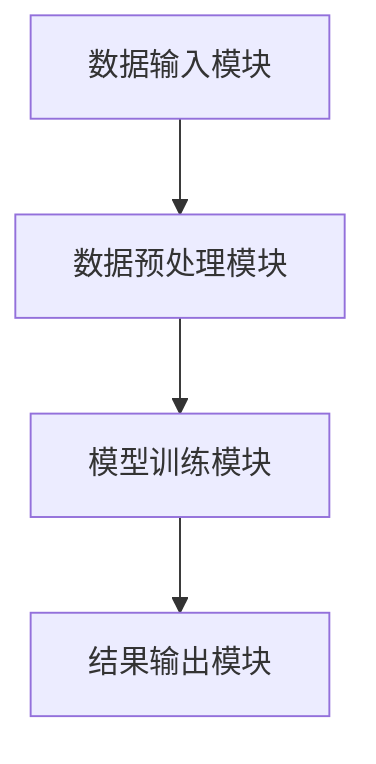
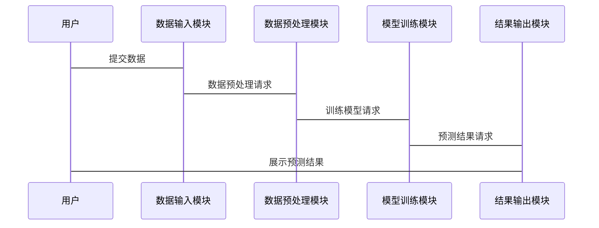

                 


# 《市场趋势预测模型》

> 关键词：市场趋势预测模型、时间序列分析、机器学习、数据驱动预测、统计学方法

> 摘要：本文详细探讨了市场趋势预测模型的构建与应用，从基础概念到高级算法，从系统架构到项目实战，结合实际案例和数学模型，全面解析市场趋势预测的核心原理与实现方法，为读者提供系统性的知识和实践指导。

---

## 第5章: 市场趋势预测模型的系统架构与实现

### 5.1 系统架构设计
#### 5.1.1 问题场景介绍
市场趋势预测系统的构建需要考虑数据输入、模型处理、结果输出等多个环节。系统架构设计需要满足高效性、可扩展性和易用性。

#### 5.1.2 系统功能设计
- 数据输入模块：接收原始数据并进行预处理。
- 模型训练模块：基于预处理后的数据训练预测模型。
- 结果输出模块：生成预测结果并进行可视化展示。

#### 5.1.3 系统架构图


#### 5.1.4 系统接口设计
- 数据接口：支持CSV、Excel等多种格式的数据输入。
- API接口：提供RESTful API用于模型预测。
- 可视化界面：用户友好的Web界面展示预测结果。

#### 5.1.5 系统交互序列图


### 5.2 系统实现细节
#### 5.2.1 数据接口实现
- 数据输入格式：CSV文件
- 数据清洗流程：处理缺失值、异常值、重复值
- 数据转换：归一化、标准化

#### 5.2.2 模型服务实现
- 模型加载：加载训练好的模型
- 数据处理：将输入数据转换为模型可接受的格式
- 预测输出：返回预测结果

#### 5.2.3 结果展示优化
- 数据可视化：折线图、柱状图、散点图
- 结果解释：显示预测置信区间、误差范围
- 可视化工具：Matplotlib、Seaborn、Plotly

---

## 第6章: 项目实战——电商销售预测模型

### 6.1 项目背景与目标
- 项目背景：某电商平台希望通过预测未来销售额，优化库存管理和营销策略。
- 项目目标：构建一个基于历史销售数据的预测模型。

### 6.2 数据收集与预处理
#### 6.2.1 数据来源
- 历史销售数据：包括日期、销售额、销量、产品类别等。
- 外部数据：节假日信息、行业趋势、经济指标。

#### 6.2.2 数据清洗
- 处理缺失值：使用均值填补法填充缺失值。
- 处理异常值：使用箱线图识别并剔除异常值。
- 数据标准化：将销售额归一化到0-1范围。

### 6.3 特征工程
#### 6.3.1 时间特征
- 周末效应、节假日效应、季节性趋势。

#### 6.3.2 历史销售特征
- 滑动窗口特征：过去7天、过去30天的平均销售额。

#### 6.3.3 其他特征
- 产品类别编码、促销活动标记。

### 6.4 模型选择与优化
#### 6.4.1 模型选择
- 选择LSTM模型进行时间序列预测。

#### 6.4.2 模型优化
- 调参：调整LSTM的隐藏层大小、学习率。
- 交叉验证：使用K折交叉验证评估模型性能。

### 6.5 代码实现
#### 6.5.1 数据预处理代码
```python
import pandas as pd
from sklearn.preprocessing import StandardScaler

# 读取数据
data = pd.read_csv('sales_data.csv')

# 处理缺失值
data = data.dropna()

# 数据标准化
scaler = StandardScaler()
data['sales'] = scaler.fit_transform(data['sales'].values.reshape(-1, 1))
```

#### 6.5.2 模型训练代码
```python
from tensorflow.keras.models import Sequential
from tensorflow.keras.layers import LSTM, Dense

# 模型定义
model = Sequential()
model.add(LSTM(64, input_shape=(timesteps, features)))
model.add(Dense(1))
model.compile(loss='mean_squared_error', optimizer='adam')

# 训练模型
model.fit(X_train, y_train, epochs=50, batch_size=32)
```

#### 6.5.3 模型预测代码
```python
# 预测未来一周的销售额
future_days = 7
predicted_sales = model.predict(future_data)
predicted_sales = scaler.inverse_transform(predicted_sales)
```

### 6.6 实际案例分析
- 模型预测结果与实际销售额对比
- 模型的RMSE、MAE、R²等指标评估

---

## 第7章: 高级主题与拓展

### 7.1 集成学习在市场趋势预测中的应用
- 集成学习原理：Bagging、Boosting
- 集成预测模型：模型融合、投票法

### 7.2 在线更新模型
- 模型实时更新方法：在线学习、增量学习
- 实时数据流处理：Apache Kafka、Flume

### 7.3 结合NLP技术的市场趋势预测
- 文本数据挖掘：社交媒体评论、新闻标题
- 多模态预测：结合文本、图像、视频数据进行预测

---

## 第8章: 总结与展望

### 8.1 核心内容总结
- 市场趋势预测模型的构建与实现
- 关键算法与技术的深入分析
- 项目实战的经验总结

### 8.2 未来展望
- 更精准的预测方法：深度学习与强化学习的结合
- 更高效的计算方式：边缘计算、分布式计算
- 更广泛的应用场景：实时预测、个性化推荐、动态定价

---

## 作者：AI天才研究院/AI Genius Institute & 禅与计算机程序设计艺术 /Zen And The Art of Computer Programming

---

以上是《市场趋势预测模型》的完整目录大纲和部分内容，后续章节将根据实际需求逐步展开。

