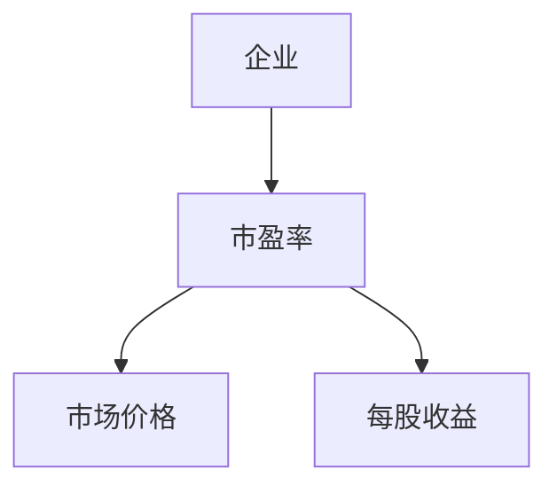
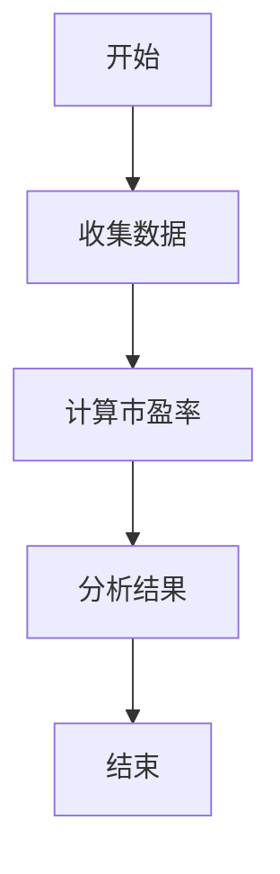
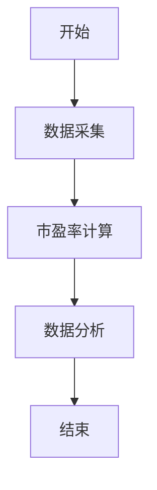
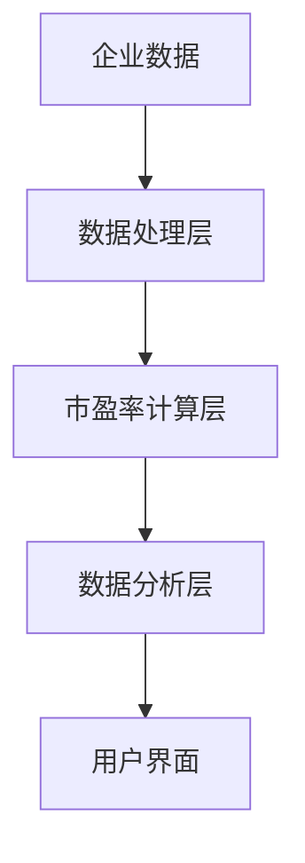
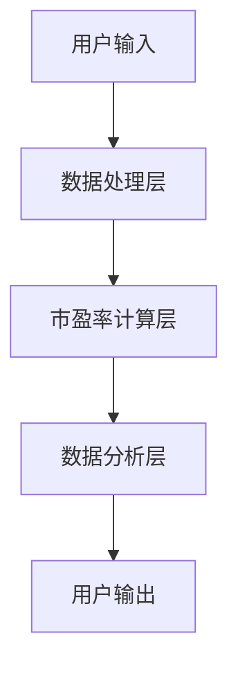
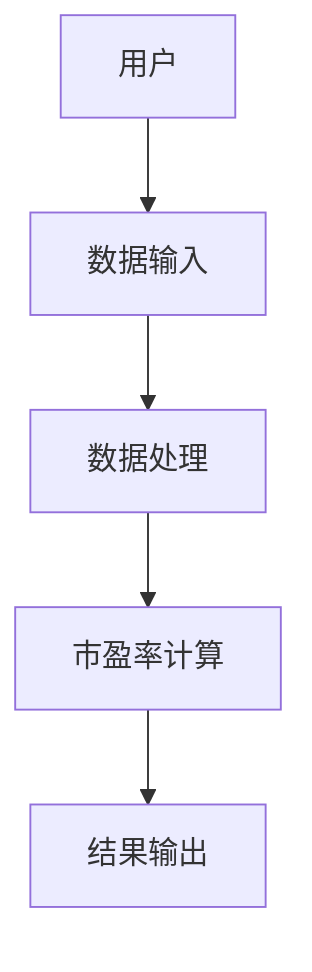

                 


# 市盈率法在企业估值中的应用

## 关键词：市盈率法，企业估值，投资分析，股票分析，财务指标

## 摘要：  
市盈率法是一种常用的估值方法，通过对企业的市盈率进行分析，评估其市场价值。本文从市盈率法的定义、原理、数学模型、系统架构设计、实际案例分析等多方面展开，全面探讨市盈率法在企业估值中的应用。通过详细的数学推导和实际案例分析，帮助读者理解市盈率法的核心思想和实际应用。

---

# 第一部分: 市盈率法的背景与基础

## 第1章: 市盈率法的概述

### 1.1 市盈率法的定义与核心概念

#### 1.1.1 市盈率法的定义  
市盈率法（Price-to-Earnings Ratio，简称P/E）是一种常用的估值方法，用于评估企业的市场价值。它通过比较企业的市场价格与每股收益（Earnings Per Share，EPS）之间的关系，判断企业是否被高估或低估。

#### 1.1.2 市盈率法的核心要素  
市盈率法的核心要素包括：  
1. 市场价格（Market Price）：企业在股票市场上的当前股价。  
2. 每股收益（EPS）：企业每股股票的净利润。  
3. 市盈率倍数（P/E Ratio）：市场价格与每股收益的比值，反映市场对企业的估值水平。  

#### 1.1.3 市盈率法的边界与外延  
市盈率法的边界包括：  
1. 仅适用于盈利企业的估值，不适用于亏损企业。  
2. 适用于同一行业或相似规模企业的比较分析。  
3. 受市场波动、行业周期和宏观经济因素的影响较大。  

### 1.2 市盈率法的背景与应用领域

#### 1.2.1 企业估值的基本问题  
企业估值是投资者在进行股票投资或企业并购时的核心问题。如何准确评估企业的市场价值，是投资者关注的重点。市盈率法作为一种简单有效的估值工具，被广泛应用于股票分析和投资决策中。

#### 1.2.2 市盈率法的适用场景  
市盈率法适用于以下场景：  
1. 判断企业是否被高估或低估。  
2. 比较同一行业内的企业估值水平。  
3. 作为投资决策的参考依据。  

#### 1.2.3 市盈率法与其他估值方法的对比  
市盈率法与市净率法、现金流折现法等其他估值方法相比，具有以下特点：  
1. 计算简单，易于理解和应用。  
2. 更适合评估盈利稳定的企业。  
3. 受行业特性和企业规模的影响较大。  

### 1.3 市盈率法的历史演变

#### 1.3.1 市盈率法的发展历程  
市盈率法起源于20世纪初，随着股票市场的兴起而逐渐发展成熟。早期的市盈率法主要用于判断企业的估值合理性，后来逐步发展为一种重要的投资分析工具。

#### 1.3.2 不同经济周期下的市盈率法应用  
在不同的经济周期下，市盈率法的应用策略有所不同：  
1. 在经济繁荣期，市盈率法可能高估企业的市场价值。  
2. 在经济衰退期，市盈率法可能低估企业的市场价值。  

### 1.4 市盈率法的现状与趋势

#### 1.4.1 当前市盈率法的应用现状  
当前，市盈率法仍然是股票分析和企业估值中最重要的工具之一。它被广泛应用于股票投资、企业并购和财务分析等领域。

#### 1.4.2 市盈率法的未来发展趋势  
市盈率法的未来发展将更加注重与其他估值方法的结合，例如结合现金流折现法、市净率法等，形成更加全面和准确的估值体系。

---

## 第2章: 市盈率法的核心概念与联系

### 2.1 市盈率法的原理与数学模型

#### 2.1.1 市盈率的计算公式  
市盈率的计算公式为：  
$$市盈率 = \frac{市场价格}{每股收益}$$  

#### 2.1.2 市盈率法的数学模型  
市盈率法的数学模型可以表示为：  
$$P/E = \frac{P}{E}$$  
其中，P代表市场价格，E代表每股收益。

#### 2.1.3 市盈率法的属性特征对比  
市盈率法的属性特征对比如下表所示：

| 属性 | 特征 |
|------|------|
| 计算复杂度 | 简单 |
| 适用范围 | 盈利企业 |
| 优点 | 计算快速，易于理解 |
| 缺点 | 受行业和市场波动影响较大 |

### 2.2 市盈率法的核心要素对比

#### 2.2.1 市盈率与企业价值的关系  
市盈率与企业价值成正比关系，市盈率越高，企业价值越大。  

#### 2.2.2 市盈率与企业盈利能力的关系  
市盈率与企业盈利能力成反比关系，盈利能力越强，市盈率越低。  

#### 2.2.3 市盈率与企业成长性的关系  
市盈率与企业成长性成正比关系，成长性越高的企业，市盈率越高。  

### 2.3 市盈率法的ER实体关系图



---

# 第二部分: 市盈率法的原理与模型

## 第3章: 市盈率法的原理与算法

### 3.1 市盈率法的基本原理

#### 3.1.1 市盈率法的基本假设  
市盈率法的基本假设包括：  
1. 市场是有效的，股价反映企业的实际价值。  
2. 企业的盈利能力是稳定的。  

#### 3.1.2 市盈率法的核心逻辑  
市盈率法的核心逻辑是：通过比较企业的市盈率与行业平均水平或可比企业的市盈率，判断企业的估值水平。

#### 3.1.3 市盈率法的适用条件  
市盈率法的适用条件包括：  
1. 企业盈利稳定。  
2. 企业规模相似。  
3. 行业特性相近。  

### 3.2 市盈率法的算法流程



### 3.3 市盈率法的数学模型与公式

#### 3.3.1 市盈率计算公式  
$$P/E = \frac{P}{E}$$  

#### 3.3.2 市盈率与企业价值的关系  
市盈率与企业价值的关系可以表示为：  
$$V = P/E \times E = P$$  

---

## 第4章: 市盈率法的系统与架构设计

### 4.1 市盈率法的系统功能设计

#### 4.1.1 系统功能模块  
市盈率法的系统功能模块包括：  
1. 数据采集模块：收集企业的市场价和每股收益。  
2. 市盈率计算模块：计算企业的市盈率。  
3. 数据分析模块：比较企业的市盈率与行业平均水平。  

#### 4.1.2 系统功能流程  


### 4.2 市盈率法的系统架构设计

#### 4.2.1 系统架构图  


#### 4.2.2 系统数据流图  


### 4.3 市盈率法的系统交互设计

#### 4.3.1 系统交互流程  


---

## 第5章: 市盈率法的项目实战

### 5.1 市盈率法的环境安装

#### 5.1.1 环境要求  
1. Python编程语言。  
2. 数据分析库（如Pandas、NumPy）。  
3. 数据可视化库（如Matplotlib）。  

### 5.2 市盈率法的核心代码实现

#### 5.2.1 数据采集  
```python
import pandas as pd

# 数据采集
data = pd.read_csv('企业数据.csv')
```

#### 5.2.2 市盈率计算  
```python
# 计算市盈率
data['市盈率'] = data['市场价格'] / data['每股收益']
```

#### 5.2.3 数据分析  
```python
# 比较市盈率
industry_avg = data['行业平均市盈率']
data['差异'] = data['市盈率'] - industry_avg
```

### 5.3 市盈率法的案例分析

#### 5.3.1 案例背景  
以某行业内的两家公司为例，计算它们的市盈率，并与行业平均水平进行比较。

#### 5.3.2 数据分析  
```python
# 计算行业平均市盈率
industry_avg = data['市盈率'].mean()
```

#### 5.3.3 结果解读  
如果某企业的市盈率低于行业平均水平，说明该企业可能被低估；反之，如果市盈率高于行业平均水平，则说明该企业可能被高估。

### 5.4 市盈率法的项目总结

#### 5.4.1 项目总结  
市盈率法是一种简单有效的估值工具，能够帮助投资者快速判断企业的估值水平。

#### 5.4.2 项目改进  
未来可以结合其他估值方法，如现金流折现法，形成更加全面的估值体系。

---

## 第三部分: 市盈率法的未来展望与最佳实践

### 6.1 市盈率法的未来展望

#### 6.1.1 技术发展趋势  
市盈率法的未来发展将更加注重与其他估值方法的结合，例如现金流折现法、市净率法等。

#### 6.1.2 应用领域拓展  
市盈率法的应用领域将更加广泛，例如在企业并购、风险管理等领域。

### 6.2 市盈率法的最佳实践

#### 6.2.1 投资者注意事项  
1. 市盈率法适用于盈利稳定的企业。  
2. 市盈率法受行业特性和市场波动影响较大。  
3. 市盈率法应与其他估值方法结合使用。  

#### 6.2.2 市盈率法的注意事项  
1. 注意企业的盈利能力。  
2. 注意企业的成长性。  
3. 注意企业的规模和行业特性。  

### 6.3 市盈率法的拓展阅读

#### 6.3.1 相关书籍  
1. 《投资学基础》  
2. 《股票投资策略》  

#### 6.3.2 相关论文  
1. "市盈率法在股票估值中的应用研究"  
2. "市盈率法与现金流折现法的结合研究"  

---

## 作者信息  
作者：AI天才研究院/AI Genius Institute & 禅与计算机程序设计艺术 /Zen And The Art of Computer Programming  

---

通过本文的详细讲解，读者可以全面理解市盈率法的原理、方法和实际应用。市盈率法作为一种简单有效的估值工具，将继续在股票分析和企业估值中发挥重要作用。

