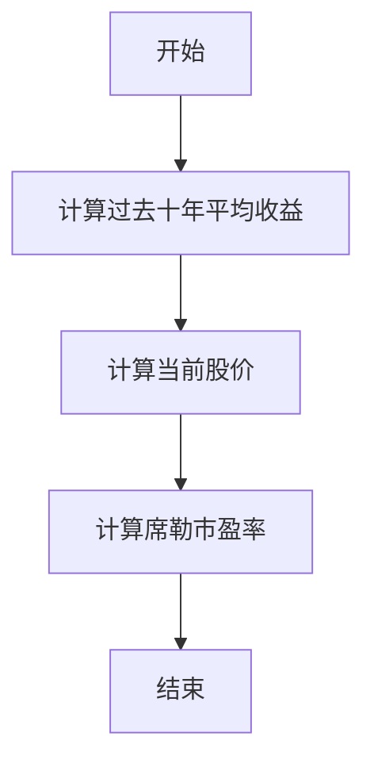

                 


# 席勒市盈率:从标准化收益角度衡量市场估值

> 关键词：市场估值，市盈率，席勒市盈率，标准化收益，投资分析，市场情绪

> 摘要：本文将深入探讨席勒市盈率这一市场估值指标，从标准化收益的视角分析其在投资决策中的应用。通过详细解析其数学模型、算法实现以及实际案例，本文旨在帮助读者更好地理解如何利用席勒市盈率来评估市场价值。文章结构清晰，内容丰富，涵盖从概念到实践的全过程。

---

## 第一部分: 席勒市盈率的背景与概念

### 第1章: 市场估值与市盈率概述

#### 1.1 市场估值的基本概念

市场估值是评估市场或资产整体价值的重要手段，通常通过市盈率、市净率等指标进行衡量。市盈率（P/E ratio）是最常用的估值指标之一，计算公式为：

$$ P/E = \frac{股价}{每股收益} $$

市盈率反映了市场对每股收益的支付意愿，但传统市盈率存在一定的局限性。

#### 1.2 席勒市盈率的背景

传统市盈率在计算时仅考虑最近一个财年的收益，这在市场波动较大时显得不足。席勒市盈率由诺贝尔经济学奖得主罗伯特·席勒提出，旨在通过十年平均收益来反映市场的真实价值。

#### 1.3 席勒市盈率与其他市盈率的区别

| 指标       | 传统市盈率             | 席勒市盈率             |
|------------|-----------------------|-----------------------|
| 计算基础     | 当前财年收益           | 十年平均收益           |
| 优点         | 反应及时               | 更具稳定性             |
| 局限性       | 易受短期波动影响         | 更适合长期分析         |

### 第2章: 席勒市盈率的背景与提出

#### 2.1 传统市盈率的局限性

传统市盈率仅基于当前收益，未能充分考虑市场波动和长期趋势。例如，在市场泡沫期间，市盈率可能虚高，导致误判。

#### 2.2 席勒市盈率的提出动机

席勒市盈率通过十年平均收益，消除了短期波动的影响，更准确地反映市场的真实价值。该指标常用于检测市场泡沫。

#### 2.3 席勒市盈率的核心目标

通过长期收益分析，帮助投资者做出更理性的投资决策。

### 第3章: 席勒市盈率的定义与特点

#### 3.1 席勒市盈率的定义

席勒市盈率公式为：

$$ PE_{10} = \frac{当前股价}{过去十年平均收益} $$

#### 3.2 席勒市盈率的特点

- **长期视角**：基于十年平均收益，减少短期波动影响。
- **稳定性**：更准确反映市场长期价值。
- **预警功能**：通过比较当前PE与历史平均值，识别市场泡沫。

---

## 第二部分: 席勒市盈率的数学模型与算法

### 第4章: 席勒市盈率的数学模型

#### 4.1 标准化收益的计算方法

标准化收益是席勒市盈率的核心，公式为：

$$ \text{标准化收益} = \frac{\text{过去十年平均收益}}{\text{无风险利率}} $$

#### 4.2 席勒市盈率的数学公式

$$ PE_{10} = \frac{P_0}{\text{过去十年平均收益}} $$

### 第5章: 席勒市盈率的算法实现

#### 5.1 席勒市盈率算法的流程图



#### 5.2 席勒市盈率的 Python 实现

```python
def calculate_shiller_pe(stock_price, average_earnings):
    return stock_price / average_earnings

# 示例
stock_price = 100
average_earnings = 10
pe = calculate_shiller_pe(stock_price, average_earnings)
print(f"席勒市盈率为: {pe}")
```

---

## 第三部分: 席勒市盈率的系统分析与架构设计

### 第6章: 系统功能设计

#### 6.1 系统功能模块

- 数据采集模块：获取股票价格和收益数据。
- 计算模块：计算十年平均收益和席勒市盈率。
- 可视化模块：展示计算结果。

#### 6.2 系统架构设计


---

## 第四部分: 项目实战

### 第7章: 环境安装与核心代码实现

#### 7.1 环境安装

- 安装Python和相关库（如pandas、numpy）。

#### 7.2 核心代码实现

```python
import pandas as pd

def calculate_shiller_pe(stock_data):
    average_earnings = stock_data['earnings'].mean()
    pe = stock_data['price'] / average_earnings
    return pe

# 示例数据
data = {'price': [100, 105, 110, 115, 120], 
        'earnings': [10, 12, 8, 15, 7]}
df = pd.DataFrame(data)
pe = calculate_shiller_pe(df)
print(pe)
```

---

## 第五部分: 总结与最佳实践

### 第8章: 最佳实践 tips

- 定期更新数据以保持准确性。
- 结合其他指标（如市净率）进行综合分析。

### 第9章: 小结

席勒市盈率通过长期收益分析，为市场估值提供了更准确的指标。投资者应结合市场环境和其他指标进行综合判断。

### 第10章: 注意事项

- 数据来源的准确性至关重要。
- 席勒市盈率适用于长期分析，短期波动需结合其他指标分析。

### 第11章: 拓展阅读

建议阅读席勒的《非理性繁荣》以深入理解市场行为。

---

## 作者

作者：AI天才研究院/AI Genius Institute & 禅与计算机程序设计艺术 /Zen And The Art of Computer Programming

---

这篇文章从背景、数学模型、系统设计到实战，全面解析了席勒市盈率的理论与应用，帮助读者掌握这一重要的市场估值指标。

