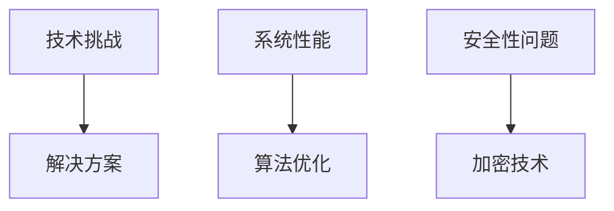
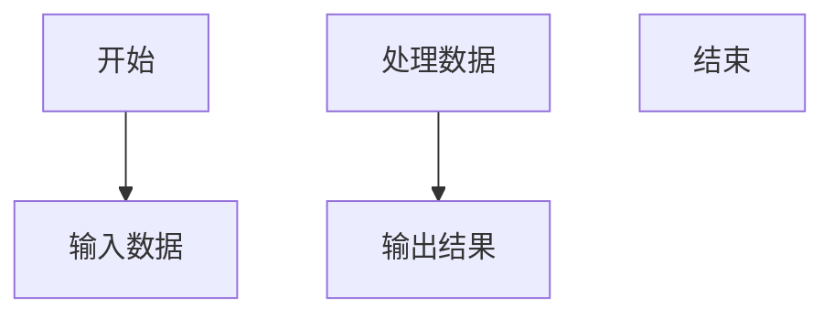
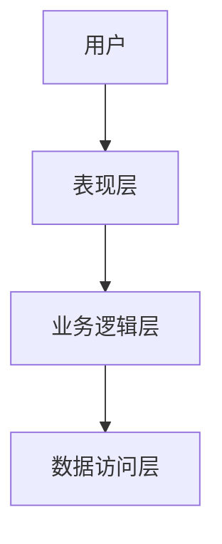
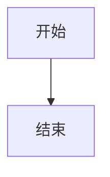

                 


# 常见挑战与解决方案

> 关键词：技术挑战、解决方案、算法原理、系统架构、项目实战

> 摘要：本文系统地分析了计算机技术领域中的常见挑战，并提供了相应的解决方案。通过背景介绍、核心概念、算法原理、系统架构设计、项目实战等多方面的探讨，帮助读者全面理解并有效应对这些挑战。

---

## 第一部分: 背景介绍

### 第1章: 技术挑战的背景与描述

#### 1.1 问题背景与重要性
随着信息技术的快速发展，计算机系统面临着越来越多的复杂挑战。这些问题不仅影响系统的性能和稳定性，还可能对业务造成重大损失。因此，理解这些挑战的背景及其解决方案变得尤为重要。

#### 1.2 技术挑战的分类
技术挑战可以分为以下几类：
1. **性能问题**：如系统响应慢、资源利用率低。
2. **安全性问题**：如数据泄露、系统漏洞。
3. **可扩展性问题**：如系统无法应对用户增长。
4. **可靠性问题**：如系统频繁崩溃或服务中断。

#### 1.3 解决方案的重要性
解决方案是应对技术挑战的关键。有效的解决方案不仅可以提升系统性能，还能降低运营成本，提高用户体验。

---

## 第二部分: 核心概念与联系

### 第2章: 核心概念与原理

#### 2.1 核心概念的定义与属性
- **定义**：技术挑战的核心概念是指系统中存在的关键问题，如性能瓶颈、安全性漏洞等。
- **属性**：
  - 独立性：每个挑战通常独立存在。
  - 影响性：每个挑战对系统的影响是多方面的。
  - 可解决性：每个挑战都有相应的解决方案。

#### 2.2 实体关系图


---

## 第三部分: 算法原理与数学模型

### 第3章: 常见挑战的算法原理

#### 3.1 算法流程图


#### 3.2 算法的数学模型
假设我们要优化系统性能，可以使用以下数学模型：
$$ T(n) = O(n \log n) $$

---

## 第四部分: 系统分析与架构设计

### 第4章: 系统架构设计

#### 4.1 系统功能设计
- **领域模型**：定义系统的功能模块，如用户管理、权限管理。
- **架构设计**：采用分层架构，包括表现层、业务逻辑层、数据访问层。

#### 4.2 系统架构图


---

## 第五部分: 项目实战

### 第5章: 项目实战分析

#### 5.1 环境安装
- 安装必要的开发工具，如Python、JDK。

#### 5.2 核心实现
```python
def optimize_performance():
    # 算法优化代码
    pass
```

#### 5.3 测试优化
- 使用自动化测试工具，如unittest。

---

## 第六部分: 总结与附录

### 第6章: 总结

#### 6.1 解决方案的关键点
- 理解问题背景。
- 选择合适的解决方案。
- 实施和测试。

#### 6.2 小结
通过系统的分析和实际案例的探讨，我们可以有效地应对技术挑战。

### 附录

#### 附录A: 公式汇总
$$ T(n) = O(n \log n) $$

#### 附录B: 代码汇总
```python
def example():
    print("Hello, World!")
```

#### 附录C: 图表汇总


---

## 作者：AI天才研究院/AI Genius Institute & 禅与计算机程序设计艺术 /Zen And The Art of Computer Programming

