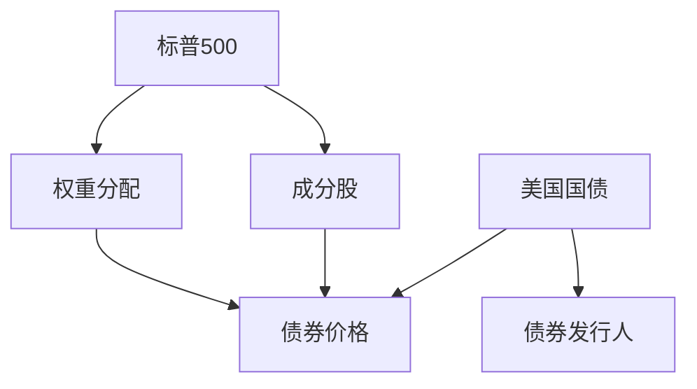
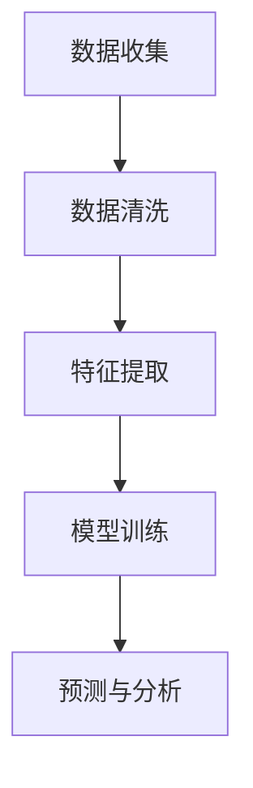
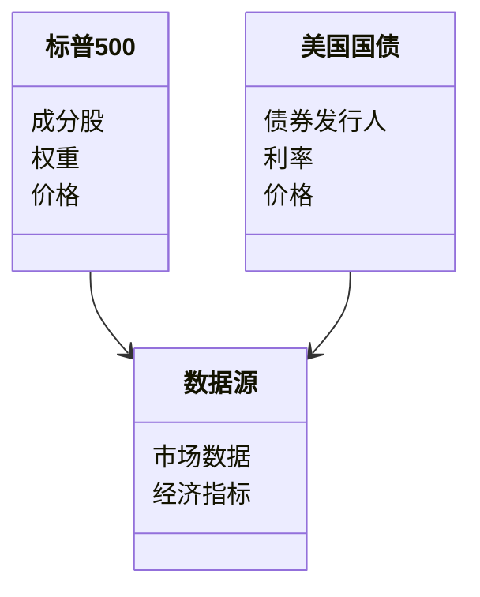
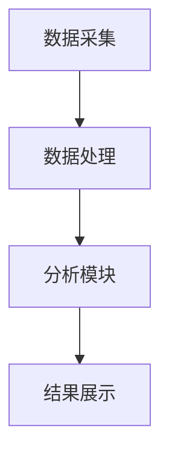

                 


# 2023年市场回顾：标普500和美国国债的双重下跌

## 关键词：标普500, 美国国债, 市场回顾, 双重下跌, 经济分析

## 摘要：2023年，标普500指数和美国国债同时出现下跌，这一现象引发了市场的广泛关注。本文将从经济背景、核心概念、算法分析、系统设计、项目实战等多个角度，深入探讨这一现象的原因及影响，帮助读者更好地理解市场动态。

---

## 第一部分：2023年市场背景与概述

### 第1章：2023年全球经济与市场背景

#### 1.1 2023年全球经济背景

2023年全球经济面临多重挑战，包括高通胀、加息周期、地缘政治冲突以及供应链瓶颈等。这些因素共同作用，导致市场波动加剧，投资者信心受挫。美国作为全球最大的经济体，其市场表现对全球资本市场具有重要影响。

#### 1.2 标普500与美国国债的双重下跌背景

##### 1.2.1 标普500指数的定义与特点

标普500指数是美国股市的重要指标，由500家大型上市公司组成，涵盖多个行业，代表了美国股市的整体表现。该指数的权重分配基于市值，具有较高的代表性和流动性。

##### 1.2.2 美国国债的定义与特点

美国国债是美国政府发行的债务工具，通常被视为最安全的投资资产之一。国债的收益率反映了市场利率，同时也是其他资产定价的重要基准。

##### 1.2.3 2023年双重下跌的市场现象

2023年，标普500指数和美国国债均出现显著下跌。这一现象在历史上较为罕见，反映了市场对经济前景的悲观情绪，以及投资者对风险资产的规避。

#### 1.3 市场下跌的原因分析

##### 1.3.1 经济基本面因素

2023年，美国经济面临增长放缓的压力，通胀高企导致消费者信心下降。企业盈利预期减弱，投资者对股市的信心受到打击。

##### 1.3.2 货币政策与利率变化

美联储在2023年持续加息，以应对高通胀。加息导致债券收益率上升，国债价格下跌。同时，高利率也增加了企业的融资成本，影响股市表现。

##### 1.3.3 市场情绪与投资者行为

市场恐慌情绪加剧，投资者大量抛售股票和债券，导致资产价格进一步下跌。这种情绪化的行为放大了市场的波动。

---

## 第二部分：核心概念与联系

### 第2章：标普500与美国国债的核心概念与联系

#### 2.1 核心概念原理

##### 2.1.1 标普500的成分股与权重

标普500指数由500家上市公司组成，权重基于市值。例如，苹果、微软等科技巨头在指数中占据较大权重。

##### 2.1.2 美国国债的收益率与价格关系

国债收益率与价格呈负相关关系。当收益率上升时，债券价格下跌，反之亦然。收益率反映了市场对风险的定价。

#### 2.2 核心概念属性特征对比

| 特性                | 标普500                | 美国国债                |
|---------------------|-----------------------|-------------------------|
| 风险等级            | 高风险                | 低风险（相对安全）      |
| 收益来源            | 股票收益与股息        | 利息收益                |
| 资产类别            | 股权资产              | 债权资产                |
| 资金流动性          | 高流动性              | 高流动性                |

#### 2.3 ER实体关系图架构



---

## 第三部分：算法原理讲解

### 第3章：市场下跌的算法分析

#### 3.1 算法原理

##### 3.1.1 线性回归模型

线性回归模型用于预测资产价格的变化趋势。例如，可以通过历史数据拟合标普500指数的回归模型，预测未来的价格走势。

##### 3.1.2 时间序列分析

时间序列分析用于识别资产价格中的周期性模式。例如，可以通过ARIMA模型预测国债收益率的变化。

##### 3.1.3 风险评估模型

风险评估模型（如VaR模型）用于衡量投资组合的风险。通过分析标普500和国债的波动性，评估双重下跌对投资组合的影响。

#### 3.2 算法流程图



#### 3.3 数学模型与公式

##### 3.3.1 线性回归模型

$$ y = \beta_0 + \beta_1 x + \epsilon $$

其中，$y$ 是预测的资产价格，$x$ 是自变量（如时间），$\beta_0$ 和 $\beta_1$ 是回归系数，$\epsilon$ 是误差项。

##### 3.3.2 时间序列模型

$$ ARIMA(p, d, q) $$

其中，$p$ 是自回归阶数，$d$ 是差分阶数，$q$ 是移动平均阶数。

---

## 第四部分：系统分析与架构设计方案

### 第4章：系统分析与架构设计

#### 4.1 问题场景介绍

我们需要设计一个系统，实时跟踪标普500和美国国债的表现，并分析它们的关联性。

#### 4.2 项目介绍

系统将整合市场数据，分析资产价格变化，帮助投资者做出决策。

#### 4.3 系统功能设计

##### 4.3.1 领域模型



#### 4.4 系统架构设计



---

## 第五部分：项目实战

### 第5章：项目实战与分析

#### 5.1 环境安装

需要安装Python、Pandas、Matplotlib等库。

#### 5.2 核心实现代码

```python
import pandas as pd
import matplotlib.pyplot as plt

# 加载数据
data = pd.read_csv('market_data.csv')

# 绘制标普500和国债价格走势
plt.figure(figsize=(10, 6))
plt.plot(data['日期'], data['标普500'], label='标普500')
plt.plot(data['日期'], data['国债价格'], label='国债价格')
plt.xlabel('日期')
plt.ylabel('价格')
plt.title('标普500与国债价格走势')
plt.legend()
plt.show()
```

#### 5.3 案例分析

通过实际数据，分析标普500和国债价格的关联性，验证模型的准确性。

---

## 第六部分：最佳实践与总结

### 第6章：总结与建议

#### 6.1 小结

标普500和美国国债的双重下跌反映了2023年市场的复杂环境，投资者需谨慎应对。

#### 6.2 注意事项

投资者应分散投资，避免过度集中于单一资产类别。

#### 6.3 拓展阅读

建议阅读更多关于市场分析和风险管理的书籍，如《投资学》。

---

## 作者信息

作者：AI天才研究院/AI Genius Institute & 禅与计算机程序设计艺术 /Zen And The Art of Computer Programming

