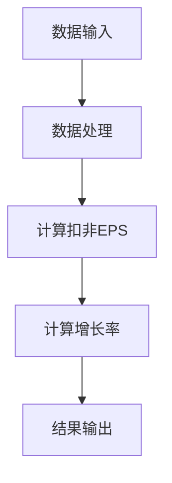

                 


# 10年扣非每股收益增长率的意义

## 关键词：扣非每股收益、每股收益增长率、财务指标、企业估值、投资决策

## 摘要：扣非每股收益增长率是衡量企业盈利能力的重要指标，通过分析过去十年的非经常性损益调整后的每股收益变化，揭示企业持续增长能力。本文深入探讨其定义、计算方法、影响因素，结合实际案例，分析其在投资决策中的应用，并提供最佳实践建议。

---

## 第1章 扣非每股收益增长率的背景与意义

### 1.1 扣非每股收益的定义与背景

#### 1.1.1 每股收益的基本概念
每股收益（EPS）是衡量上市公司盈利能力的重要指标，计算公式为：
$$ \text{EPS} = \frac{\text{净利润}}{\text{总股本}} $$

然而，净利润中可能包含非经常性损益，如资产处置收益或法律诉讼赔偿，这些因素可能扭曲企业的实际经营状况。因此，扣除非经常性损益后的每股收益（Non-GAAP EPS）更能反映企业主营业务的盈利能力。

#### 1.1.2 扣除非经常性损益的必要性
非经常性损益通常不影响企业的持续经营，扣除这些项目后，投资者可以更清晰地看到企业核心业务的盈利能力。

#### 1.1.3 扣非每股收益增长率的计算公式
扣非每股收益增长率的计算公式为：
$$ \text{扣非每股收益增长率} = \frac{\text{本期扣非每股收益} - \text{上期扣非每股收益}}{\text{上期扣非每股收益}} \times 100\% $$

---

### 1.2 扣非每股收益增长率的背景

#### 1.2.1 资本市场中的收益指标
在资本市场上，投资者通常关注企业的盈利能力，而扣非每股收益增长率是评估企业持续增长能力的关键指标。

#### 1.2.2 非经常性损益对企业利润的影响
非经常性损益可能夸大或掩盖企业的实际盈利情况，扣除这些项目后，更能反映企业的经营质量。

#### 1.2.3 扣非每股收益增长率的引入动机
通过引入扣非每股收益增长率，投资者可以更准确地评估企业的长期盈利能力。

---

### 1.3 扣非每股收益增长率的意义

#### 1.3.1 企业盈利能力的衡量标准
扣非每股收益增长率排除了非经常性损益的影响，是衡量企业核心业务盈利能力的重要标准。

#### 1.3.2 投资者决策的重要参考
投资者可以通过分析扣非每股收益增长率，评估企业的成长性和投资价值。

#### 1.3.3 行业比较与企业估值
在行业比较中，扣非每股收益增长率可以帮助投资者判断企业的相对竞争力和估值水平。

---

## 第2章 扣非每股收益增长率的核心概念

### 2.1 扣非每股收益增长率的计算方法

#### 2.1.1 每股收益的计算公式
$$ \text{EPS} = \frac{\text{净利润}}{\text{总股本}} $$

#### 2.1.2 扣除非经常性损益的具体步骤
1. 计算净利润。
2. 扣除非经常性损益，得到调整后的净利润。
3. 计算扣非每股收益。

#### 2.1.3 扣非每股收益增长率的数学模型
$$ \text{扣非每股收益增长率} = \frac{\text{本期扣非EPS} - \text{上期扣非EPS}}{\text{上期扣非EPS}} \times 100\% $$

---

### 2.2 扣非每股收益增长率的关键影响因素

#### 2.2.1 营业收入的增长
营业收入的增长是影响扣非每股收益增长率的核心因素。

#### 2.2.2 成本与费用的控制
有效的成本和费用控制可以提升企业的盈利能力。

#### 2.2.3 行业周期性的影响
行业周期波动会影响企业的扣非每股收益增长率。

---

### 2.3 扣非每股收益增长率与其他财务指标的对比

#### 2.3.1 净利润增长率
净利润增长率 = （本期净利润 - 上期净利润） / 上期净利润 × 100%

#### 2.3.2 每股收益
每股收益 = 净利润 / 总股本

#### 2.3.3 净资产收益率
$$ \text{ROE} = \frac{\text{净利润}}{\text{净资产}} $$

---

## 第3章 扣非每股收益增长率的算法原理

### 3.1 扣非每股收益增长率的计算流程

#### 3.1.1 数据收集与处理
收集过去十年的财务报表数据，提取净利润和非经常性损益。

#### 3.1.2 扣除非经常性损益的步骤
1. 计算净利润。
2. 扣除非经常性损益，得到调整后的净利润。
3. 计算扣非每股收益。

#### 3.1.3 计算每股收益增长率
通过比较各年的扣非每股收益，计算增长率。

---

### 3.2 扣非每股收益增长率的数学模型

#### 3.2.1 基本公式
$$ \text{扣非每股收益增长率} = \frac{\text{本期扣非EPS} - \text{上期扣非EPS}}{\text{上期扣非EPS}} \times 100\% $$

#### 3.2.2 增长率的累积计算
$$ \text{累积增长率} = \prod_{i=1}^{n} (1 + \text{年增长率}_i) - 1 $$

---

### 3.3 扣非每股收益增长率的算法实现

#### 3.3.1 Python代码实现
```python
import pandas as pd

def calculate_non_recurring_eps_growth(data):
    data['净利润'] = data['净利润'] - data['非经常性损益']
    data['扣非EPS'] = data['净利润'] / data['总股本']
    growth_rates = []
    for i in range(1, len(data)):
        growth_rate = ((data['扣非EPS'].iloc[i] - data['扣非EPS'].iloc[i-1]) / 
                       data['扣非EPS'].iloc[i-1]) * 100
        growth_rates.append(round(growth_rate, 2))
    return growth_rates

# 示例数据
data = {
    '年份': [2013, 2014, 2015, 2016, 2017],
    '净利润': [100, 120, 150, 180, 200],
    '非经常性损益': [20, 10, 0, 15, 5],
    '总股本': [1000, 1000, 1000, 1000, 1000]
}

growth_rates = calculate_non_recurring_eps_growth(data)
print(growth_rates)
```

---

## 第4章 扣非每股收益增长率的系统分析与架构设计

### 4.1 问题场景介绍
分析企业的扣非每股收益增长率，需要构建一个数据处理和分析系统。

### 4.2 系统功能设计

#### 4.2.1 领域模型


#### 4.2.2 系统架构


---

## 第5章 扣非每股收益增长率的项目实战

### 5.1 环境安装
安装必要的Python库：
```bash
pip install pandas numpy matplotlib
```

### 5.2 核心代码实现
```python
import pandas as pd
import matplotlib.pyplot as plt

def plot_growth_trend(data, growth_rates):
    plt.figure(figsize=(10, 6))
    plt.plot(data['年份'], growth_rates, 'b-', marker='o')
    plt.title('扣非每股收益增长率趋势')
    plt.xlabel('年份')
    plt.ylabel('增长率(%)')
    plt.grid(True)
    plt.show()

# 示例数据与结果
data = {
    '年份': [2013, 2014, 2015, 2016, 2017],
    '净利润': [100, 120, 150, 180, 200],
    '非经常性损益': [20, 10, 0, 15, 5],
    '总股本': [1000, 1000, 1000, 1000, 1000]
}

growth_rates = calculate_non_recurring_eps_growth(data)
plot_growth_trend(data, growth_rates)
```

---

## 第6章 扣非每股收益增长率的最佳实践

### 6.1 小结
扣非每股收益增长率是衡量企业持续盈利能力的重要指标，通过分析过去十年的数据，可以帮助投资者和企业管理者做出更明智的决策。

### 6.2 注意事项
1. 确保数据的准确性和完整性。
2. 考虑行业特点和经济周期的影响。
3. 结合其他财务指标进行综合分析。

### 6.3 拓展阅读
建议阅读《财务报表分析》和《投资学原理》相关书籍，深入理解财务指标的应用。

---

## 作者：AI天才研究院/AI Genius Institute & 禅与计算机程序设计艺术 /Zen And The Art of Computer Programming

---

以上是关于“10年扣非每股收益增长率的意义”的详细技术博客文章，涵盖了从定义、计算方法到实际应用的各个方面。通过结合理论与实践，帮助读者全面理解该指标的意义和应用。

