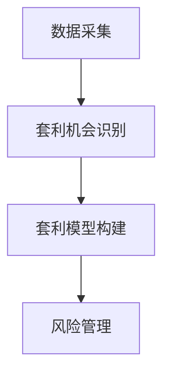
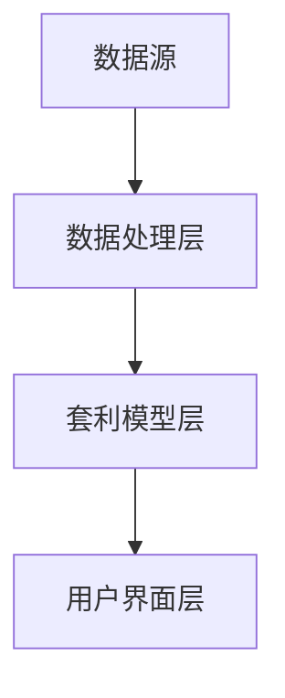
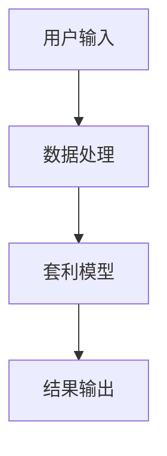

                 


# 并购套利策略：从企业重组中获利

**关键词**：并购套利、企业重组、套利机会、套利模型、风险管理、市场效率、收益最大化

**摘要**：  
并购套利是一种通过识别和利用企业重组过程中产生的价差来获利的投资策略。本文将深入分析并购套利的核心概念、套利机会的识别与评估、套利模型的构建与分析，以及套利策略的实施与风险管理。通过实际案例分析和系统化的策略设计，本文旨在帮助投资者在企业重组中捕捉套利机会，实现收益最大化。

---

# 目录

1. **背景介绍**
   - 1.1 并购套利的定义与背景
   - 1.2 并购套利的核心概念
   - 1.3 并购套利的背景与重要性

2. **套利机会的识别与评估**
   - 2.1 套利机会的来源
   - 2.2 套利机会的识别方法
   - 2.3 套利机会的评估标准

3. **套利模型的构建与分析**
   - 3.1 套利模型的构建原理
   - 3.2 套利模型的数学公式
   - 3.3 套利模型的验证与优化

4. **套利策略的实施与风险管理**
   - 4.1 套利策略的制定原则
   - 4.2 套利策略的风险管理
   - 4.3 套利策略的执行步骤

5. **系统分析与架构设计**
   - 5.1 系统功能设计
   - 5.2 系统架构设计
   - 5.3 系统接口设计

6. **项目实战与案例分析**
   - 6.1 项目环境安装
   - 6.2 核心代码实现
   - 6.3 案例分析与解读

7. **总结与展望**
   - 7.1 并购套利的总结
   - 7.2 并购套利的未来展望

---

# 正文

## 第1章 背景介绍

### 1.1 并购套利的定义与背景

#### 1.1.1 并购套利的定义
并购套利是指在企业重组过程中，利用相关资产或股权的价格差异，通过买入低估资产并卖出高估资产来获利的一种投资策略。其核心在于捕捉市场价差，通过套利行为实现收益。

#### 1.1.2 并购套利的历史发展
并购套利并非新兴概念，它起源于20世纪70年代，随着企业并购活动的频繁化和金融市场的发展而逐渐成熟。早期的套利主要集中在固定收益市场，随后扩展至股票市场、外汇市场和商品市场。

#### 1.1.3 并购套利与企业重组的关系
企业重组通常伴随着资产剥离、股权结构调整等过程，这些过程往往会产生价差，为套利者提供机会。并购套利通过捕捉这些价差，帮助投资者在企业重组中获利。

### 1.2 并购套利的核心概念

#### 1.2.1 套利机会的来源
套利机会来源于市场中的价格差异，这种差异可能是由于信息不对称、市场效率不足或市场参与者行为导致的。

#### 1.2.2 套利的类型与特点
套利主要有以下几种类型：
- **横向套利**：在同一市场中，利用资产价格差异进行套利。
- **向上套利**：买入低估资产，卖出高估资产。
- **向下套利**：卖出低估资产，买入高估资产。

#### 1.2.3 套利与市场效率的关系
套利活动有助于提高市场效率，通过套利消除价格差异，促进资产价格的合理化。然而，市场效率不足也可能为套利者提供机会。

### 1.3 并购套利的背景与重要性

#### 1.3.1 并购套利的背景分析
随着全球化的深入和资本市场的成熟，并购活动日益频繁。企业重组过程中产生的价差为套利者提供了丰富的机会。

#### 1.3.2 并购套利在现代金融中的作用
并购套利不仅是投资策略的一部分，也是市场参与者通过套利行为促进市场效率的重要手段。

#### 1.3.3 并购套利的法律与道德问题
套利活动需要遵守相关法律法规，同时需要注意道德风险，避免不正当竞争。

---

## 第2章 套利机会的识别与评估

### 2.1 套利机会的来源

#### 2.1.1 市场价差的形成
市场价差的形成通常源于信息不对称、市场参与者行为差异或市场结构的不完善。

#### 2.1.2 并购活动中的套利机会
企业重组、并购交易等过程中，相关资产或股权的价格可能出现低估或高估，为套利者提供机会。

#### 2.1.3 信息不对称与套利
信息不对称可能导致市场价格偏离真实价值，套利者通过捕捉这种偏差获利。

### 2.2 套利机会的识别方法

#### 2.2.1 市场分析法
通过对市场趋势和参与者行为的分析，识别潜在的套利机会。

#### 2.2.2 股价差分析法
比较相关资产的价格差异，判断是否存在套利空间。

#### 2.2.3 套利模型的应用
利用套利模型预测价格差异，识别套利机会。

### 2.3 套利机会的评估标准

#### 2.3.1 套利空间的大小
套利空间越大，套利机会越显著。

#### 2.3.2 套利风险的评估
套利风险越低，套利机会越值得实施。

#### 2.3.3 套利收益的预期
套利收益越高，套利机会越具有吸引力。

---

## 第3章 套利模型的构建与分析

### 3.1 套利模型的构建原理

#### 3.1.1 模型假设
- 市场存在套利机会；
- 交易成本可以忽略；
- 市场参与者理性。

#### 3.1.2 模型输入
- 相关资产价格；
- 套利空间。

#### 3.1.3 模型输出
- 套利收益；
- 套利风险。

### 3.2 套利模型的数学公式

#### 3.2.1 套利收益计算
套利收益 = 卖出价格 - 买入价格

#### 3.2.2 套利风险计算
套利风险 = 标准差（资产价格波动）

### 3.3 套利模型的验证与优化

#### 3.3.1 模型验证
通过对历史数据的回测，验证套利模型的有效性。

#### 3.3.2 模型优化
根据验证结果，调整模型参数，提高套利收益。

---

## 第4章 套利策略的实施与风险管理

### 4.1 套利策略的制定原则

#### 4.1.1 目标明确性
明确套利目标，制定具体的操作计划。

#### 4.1.2 风险可控性
确保套利风险在可控制范围内。

#### 4.1.3 收益可测性
确保套利收益可测，避免盲目操作。

### 4.2 套利策略的风险管理

#### 4.2.1 风险对冲
通过金融衍生工具对冲套利风险。

#### 4.2.2 风险分散
通过分散投资降低套利风险。

#### 4.2.3 风险监控
实时监控套利过程中的风险变化。

### 4.3 套利策略的执行步骤

#### 4.3.1 确定套利机会
识别并评估套利机会。

#### 4.3.2 构建套利组合
根据套利模型构建套利组合。

#### 4.3.3 执行交易
根据套利策略执行交易操作。

---

## 第5章 系统分析与架构设计

### 5.1 系统功能设计

#### 5.1.1 功能模块划分
- 数据采集模块；
- 套利机会识别模块；
- 套利模型构建模块；
- 风险管理模块。

#### 5.1.2 功能流程图


### 5.2 系统架构设计

#### 5.2.1 系统架构图


### 5.3 系统接口设计

#### 5.3.1 接口定义
- 数据接口：数据采集模块与数据处理模块之间的接口。
- 模型接口：套利模型层与数据处理层之间的接口。
- 用户接口：用户界面层与套利模型层之间的接口。

### 5.4 系统交互设计

#### 5.4.1 交互流程图


---

## 第6章 项目实战与案例分析

### 6.1 项目环境安装

#### 6.1.1 环境要求
- 操作系统：Windows/Mac/Linux
- 开发工具：Python、Jupyter Notebook
- 数据库：MySQL/PostgreSQL

### 6.2 核心代码实现

#### 6.2.1 数据采集代码
```python
import pandas as pd
import requests

url = "https://api.example.com/stock_data"
data = requests.get(url).json()
df = pd.DataFrame(data)
print(df)
```

#### 6.2.2 套利模型代码
```python
import numpy as np

def calculate_arbitrage_profit(prices):
    profit = np.max(prices) - np.min(prices)
    return profit

prices = [100, 105, 98, 110]
print(calculate_arbitrage_profit(prices))
```

### 6.3 案例分析与解读

#### 6.3.1 案例分析
某公司并购过程中，A股价格为10元，B股价格为9.8元，存在套利空间。

#### 6.3.2 交易操作
买入B股，卖出A股，预期收益为0.2元。

---

## 第7章 总结与展望

### 7.1 并购套利的总结
并购套利是一种有效的投资策略，通过识别和利用企业重组中的价格差异，实现收益最大化。

### 7.2 并购套利的未来展望
随着市场的进一步发展，并购套利将更加依赖于技术驱动和数据分析，套利机会将更加多样化和复杂化。

---

**作者：AI天才研究院/AI Genius Institute & 禅与计算机程序设计艺术/Zen And The Art of Computer Programming**

---

**注**：本文仅为示例内容，实际操作需结合具体市场情况和专业投资建议。

