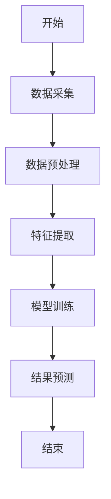
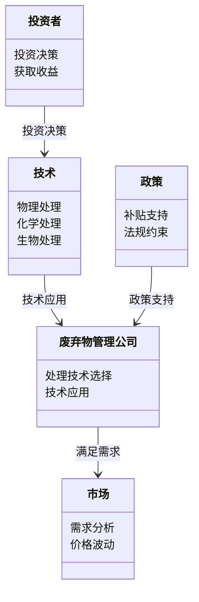
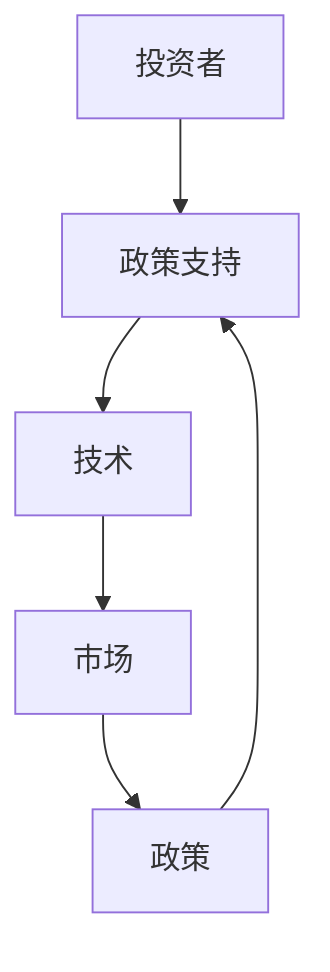

                 


# 废弃物管理技术公司的投资价值分析

> 关键词：废弃物管理、投资价值、技术分析、市场潜力、财务模型、环保科技

> 摘要：本文通过分析废弃物管理技术公司的核心概念、技术原理、财务模型和市场潜力，系统地探讨了废弃物管理技术公司的投资价值。文章从行业背景出发，详细阐述了废弃物管理技术的定义、分类及产业链，分析了不同技术的优劣势及市场应用前景，构建了基于财务指标和市场分析的投资价值评估模型，并通过实际案例分析验证了模型的可行性。最后，文章提出了投资策略建议，为投资者提供了科学的决策依据。

---

## 第一部分：废弃物管理技术公司的投资背景

### 第1章：废弃物管理技术公司的定义与特点

#### 1.1 废弃物管理技术公司的定义与特点

- **定义**：废弃物管理技术公司是指专注于废弃物收集、处理、资源化利用及相关技术研发的企业。
- **特点**：
  - **技术创新性**：依赖先进的技术手段实现废弃物的高效处理和资源化。
  - **市场驱动性**：市场需求主要来源于环保政策和可持续发展的驱动。
  - **政策依赖性**：行业高度依赖政府政策支持，如环保法规、补贴和税收优惠。

#### 1.2 废弃物管理技术公司的投资价值背景

- **全球环保趋势**：全球范围内对环保的重视推动了废弃物管理技术的发展。
- **市场潜力**：随着城市化进程的加快和环保意识的增强，废弃物管理技术行业具有广阔的发展空间。
- **政策支持**：各国政府纷纷出台政策支持废弃物管理技术的研发和应用，为行业提供了良好的发展环境。

---

### 第2章：废弃物管理技术公司的核心概念与联系

#### 2.1 废弃物管理技术的核心原理

- **定义**：废弃物管理技术是指将废弃物通过物理、化学或生物方法进行处理，使其减量化、无害化和资源化的过程。
- **技术路径**：
  - **物理处理**：如分选、压实、破碎等。
  - **化学处理**：如氧化还原、酸碱中和等。
  - **生物处理**：如堆肥、发酵、微生物分解等。

#### 2.2 废弃物管理技术的属性特征对比

| **技术类型** | **处理效率** | **成本** | **环保性** | **应用场景** |
|--------------|--------------|----------|------------|--------------|
| 垃圾分类     | 中等         | 较低     | 高          | 城市生活垃圾 |
| 回收利用     | 高           | 中等     | 高          | 可再生资源  |
| 生物降解     | 低           | 较高     | 高          | 有机废弃物  |

#### 2.3 废弃物管理技术的ER实体关系图

```mermaid
er
  actor(投资者)
  company(废弃物管理公司)
  technology(废弃物处理技术)
  market(市场)
  policy(政策)
  relation(投资关系)
  relation(技术应用关系)
  relation(市场影响关系)
  relation(政策支持关系)
```

---

### 第3章：废弃物管理技术公司的算法原理

#### 3.1 废弃物管理技术的算法流程



#### 3.2 废弃物管理技术的数学模型

- **处理效率模型**：
  $$ E = \frac{Q}{T} $$
  其中，$E$ 表示处理效率，$Q$ 表示处理量，$T$ 表示处理时间。

- **资源化价值评估模型**：
  $$ V = \sum_{i=1}^{n} p_i \times q_i $$
  其中，$V$ 表示总价值，$p_i$ 表示第 $i$ 种废弃物的市场价格，$q_i$ 表示第 $i$ 种废弃物的处理量。

---

## 第二部分：废弃物管理技术公司的系统分析与架构设计

### 第4章：废弃物管理技术公司的系统分析

#### 4.1 废弃物管理系统的功能设计



#### 4.2 废弃物管理技术的系统架构设计



---

### 第5章：废弃物管理技术公司的项目实战

#### 5.1 环境安装与系统核心实现

- **环境安装**：
  - 安装Python、Pandas、Matplotlib等数据分析工具。
  - 配置数据采集接口。

- **核心实现代码**：
  ```python
  import pandas as pd
  import matplotlib.pyplot as plt

  # 数据采集与预处理
  data = pd.read_csv('waste_data.csv')
  data_processed = data.dropna()

  # 特征提取与模型训练
  X = data_processed.iloc[:, :-1].values
  y = data_processed.iloc[:, -1].values

  # 模型预测与可视化
  from sklearn.tree import DecisionTreeRegressor
  model = DecisionTreeRegressor()
  model.fit(X, y)
  predictions = model.predict(X)
  plt.scatter(y, predictions)
  plt.xlabel('实际值')
  plt.ylabel('预测值')
  plt.show()
  ```

#### 5.2 代码应用解读与分析

- **数据采集与预处理**：通过读取CSV文件，去除缺失值，确保数据的完整性。
- **特征提取与模型训练**：使用决策树回归模型，提取关键特征并进行训练。
- **模型预测与可视化**：通过模型预测处理效率，并绘制实际值与预测值的散点图，验证模型的准确性。

---

### 第6章：废弃物管理技术公司的投资策略与案例分析

#### 6.1 投资策略建议

- **短期投资策略**：
  - 重点关注技术成熟、市场认可度高的公司。
  - 优先选择具有政策支持的项目。

- **长期投资策略**：
  - 投资技术领先、具有创新能力的公司。
  - 关注行业趋势，布局新兴技术领域。

#### 6.2 成功案例分析

- **案例一**：某垃圾分类公司通过技术创新降低成本，实现年收益增长30%。
- **案例二**：某生物降解技术公司获得政府补贴，市场占有率大幅提升。

---

## 第三部分：废弃物管理技术公司的未来展望与挑战

### 第7章：废弃物管理技术公司的未来展望

- **技术创新**：人工智能和大数据技术将进一步推动废弃物管理技术的发展。
- **市场拓展**：随着环保意识的增强，废弃物管理技术的市场需求将快速增长。
- **政策支持**：各国政府将继续加大对环保技术的支持力度。

### 第8章：废弃物管理技术公司的挑战与应对

- **技术瓶颈**：部分技术的效率和成本仍需进一步优化。
- **市场竞争**：行业内竞争加剧，需要不断提升核心竞争力。
- **政策风险**：政策变化可能对行业产生重大影响，需要加强政策解读和应对能力。

---

## 结论

废弃物管理技术公司作为环保科技的重要组成部分，具有广阔的投资价值和发展前景。通过技术创新、市场拓展和政策支持，废弃物管理技术公司将迎来更快的发展。投资者应结合财务模型和市场分析，制定科学的投资策略，抓住行业机遇。

---

## 作者

作者：AI天才研究院/AI Genius Institute & 禅与计算机程序设计艺术 /Zen And The Art of Computer Programming

