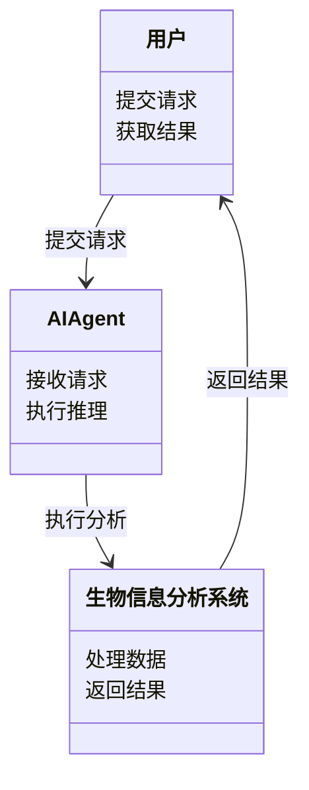
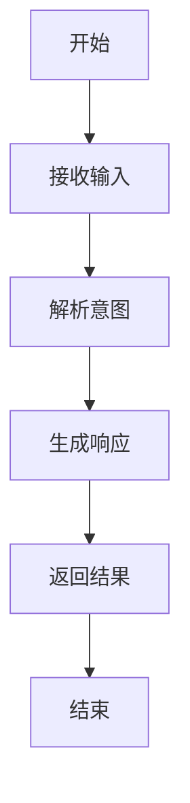
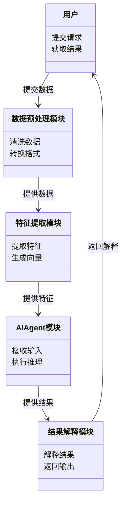
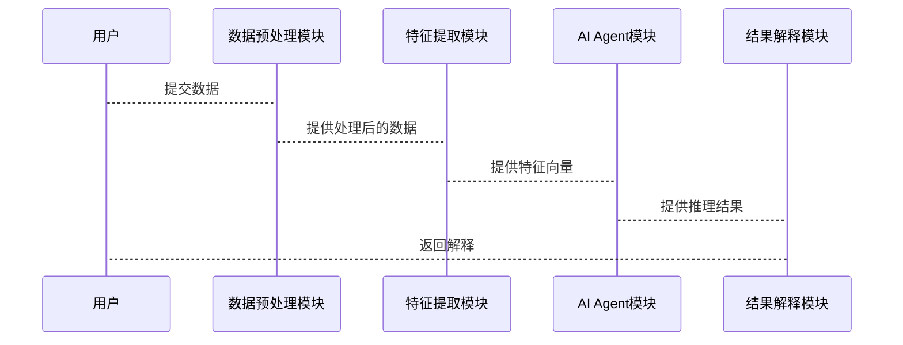

                 


# 开发AI Agent支持的智能生物信息分析系统

> **关键词：** AI Agent, 生物信息分析, 系统架构, 算法原理, 项目实战  
> **摘要：**  
> 本文详细探讨了如何开发AI Agent支持的智能生物信息分析系统。首先，介绍了生物信息分析的挑战及其对AI Agent的需求，分析了AI Agent与生物信息分析系统的概念和关系。接着，深入讲解了AI Agent的核心算法与数学模型，包括知识表示、自然语言处理和强化学习。然后，从系统分析与架构设计的角度，提出了系统的功能模块划分、架构图和交互流程图。最后，通过项目实战部分，展示了如何实现该系统，并总结了开发过程中的最佳实践。

---

# 第1章: AI Agent与生物信息分析系统概述

## 1.1 问题背景与目标

### 1.1.1 生物信息分析的挑战
生物信息分析是研究生命科学的重要手段，涉及基因组学、蛋白质组学等领域。传统的方法依赖人工分析，效率低、易出错，难以应对海量数据的挑战。现代生物信息分析需要处理复杂的数据结构，例如序列数据、结构数据和网络数据，这为AI Agent的应用提供了广阔的空间。

### 1.1.2 AI Agent在生物信息分析中的作用
AI Agent是一种能够感知环境、自主决策并执行任务的智能体。在生物信息分析中，AI Agent可以用于数据预处理、特征提取、模型训练和结果解释等环节。它能够提高分析效率、减少人为误差，并帮助研究人员发现潜在的模式和规律。

### 1.1.3 系统的目标与边界
本系统的开发目标是构建一个高效、智能的生物信息分析平台，通过AI Agent实现自动化分析。系统的边界包括数据输入、处理和输出，不涉及数据采集和用户界面设计。

---

## 1.2 核心概念与联系

### 1.2.1 AI Agent的定义与属性
AI Agent是一种智能体，具备以下属性：
- **感知能力：** 能够接收外部输入。
- **推理能力：** 能够处理信息并做出决策。
- **自主性：** 能够独立执行任务。
- **协作性：** 能够与其他系统或用户交互。

### 1.2.2 生物信息分析系统的组成
生物信息分析系统主要包括以下模块：
- 数据预处理模块：清洗和转换数据。
- 特征提取模块：提取关键特征。
- 模型训练模块：训练分类或聚类模型。
- 结果解释模块：解释模型输出。

### 1.2.3 实体关系图

```mermaid
er
actor: 用户
agent: AI Agent
system: 生物信息分析系统
actor --> agent: 请求分析
agent --> system: 执行分析
system --> actor: 返回结果
```

---

## 1.3 系统架构与功能模块

### 1.3.1 系统功能模块划分
系统主要分为以下几个模块：
1. 数据预处理模块：负责数据清洗和格式转换。
2. 特征提取模块：提取生物序列特征。
3. AI Agent模块：负责推理和决策。
4. 结果解释模块：解释分析结果。

### 1.3.2 功能模块的交互关系



---

# 第2章: AI Agent的核心算法与数学模型

## 2.1 知识表示与推理

### 2.1.1 知识图谱的构建
知识图谱是AI Agent的知识基础，通常由节点和边组成。节点代表实体，边代表关系。

### 2.1.2 逻辑推理的基本原理
逻辑推理是基于知识图谱进行的推导过程。常用的推理方法包括基于规则的推理和基于概率的推理。

---

## 2.2 自然语言处理技术

### 2.2.1 分词与词性标注
分词是将文本分割成词语，词性标注是为每个词语标注其词性。例如，中文分词可以使用jieba库，词性标注可以使用NLTK库。

### 2.2.2 语义理解与生成
语义理解通过词嵌入技术（如Word2Vec）实现，语义生成可以通过生成模型（如GPT）实现。

---

## 2.3 强化学习与决策

### 2.3.1 状态空间与动作空间
状态空间是所有可能的状态集合，动作空间是所有可能的动作集合。

### 2.3.2 奖励机制与策略优化
奖励机制用于衡量动作的好坏，策略优化通过最大化累积奖励来改进策略。

---

## 2.4 算法流程图



---

# 第3章: 生物信息分析系统的算法实现

## 3.1 数据预处理

### 3.1.1 数据清洗
使用Python的pandas库进行数据清洗，例如处理缺失值和异常值。

### 3.1.2 特征提取
使用特征提取方法，例如TF-IDF提取文本特征。

---

## 3.2 AI Agent的实现

### 3.2.1 知识图谱构建
使用图数据库（如Neo4j）构建知识图谱。

### 3.2.2 逻辑推理实现
使用逻辑推理算法（如RDF推理）进行推理。

---

## 3.3 系统架构设计

### 3.3.1 系统功能模块
系统功能模块包括数据预处理、特征提取、AI Agent推理和结果解释。

### 3.3.2 系统架构图

```mermaid
containerDiagram
    生物信息分析系统
    + 数据预处理模块
    + 特征提取模块
    + AI Agent模块
    + 结果解释模块
```

---

## 3.4 项目实战

### 3.4.1 环境安装
安装必要的库，例如pandas、numpy、scikit-learn、tensorflow。

### 3.4.2 核心代码实现

```python
import pandas as pd
from sklearn.feature_extraction.text import TfidfVectorizer
from sklearn.naive_bayes import MultinomialNB

# 数据预处理
data = pd.read_csv('data.csv')
data.dropna(inplace=True)

# 特征提取
vectorizer = TfidfVectorizer()
X = vectorizer.fit_transform(data['text'])

# 模型训练
model = MultinomialNB()
model.fit(X, data['label'])

# 模型预测
test_data = ['Sample text for prediction']
test_X = vectorizer.transform(test_data)
predicted_label = model.predict(test_X)
```

### 3.4.3 案例分析
以基因序列分析为例，展示如何使用AI Agent进行特征提取和分类。

---

# 第4章: 系统分析与架构设计

## 4.1 系统功能设计

### 4.1.1 领域模型



---

## 4.2 系统架构设计

### 4.2.1 系统架构图

```mermaid
containerDiagram
    用户
    + 数据预处理模块
    + 特征提取模块
    + AI Agent模块
    + 结果解释模块
```

---

## 4.3 系统接口设计

### 4.3.1 API接口设计
定义RESTful API接口，例如：
- POST /analyze 提交数据
- GET /result 获取结果

---

## 4.4 系统交互流程图



---

# 第5章: 项目实战与案例分析

## 5.1 环境安装

### 5.1.1 安装Python库
安装pandas、numpy、scikit-learn、tensorflow等库。

## 5.2 核心代码实现

### 5.2.1 数据预处理

```python
import pandas as pd
data = pd.read_csv('data.csv')
data.dropna(inplace=True)
```

### 5.2.2 特征提取

```python
from sklearn.feature_extraction.text import TfidfVectorizer
vectorizer = TfidfVectorizer()
X = vectorizer.fit_transform(data['text'])
```

### 5.2.3 模型训练

```python
from sklearn.naive_bayes import MultinomialNB
model = MultinomialNB()
model.fit(X, data['label'])
```

### 5.2.4 模型预测

```python
test_data = ['Sample text for prediction']
test_X = vectorizer.transform(test_data)
predicted_label = model.predict(test_X)
```

## 5.3 案例分析

### 5.3.1 数据准备
准备生物序列数据，例如基因序列。

### 5.3.2 特征提取
提取基因序列的碱基组成和序列长度。

### 5.3.3 模型训练
使用支持向量机（SVM）模型进行训练。

### 5.3.4 模型预测
使用训练好的模型进行预测，并解释结果。

---

# 第6章: 总结与展望

## 6.1 最佳实践 tips
- 确保数据质量，清洗和预处理是关键。
- 使用合适的特征提取方法，提高模型性能。
- 定期更新知识库，保持AI Agent的准确性。

## 6.2 小结
本文详细讲解了如何开发AI Agent支持的智能生物信息分析系统，从理论到实践，为研究人员提供了宝贵的参考。

## 6.3 注意事项
- 数据隐私和安全问题需要高度重视。
- 模型的可解释性是实际应用中的重要考量。

## 6.4 拓展阅读
推荐阅读相关领域的书籍和论文，例如《生物信息学：算法与应用》和《人工智能：一种现代方法》。

---

# 作者

**作者：AI天才研究院/AI Genius Institute & 禅与计算机程序设计艺术 /Zen And The Art of Computer Programming**

