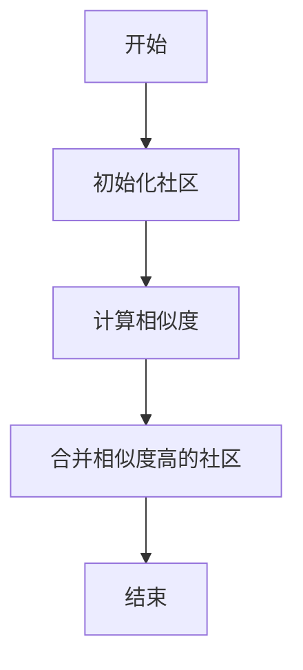
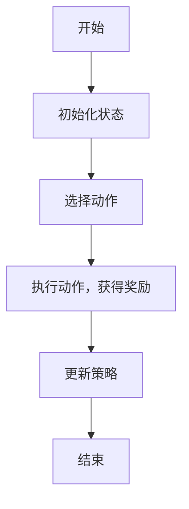
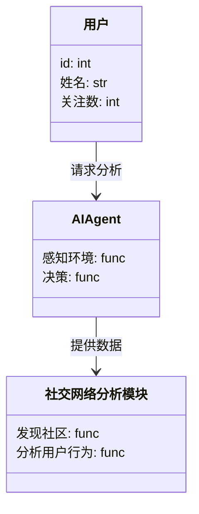
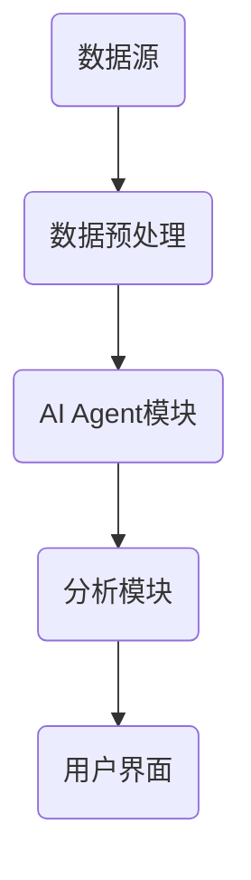
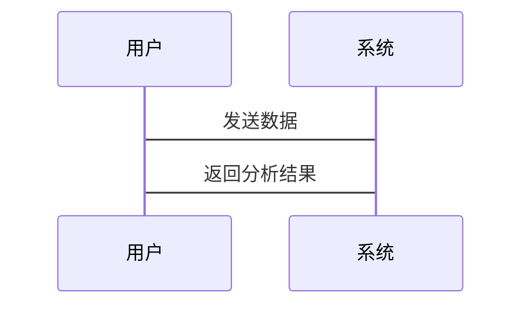

                 


# 开发AI Agent支持的智能社交网络分析系统

> 关键词：AI Agent, 社交网络分析, 社区发现, 强化学习, 系统架构

> 摘要：本文详细探讨了开发AI Agent支持的智能社交网络分析系统的背景、核心概念、算法原理、系统架构以及项目实战。通过分析社交网络的复杂性，结合AI Agent的强大能力，提出了一种高效的智能社交网络分析系统，并通过实际案例展示了系统的实现与应用。

---

# 1. 背景介绍

## 1.1 问题背景

随着社交网络的快速发展，用户生成的数据呈现出爆炸性增长。这些数据不仅包括文本、图片、视频，还包括复杂的用户行为和互动关系。传统的社交网络分析方法难以处理这种复杂性，特别是在实时性、个性化推荐和异常检测方面存在明显不足。因此，引入AI Agent技术，可以显著提升社交网络分析的智能化和效率。

## 1.2 问题描述

智能社交网络分析系统需要解决以下关键问题：
- 如何高效地从海量数据中提取有价值的信息？
- 如何实现用户行为的实时监控与预测？
- 如何利用AI Agent进行智能决策和推荐？

## 1.3 解决策略

通过结合AI Agent的自主学习和决策能力，设计一个能够实时处理社交网络数据、识别用户行为模式，并提供智能推荐的系统。该系统将采用社区发现算法和强化学习算法，分别处理网络结构分析和用户行为预测。

## 1.4 系统边界与外延

本系统专注于社交网络的结构分析和用户行为预测，不涉及具体的数据存储和安全问题。系统的外延包括数据源的获取、数据清洗、模型训练和结果可视化。

---

# 2. 核心概念与联系

## 2.1 核心概念

### AI Agent

- **定义**：AI Agent是一种能够感知环境、自主决策并执行任务的智能体。
- **核心功能**：
  - 数据采集
  - 信息处理
  - 智能决策

### 社交网络分析系统

- **定义**：通过分析社交网络数据，提取有用信息的系统。
- **核心功能**：
  - 社区发现
  - 用户行为分析
  - 异常检测

## 2.2 核心概念对比

| 属性       | AI Agent                          | 社交网络分析系统                 |
|------------|------------------------------------|----------------------------------|
| 数据处理    | 实时数据处理                     | 批量数据处理                     |
| 决策能力    | 自主决策                         | 基于规则的决策                   |
| 应用场景    | 个性化推荐                       | 社区发现                         |

## 2.3 ER实体关系图

```mermaid
er
  actor: 用户
  post: 帖子
  comment: 评论
  agent: AI Agent
  community: 社区

  actor --> post: 发布
  post --> comment: 评论
  agent --> community: 分析
```

---

# 3. 算法原理

## 3.1 社区发现算法

### 算法原理

社区发现的目标是将社交网络划分为多个社区，每个社区内的用户具有较高的相似性或互动频率。常用的算法包括Louvain算法和层次聚类算法。

### 具体实现



### 代码示例

```python
import networkx as nx

def louvain_algorithm(graph):
    communities = nx.community.louvain(graph)
    return communities

# 示例数据
G = nx.Graph()
G.add_edges_from([(1,2), (2,3), (3,4), (4,5)])
communities = louvain_algorithm(G)
print(" Communities:", communities)
```

### 数学公式

社区发现的目标函数：
$$ Q = \sum_{i} \sum_{j} (A_{ij} - p_i p_j) $$
其中，$A_{ij}$是邻接矩阵的元素，$p_i$和$p_j$是节点$i$和$j$属于同一个社区的概率。

---

## 3.2 强化学习算法

### 算法原理

强化学习通过智能体与环境的交互，学习最优策略。在社交网络分析中，强化学习可以用于用户行为预测和推荐系统。

### 具体实现



### 代码示例

```python
import numpy as np
import tensorflow as tf

model = tf.keras.Sequential([
    tf.keras.layers.Dense(64, activation='relu'),
    tf.keras.layers.Dense(1, activation='sigmoid')
])

model.compile(optimizer='adam', loss='binary_crossentropy')
```

### 数学公式

强化学习的目标函数：
$$ J(\theta) = \mathbb{E}_{\tau}[\sum_{t} r_t] $$
其中，$\tau$是策略$\pi$生成的轨迹，$r_t$是时间$t$的奖励。

---

# 4. 系统分析与架构设计

## 4.1 项目背景

本项目旨在开发一个智能社交网络分析系统，利用AI Agent技术提升分析效率和准确性。

## 4.2 功能设计

### 领域模型



### 系统架构



### 接口设计

系统提供RESTful API接口，支持以下操作：
- 数据上传
- 社区发现请求
- 用户行为分析请求

### 交互流程



---

# 5. 项目实战

## 5.1 环境安装

安装所需的Python库：
```bash
pip install networkx tensorflow
```

## 5.2 核心实现

### 社区发现实现

```python
import networkx as nx

def load_data():
    G = nx.Graph()
    G.add_edges_from([(1,2), (2,3), (3,4), (4,5)])
    return G

def find_communities(G):
    communities = nx.community.louvain(G)
    return communities

# 示例运行
G = load_data()
communities = find_communities(G)
print(" Communities:", communities)
```

### 强化学习实现

```python
import tensorflow as tf
import numpy as np

model = tf.keras.Sequential([
    tf.keras.layers.Dense(64, activation='relu'),
    tf.keras.layers.Dense(1, activation='sigmoid')
])

model.compile(optimizer='adam', loss='binary_crossentropy')

# 示例训练
X = np.random.random((100, 64))
y = np.random.randint(0, 2, 100)
model.fit(X, y, epochs=10)
```

## 5.3 案例分析

### 数据集选择

选择一个社交网络数据集，例如Twitter用户数据。

### 实际应用

分析用户行为，识别社区结构，并预测用户的兴趣。

## 5.4 小结

通过代码示例和实际案例分析，展示了系统的实现过程和应用价值。

---

# 6. 总结与扩展

## 6.1 最佳实践

- 数据预处理是关键
- 模型调参需谨慎
- 注意数据隐私

## 6.2 小结

本文详细介绍了AI Agent支持的智能社交网络分析系统的开发过程，从背景分析到系统实现，为读者提供了全面的指导。

## 6.3 注意事项

- 数据隐私和安全
- 模型泛化能力
- 算法的实时性

## 6.4 拓展阅读

- 《深度学习》
- 《社交网络分析》
- 《强化学习实战》

---

# 作者

作者：AI天才研究院/AI Genius Institute & 禅与计算机程序设计艺术/Zen And The Art of Computer Programming

