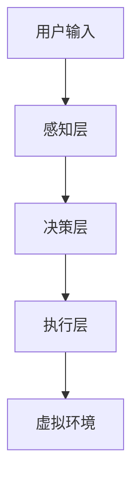

                 


# 开发AI Agent支持的智能虚拟现实系统

## 关键词：
AI Agent、智能虚拟现实、实时交互、多智能体协作、计算机视觉、自然语言处理、系统架构设计

## 摘要：
本文详细探讨了AI Agent在智能虚拟现实系统中的应用，从基本概念到技术实现，再到系统设计和项目实战，全面分析了AI Agent如何提升虚拟现实系统的智能化水平。文章涵盖AI Agent的核心理论、协同机制、系统架构设计以及实际开发案例，旨在为开发者提供理论支持和实践指导。

---

# 正文

## 第1章 AI Agent与智能虚拟现实系统概述

### 1.1 AI Agent的基本概念
AI Agent（人工智能代理）是指能够感知环境并采取行动以实现目标的智能实体。它具有以下特点：
- **自主性**：能够在没有外部干预的情况下运行。
- **反应性**：能够根据环境变化调整行为。
- **目标导向**：通过目标驱动决策和行动。

AI Agent的类型包括：
1. **反应式Agent**：基于当前感知做出反应。
2. **基于模型的Agent**：利用内部模型进行规划和推理。
3. **学习型Agent**：通过经验改进性能。

### 1.2 智能虚拟现实系统的概念
虚拟现实（VR）是一种能够提供沉浸式体验的技术，通过计算机生成的三维环境，让用户获得身临其境的感觉。智能虚拟现实系统通过集成AI技术，使系统具备自主决策和交互能力。

### 1.3 AI Agent在智能虚拟现实系统中的作用
AI Agent在VR系统中的作用主要体现在：
1. **智能交互**：通过自然语言处理和计算机视觉提供更自然的用户交互。
2. **实时反馈**：根据用户行为实时调整虚拟环境。
3. **多智能体协作**：在多人协作场景中，AI Agent可以协调多个用户的行动。

---

## 第2章 AI Agent的核心理论与技术

### 2.1 AI Agent的智能模型
AI Agent的智能模型包括：
1. **知识表示**：将知识以符号或数据结构形式存储，例如逻辑推理和语义网络。
2. **推理与决策**：通过逻辑推理或机器学习模型做出决策。
3. **学习与自适应**：通过强化学习或监督学习提升性能。

数学模型示例：
$$ Q-learning算法：Q(s, a) = r + \gamma \max Q(s', a') $$

### 2.2 虚拟现实系统的感知与交互
感知技术包括：
- **计算机视觉**：使用OpenCV进行图像处理。
- **语音识别**：使用如Google Speech API进行语音交互。

### 2.3 AI Agent与虚拟现实系统的协同机制
协同机制涉及信息共享与任务分配。例如，使用多智能体系统中的分布式协同方法。

---

## 第3章 系统分析与架构设计方案

### 3.1 系统架构设计
系统架构包括：
1. **感知层**：处理用户输入。
2. **决策层**：AI Agent进行决策。
3. **执行层**：调整虚拟环境。

Mermaid架构图：


### 3.2 系统接口设计
接口设计包括：
- 用户界面：图形化界面或命令行。
- API接口：供其他系统调用。

---

## 第4章 项目实战

### 4.1 环境配置
开发环境：
- 操作系统：Linux或Windows。
- 开发工具：PyCharm、Unity。
- 库：OpenCV、TensorFlow。

### 4.2 核心实现
代码示例：
```python
import cv2
import numpy as np

def detect_object(image):
    # 图像处理代码
    pass

# 使用OpenCV进行图像处理
image = cv2.imread('input.jpg')
result = detect_object(image)
cv2.imwrite('output.jpg', result)
```

### 4.3 测试与优化
测试步骤：
1. 功能测试：验证各模块是否正常工作。
2. 性能优化：提升处理速度。

---

## 第5章 总结与展望

### 5.1 总结
本文详细探讨了AI Agent在智能虚拟现实系统中的应用，从理论到实践，提供了全面的分析和实现方案。

### 5.2 未来展望
未来的挑战包括实时性提升和多智能体协作优化。未来的研究方向包括更高效的算法和更自然的交互方式。

---

## 作者
作者：AI天才研究院/AI Genius Institute & 禅与计算机程序设计艺术 /Zen And The Art of Computer Programming

