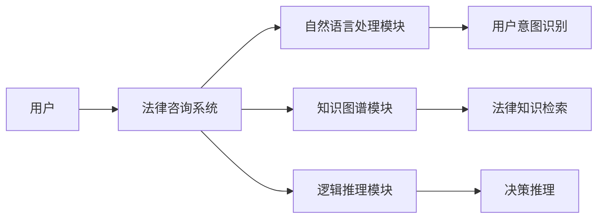
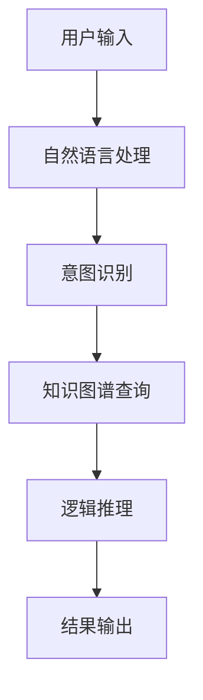
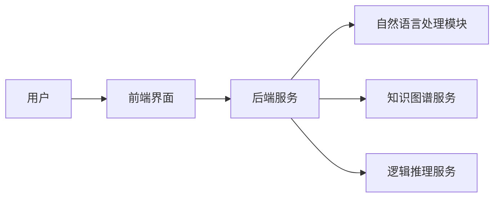
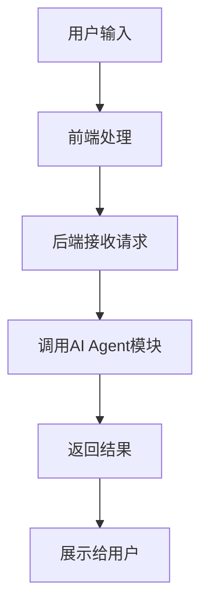

                 


# 开发AI Agent支持的法律咨询系统

> 关键词：AI Agent, 法律咨询, 自然语言处理, 知识图谱, 逻辑推理, 系统架构, 项目实战

> 摘要：本文详细探讨了开发AI Agent支持的法律咨询系统的背景、核心概念、算法原理、系统架构设计及项目实战。通过自然语言处理、知识图谱构建和逻辑推理等技术，结合实际案例，展示了如何构建一个智能化的法律咨询系统。文章内容详实，涵盖从理论到实践的各个方面，旨在为读者提供全面的技术指导。

---

## 目录

### 第一部分: AI Agent支持的法律咨询系统背景介绍

#### 第1章: 法律咨询系统的问题背景

##### 1.1 传统法律咨询系统的局限性

- 1.1.1 传统法律咨询的效率问题
- 1.1.2 专业法律咨询的可及性问题
- 1.1.3 传统法律咨询的成本问题

##### 1.2 AI Agent在法律咨询中的潜力

- 1.2.1 AI技术在法律领域的应用现状
- 1.2.2 AI Agent在法律咨询中的优势
- 1.2.3 法律咨询系统智能化发展的趋势

##### 1.3 问题描述与目标设定

- 1.3.1 法律咨询系统智能化的目标
- 1.3.2 系统需要解决的核心问题
- 1.3.3 系统边界与外延

##### 1.4 核心概念与系统结构

- 1.4.1 AI Agent的定义与特征
- 1.4.2 法律咨询系统的功能模块
- 1.4.3 系统的核心要素与组成

##### 1.5 本章小结

---

### 第二部分: AI Agent的核心概念与原理

#### 第2章: AI Agent的基本原理

##### 2.1 AI Agent的定义与分类

- 2.1.1 AI Agent的定义
- 2.1.2 AI Agent的分类
- 2.1.3 各类AI Agent的特点对比

##### 2.2 AI Agent的核心技术

- 2.2.1 自然语言处理技术
- 2.2.2 知识图谱构建技术
- 2.2.3 逻辑推理与决策技术

##### 2.3 AI Agent与法律咨询的结合

- 2.3.1 法律咨询中的自然语言处理
- 2.3.2 知识图谱在法律咨询中的应用
- 2.3.3 逻辑推理在法律咨询中的作用

##### 2.4 AI Agent的实体关系图



##### 2.5 本章小结

---

### 第三部分: AI Agent支持的法律咨询系统算法原理

#### 第3章: AI Agent的算法原理

##### 3.1 自然语言处理算法

- 3.1.1 Transformer模型简介
- 3.1.2 注意力机制的原理
- 3.1.3 解码器的实现过程

##### 3.2 知识图谱构建算法

- 3.2.1 实体识别与抽取
- 3.2.2 关系抽取与构建
- 3.2.3 知识图谱的存储与查询

##### 3.3 逻辑推理算法

- 3.3.1 基于规则的推理
- 3.3.2 基于概率的推理
- 3.3.3 基于深度学习的推理

##### 3.4 算法流程图



##### 3.5 本章小结

---

### 第四部分: 法律咨询系统架构设计

#### 第4章: 系统分析与架构设计方案

##### 4.1 问题场景介绍

- 4.1.1 用户需求分析
- 4.1.2 系统功能需求
- 4.1.3 系统性能需求

##### 4.2 系统功能设计

- 4.2.1 用户界面设计
- 4.2.2 法律知识库设计
- 4.2.3 AI Agent交互设计

##### 4.3 系统架构设计



##### 4.4 系统接口设计

- 4.4.1 API设计原则
- 4.4.2 接口实现细节
- 4.4.3 接口安全与性能优化

##### 4.5 系统交互流程图



##### 4.6 本章小结

---

### 第五部分: 项目实战

#### 第5章: 项目实战与分析

##### 5.1 环境安装与配置

- 5.1.1 开发工具安装
- 5.1.2 依赖库安装
- 5.1.3 环境配置

##### 5.2 核心代码实现

- 5.2.1 自然语言处理模块
- 5.2.2 知识图谱构建模块
- 5.2.3 逻辑推理模块

##### 5.3 实际案例分析

- 5.3.1 案例背景介绍
- 5.3.2 系统运行流程
- 5.3.3 结果分析与优化

##### 5.4 代码示例

```python
# 自然语言处理模块示例代码
def process_input(user_input):
    # 文本预处理
    tokens = tokenizer(user_input)
    # 意图识别
    intent = model.predict(tokens)
    return intent

# 知识图谱查询模块示例代码
def query_knowledge_graph(intent):
    # 根据意图查询知识图谱
    results = knowledge_graph.search(intent)
    return results

# 逻辑推理模块示例代码
def logical_reasoning(results):
    # 基于规则的推理
    conclusion = rule_engine(results)
    return conclusion
```

##### 5.5 本章小结

---

### 第六部分: 最佳实践与总结

#### 第6章: 最佳实践与总结

##### 6.1 最佳实践

- 6.1.1 系统设计中的注意事项
- 6.1.2 开发中的常见问题与解决方案
- 6.1.3 系统优化与性能提升

##### 6.2 小结

- 6.2.1 项目总结
- 6.2.2 未来展望

##### 6.3 注意事项

- 6.3.1 使用AI Agent的法律风险
- 6.3.2 系统的可扩展性与维护

##### 6.4 拓展阅读

- 6.4.1 相关技术领域
- 6.4.2 推荐阅读资料

##### 6.5 本章小结

---

### 作者：AI天才研究院/AI Genius Institute & 禅与计算机程序设计艺术 /Zen And The Art of Computer Programming

---

**注：本文目录大纲已生成，具体内容需要根据上述结构逐步展开，确保每部分内容详实，逻辑清晰，涵盖从理论到实践的各个方面。**

