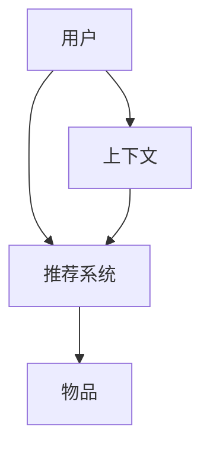
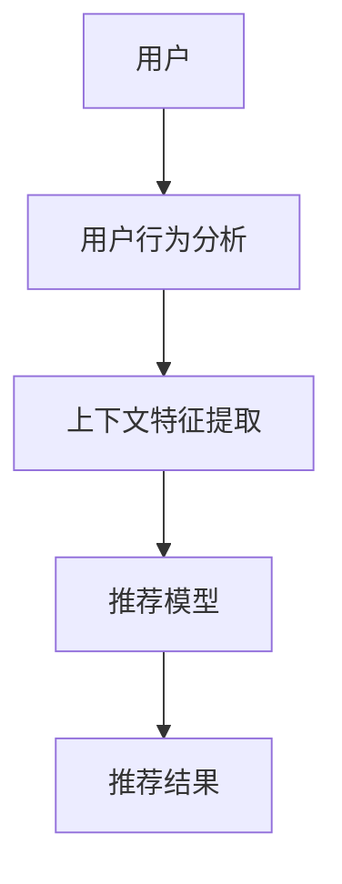
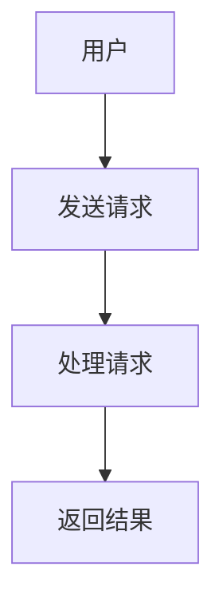

                 


# 开发AI Agent的上下文感知推荐系统

## 关键词：AI Agent、上下文感知推荐系统、推荐算法、系统架构设计、项目实战

## 摘要：本文详细探讨了开发AI Agent的上下文感知推荐系统的核心概念、算法原理、系统架构设计以及项目实战。文章首先从背景介绍入手，分析了传统推荐系统与上下文感知推荐系统的区别，详细阐述了AI Agent的基本原理和上下文处理机制。接着，通过数学公式和图表，详细讲解了协同过滤和深度学习模型的实现原理。然后，结合实际案例，展示了系统的架构设计和接口设计，最后通过项目实战部分，提供了完整的代码实现和优化建议，帮助读者全面理解和掌握开发AI Agent的上下文感知推荐系统的技术细节。

---

## 第1章: 上下文感知推荐系统概述

### 1.1 问题背景与描述

#### 1.1.1 推荐系统的发展历程
推荐系统是一种通过分析用户行为和偏好，为用户推荐相关物品的技术。从协同过滤到基于内容的推荐，再到混合推荐，推荐系统经历了从简单到复杂的演变。然而，传统的推荐系统往往忽视了上下文信息，导致推荐结果不够精准。

#### 1.1.2 上下文感知推荐的核心问题
上下文感知推荐系统通过整合时间、地点、用户状态等多维度信息，提升推荐的准确性。AI Agent作为推荐系统的核心，能够实时感知上下文信息，并动态调整推荐策略。

#### 1.1.3 AI Agent在推荐系统中的作用
AI Agent通过感知上下文信息，能够实时分析用户需求，提供个性化推荐。例如，在电商推荐中，AI Agent可以根据用户的浏览历史、当前时间、所在位置等因素，推荐最合适的产品。

### 1.2 问题解决与边界

#### 1.2.1 上下文感知推荐的解决方案
解决方案包括数据采集、上下文特征提取、推荐模型训练和结果输出。AI Agent通过整合这些模块，实现上下文感知推荐。

#### 1.2.2 系统的边界与外延
系统的边界包括输入数据的范围和输出结果的范围。外延则包括与推荐系统交互的其他系统，如数据库和用户界面。

#### 1.2.3 核心概念与组成要素
核心概念包括用户、上下文、推荐结果等。组成要素包括数据采集模块、特征提取模块、推荐模型和结果输出模块。

### 1.3 核心概念对比分析

#### 1.3.1 AI Agent与传统推荐系统的对比
AI Agent能够实时感知上下文信息，而传统推荐系统往往依赖静态数据。AI Agent的动态性和智能性使其更适合上下文感知推荐。

#### 1.3.2 上下文感知推荐的特征分析
上下文感知推荐具有实时性、动态性和个性化的特点。通过整合多维度信息，推荐结果更加精准。

#### 1.3.3 ER实体关系图架构



---

## 第2章: AI Agent的核心原理

### 2.1 AI Agent的基本原理

#### 2.1.1 AI Agent的定义与分类
AI Agent是一种能够感知环境并采取行动的智能体。根据智能体的结构和功能，可以分为简单反射型、基于模型的反射型、目标驱动型和效用驱动型。

#### 2.1.2 AI Agent的感知与决策机制
AI Agent通过感知环境信息，利用内部模型进行决策。感知模块负责数据采集，决策模块负责策略生成和执行。

#### 2.1.3 AI Agent的上下文处理流程
上下文处理流程包括数据采集、特征提取、模型训练和结果输出。AI Agent通过整合多源数据，生成精准的推荐结果。

### 2.2 上下文感知推荐的算法原理

#### 2.2.1 协同过滤算法
协同过滤是一种基于用户相似性推荐的方法。通过计算用户之间的相似度，推荐相似用户的偏好物品。

#### 2.2.2 基于深度学习的推荐模型
深度学习模型通过多层神经网络，提取数据的深层特征，生成推荐结果。常用的模型包括矩阵分解和神经网络模型。

#### 2.2.3 混合推荐算法
混合推荐结合了协同过滤和深度学习的优点，通过集成多个模型，提升推荐的准确性和多样性。

### 2.3 算法实现与优化

#### 2.3.1 协同过滤的数学模型
协同过滤的相似度计算公式如下：
$$sim(i,j) = \frac{\sum_{k} r_{ik}r_{jk}}{\sqrt{\sum_{k} r_{ik}^2} \sqrt{\sum_{k} r_{jk}^2}}$$

#### 2.3.2 基于神经网络的推荐模型
神经网络模型通过多层感知机提取特征，生成推荐结果。常用的模型包括深度协同过滤和注意力机制模型。

#### 2.3.3 算法优化策略
算法优化包括参数调优、模型压缩和分布式训练。通过优化算法，提升推荐系统的性能和效率。

### 2.4 本章小结

---

## 第3章: 上下文感知推荐系统的架构设计

### 3.1 系统功能设计

#### 3.1.1 用户行为分析模块
用户行为分析模块负责采集用户的交互数据，包括点击、浏览和购买行为。

#### 3.1.2 上下文特征提取模块
上下文特征提取模块提取时间、地点和设备等信息，作为推荐的辅助特征。

#### 3.1.3 推荐结果生成模块
推荐结果生成模块基于用户特征和上下文信息，生成推荐列表。

### 3.2 系统架构图



### 3.3 接口设计与交互流程

#### 3.3.1 系统接口定义
系统接口包括数据输入接口、模型训练接口和结果输出接口。

#### 3.3.2 系统交互流程图



### 3.4 本章小结

---

## 第4章: 项目实战与实现

### 4.1 环境安装与配置

#### 4.1.1 Python环境搭建
安装Python 3.8以上版本，并安装必要的依赖库，如NumPy、Pandas和Scikit-learn。

#### 4.1.2 依赖库安装
使用pip安装必要的库：
```bash
pip install numpy pandas scikit-learn
```

#### 4.1.3 开发工具配置
配置IDE，如PyCharm或VS Code，确保环境变量配置正确。

### 4.2 系统核心实现

#### 4.2.1 数据预处理
加载数据并进行清洗和特征提取。

#### 4.2.2 推荐模型实现
实现协同过滤算法和深度学习模型，对比分析性能。

#### 4.2.3 代码实现

```python
from sklearn.metrics.pairwise import cosine_similarity

def collaborative_filtering(user_data):
    user_similarity = cosine_similarity(user_data)
    return user_similarity
```

### 4.3 代码解读与分析

#### 4.3.1 协同过滤算法实现
计算用户相似度矩阵，推荐相似用户的偏好物品。

#### 4.3.2 深度学习模型实现
使用神经网络模型，提取深层特征，生成推荐结果。

#### 4.3.3 实际案例分析
通过具体案例，展示上下文感知推荐系统的实际应用。

### 4.4 项目优化与调优

#### 4.4.1 参数调优
通过网格搜索优化模型参数，提升推荐准确率。

#### 4.4.2 模型压缩
通过剪枝和降维技术，减少模型复杂度，提升运行效率。

#### 4.4.3 分布式训练
利用分布式计算框架，提升模型训练效率。

### 4.5 项目小结

---

## 第5章: 总结与展望

### 5.1 最佳实践 tips
- 数据预处理是关键，确保数据质量。
- 模型调优需要结合业务场景，选择合适的方法。
- 系统架构设计要注重扩展性和可维护性。

### 5.2 小结
本文详细介绍了AI Agent的上下文感知推荐系统的开发过程，从背景到实现，全面覆盖了核心概念、算法原理和系统设计。

### 5.3 注意事项
- 数据隐私和安全问题需要重视。
- 模型的实时性和响应速度需要优化。
- 系统的可扩展性和可维护性需要考虑。

### 5.4 拓展阅读
- 《推荐系统导论》
- 《深度学习推荐系统》
- 《AI Agent的理论与实践》

---

## 作者：AI天才研究院/AI Genius Institute & 禅与计算机程序设计艺术 /Zen And The Art of Computer Programming

