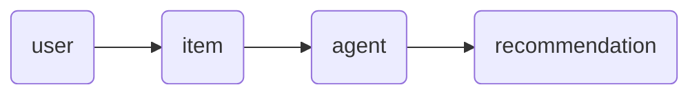
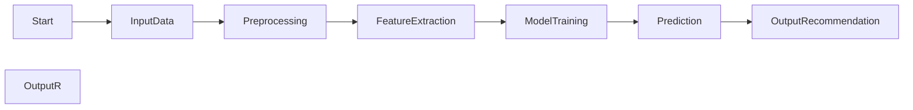
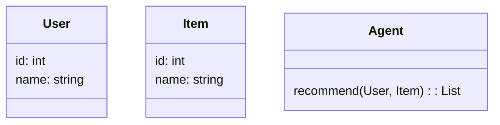
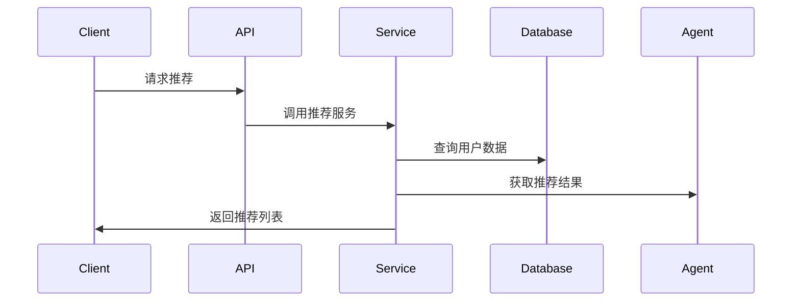

                 


# 开发AI Agent的个性化推荐系统

> 关键词：AI Agent, 个性化推荐, 算法原理, 系统架构, 项目实战

> 摘要：本文详细探讨了AI Agent在个性化推荐系统中的应用，从核心概念、算法原理、系统架构到项目实战，全面解析了开发AI Agent推荐系统的全过程。通过理论与实践结合，为开发者提供了一套完整的解决方案。

---

## 第1章 AI Agent与个性化推荐系统概述

### 1.1 问题背景与问题描述

#### 1.1.1 当前推荐系统的痛点
传统推荐系统存在以下问题：
- **数据稀疏性**：用户行为数据不足，导致推荐结果不够精准。
- **实时性不足**：无法实时响应用户的动态需求。
- **个性化不足**：推荐结果千人一面，缺乏深度个性化。

#### 1.1.2 AI Agent在推荐系统中的作用
AI Agent通过以下方式提升推荐系统：
- **动态适应性**：实时分析用户行为，动态调整推荐策略。
- **多模态数据处理**：整合文本、图像等多种数据源，提升推荐精准度。
- **自适应学习**：通过强化学习优化推荐策略。

#### 1.1.3 个性化推荐的核心目标
个性化推荐的核心目标是：
- 提供高度个性化的推荐结果。
- 提升用户体验，增加用户粘性和满意度。
- 帮助企业实现精准营销，提高转化率。

### 1.2 问题解决与边界定义

#### 1.2.1 AI Agent推荐系统的解决方案
AI Agent推荐系统的解决方案包括：
1. **数据收集与预处理**：实时收集用户行为数据，并进行清洗和特征提取。
2. **模型训练与优化**：基于历史数据训练推荐模型，并通过反馈优化模型。
3. **动态推荐生成**：根据实时数据生成个性化推荐列表。

#### 1.2.2 系统边界与功能范围
系统边界包括：
- 用户端：推荐结果展示。
- 服务端：数据处理与模型训练。
- 第三方：数据源和API接口。

功能范围涵盖：
- 用户行为分析。
- 推荐结果生成。
- 系统监控与维护。

#### 1.2.3 系统的可扩展性与灵活性
系统设计注重：
- **模块化设计**：便于功能扩展。
- **多平台支持**：适配不同终端。
- **高可用性**：确保系统稳定运行。

### 1.3 核心概念与系统架构

#### 1.3.1 AI Agent的基本概念
AI Agent定义为：
$$
\text{AI Agent} = \{ \text{感知环境}, \text{决策逻辑}, \text{执行动作} \}
$$

#### 1.3.2 个性化推荐的核心要素
个性化推荐的核心要素包括：
- 用户特征（User Profile）。
- 物品特征（Item Profile）。
- 用户-物品交互数据（User-Item Interaction）。

#### 1.3.3 系统架构的组成与关系
系统架构包括：
1. 数据层：存储用户、物品、交互数据。
2. 模型层：推荐算法和AI Agent逻辑。
3. 接口层：API和用户界面。
4. 应用层：推荐结果展示与反馈。

---

## 第2章 AI Agent与推荐系统的核心概念

### 2.1 AI Agent的定义与属性

#### 2.1.1 AI Agent的基本定义
AI Agent的特征包括：
- **自主性**：无需外部干预。
- **反应性**：实时响应环境变化。
- **目标导向性**：基于目标执行任务。

#### 2.1.2 AI Agent的分类与应用场景
AI Agent分类：
- **简单反射型**：基于规则的反应。
- **基于模型的反应型**：基于模型进行推理。
- **目标驱动型**：以目标为导向行动。

应用场景：
- **电商推荐**：根据用户行为推荐商品。
- **社交推荐**：基于社交网络推荐内容。
- **教育推荐**：根据学习行为推荐课程。

### 2.2 推荐系统的定义与分类

#### 2.2.1 推荐系统的定义
推荐系统是：
$$
\text{推荐系统} = \{ \text{数据输入}, \text{推荐算法}, \text{推荐结果} \}
$$

#### 2.2.2 推荐系统的分类
推荐系统分为：
- **协同过滤**：基于用户相似性推荐。
- **基于内容的推荐**：基于物品特征推荐。
- **混合推荐**：结合多种推荐方法。

### 2.3 AI Agent推荐系统的实体关系

#### 2.3.1 实体关系图（ER图）


---

## 第3章 AI Agent推荐系统的算法原理

### 3.1 推荐算法的核心原理

#### 3.1.1 协同过滤算法
协同过滤算法步骤：
1. 找出与用户相似的其他用户。
2. 推荐这些用户喜欢的物品。

#### 3.1.2 基于内容的推荐算法
基于内容的推荐算法步骤：
1. 提取物品特征。
2. 找出与用户兴趣匹配的物品。

#### 3.1.3 混合推荐算法
混合推荐算法结合了协同过滤和基于内容的推荐方法。

### 3.2 基于深度学习的推荐算法

#### 3.2.1 神经网络在推荐系统中的应用
神经网络用于推荐系统的特征提取和预测。

#### 3.2.2 基于矩阵分解的推荐算法
矩阵分解公式：
$$
R = P \cdot Q^T
$$
其中，R是评分矩阵，P是用户矩阵，Q是物品矩阵。

#### 3.2.3 基于序列模型的推荐算法
序列模型用于捕捉用户的兴趣变化。

### 3.3 AI Agent推荐系统的算法流程

#### 3.3.1 算法流程图


---

## 第4章 系统分析与架构设计

### 4.1 系统分析

#### 4.1.1 应用场景介绍
系统应用于电商、社交、教育等多个领域。

#### 4.1.2 系统功能设计
系统功能包括：
- 用户管理。
- 物品管理。
- 推荐管理。

### 4.2 系统架构设计

#### 4.2.1 领域模型类图


#### 4.2.2 系统架构图


### 4.3 接口设计与交互流程

#### 4.3.1 系统接口设计
主要接口包括：
- 用户鉴权接口。
- 推荐请求接口。
- 反馈收集接口。

#### 4.3.2 交互流程


---

## 第5章 项目实战

### 5.1 环境安装与配置

#### 5.1.1 安装依赖
```bash
pip install numpy
pip install scikit-learn
```

### 5.2 系统核心实现

#### 5.2.1 数据预处理代码
```python
import numpy as np
from sklearn.preprocessing import normalize

def preprocess_data(data):
    # 特征提取
    features = data.drop(['user_id', 'item_id'], axis=1)
    # 标准化处理
    features = normalize(features)
    return features
```

#### 5.2.2 推荐算法实现
```python
from sklearn.neighbors import NearestNeighbors

def collaborative_filtering(train_data, test_data):
    model = NearestNeighbors(n_neighbors=5)
    model.fit(train_data)
    # 查找最近邻
    distances, indices = model.kneighbors(test_data)
    return indices
```

### 5.3 案例分析与总结

#### 5.3.1 实际案例分析
案例：电商推荐系统。

#### 5.3.2 项目总结
- **优势**：提升用户体验。
- **挑战**：数据隐私和计算效率。

---

## 结论

开发AI Agent的个性化推荐系统是一项复杂的工程，需要结合算法、系统架构和实际应用场景。通过本文的系统解析和实战案例，读者可以掌握开发此类系统的核心方法和技巧。

---

## 附录

### 附录A: 工具安装指南
```bash
pip install numpy
pip install scikit-learn
pip install mermaid
```

### 附录B: API接口文档
```markdown
## API接口
### 接口1: 获取推荐
- 请求方式：POST
- 地址：/api/recommend
- 参数：user_id
```

作者：AI天才研究院/AI Genius Institute & 禅与计算机程序设计艺术 /Zen And The Art of Computer Programming

