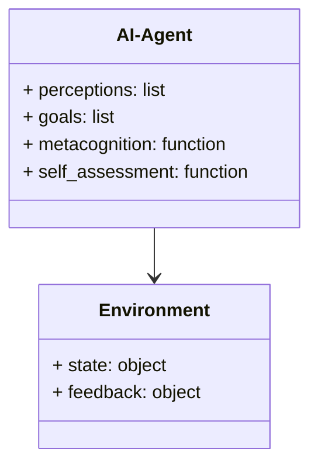
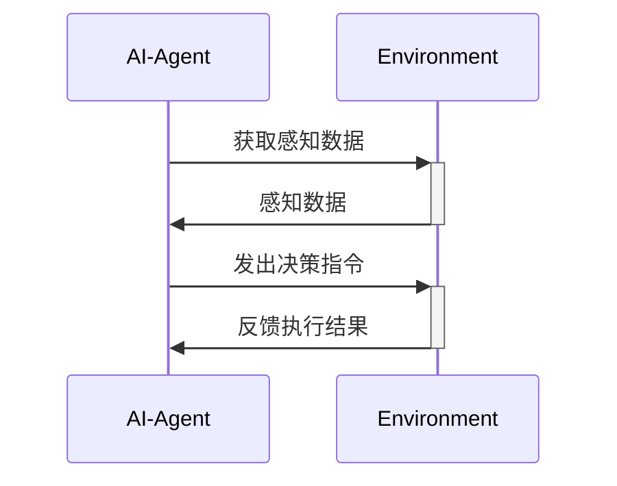

                 


# 开发AI Agent的元认知与自我评估能力

> 关键词：AI Agent，元认知，自我评估，人工智能，算法，系统架构

> 摘要：本文深入探讨了AI Agent的元认知与自我评估能力，从理论基础到实际应用，详细讲解了如何通过元认知和自我评估提升AI Agent的智能水平和适应性。文章结合数学公式、算法流程图和实际代码示例，全面分析了AI Agent的开发过程，帮助读者系统地理解和掌握相关技术。

---

# 第1章 AI Agent与元认知概述

## 1.1 AI Agent的基本概念

### 1.1.1 AI Agent的定义与分类
- **定义**：AI Agent是指能够感知环境并采取行动以实现目标的智能实体。
- **分类**：
  - **简单反射型AI Agent**：基于预设规则进行反应，如专家系统。
  - **基于模型的反应型AI Agent**：利用内部模型来规划和推理。
  - **目标驱动型AI Agent**：根据目标选择行动。
  - **效用驱动型AI Agent**：通过最大化效用函数来优化决策。

### 1.1.2 元认知的定义与特点
- **元认知**：是对认知过程的认知，包括对思维过程的监控和调节。
- **特点**：
  - **内省性**：能够反思自身的认知过程。
  - **调节性**：能够根据反馈调整认知策略。
  - **灵活性**：能够适应不同情境下的认知需求。

### 1.1.3 元认知在AI Agent中的作用
- **作用**：
  - 提高决策的准确性。
  - 增强环境适应能力。
  - 优化学习和自适应过程。

---

## 1.2 自我评估能力的重要性

### 1.2.1 自我评估的定义与目标
- **定义**：AI Agent对其自身的状态、行为和结果进行分析和评价。
- **目标**：
  - 识别自身的优势和不足。
  - 提供改进的方向和策略。

### 1.2.2 自我评估在AI Agent中的应用场景
- **应用场景**：
  - 自动调整参数和模型。
  - 实时监控和优化性能。
  - 处理复杂任务时的动态调整。

### 1.2.3 自我评估与元认知的关系
- **关系**：
  - 元认知为自我评估提供理论基础。
  - 自我评估是元认知能力的具体应用。

---

## 1.3 本章小结

### 1.3.1 AI Agent的核心概念总结
- AI Agent是具有感知和行动能力的智能实体。
- 元认知是AI Agent具备自我反思和调节能力的关键。

### 1.3.2 元认知与自我评估的联系
- 元认知为自我评估提供了理论和方法。
- 自我评估是元认知能力的实际应用。

---

# 第2章 元认知与自我评估的理论基础

## 2.1 元认知理论的发展历程

### 2.1.1 元认知理论的起源
- **弗拉基米尔·维果茨基**：提出认知发展的社会文化理论。
- **让·皮亚杰**：提出认知发展阶段理论。

### 2.1.2 元认知理论在AI领域的应用
- **早期研究**：基于专家系统和知识表示的元认知模型。
- **现代研究**：结合深度学习和强化学习的元认知框架。

### 2.1.3 元认知理论的核心框架
- **输入**：感知信息、内部状态。
- **处理**：元认知过程，如监控和调节。
- **输出**：决策和行动。

---

## 2.2 自我评估的理论基础

### 2.2.1 自我评估的基本原理
- **自适应理论**：通过反馈调整自身行为。
- **元学习理论**：通过元认知进行学习策略的优化。

### 2.2.2 自我评估的层次结构
- **层次**：
  - 行为评估：对具体行动的评价。
  - 认知评估：对思维过程的评价。
  - 整体评估：对整体表现的评价。

### 2.2.3 自我评估与学习的关系
- **关系**：
  - 自我评估促进学习效果的提升。
  - 学习过程中的自我评估帮助识别知识盲点。

---

## 2.3 元认知与自我评估的整合

### 2.3.1 元认知与自我评估的协同作用
- **协同**：
  - 元认知监控思维过程。
  - 自我评估提供反馈和调整方向。

### 2.3.2 元认知与自我评估的相互影响
- **影响**：
  - 元认知影响自我评估的标准和方法。
  - 自我评估结果反哺元认知过程。

### 2.3.3 元认知与自我评估的系统模型
- **系统模型**：
  - 输入：环境信息、任务要求。
  - 处理：元认知监控、自我评估分析。
  - 输出：优化决策、改进策略。

---

## 2.4 本章小结

### 2.4.1 元认知与自我评估的理论框架
- 元认知和自我评估共同构建了AI Agent的自适应能力。

### 2.4.2 理论基础对AI Agent开发的指导意义
- 为AI Agent的设计提供了理论依据和方法论支持。

---

# 第3章 AI Agent元认知与自我评估的核心算法

## 3.1 元认知模型的构建

### 3.1.1 元认知模型的输入输出
- **输入**：感知数据、内部状态。
- **输出**：决策建议、行为调节。

### 3.1.2 元认知模型的内部结构
- **模块**：
  - 监控模块：实时监控认知过程。
  - 调节模块：根据监控结果调整策略。

### 3.1.3 元认知模型的训练方法
- **训练方法**：
  - 监督学习：基于标注数据进行训练。
  - 强化学习：通过奖励机制优化模型。

---

## 3.2 自我评估算法的设计

### 3.2.1 自我评估指标的定义
- **指标**：
  - 正确率：任务完成的准确程度。
  - 反应时间：任务处理的效率。
  - 资源消耗：计算资源的使用情况。

### 3.2.2 自我评估算法

#### 3.2.2.1 算法流程
1. **数据采集**：收集任务执行的数据。
2. **指标计算**：根据预设指标计算评估结果。
3. **结果分析**：判断评估结果是否达到预期。
4. **策略调整**：根据评估结果优化下一步行动。

#### 3.2.2.2 算法实现
```python
def self_assessment(data, metrics):
    results = {}
    for metric in metrics:
        if metric == 'accuracy':
            results[metric] = calculate_accuracy(data)
        elif metric == 'response_time':
            results[metric] = calculate_response_time(data)
        elif metric == 'resource_usage':
            results[metric] = calculate_resource_usage(data)
    return results
```

---

## 3.3 元认知与自我评估的协同算法

### 3.3.1 协同算法的原理
- **原理**：
  - 元认知监控认知过程。
  - 自我评估分析结果。
  - 协同优化决策。

### 3.3.2 协同算法的实现

#### 3.3.2.1 算法流程
1. **元认知监控**：实时监控认知过程。
2. **自我评估分析**：对监控结果进行评估。
3. **协同优化**：根据评估结果调整策略。

#### 3.3.2.2 算法实现
```python
def metacognitive_algorithm(perceptions, goals):
    meta_results = metacognition(perceptions)
    self_assessment_results = self_assessment(meta_results, goals)
    optimized_strategy = optimize_strategy(meta_results, self_assessment_results)
    return optimized_strategy
```

---

## 3.4 本章小结

### 3.4.1 元认知模型的核心算法
- 元认知模型通过监督学习和强化学习进行训练。

### 3.4.2 自我评估算法的设计与实现
- 自我评估算法通过预设指标和反馈机制优化决策过程。

---

# 第4章 系统分析与架构设计方案

## 4.1 问题场景介绍

### 4.1.1 问题背景
- AI Agent需要在复杂动态环境中完成任务。
- 需要具备自适应和自优化能力。

### 4.1.2 问题描述
- 开发具备元认知和自我评估能力的AI Agent。
- 实现动态调整和优化功能。

---

## 4.2 系统功能设计

### 4.2.1 领域模型


---

## 4.3 系统架构设计

### 4.3.1 架构图


---

## 4.4 系统接口设计

### 4.4.1 接口定义
- **输入接口**：感知数据、任务目标。
- **输出接口**：决策指令、反馈信息。

### 4.4.2 交互流程


---

## 4.5 本章小结

### 4.5.1 系统分析与设计的总结
- 系统架构设计为AI Agent的实现提供了框架支持。
- 接口设计确保了系统的可扩展性和灵活性。

---

# 第5章 项目实战

## 5.1 环境安装

### 5.1.1 开发工具
- **Python**：编程语言。
- **TensorFlow**：深度学习框架。
- **Mermaid**：图表绘制工具。

### 5.1.2 环境配置
```bash
pip install mermaid
pip install tensorflow
```

---

## 5.2 系统核心实现

### 5.2.1 核心代码实现
```python
def metacognition(perceptions):
    # 元认知处理逻辑
    pass

def self_assessment(perceptions, goals):
    # 自我评估逻辑
    pass
```

---

## 5.3 代码应用解读与分析

### 5.3.1 代码实现
```python
class AIAgent:
    def __init__(self, perceptions, goals):
        self.perceptions = perceptions
        self.goals = goals

    def metacognition(self):
        # 元认知处理
        pass

    def self_assessment(self):
        # 自我评估
        pass
```

---

## 5.4 实际案例分析

### 5.4.1 案例分析
- **案例背景**：在动态变化的环境中完成任务。
- **案例实现**：通过元认知和自我评估调整策略。

---

## 5.5 项目小结

### 5.5.1 实战经验总结
- 代码实现为理论提供了实践支持。
- 案例分析加深了对技术的理解。

---

# 第6章 最佳实践

## 6.1 小结

### 6.1.1 核心要点回顾
- 元认知与自我评估的理论基础。
- 算法实现与系统设计的关键点。

---

## 6.2 注意事项

### 6.2.1 开发中的注意事项
- 确保元认知模型的准确性。
- 优化自我评估算法的效率。

### 6.2.2 部署中的注意事项
- 确保系统的可扩展性和可维护性。

---

## 6.3 拓展阅读

### 6.3.1 推荐阅读
- 《深度学习》：学习深度学习的基本概念和算法。
- 《强化学习》：了解强化学习的原理和应用。

---

## 6.4 本章小结

### 6.4.1 元认知与自我评估能力的开发总结
- 元认知和自我评估能力的开发是一个复杂但值得探索的领域。

### 6.4.2 持续学习与实践的重要性
- 持续学习新技术，不断优化和改进系统。

---

# 作者：AI天才研究院 & 禅与计算机程序设计艺术

---

以上是《开发AI Agent的元认知与自我评估能力》的完整目录大纲，涵盖了从理论到实践的各个方面，适合希望深入理解AI Agent开发的读者。

