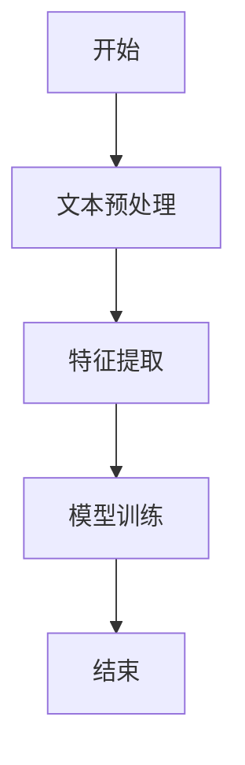
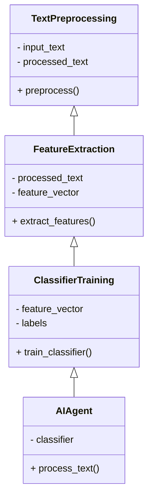

                 


# 开发AI Agent的多语言文本分类器

> 关键词：AI Agent，多语言文本分类器，自然语言处理，机器学习，文本分类

> 摘要：本文详细探讨了开发AI Agent驱动的多语言文本分类器的各个方面，包括背景介绍、核心概念、算法原理、系统架构设计、项目实战以及最佳实践。通过逐步分析和详细讲解，帮助读者理解如何从零开始构建一个高效的多语言文本分类系统，并将其集成到AI Agent中，实现智能化的文本处理与分类。

---

## 第一部分: AI Agent与多语言文本分类器背景介绍

### 第1章: 问题背景与核心概念

#### 1.1 问题背景
在当今的数字化时代，多语言文本处理的需求日益增长。随着全球化的发展，企业、组织和个人都需要处理多种语言的文本数据，例如社交媒体上的评论、客户服务请求、新闻报道等。传统的单语言文本分类器无法满足跨语言场景的需求，因此开发一个多语言文本分类器变得尤为重要。

AI Agent（智能代理）作为一种能够感知环境、自主决策并执行任务的智能系统，可以完美地结合多语言文本分类器，实现自动化、智能化的文本处理。AI Agent可以通过多语言文本分类器快速理解并分类不同语言的文本，从而提高处理效率和准确性。

#### 1.2 问题描述
多语言文本分类的核心问题是如何在多种语言的文本中准确分类。AI Agent需要能够理解多种语言的上下文，并根据分类结果执行相应的操作。这涉及到以下几个关键问题：
1. 如何处理不同语言文本的语法、语义差异？
2. 如何训练一个多语言模型，使其在多种语言上表现良好？
3. 如何优化AI Agent与多语言分类器之间的交互流程？

#### 1.3 核心概念与联系
**多语言文本分类器**是指能够处理多种语言文本并进行分类的模型。它需要具备跨语言理解能力，能够识别不同语言文本中的关键词、情感倾向、主题等信息。

**AI Agent**是一种智能系统，能够通过感知环境、分析数据并执行任务来实现特定目标。AI Agent可以集成多语言文本分类器，利用其分类结果进行决策和行动。

**两者的实体关系**可以表示为：AI Agent通过调用多语言文本分类器来处理不同语言的文本数据，分类结果作为AI Agent的输入，用于后续的决策和执行。

---

### 第2章: 核心概念原理

#### 2.1 多语言文本分类器原理
多语言文本分类器的核心原理是基于自然语言处理（NLP）技术和机器学习算法。以下是其实现流程：
1. **文本预处理**：对文本进行清洗、分词、去除停用词等操作。
2. **特征提取**：将文本转换为向量表示，例如TF-IDF、Word2Vec等。
3. **模型训练**：使用监督学习算法（如SVM、随机森林、神经网络）训练分类器。

#### 2.2 AI Agent的工作原理
AI Agent通过以下步骤实现与多语言文本分类器的交互：
1. **感知环境**：接收多语言文本数据。
2. **分类处理**：调用多语言文本分类器对文本进行分类。
3. **决策执行**：根据分类结果执行相应的操作，例如发送邮件、生成回复、触发警报等。

#### 2.3 核心概念对比分析
以下是多语言文本分类器与传统单语言分类器的对比：

| **对比维度** | **单语言分类器** | **多语言分类器** |
|--------------|------------------|-------------------|
| 适用场景     | 单一语言的文本处理 | 多种语言的文本处理 |
| 模型复杂度   | 较低             | 较高             |
| 开发难度     | 较低             | 较高             |
| 应用范围     | 有限             | 广泛             |

---

## 第二部分: 算法原理与数学模型

### 第3章: 算法原理与数学模型

#### 3.1 文本分类算法流程
以下是文本分类的典型流程：

1. **预处理阶段**：对文本进行清洗和分词。
2. **特征提取阶段**：将文本转换为数值表示。
3. **分类器训练阶段**：使用机器学习算法训练分类器。

以下是流程图：



#### 3.2 数学模型与公式
**概率论基础**：
- 贝叶斯定理是文本分类的重要基础：
  $$ P(y|x) = \frac{P(x|y)P(y)}{P(x)} $$

**统计学习模型**：
- 线性回归模型：
  $$ y = f(x) + \epsilon $$

**优化目标函数**：
- 常见的目标函数包括交叉熵损失：
  $$ L = -\frac{1}{N}\sum_{i=1}^{N} \log P(y_i|x_i) $$

---

## 第三部分: 系统架构设计

### 第4章: 系统架构与实现

#### 4.1 问题场景介绍
AI Agent需要处理来自不同语言的文本数据，并通过多语言文本分类器进行分类。以下是系统的主要功能模块：

1. **文本预处理模块**：负责清洗和分词。
2. **特征提取模块**：将文本转换为向量表示。
3. **分类器训练模块**：训练多语言分类器。
4. **AI Agent交互模块**：与分类器进行交互并执行任务。

#### 4.2 系统功能设计
以下是系统功能的类图：



#### 4.3 系统架构设计
以下是系统的架构图：


---

## 第四部分: 项目实战

### 第5章: 项目实战与实现

#### 5.1 环境安装
以下是开发环境的安装步骤：
1. 安装Python和必要的库（如numpy、scikit-learn、spaCy）。
2. 下载多语言文本数据集。

#### 5.2 核心代码实现
以下是核心代码示例：

```python
import spacy
from sklearn.feature_extraction.text import TfidfVectorizer
from sklearn.svm import SVC

# 加载多语言模型
nlp = spacy.load("multiLanguage")

# 文本预处理
def preprocess_text(text):
    doc = nlp(text)
    return " ".join([token.text for token in doc])

# 特征提取
vectorizer = TfidfVectorizer()
X = vectorizer.fit_transform([preprocess_text(text) for text in texts])

# 分类器训练
classifier = SVC()
classifier.fit(X, labels)
```

#### 5.3 实际案例分析
以下是实际案例分析：
1. 中文文本分类：将中文评论分为正面、中性、负面。
2. 英文文本分类：将英文邮件分为 spam 和 not spam。

#### 5.4 项目小结
通过实际案例分析，我们可以看到多语言文本分类器在不同语言上的表现差异。中文分类器由于语法复杂，需要更复杂的模型；而英文分类器相对简单。

---

## 第五部分: 最佳实践与总结

### 第6章: 最佳实践与总结

#### 6.1 最佳实践
1. 数据预处理是关键，确保文本清洗和分词的准确性。
2. 使用预训练语言模型（如BERT）可以显著提高分类性能。
3. 跨语言数据增强可以有效缓解数据稀缺问题。

#### 6.2 小结
开发AI Agent的多语言文本分类器是一个复杂但极具挑战性的任务。通过本文的详细讲解，读者可以掌握从理论到实践的完整流程，包括背景介绍、算法原理、系统设计和项目实战。

#### 6.3 注意事项
1. 数据质量直接影响分类性能。
2. 跨语言模型需要考虑语言间的差异。
3. 系统优化需要从算法、计算资源和数据处理等多个方面入手。

#### 6.4 拓展阅读
1. 《Deep Learning for NLP》
2. 《Multi-Language Text Classification with BERT》
3. 《AI Agent Design Patterns》

---

## 作者：AI天才研究院 & 禅与计算机程序设计艺术

---

通过以上结构，我们可以系统地开发一个多语言文本分类器，并将其集成到AI Agent中，实现智能化的文本处理与分类。

