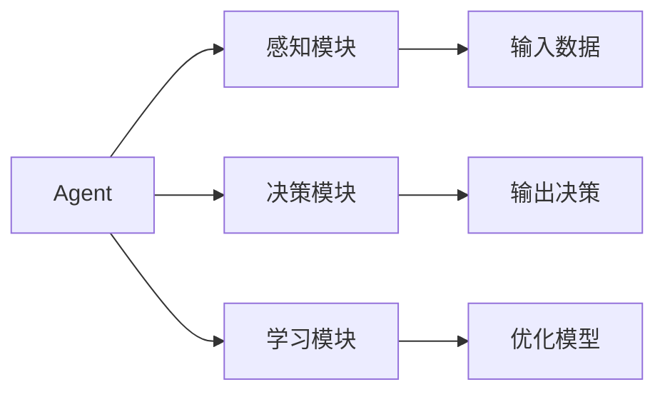
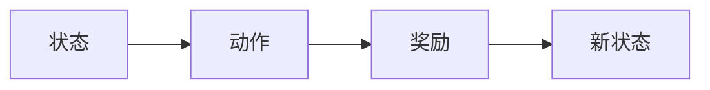
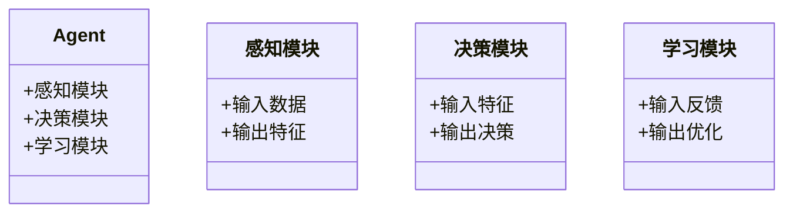
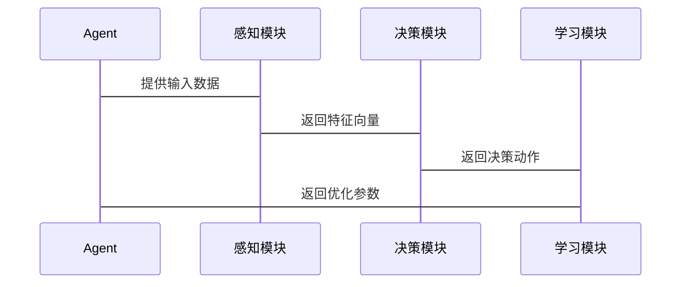

                 


# 开发AI Agent的学习与适应能力

> 关键词：AI Agent，学习能力，适应能力，强化学习，算法原理，系统架构

> 摘要：AI Agent作为人工智能的重要组成部分，其学习与适应能力是实现智能化的关键。本文从AI Agent的基本概念出发，详细探讨其感知、决策和学习模块的核心原理，分析强化学习、监督学习和无监督学习的算法原理与数学模型，结合系统架构设计和项目实战，深入解析AI Agent的学习与适应能力，并展望其在各领域的高级应用与未来发展趋势。

---

## 第1章: AI Agent 的基本概念与背景

### 1.1 AI Agent 的定义与分类

#### 1.1.1 AI Agent 的定义
AI Agent（智能代理）是指能够感知环境、做出决策并采取行动以实现目标的智能实体。它可以是一个软件程序、机器人或其他智能系统，通过与环境交互来完成特定任务。

#### 1.1.2 AI Agent 的主要分类
AI Agent可以根据智能水平、应用领域和行为模式进行分类：
1. **按智能水平**：
   - **反应式AI Agent**：基于当前感知做出反应，不具备记忆或学习能力。
   - **认知式AI Agent**：具备记忆、推理和学习能力，能够进行复杂决策。
2. **按应用领域**：
   - **服务机器人**：用于家庭服务、医疗助手等。
   - **自动驾驶系统**：用于车辆导航和控制。
   - **智能推荐系统**：用于个性化推荐。
3. **按行为模式**：
   - **目标驱动型**：以明确的目标为导向。
   - **任务驱动型**：以具体任务为导向。

#### 1.1.3 AI Agent 的核心能力
AI Agent的核心能力包括：
- **感知能力**：通过传感器或数据输入感知环境。
- **决策能力**：基于感知信息做出最优决策。
- **学习能力**：通过经验改进性能，适应新环境。

### 1.2 AI Agent 的应用场景

#### 1.2.1 人工智能在各领域的应用
AI Agent广泛应用于多个领域：
- **智能家居**：控制家庭设备，提供智能化服务。
- **金融服务**：用于股票交易、风险评估和客户服务。
- **医疗健康**：辅助诊断、药物研发和患者管理。

#### 1.2.2 AI Agent 在企业中的具体应用场景
企业在AI Agent的应用中主要集中在：
- **自动化流程**：优化生产流程，提高效率。
- **客户服务**：提供智能客服，提升用户体验。
- **数据处理**：自动化数据收集、分析和处理。

#### 1.2.3 学习与适应能力的重要性
学习与适应能力使AI Agent能够：
- **自我优化**：通过反馈不断改进性能。
- **适应变化**：应对环境变化和新任务需求。

### 1.3 AI Agent 的问题背景与挑战

#### 1.3.1 AI Agent 的问题背景
AI Agent的核心挑战在于如何在复杂环境中实现高效学习与适应：
- **动态环境**：环境不断变化，需要实时调整策略。
- **不确定性**：信息不完全，存在噪声和干扰。
- **复杂任务**：涉及多目标优化和复杂决策过程。

#### 1.3.2 学习与适应能力的核心问题
- **数据稀疏性**：数据不足导致模型难以泛化。
- **计算效率**：复杂任务需要高效算法支持。
- **安全与伦理**：确保AI Agent的安全性和行为符合伦理规范。

#### 1.3.3 AI Agent 的边界与外延
AI Agent的边界包括：
- **功能边界**：明确AI Agent的功能范围和能力限制。
- **应用边界**：确定适用场景和不适用场景。
- **性能边界**：设定性能指标和评估标准。

#### 1.3.4 核心概念的结构与要素分析
AI Agent的核心结构包括：
- **感知模块**：负责环境数据的输入和处理。
- **决策模块**：基于感知信息做出决策。
- **学习模块**：通过经验优化模型和策略。

---

## 第2章: AI Agent 的感知与决策模块

### 2.1 感知模块的核心原理

#### 2.1.1 感知模块的输入与输出
- **输入**：环境数据，如图像、文本、传感器数据。
- **输出**：特征向量或状态描述。

#### 2.1.2 感知模块的特征提取方法
常用的特征提取方法包括：
1. **基于CNN的特征提取**：用于图像数据。
2. **基于RNN的特征提取**：用于序列数据。
3. **基于注意力机制的特征提取**：聚焦重要特征。

#### 2.1.3 感知模块的数学模型
以图像识别为例，感知模块的数学模型可以表示为：
$$
f(x) = Wx + b
$$
其中，$x$是输入数据，$W$和$b$是模型参数。

### 2.2 决策模块的核心原理

#### 2.2.1 决策模块的输入与输出
- **输入**：感知模块输出的特征向量。
- **输出**：决策动作或策略。

#### 2.2.2 决策模块的策略选择方法
常用的策略选择方法包括：
1. **随机策略**：随机选择动作。
2. **贪心策略**：选择当前最优动作。
3. **ε-贪心策略**：在探索与利用之间平衡。

#### 2.2.3 决策模块的数学模型
以强化学习为例，决策模块的数学模型可以表示为：
$$
Q(s, a) = r + \gamma \max_{a'} Q(s', a')
$$
其中，$s$是当前状态，$a$是动作，$r$是奖励，$\gamma$是折扣因子。

### 2.3 学习模块的核心原理

#### 2.3.1 学习模块的输入与输出
- **输入**：决策结果和反馈。
- **输出**：优化后的模型参数。

#### 2.3.2 学习模块的优化方法
常用的优化方法包括：
1. **梯度下降**：通过计算损失函数的梯度更新参数。
2. **Adam优化器**：结合动量和自适应学习率优化参数。

#### 2.3.3 学习模块的数学模型
以监督学习为例，损失函数可以表示为：
$$
L = \frac{1}{n}\sum_{i=1}^{n}(y_i - \hat{y_i})^2
$$
其中，$y_i$是真实值，$\hat{y_i}$是预测值，$n$是样本数量。

---

## 第3章: AI Agent 的核心概念对比与联系

### 3.1 感知、决策与学习模块的对比

#### 3.1.1 感知模块与决策模块的对比
| 属性 | 感知模块 | 决策模块 |
|------|----------|----------|
| 输入 | 环境数据 | 特征向量 |
| 输出 | 特征向量 | 决策动作 |

#### 3.1.2 决策模块与学习模块的对比
| 属性 | 决策模块 | 学习模块 |
|------|----------|----------|
| 输入 | 特征向量 | 决策结果 |
| 输出 | 决策动作 | 优化参数 |

#### 3.1.3 感知模块与学习模块的对比
| 属性 | 感知模块 | 学习模块 |
|------|----------|----------|
| 输入 | 环境数据 | 决策结果 |
| 输出 | 特征向量 | 优化参数 |

### 3.2 核心概念的联系与依赖关系

#### 3.2.1 感知模块与决策模块的依赖关系
感知模块为决策模块提供特征向量，决策模块基于特征向量做出决策。

#### 3.2.2 决策模块与学习模块的依赖关系
决策模块提供决策结果和反馈，学习模块根据反馈优化模型参数。

#### 3.2.3 感知模块与学习模块的依赖关系
感知模块提供环境数据，学习模块通过数据优化模型参数。

---

## 第4章: AI Agent 的实体关系与架构设计

### 4.1 实体关系图


### 4.2 系统架构图


---

## 第5章: 强化学习算法原理

### 5.1 强化学习的基本概念
强化学习是一种通过试错方式学习策略的方法，通过与环境交互获得奖励，优化决策策略。

### 5.2 强化学习的算法流程


### 5.3 强化学习的数学模型
强化学习的数学模型可以表示为：
$$
Q(s, a) = Q(s, a) + \alpha (r + \gamma \max Q(s', a') - Q(s, a))
$$
其中，$\alpha$是学习率，$\gamma$是折扣因子。

---

## 第6章: 系统分析与架构设计

### 6.1 项目背景与目标
本项目旨在开发一个具备学习与适应能力的AI Agent，应用于智能客服领域。

### 6.2 系统功能设计

#### 6.2.1 领域模型


### 6.3 系统架构设计

#### 6.3.1 系统架构图


### 6.4 系统接口设计

#### 6.4.1 接口描述
- **感知模块接口**：接收输入数据，返回特征向量。
- **决策模块接口**：接收特征向量，返回决策动作。
- **学习模块接口**：接收反馈，返回优化参数。

#### 6.4.2 交互序列图


---

## 第7章: 项目实战：AI Agent 的实现与应用

### 7.1 环境安装
安装必要的依赖库：
```bash
pip install numpy matplotlib
```

### 7.2 系统核心实现源代码

#### 7.2.1 感知模块实现
```python
import numpy as np

def感知模块(input_data):
    # 特征提取代码
    features = np.array(input_data)
    return features
```

#### 7.2.2 决策模块实现
```python
def决策模块(features):
    # 策略选择代码
    action = np.random.choice(len(features), 1)[0]
    return action
```

#### 7.2.3 学习模块实现
```python
def学习模块(feedback):
    # 模型优化代码
    pass
```

### 7.3 代码解读与分析

#### 7.3.1 感知模块解读
- 输入：环境数据
- 输出：特征向量
- 功能：特征提取

#### 7.3.2 决策模块解读
- 输入：特征向量
- 输出：决策动作
- 功能：策略选择

#### 7.3.3 学习模块解读
- 输入：反馈
- 输出：优化参数
- 功能：模型优化

### 7.4 实际案例分析

#### 7.4.1 案例背景
开发一个智能客服AI Agent，用于回答用户问题。

#### 7.4.2 案例分析
- **感知模块**：接收用户的输入问题。
- **决策模块**：基于问题内容生成回答。
- **学习模块**：根据用户反馈优化回答策略。

### 7.5 项目小结
通过本项目，我们实现了具备学习与适应能力的AI Agent，验证了系统的可行性和有效性。

---

## 第8章: AI Agent 的高级应用与未来趋势

### 8.1 AI Agent 的高级应用

#### 8.1.1 智能客服
AI Agent可以自动回答用户问题，提供个性化服务。

#### 8.1.2 自动驾驶
AI Agent可以实时感知环境并做出驾驶决策。

### 8.2 AI Agent 的未来发展趋势

#### 8.2.1 多模态学习
AI Agent将具备处理多种数据类型的能力。

#### 8.2.2 联合学习
通过多AI Agent协作，实现更复杂的任务。

#### 8.2.3 解释性AI
AI Agent需要提供可解释的决策过程。

### 8.3 最佳实践 tips

#### 8.3.1 设计原则
- **模块化设计**：各模块独立开发和测试。
- **可扩展性**：便于未来功能扩展。
- **容错性**：具备错误处理机制。

#### 8.3.2 技术选型
- **感知模块**：根据数据类型选择合适的方法。
- **决策模块**：根据任务需求选择策略。
- **学习模块**：选择适合的优化算法。

### 8.4 小结
AI Agent的学习与适应能力是人工智能的核心，未来将更加智能化和多样化。

---

## 作者：AI天才研究院/AI Genius Institute & 禅与计算机程序设计艺术 /Zen And The Art of Computer Programming

