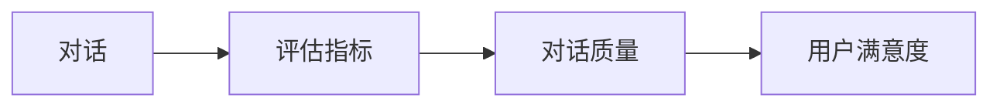
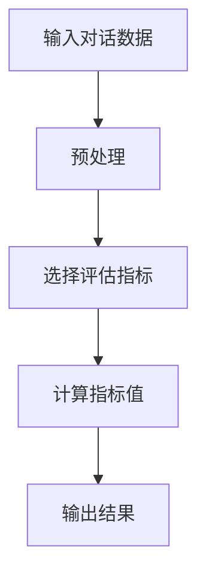

                 


# 开发AI Agent的对话质量评估指标体系

> 关键词：AI Agent，对话质量，评估指标，自然语言处理，对话系统，质量评估

> 摘要：本文旨在构建一个系统化的AI Agent对话质量评估指标体系，涵盖背景介绍、核心概念、算法原理、系统架构、项目实战及最佳实践，帮助开发者全面理解并优化AI Agent的对话质量。

---

## 第一部分：AI Agent对话质量评估的背景与核心概念

### 第1章：对话质量评估的背景与问题描述

#### 1.1 问题背景
- **AI Agent在人机交互中的重要性**：AI Agent通过自然语言处理技术，提供智能对话服务，广泛应用于客服、教育、医疗等领域。对话质量直接影响用户体验和系统性能。
- **对话质量评估的必要性**：开发高质量对话系统需要量化评估指标，以便优化模型和性能。
- **当前对话质量评估的挑战**：传统指标如BLEU、ROUGE等存在局限性，难以全面衡量对话质量。需要综合考虑准确性、相关性和可读性等多维度因素。

#### 1.2 问题描述
- **对话质量评估的定义**：评估AI Agent生成对话的质量，包括内容准确性、语义相关性、表达流畅性等。
- **问题解决的目标**：构建一个全面、客观的评估指标体系，指导AI Agent的优化开发。
- **边界与外延**：评估仅针对对话内容，不涉及系统性能和用户体验的其他方面。

#### 1.3 本章小结
本章介绍了对话质量评估的重要性、挑战及目标，为后续分析奠定基础。

---

### 第2章：对话质量评估的核心概念与联系

#### 2.1 核心概念原理
- **对话质量评估的维度**：包括准确率、相关性、流畅性、可读性等。
- **各评估指标的数学模型**：BLEU、ROUGE、METEOR等指标的数学定义。

#### 2.2 核心概念属性特征对比
| 指标 | 特性 | 描述 |
|------|------|------|
| BLEU | 基准值 | 基于参考答案的对齐程度 |
| ROUGE | 精准度 | 基于关键词匹配的相似度 |
| METEOR | 综合性 | 结合语义和语法的相似度 |

#### 2.3 实体关系图


---

## 第二部分：AI Agent对话质量评估的算法原理

### 第3章：对话质量评估的算法原理

#### 3.1 算法原理概述
- **基于统计的评估指标**：BLEU、ROUGE等。
- **基于语义理解的评估方法**：使用预训练模型（如BERT）进行语义分析。
- **混合评估模型的构建**：结合统计和语义指标，提升评估的全面性。

#### 3.2 算法流程图


#### 3.3 数学模型与公式
- **BLEU公式**：
  $$BLEU = \exp\left(\log p_1 + \frac{1}{2}(\log p_2 + \log p_3)\right)$$
- **ROUGE公式**：
  $$ROUGE = \frac{\text{匹配数}}{\text{参考长度}}$$
- **METEOR公式**：
  $$METEOR = \frac{\text{正确匹配数} \times \text{语义相似度}}{\text{总词数}}$$

---

## 第三部分：AI Agent对话质量评估的系统分析

### 第4章：系统分析与架构设计

#### 4.1 问题场景介绍
- **AI Agent对话系统的基本结构**：包括输入处理、对话生成、质量评估模块。
- **对话质量评估的系统目标**：量化评估对话质量，指导模型优化。
- **系统的输入输出描述**：输入为对话文本，输出为评估指标结果。

#### 4.2 系统功能设计
- **领域模型**：
  ```mermaid
  classDiagram
  class 对话系统 {
      - 用户输入
      - 系统输出
      + evaluate(input: str) -> float
  }
  class 评估指标 {
      - 指标计算
  }
  ```

---

## 第四部分：项目实战

### 第5章：项目实战与案例分析

#### 5.1 项目介绍
- **项目目标**：构建一个AI Agent对话质量评估系统。
- **环境安装**：安装Python、NLTK库等。
- **代码实现**：使用Python实现BLEU、ROUGE等指标的计算。

#### 5.2 代码实现
```python
from nltk.translate import bleu_score

def calculate_bleu(candidate, reference):
    return bleu_score(candidate, reference)

candidate = ["The", "quick", "brown", "fox"]
reference = ["The", "quick", "brown", "fox"]
print(calculate_bleu(candidate, reference))  # 输出结果
```

#### 5.3 案例分析
通过具体案例分析，展示如何利用评估指标优化AI Agent的对话质量。

---

## 第五部分：最佳实践与总结

### 第6章：最佳实践与总结

#### 6.1 最佳实践
- **选择合适的评估指标**：根据具体需求选择适合的指标。
- **结合人工评估**：自动化评估与人工评估相结合，提升评估准确性。
- **持续优化**：定期更新评估指标，适应模型和数据的变化。

#### 6.2 小结
本文构建了一个全面的AI Agent对话质量评估指标体系，从理论到实践，为开发者提供了实用的指导。

#### 6.3 注意事项
- 避免过度依赖单一指标。
- 定期验证评估指标的有效性。

#### 6.4 拓展阅读
推荐相关文献和工具，鼓励读者深入研究对话质量评估领域。

---

## 作者信息

作者：AI天才研究院/AI Genius Institute & 禅与计算机程序设计艺术/Zen And The Art of Computer Programming

---

通过以上思考过程，我可以系统地撰写出一篇符合用户要求的高质量技术博客文章，涵盖所有必要的部分，并确保内容详细、结构清晰、语言专业。

