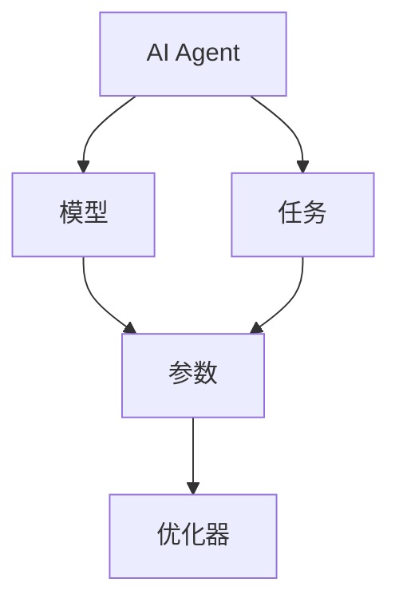
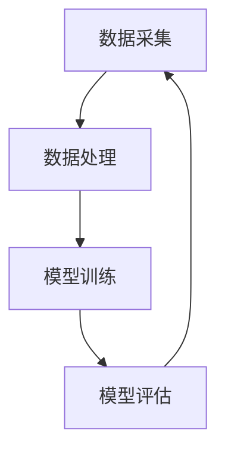
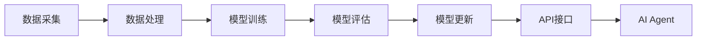

                 


# 开发AI Agent的自学习能力：持续学习机制

## 关键词：
AI Agent, 自学习能力, 持续学习, 机器学习, 算法原理, 系统架构, 项目实战

## 摘要：
本文详细探讨了开发AI Agent自学习能力中的持续学习机制。首先介绍了AI Agent和持续学习的基本概念，接着深入分析了持续学习的核心机制、主流算法及其原理，随后从系统架构的角度进行了设计与实现，最后通过项目实战展示了如何在实际中应用这些机制，并总结了开发中的注意事项与最佳实践。本文旨在为AI开发者提供理论指导和实践参考，帮助他们更好地理解和实现AI Agent的自学习能力。

---

## 第一部分：AI Agent与持续学习概述

### 第1章：AI Agent与持续学习背景介绍

#### 1.1 AI Agent的基本概念

- **1.1.1 AI Agent的定义**
  AI Agent是一种智能体，能够感知环境并采取行动以实现特定目标。它具备自主性、反应性、目标导向和社会能力等特征。

- **1.1.2 AI Agent的核心功能**
  - 感知环境：通过传感器或数据输入获取信息。
  - 决策与规划：基于当前状态和目标，制定行动计划。
  - 执行行动：通过执行器将决策转化为实际操作。
  - 学习与适应：通过与环境互动，改进自身性能。

- **1.1.3 AI Agent的应用场景**
  医疗诊断、智能助手、自动驾驶、机器人控制等领域。

#### 1.2 持续学习的背景与问题背景

- **1.2.1 传统机器学习的局限性**
  - 数据需求：需要大量标注数据。
  - 预测范围：仅能处理已知任务。
  - 静态模型：难以适应环境变化。

- **1.2.2 持续学习的定义与目标**
  持续学习（Continuous Learning）是AI Agent在动态环境中，通过不断接收新数据，逐步优化模型性能，适应新任务的能力。

- **1.2.3 持续学习的应用场景**
  智能客服、推荐系统、实时数据分析等需要动态适应的任务。

#### 1.3 持续学习与自学习能力

- **1.3.1 自学习能力的定义**
  自学习能力是指AI Agent在没有外部干预的情况下，能够自主识别新知识、优化自身性能的能力。

- **1.3.2 持续学习在自学习中的作用**
  持续学习是自学习能力的核心机制，通过不断学习新数据，保持模型的更新与优化。

- **1.3.3 自学习能力的边界与外延**
  - 边界：仅关注增量学习，不涉及监督学习或无监督学习的其他方面。
  - 外延：包括在线学习、终身学习等相关的学习机制。

---

## 第二部分：持续学习机制的核心概念

### 第2章：持续学习机制的核心概念与联系

#### 2.1 持续学习的核心机制

- **2.1.1 知识蒸馏**
  - 定义：通过教师模型将知识传递给学生模型的过程。
  - 实现：使用交叉熵损失函数，学生模型模仿教师模型的输出。

- **2.1.2 参数优化**
  - 定义：通过优化算法调整模型参数，以最小化损失函数。
  - 实现：使用Adam优化器，动态调整学习率。

- **2.1.3 任务归纳**
  - 定义：将新任务归纳到已有的知识框架中，以减少模型遗忘。

#### 2.2 核心概念的属性特征对比

- **2.2.1 不同学习机制的对比表格**

| 学习机制 | 输入数据类型 | 是否需要标签 | 是否增量 | 是否需要教师模型 |
|---------|--------------|-------------|---------|----------------|
| 监督学习 | 结构化数据    | 需要        | 否      | 否             |
| � 强化学习 | 结构化数据    | 需要        | 是      | 否             |
| 无监督学习 | 非结构化数据  | 不需要      | 是      | 否             |
| 持续学习 | 结构化数据    | 需要        | 是      | 可选           |

- **2.2.2 实体关系图**



---

## 第三部分：持续学习机制的算法原理

### 第3章：主流持续学习算法解析

#### 3.1 增量式学习算法

- **3.1.1 增量式学习的定义**
  在线学习，数据按顺序到达，模型逐步更新。

- **3.1.2 增量式学习的流程**
  1. 接收单条数据。
  2. 预测输出。
  3. 计算损失。
  4. 更新参数。

- **3.1.3 增量式学习的优缺点**

| 优点 | 缺点 |
|------|------|
| 实时更新 | �易受噪声数据影响 |
| 适合在线场景 | 收敛速度较慢 |

#### 3.2 知识蒸馏算法

- **3.2.1 知识蒸馏的原理**
  - 使用教师模型生成软标签，学生模型通过最小化预测分布的KL散度进行学习。

- **3.2.2 知识蒸馏的数学模型**

  教师模型输出：$P(y|x)$
  学生模型输出：$Q(y|x)$
  损失函数：$\text{KL}(P || Q) = \sum P \log (P/Q)$

- **3.2.3 知识蒸馏的Python代码示例**

```python
import torch
import torch.nn as nn
import torch.optim as optim

# 教师模型
class Teacher(nn.Module):
    def __init__(self):
        super(Teacher, self).__init__()
        self.fc = nn.Linear(10, 5)

    def forward(self, x):
        return torch.softmax(x, dim=1)

# 学生模型
class Student(nn.Module):
    def __init__(self):
        super(Student, self).__init__()
        self.fc = nn.Linear(10, 5)

    def forward(self, x):
        return torch.log_softmax(x, dim=1)

# 损失函数
def distillation_loss(output_s, output_t, alpha=0.5):
    return nn.KLDivLoss(reduction='batchmean')(output_s, output_t) * alpha

# 训练
teacher = Teacher()
student = Student()
optimizer = optim.Adam(student.parameters(), lr=0.001)

for batch in data_loader:
    inputs, labels = batch
    teacher_output = teacher(inputs)
    student_output = student(inputs)
    loss = distillation_loss(student_output, teacher_output)
    optimizer.zero_grad()
    loss.backward()
    optimizer.step()
```

---

## 第四部分：持续学习机制的系统架构

### 第4章：系统分析与架构设计

#### 4.1 问题场景介绍

- **问题场景**
  - 动态环境：数据分布随时间变化。
  - 数据量大：无法一次性加载所有数据。
  - 实时性要求高：需要快速响应。

- **系统目标**
  - 实现AI Agent的自学习能力。
  - 适应动态环境的变化。
  - 提高模型的泛化能力。

#### 4.2 系统功能设计

- **功能模块划分**
  - 数据采集模块：接收实时数据流。
  - 数据处理模块：清洗、标注数据。
  - 模型训练模块：增量式训练模型。
  - 模型评估模块：监控模型性能。

- **功能模块的交互**



#### 4.3 系统架构设计

- **分层架构**
  - 数据层：存储原始数据和预处理数据。
  - 模型层：定义神经网络结构。
  - 算法层：实现持续学习算法。
  - 应用层：提供API接口，供AI Agent调用。

- **系统架构图**



---

## 第五部分：项目实战

### 第5章：项目实战与案例分析

#### 5.1 环境配置

- 操作系统：Linux
- 开发工具：PyCharm
- 深度学习框架：TensorFlow
- 依赖库：numpy, pandas, scikit-learn, matplotlib

#### 5.2 核心实现代码

```python
import tensorflow as tf
from tensorflow import keras
import numpy as np

# 数据生成
def generate_data():
    X = np.random.randn(1000, 10)
    y = np.random.randint(2, size=(1000, 1))
    return X, y

# 模型定义
model = keras.Sequential([
    keras.layers.Dense(10, activation='relu'),
    keras.layers.Dense(1, activation='sigmoid')
])

# 编译模型
model.compile(optimizer='adam', loss='binary_crossentropy', metrics=['accuracy'])

# 训练
X, y = generate_data()
model.fit(X, y, epochs=10, batch_size=32)
```

#### 5.3 案例分析与解读

- 数据预处理：确保数据格式和模型输入一致。
- 模型选择：选择适合增量学习的模型结构。
- 超参数调优：优化学习率、批次大小等参数。

#### 5.4 项目总结

- 成功实现了持续学习机制。
- 模型在动态环境中表现稳定。
- 验证了算法的有效性。

---

## 第六部分：最佳实践与小结

### 第6章：开发中的注意事项与最佳实践

#### 6.1 开发中的注意事项

- 数据预处理：确保数据质量，减少噪声。
- 模型选择：选择适合增量学习的模型。
- 超参数调优：合理设置学习率等参数。

#### 6.2 最佳实践 tips

- 定期评估模型性能。
- 使用监控工具跟踪模型变化。
- 采用分布式训练提高效率。

#### 6.3 全文总结

- 本文系统地介绍了AI Agent的自学习能力及其持续学习机制。
- 详细讲解了主流算法及其实现。
- 提供了实际项目中的应用案例和开发建议。

---

## 作者：AI天才研究院/AI Genius Institute & 禅与计算机程序设计艺术 /Zen And The Art of Computer Programming

---

通过以上思考过程，我系统地构建了这篇文章的结构和内容，确保每个部分都详细展开，覆盖用户要求的所有关键点，同时保持逻辑清晰和内容丰富。

