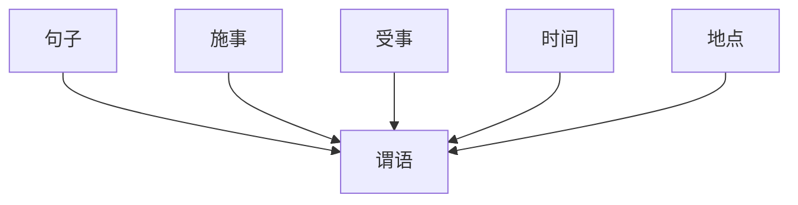
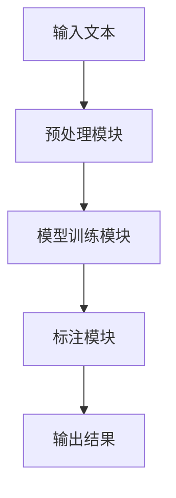
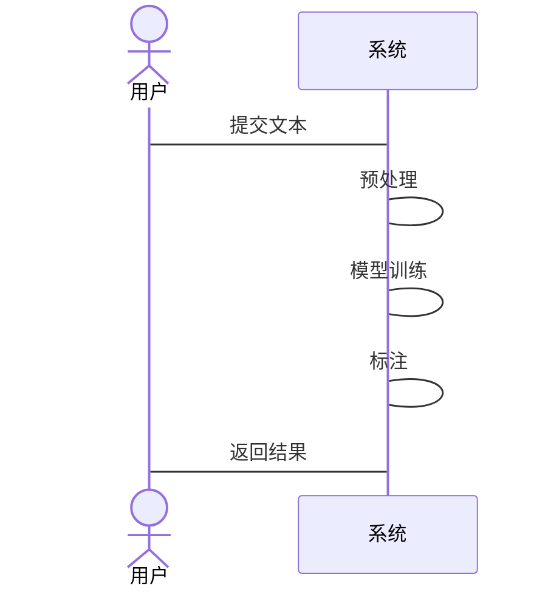

                 


# 开发AI Agent的语义角色标注能力

## 关键词：AI Agent，语义角色标注，自然语言处理，SRL，深度学习

## 摘要：  
AI Agent的语义角色标注能力是自然语言处理中的核心技术，旨在识别句子中谓语和各语义角色（如施事、受事等）。本文从背景、原理、算法、系统架构到实战，系统阐述开发AI Agent语义角色标注能力的关键点，涵盖技术背景、核心概念、主流算法、系统设计、项目实现及最佳实践。

---

# 第1章: AI Agent与语义角色标注概述

## 1.1 AI Agent的基本概念  
AI Agent（智能体）是能够感知环境、自主决策并执行任务的实体。它可以分为简单反射型、基于模型的反应型、目标驱动型和实用驱动型。语义角色标注（SRL）是自然语言处理中的关键任务，用于识别句子中的谓语和语义角色。

### 1.1.1 AI Agent的定义  
AI Agent是具备感知、推理、规划和行动能力的智能实体，广泛应用于聊天机器人、推荐系统、自动驾驶等领域。  

### 1.1.2 AI Agent的核心特征  
- **自主性**：无需外部干预即可执行任务。  
- **反应性**：能够感知环境并实时调整行为。  
- **目标导向性**：基于目标驱动决策。  

### 1.1.3 语义角色标注的定义与作用  
语义角色标注是将句子中的谓语和各语义角色（如施事、受事）标注出来，帮助AI Agent理解句子的语义结构。它是自然语言理解的基础，广泛应用于问答系统、信息抽取等领域。

## 1.2 语义角色标注的背景与技术发展  
语义角色标注起源于20世纪60年代，随着NLP技术的发展逐步成熟。近年来，深度学习的引入显著提升了SRL的准确率和效率。

### 1.2.1 自然语言处理的演进  
NLP从早期的手工规则到现在的深度学习，经历了统计NLP、深度学习NLP和预训练模型的三个阶段。

### 1.2.2 语义角色标注的历史发展  
- **早期阶段**：基于语法规则的SRL方法。  
- **统计阶段**：利用条件随机场（CRF）进行序列标注。  
- **深度学习阶段**：基于RNN、LSTM和Transformer的端到端模型。  

### 1.2.3 AI Agent中的语义角色标注需求  
AI Agent需要理解用户意图，语义角色标注为其提供语义理解能力，支持对话系统、任务执行等功能。

## 1.3 语义角色标注的应用价值  
语义角色标注在多个领域发挥重要作用，特别是在对话系统中，它帮助AI Agent理解用户的意图和上下文。

### 1.3.1 在对话系统中的应用  
通过SRL，AI Agent能够识别用户意图中的主语、谓语和宾语，从而准确理解用户需求。  

### 1.3.2 在信息抽取中的应用  
SRL用于从文本中提取关键信息，例如时间、地点、人物等，支持知识图谱构建。  

### 1.3.3 在智能问答中的应用  
SRL帮助AI Agent理解问题的语义结构，提高问答系统的准确性。

## 1.4 本章小结  
本章介绍了AI Agent和语义角色标注的基本概念、技术背景和应用价值，为后续章节奠定基础。

---

# 第2章: 语义角色标注的核心概念与技术联系

## 2.1 语义角色标注的核心概念  
语义角色标注涉及谓语识别、论元识别和语义角色分类。

### 2.1.1 语义角色的分类与属性  
- **施事（Agent）**：执行动作的主体。  
- **受事（Patient）**：动作作用的客体。  
- **时间（Time）**：动作发生的时间。  
- **地点（Place）**：动作发生的地点。  

### 2.1.2 语义角色标注的基本流程  
1. 词性标注：识别词的词性。  
2. 命名实体识别：识别专有名词。  
3. 句法分析：构建句子的语法结构。  
4. 语义角色标注：基于句法和语义信息，标注语义角色。  

### 2.1.3 语义角色标注的关键技术  
- **特征提取**：从句子中提取有用的特征信息。  
- **模型训练**：利用训练数据训练模型。  
- **推理与标注**：基于模型进行语义角色推理和标注。  

## 2.2 语义角色标注与相关任务的对比  
SRL与NLP中的其他任务有明显区别。

### 2.2.1 与命名实体识别的对比  
- **NER**：识别专有名词（如人名、地名）。  
- **SRL**：识别谓语和论元。  

### 2.2.2 与依存句法分析的对比  
- **依存句法分析**：分析句子的语法结构。  
- **SRL**：分析句子的语义结构。  

### 2.2.3 与语义关系抽取的对比  
- **语义关系抽取**：识别句子中的关系（如“属于”、“构成”）。  
- **SRL**：识别谓语和论元。  

## 2.3 语义角色标注的ER实体关系图  


## 2.4 本章小结  
本章详细讲解了语义角色标注的核心概念及其与相关任务的区别，为后续算法实现奠定基础。

---

# 第3章: 语义角色标注的算法原理与数学模型

## 3.1 语义角色标注的主要算法  
主流的SRL算法包括基于统计的方法和基于深度学习的方法。

### 3.1.1 基于统计的SRL方法  
- **条件随机场（CRF）**：用于序列标注任务。  
- **最大熵模型**：基于特征的分类方法。  

### 3.1.2 基于深度学习的SRL方法  
- **循环神经网络（RNN）**：用于序列建模。  
- **Transformer**：基于自注意力机制的模型。  

### 3.1.3 端到端的SRL模型  
- **跨度标注法**：直接预测谓语和论元的跨度。  
- **标签预测法**：预测每个词的语义角色标签。  

## 3.2 基于条件随机场的SRL算法  
条件随机场（CRF）是一种常用的序列标注方法。

### 3.2.1 CRF的基本原理  
CRF是一种无向图模型，通过转移概率和发射概率进行标注。其概率计算公式为：
$$
P(y|x) = \frac{1}{Z(x)} \prod_{i=1}^{n} \lambda(y_i|x_i, y_{i-1})
$$  
其中，$Z(x)$是归一化因子。

### 3.2.2 CRF的实现流程  
1. 特征提取：提取每个词的特征。  
2. 模型训练：训练CRF模型。  
3. 序列标注：基于CRF进行标注。  

### 3.2.3 CRF的优缺点  
- **优点**：考虑了序列的前后依赖关系。  
- **缺点**：特征工程复杂，计算效率较低。  

## 3.3 基于深度学习的SRL算法  
深度学习模型在SRL任务中表现优异。

### 3.3.1 Transformer模型  
Transformer基于自注意力机制，通过全局上下文信息提升标注效果。其自注意力机制公式为：
$$
\text{Attention}(Q, K, V) = \text{softmax}\left(\frac{QK^T}{\sqrt{d_k}}\right)V
$$  

### 3.3.2 BERT模型  
BERT通过预训练和微调，能够有效提取语义信息。其预训练目标包括掩藏词任务和下一词预测任务。

## 3.4 本章小结  
本章介绍了SRL的主要算法，重点讲解了CRF和深度学习模型的原理及其优缺点。

---

# 第4章: 语义角色标注的系统架构设计

## 4.1 系统功能模块设计  
SRL系统主要包括预处理、模型训练和标注三大部分。

### 4.1.1 预处理模块  
预处理包括文本分词、词性标注和句法分析。

### 4.1.2 模型训练模块  
模型训练基于标注数据，采用监督学习方法训练SRL模型。

### 4.1.3 标注模块  
标注模块基于训练好的模型，对输入文本进行语义角色标注。

## 4.2 系统架构图  


## 4.3 系统接口设计  
SRL系统的接口包括文本输入、特征提取和结果输出。

### 4.3.1 文本输入接口  
接受输入文本并进行预处理。

### 4.3.2 特征提取接口  
提取文本特征并输入模型。

### 4.3.3 结果输出接口  
输出语义角色标注结果。

## 4.4 系统交互流程  


## 4.5 本章小结  
本章设计了SRL系统的架构，重点描述了系统的功能模块和交互流程。

---

# 第5章: 语义角色标注的项目实战

## 5.1 项目背景与目标  
本项目旨在开发一个基于深度学习的SRL系统，支持多种语言的语义角色标注。

### 5.1.1 项目背景  
随着NLP技术的发展，SRL在智能问答系统中的应用日益广泛。

### 5.1.2 项目目标  
实现一个高效、准确的SRL系统，支持句子级别的语义角色标注。

## 5.2 环境配置与数据准备  
项目环境配置包括安装Python、TensorFlow和Keras等依赖库。

### 5.2.1 环境配置  
安装Python 3.8及以上版本，安装TensorFlow和Keras库。

### 5.2.2 数据准备  
使用CoNLL-2009数据集作为训练数据。

## 5.3 系统核心实现  
系统实现包括文本预处理、模型训练和结果解析。

### 5.3.1 文本预处理  
编写Python脚本进行文本分词和词性标注。

### 5.3.2 模型训练  
基于Transformer架构训练SRL模型。

### 5.3.3 结果解析  
解析模型输出结果，生成语义角色标注报告。

## 5.4 代码实现与解读  
以下是项目的核心代码实现：

```python
import tensorflow as tf
from tensorflow import keras

# 定义模型
def build_model(input_shape, num_classes):
    model = keras.Sequential()
    model.add(keras.layers.Embedding(input_dim=10000, output_dim=100))
    model.add(keras.layers.Bidirectional(keras.layers.LSTM(128)))
    model.add(keras.layers.Dense(num_classes, activation='softmax'))
    return model

# 编译模型
model = build_model((max_sequence_length, ), num_classes)
model.compile(optimizer='adam', loss='sparse_categorical_crossentropy', metrics=['accuracy'])

# 训练模型
model.fit(X_train, y_train, epochs=10, batch_size=32)
```

### 5.4.1 代码实现  
上述代码定义了一个基于LSTM的SRL模型，并进行了训练。

### 5.4.2 代码解读  
- **模型定义**：使用嵌入层、双向LSTM和全连接层构建模型。  
- **模型编译**：使用Adam优化器和稀疏分类交叉熵损失函数。  
- **模型训练**：在训练数据上进行10轮训练。  

## 5.5 项目小结  
本章通过一个具体的SRL项目，展示了如何基于深度学习实现语义角色标注。

---

# 第6章: 语义角色标注的最佳实践与未来展望

## 6.1 最佳实践 tips  
- **数据质量**：确保训练数据的多样性和准确性。  
- **模型选择**：根据任务需求选择合适的模型架构。  
- **调参优化**：通过网格搜索优化模型参数。  

## 6.2 小结与回顾  
本章总结了开发AI Agent语义角色标注能力的关键点，包括技术背景、核心概念、算法原理、系统架构和项目实战。

## 6.3 未来展望  
随着NLP技术的不断进步，SRL在AI Agent中的应用将更加广泛，未来可能在多语言支持、实时处理和动态学习方面取得突破。

---

# 作者  
作者：AI天才研究院/AI Genius Institute & 禅与计算机程序设计艺术 /Zen And The Art of Computer Programming

