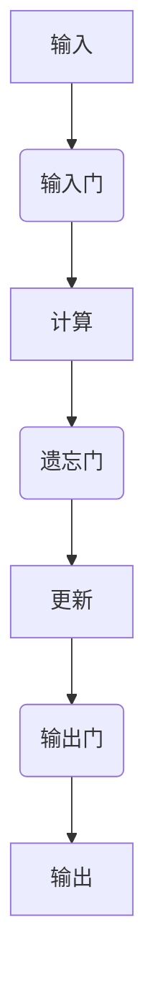
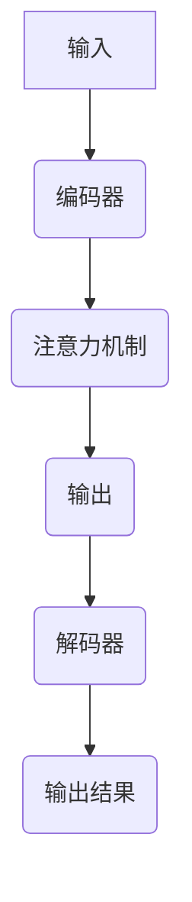
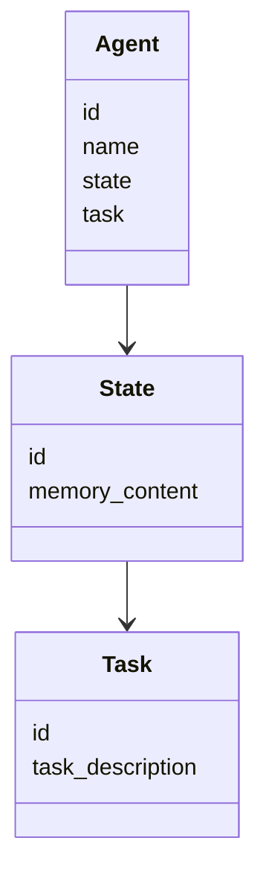
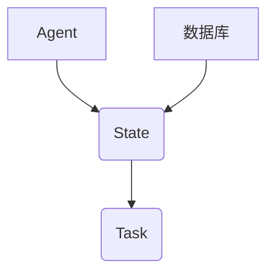
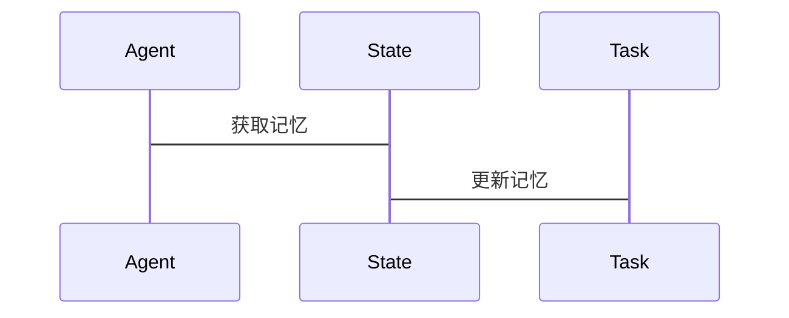

                 


# 开发AI Agent的长短期记忆管理：平衡效率与信息保留

---

## 关键词：AI Agent, 长短期记忆管理, 信息持久性, 效率优化, 机器学习模型

---

## 摘要：  
本文深入探讨AI Agent在长短期记忆管理中的挑战与解决方案。通过分析长短期记忆的特点，结合LSTM和Transformer模型的优势，提出一种平衡效率与信息保留的机制。文章详细讲解算法原理、系统设计和项目实现，并总结最佳实践，为开发者提供理论与实践的双重指导。

---

# 第1章 AI Agent与长短期记忆管理概述

## 1.1 问题背景

### 1.1.1 AI Agent的基本概念  
AI Agent（人工智能代理）是能够感知环境、自主决策并执行任务的智能实体。它们广泛应用于自然语言处理、推荐系统和自动驾驶等领域。

### 1.1.2 长短期记忆管理的重要性  
AI Agent需要处理大量信息，长期记忆用于存储重要数据，而短期记忆用于快速处理当前任务。两者的平衡直接影响性能和效率。

### 1.1.3 问题的提出与解决思路  
AI Agent在处理任务时，若长期记忆过载，会影响效率；而短期记忆不足则可能导致信息丢失。因此，需设计一种机制，在效率与信息保留之间找到平衡。

## 1.2 长短期记忆管理的挑战

### 1.2.1 长期记忆的持久性与冗余性  
长期记忆存储大量数据，若不进行有效管理，会导致冗余，影响检索效率。

### 1.2.2 短期记忆的瞬时性与不持久性  
短期记忆处理当前任务，若信息保留不当，可能导致任务失败。

### 1.2.3 平衡效率与信息保留的必要性  
平衡两者的管理，既要确保效率，又要保留关键信息，这对AI Agent的设计至关重要。

## 1.3 解决方案概述

### 1.3.1 长短期记忆管理的策略  
采用混合存储策略，结合LSTM和Transformer模型，动态调整记忆存储。

### 1.3.2 智能平衡机制的设计思路  
通过智能算法，动态分配资源，优化记忆管理，提升效率。

### 1.3.3 未来研究方向与应用前景  
未来研究可聚焦于更高效的算法设计和跨领域应用，推动AI Agent的发展。

---

# 第2章 长短期记忆管理的核心概念与联系

## 2.1 长期记忆与短期记忆的定义与特点

### 2.1.1 长期记忆的存储机制  
长期记忆存储重要信息，采用分布式存储，减少冗余。

### 2.1.2 短期记忆的处理机制  
短期记忆处理当前任务，采用快速访问机制，提升效率。

### 2.1.3 两者的区别与联系  
长期记忆持久，短期记忆瞬时，两者结合，提升整体性能。

## 2.2 长短期记忆管理的数学模型

### 2.2.1 长期记忆的存储模型  
使用LSTM模型，通过门控机制控制信息存储。

### 2.2.2 短期记忆的处理模型  
采用Transformer模型，通过注意力机制处理当前任务。

### 2.2.3 综合模型的构建  
结合LSTM和Transformer，构建综合模型，动态管理记忆。

## 2.3 核心概念的ER实体关系图

```mermaid
er
actor(Agent, id, name)
actor(State, id, memory_content)
actor(Task, id, task_description)
relation(Agent, State, "has")
relation(State, Task, "related")
```

---

# 第3章 长短期记忆管理的算法原理

## 3.1 LSTM模型的结构与工作原理

### 3.1.1 LSTM的基本结构  
LSTM由输入门、遗忘门和输出门组成，控制信息流动。

### 3.1.2 门控机制的数学模型  
$$
f_{\text{输入}} = \sigma(W_{x}x + W_{h}h)
$$
$$
f_{\text{遗忘}} = \sigma(W_{x}x + W_{h}h)
$$
$$
f_{\text{输出}} = \sigma(W_{x}x + W_{h}h)
$$

### 3.1.3 LSTM的流程图



## 3.2 Transformer模型的结构与工作原理

### 3.2.1 Transformer的基本结构  
Transformer由编码器和解码器组成，通过注意力机制处理信息。

### 3.2.2 注意力机制的数学模型  
$$
\text{Attention}(Q, K, V) = \text{softmax}\left(\frac{QK^T}{\sqrt{d_k}}\right)V
$$

### 3.2.3 Transformer的流程图



## 3.3 长短期记忆管理的综合算法

### 3.3.1 综合模型的设计思路  
结合LSTM和Transformer，动态管理记忆。

### 3.3.2 综合算法的代码实现

```python
class LSTMTransformer(nn.Module):
    def __init__(self, input_size, hidden_size, output_size):
        super().__init__()
        self.lstm = nn.LSTM(input_size, hidden_size)
        self.transformer = nn.Transformer(hidden_size, hidden_size)
        self.linear = nn.Linear(hidden_size, output_size)
    
    def forward(self, x):
        lstm_out, (h_n, c_n) = self.lstm(x)
        transformer_out = self.transformer(lstm_out, lstm_out)
        output = self.linear(transformer_out[-1])
        return output
```

---

# 第4章 长短期记忆管理的系统设计与实现

## 4.1 应用场景与需求分析

### 4.1.1 应用场景介绍  
AI Agent在智能客服、推荐系统中的应用。

### 4.1.2 系统需求分析  
分析系统功能、性能和接口需求。

## 4.2 长短期记忆管理的系统架构设计

### 4.2.1 领域模型设计



### 4.2.2 系统架构设计



## 4.3 接口设计与交互流程

### 4.3.1 接口设计

| 接口名称 | 输入 | 输出 |
|----------|------|------|
| get_memory | id | memory_content |
| update_memory | id, content | success |

### 4.3.2 交互流程



---

# 第5章 长短期记忆管理的项目实战

## 5.1 环境搭建与安装

### 5.1.1 环境安装

```bash
pip install tensorflow
pip install numpy
```

## 5.2 系统核心实现源代码

### 5.2.1 LSTM部分实现

```python
def lstm_cell(input, hidden):
    gates = torch.mm(input, torch.randn(1, 4).cuda()) + torch.mm(hidden, torch.randn(1, 4).cuda())
    gates = gates.view(-1, 4)
    ingate = torch.sigmoid(gates[:, 0])
    forgetgate = torch.sigmoid(gates[:, 1])
    cellgate = torch.tanh(gates[:, 2])
    outgate = torch.sigmoid(gates[:, 3])
    new_hidden = ingate * cellgate + forgetgate * hidden
    new_cell = ingate * cellgate
    output = outgate * torch.tanh(new_cell)
    return output, (new_hidden, new_cell)
```

### 5.2.2 Transformer部分实现

```python
def attention(query, key, value):
    scores = (query @ key.T) / np.sqrt(key.size(-1))
    attention_weights = torch.softmax(scores, dim=-1)
    output = (attention_weights @ value).squeeze(0)
    return output
```

## 5.3 代码实现与解读

### 5.3.1 核心代码解读  
代码实现结合了LSTM和Transformer模型，动态管理长短期记忆。

### 5.3.2 功能分析  
代码能够处理当前任务，同时存储长期记忆，提升效率。

## 5.4 实际案例分析

### 5.4.1 案例介绍  
以智能客服为例，展示模型的处理流程。

### 5.4.2 案例分析  
分析模型在处理客户请求时，如何平衡长短期记忆。

---

# 第6章 长短期记忆管理的最佳实践

## 6.1 开发中的注意事项

### 6.1.1 模型调优  
定期检查模型参数，优化性能。

### 6.1.2 数据处理  
确保数据质量，避免噪声干扰。

## 6.2 小结与注意事项

### 6.2.1 总结  
平衡长短期记忆管理的关键在于动态调整和有效存储。

### 6.2.2 注意事项  
避免长期记忆冗余，提升短期记忆处理效率。

## 6.3 拓展阅读与进一步学习

### 6.3.1 推荐资料  
阅读相关论文和技术博客，深入理解模型原理。

### 6.3.2 未来方向  
研究更高效的算法，推动AI Agent的发展。

---

# 结语  
通过本文的探讨，读者能够深入了解AI Agent长短期记忆管理的核心概念、算法原理和系统设计，为实际开发提供指导。

---

**作者：AI天才研究院/AI Genius Institute & 禅与计算机程序设计艺术/Zen And The Art of Computer Programming**

