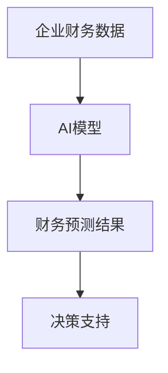
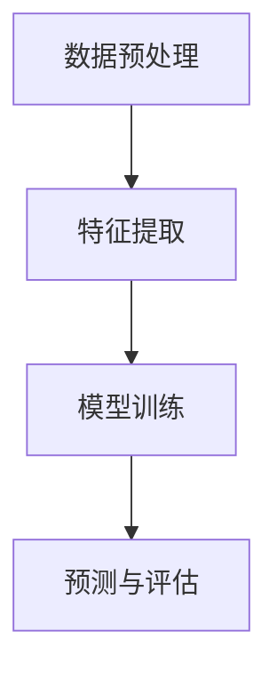
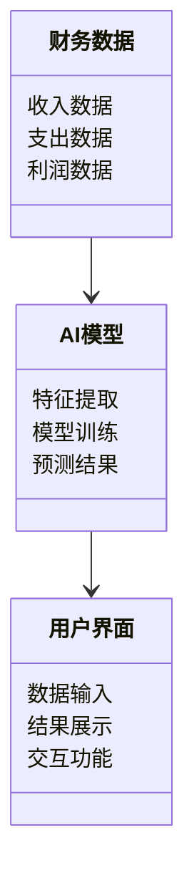
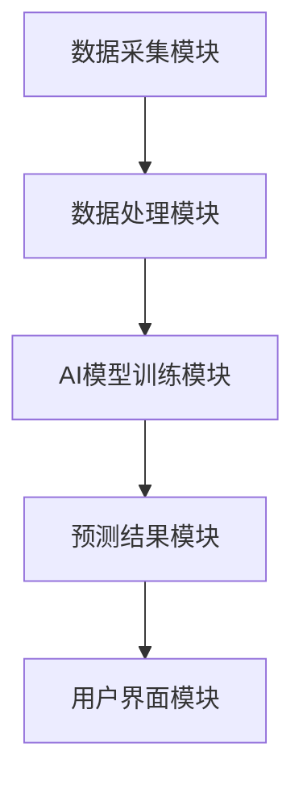

                 


# 开发AI辅助的企业财务战略规划工具

---

## 关键词：企业财务、AI技术、战略规划、工具开发、数据驱动

---

## 摘要

本文详细探讨了开发AI辅助的企业财务战略规划工具的各个方面，从背景分析到算法实现，再到系统设计和项目实战。文章首先介绍了企业财务战略规划的传统方法及其局限性，然后阐述了AI技术在财务领域的潜力和应用。接着，从算法原理、系统架构、项目实现等角度，深入分析了如何利用AI技术提升企业财务规划的效率和准确性。最后，通过实际案例展示了工具的开发过程和应用效果，为企业的智能化转型提供了参考。

---

# 第一部分: 背景与核心概念

## 第1章: 企业财务战略规划的背景与挑战

### 1.1 企业财务战略规划的背景

#### 1.1.1 财务战略规划的定义与作用

财务战略规划是指企业在一定时期内，根据内外部环境的变化，制定和调整财务目标、策略和行动计划的过程。其作用包括优化资金配置、降低风险、提高决策效率等。

#### 1.1.2 数字化转型对企业财务规划的影响

数字化转型使得企业能够利用大数据、云计算和AI技术，实现财务数据的实时处理和分析，从而提高规划的准确性和及时性。

#### 1.1.3 AI技术在财务领域的应用现状

AI技术已经在财务领域得到了广泛应用，包括自动记账、智能审计、财务预测等。然而，现有的工具大多集中在单点任务，缺乏战略层面的规划能力。

### 1.2 传统财务规划的局限性

#### 1.2.1 传统财务模型的不足

传统财务模型通常基于线性假设，难以应对复杂的市场变化和多变的业务需求。

#### 1.2.2 人工规划的效率问题

人工规划需要大量时间，且容易受到主观因素的影响，导致效率低下。

#### 1.2.3 数据分析的深度与广度限制

传统方法往往只能处理有限的数据维度，难以进行全面的分析。

### 1.3 AI辅助财务规划的必要性

#### 1.3.1 AI技术在财务领域的潜在价值

AI能够通过深度学习和自然语言处理，从大量非结构化数据中提取有用信息，为财务规划提供更全面的依据。

#### 1.3.2 数据驱动的财务决策优势

数据驱动的决策能够提高规划的科学性和精准性，从而降低企业的经营风险。

#### 1.3.3 企业对智能化财务工具的需求

随着市场竞争的加剧，企业需要更快、更准确的财务规划工具来支持其战略决策。

### 1.4 本章小结

本章分析了企业财务战略规划的背景、传统方法的局限性以及AI技术在其中的应用潜力。

---

## 第2章: AI辅助企业财务规划的核心概念

### 2.1 AI与财务规划的结合点

#### 2.1.1 数据分析与预测

AI可以通过机器学习算法对历史数据进行分析，预测未来的财务趋势。

#### 2.1.2 智能决策支持

AI能够根据实时数据和市场变化，为企业提供个性化的财务决策支持。

#### 2.1.3 自动化流程优化

AI可以自动化处理财务数据，减少人工干预，提高规划效率。

### 2.2 AI辅助财务规划的系统架构

#### 2.2.1 数据输入与处理模块

数据输入模块负责接收企业财务数据，处理模块对数据进行清洗和预处理。

#### 2.2.2 AI模型训练与预测模块

模型训练模块利用历史数据训练AI模型，预测模块基于当前数据生成财务规划建议。

#### 2.2.3 结果展示与交互模块

结果展示模块以可视化形式呈现预测结果，交互模块允许用户对规划方案进行调整和优化。

### 2.3 核心概念与实体关系图



### 2.4 本章小结

本章详细介绍了AI辅助财务规划的核心概念和系统架构，为后续的算法实现奠定了基础。

---

# 第二部分: 算法原理

## 第3章: AI辅助财务规划的算法原理

### 3.1 常见AI算法在财务规划中的应用

#### 3.1.1 线性回归模型

线性回归模型适用于简单的财务预测任务，例如销售预测。

#### 3.1.2 随机森林算法

随机森林算法适用于处理高维数据，能够捕捉复杂的数据关系。

#### 3.1.3 LSTM网络

LSTM网络适用于时间序列数据的预测，如汇率波动预测。

### 3.2 算法原理与流程图



### 3.3 线性回归模型实现

```python
import numpy as np
from sklearn.linear_model import LinearRegression

# 示例数据
X = np.array([[1], [2], [3], [4]])
y = np.array([2, 4, 5, 6])

# 模型训练
model = LinearRegression()
model.fit(X, y)

# 预测
print(model.predict([[5]]))  # 输出: [[6.5]]
```

### 3.4 算法优缺点对比

| 算法名称 | 优点 | 缺点 |
|----------|------|------|
| 线性回归 | 简单高效 | 无法处理非线性关系 |
| 随机森林 | 高准确性 | 计算复杂度高 |
| LSTM     | 处理时间序列数据能力强 | 需要大量训练数据 |

### 3.5 本章小结

本章详细讲解了常见AI算法在财务规划中的应用及其优缺点。

---

# 第三部分: 系统分析与架构设计

## 第4章: 系统分析与架构设计

### 4.1 项目背景与目标

#### 4.1.1 项目背景介绍

本项目旨在开发一款基于AI的企业财务战略规划工具，帮助企业提高财务规划的效率和准确性。

#### 4.1.2 项目目标与范围

项目目标包括开发一个支持多维度数据输入、智能预测和结果展示的系统。范围包括数据采集、模型训练和用户界面设计。

### 4.2 系统功能设计

#### 4.2.1 数据采集与处理

系统需要从企业的ERP系统中采集财务数据，并进行清洗和预处理。

#### 4.2.2 AI模型训练与预测

系统利用训练好的模型对当前数据进行预测，并生成财务规划建议。

#### 4.2.3 结果展示与交互

用户可以通过可视化界面查看预测结果，并对规划方案进行调整。

### 4.3 系统架构设计

#### 4.3.1 领域模型



#### 4.3.2 系统架构图



#### 4.3.3 系统接口设计

系统需要与企业的ERP系统对接，获取实时财务数据。

#### 4.3.4 系统交互设计

用户可以通过输入参数调整预测模型，并查看不同方案的对比结果。

### 4.4 本章小结

本章详细设计了系统的架构和功能模块，为后续的开发奠定了基础。

---

# 第四部分: 项目实战

## 第5章: 项目实战

### 5.1 环境安装与配置

#### 5.1.1 安装Python和相关库

安装Python 3.8以上版本，并安装numpy、pandas、scikit-learn等库。

```bash
pip install numpy pandas scikit-learn
```

### 5.2 核心代码实现

#### 5.2.1 数据预处理代码

```python
import pandas as pd
import numpy as np

# 读取数据
data = pd.read_csv('financial_data.csv')

# 数据清洗
data = data.dropna()
data = pd.get_dummies(data)
```

#### 5.2.2 模型训练代码

```python
from sklearn.model import LinearRegression
from sklearn.metrics import mean_squared_error

# 训练模型
model = LinearRegression()
model.fit(X_train, y_train)

# 评估模型
y_pred = model.predict(X_test)
print(mean_squared_error(y_test, y_pred))
```

### 5.3 案例分析与解读

以某企业为例，利用模型预测未来的销售收入，并制定相应的财务策略。

### 5.4 项目总结与优化建议

总结开发过程中的经验教训，并提出优化建议，如优化模型性能、提升用户体验等。

### 5.5 本章小结

本章通过实际案例展示了AI辅助财务规划工具的开发过程，为读者提供了实践参考。

---

# 第五部分: 最佳实践与总结

## 第6章: 最佳实践与总结

### 6.1 最佳实践

- 数据清洗和特征工程是关键，直接影响模型性能。
- 模型的选择要根据具体场景，不能盲目追求复杂性。
- 系统设计要注重用户体验，提供友好的交互界面。

### 6.2 项目小结

通过本项目，我们成功开发了一款基于AI的企业财务战略规划工具，帮助企业提升了财务规划的效率和准确性。

### 6.3 注意事项

- 数据安全是重中之重，需确保财务数据的保密性。
- 模型的可解释性也是关键，用户需要理解预测结果的依据。
- 系统的可扩展性设计，以应对未来业务的变化。

### 6.4 拓展阅读

- 《机器学习实战》
- 《深度学习》
- 《财务报表分析与决策》

### 6.5 本章小结

本章总结了项目的开发经验，并提出了未来的研究方向。

---

# 作者：AI天才研究院（AI Genius Institute） & 禅与计算机程序设计艺术（Zen And The Art of Computer Programming）

---

**全文完**

