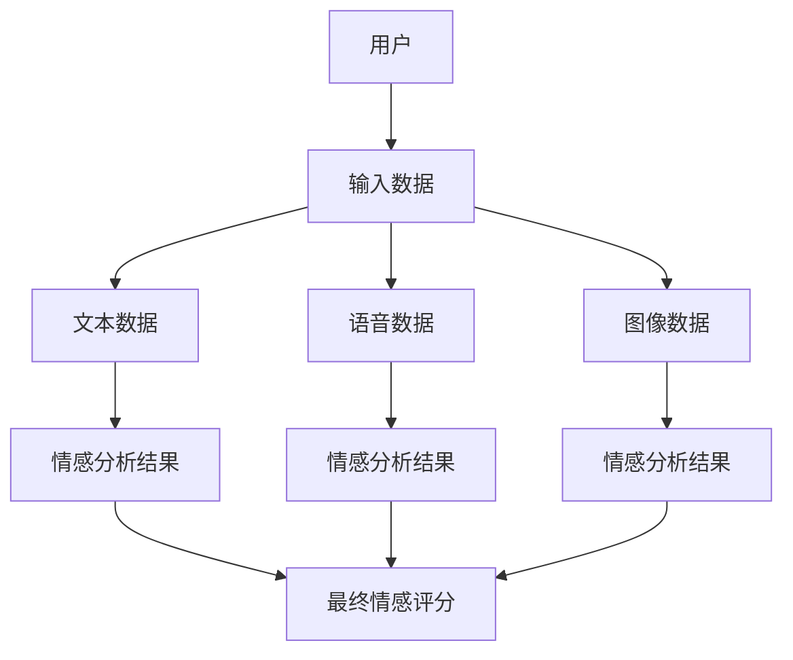
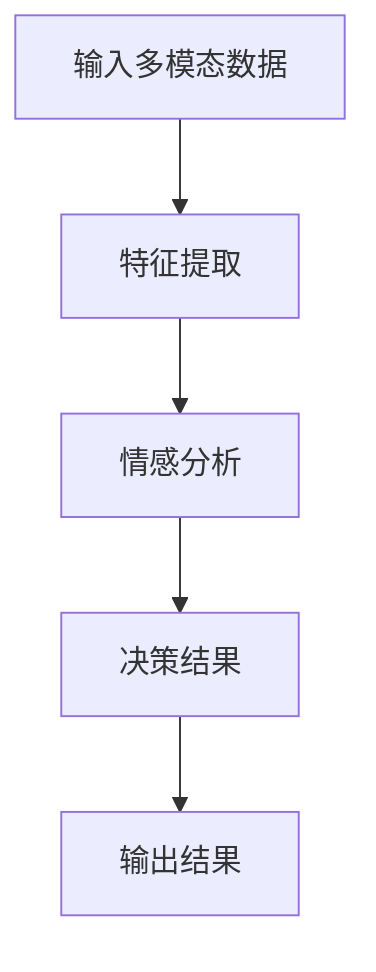
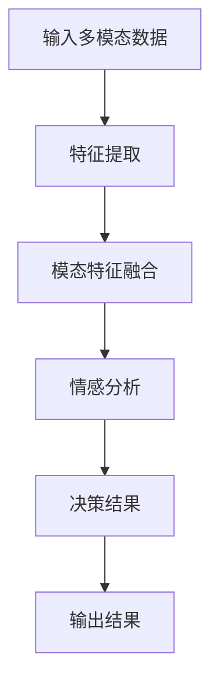
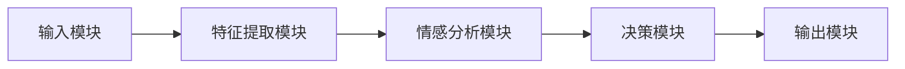
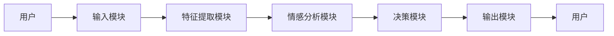

                 


# 开发具有多模态情感分析能力的AI Agent

> 关键词：多模态情感分析，AI Agent，深度学习，自然语言处理，语音识别，计算机视觉

> 摘要：本文将详细介绍如何开发一个具有多模态情感分析能力的AI Agent。首先，我们从背景知识和核心概念入手，逐步分析多模态情感分析的必要性和技术挑战。接着，我们将探讨多模态情感分析的核心算法原理，包括数据融合方法和情感分析模型的选择。然后，我们将从系统架构设计的角度，详细讲解AI Agent的整体架构、模块交互和接口设计。最后，我们将通过一个实际项目案例，展示如何将理论应用于实践，包括环境搭建、代码实现和案例分析。通过本文的学习，读者将能够掌握开发具有多模态情感分析能力的AI Agent的完整流程和技术细节。

---

## 第一部分: 多模态情感分析与AI Agent概述

### 第1章: 多模态情感分析与AI Agent的背景介绍

#### 1.1 问题背景
多模态情感分析是一种结合多种数据模态（如文本、语音、图像）来分析用户情感的技术。传统的单模态情感分析只能基于单一数据源进行分析，例如仅基于文本或仅基于语音，这在实际应用中存在诸多限制。

- **情感分析的定义与应用**：情感分析是通过计算机技术对文本、语音或图像等数据进行分析，识别其中的情感倾向（如正面、负面或中性）。情感分析广泛应用于社交媒体监控、客户满意度分析、智能客服等领域。
- **单模态与多模态情感分析的对比**：单模态情感分析仅依赖一种数据模态，而多模态情感分析可以结合多种数据模态，从而更全面地捕捉用户情感。
- **多模态情感分析的必要性**：在实际场景中，用户可能会通过多种方式表达情感，例如在社交媒体上发布带图的评论，或在客服对话中结合语音和表情进行表达。仅依赖单一模态的情感分析难以准确捕捉用户的真实情感。

#### 1.2 AI Agent的定义与特点
AI Agent（人工智能代理）是一种能够感知环境、执行任务并做出决策的智能实体。AI Agent可以是软件程序，也可以是硬件设备，其核心目标是为用户提供智能化的服务。

- **AI Agent的基本概念**：AI Agent能够通过传感器或接口感知外部环境，通过内部算法处理信息，并通过执行器或输出模块与环境交互。
- **AI Agent的核心功能**：感知、决策、执行和学习。AI Agent需要能够从多模态数据中提取信息，做出符合用户需求的决策，并通过执行模块完成任务。
- **多模态情感分析在AI Agent中的作用**：通过多模态情感分析，AI Agent可以更准确地理解用户的需求和情感，从而提供更智能化和个性化的服务。

#### 1.3 问题描述与解决方法
开发具有多模态情感分析能力的AI Agent面临以下挑战：

- **多模态数据的融合**：如何有效地将文本、语音和图像等多种数据模态进行融合，以提高情感分析的准确性。
- **跨模态数据的理解**：不同模态的数据具有不同的特征和语义，如何在不同模态之间建立有效的关联。
- **实时性与计算效率**：在实际应用中，AI Agent需要在实时或近实时的条件下完成情感分析任务，这对计算效率提出了较高的要求。

为解决上述问题，我们可以采用以下方法：

- **多模态数据融合**：通过设计专门的多模态融合模型，将不同模态的数据特征进行有效融合。
- **跨模态关联学习**：通过跨模态学习方法，建立不同模态数据之间的关联，从而实现更准确的情感分析。
- **优化算法设计**：通过优化算法结构和参数，提高模型的计算效率和准确性。

#### 1.4 边界与外延
- **多模态情感分析的边界**：多模态情感分析的目标是识别用户情感，但其输出结果可能不直接反映用户的意图或行为。
- **AI Agent的功能边界**：AI Agent的核心功能是感知、决策和执行，但其具体功能可以根据应用场景进行定制。
- **相关领域的外延**：多模态情感分析与自然语言处理、语音识别、计算机视觉等领域密切相关，AI Agent的开发也需要结合这些领域的技术。

---

### 第2章: 多模态情感分析与AI Agent的核心概念

#### 2.1 核心概念原理
- **多模态数据的定义与特征**：多模态数据指的是由多种数据模态组成的复杂数据，例如文本、语音、图像等。每种模态数据都有其独特的特征和语义。
- **情感分析的分类与层次**：情感分析可以分为整体情感分析和细粒度情感分析。整体情感分析关注整体情感倾向，而细粒度情感分析关注具体情感类别。
- **AI Agent的决策机制**：AI Agent需要根据多模态情感分析结果做出决策，例如调整响应策略或执行特定任务。

#### 2.2 核心概念对比
- **多模态与单模态情感分析的对比**：
  | 对比维度 | 单模态情感分析 | 多模态情感分析 |
  |----------|----------------|----------------|
  | 数据来源 | 单一数据模态    | 多种数据模态    |
  | 分析精度 | 较低            | 较高            |
  | 应用场景 | 有限            | 广泛            |
- **不同情感分析模型的优缺点**：
  | 模型类型 | 优点                | 缺点                |
  |----------|---------------------|---------------------|
  | 基础模型 | 实现简单，计算效率高 | 分析精度较低        |
  | 高阶模型 | 分析精度高           | 实现复杂，计算效率低 |
- **AI Agent与传统情感分析系统的区别**：
  | 对比维度       | AI Agent          | 传统情感分析系统    |
  |----------------|--------------------|--------------------|
  | 智能性         | 高                 | 低                 |
  | 决策能力       | 强                 | 弱                 |
  | 交互能力       | 强                 | 无或弱             |

#### 2.3 ER实体关系图


#### 2.4 算法流程图


---

## 第二部分: 多模态情感分析的算法原理

### 第3章: 多模态情感分析的算法原理

#### 3.1 算法原理概述
- **多模态数据融合方法**：多模态数据融合可以通过早期融合和晚期融合两种方式实现。早期融合将不同模态的数据特征进行早期结合，而晚期融合则是分别对每种模态进行分析，再将结果进行融合。
- **情感分析模型的选择**：选择适合多模态情感分析的模型，例如基于注意力机制的多模态融合模型。
- **AI Agent的决策机制**：通过设计合理的决策算法，结合情感分析结果和上下文信息，做出最优决策。

#### 3.2 算法流程图


#### 3.3 核心算法实现
- **特征提取**：对于文本数据，可以使用词袋模型或词嵌入模型（如Word2Vec、BERT）提取特征；对于语音数据，可以使用MFCC特征提取；对于图像数据，可以使用CNN提取特征。
- **模态特征融合**：将不同模态的特征向量进行融合，例如通过加权平均或注意力机制进行融合。
- **情感分析模型**：基于融合后的特征，使用深度学习模型（如LSTM、Transformer）进行情感分类。
- **决策机制**：根据情感分析结果和上下文信息，通过设计的决策算法（如基于规则的决策或基于强化学习的决策）做出最终决策。

#### 3.4 数学模型与公式
- **特征融合公式**：
  $$ 
  f_{\text{fusion}}(x) = \alpha x_{\text{text}} + \beta x_{\text{audio}} + \gamma x_{\text{image}} 
  $$
  其中，$\alpha, \beta, \gamma$ 是融合权重，$x_{\text{text}}$, $x_{\text{audio}}$, $x_{\text{image}}$ 分别是文本、语音和图像的特征向量。
- **情感分类损失函数**：
  $$
  L = -\sum_{i=1}^{n} y_i \log(p_i) + (1 - y_i) \log(1 - p_i)
  $$
  其中，$y_i$ 是真实标签，$p_i$ 是模型预测的概率。

---

## 第三部分: 系统分析与架构设计

### 第4章: 系统分析与架构设计

#### 4.1 问题场景介绍
在实际应用中，开发一个具有多模态情感分析能力的AI Agent需要考虑以下问题：
- 如何高效地处理多模态数据？
- 如何保证系统的实时性和稳定性？
- 如何设计模块化的系统架构以适应不同的应用场景？

#### 4.2 系统功能设计
- **输入模块**：接收多模态数据输入，包括文本、语音和图像。
- **特征提取模块**：对输入的多模态数据进行特征提取。
- **情感分析模块**：对提取的特征进行情感分析，输出情感评分。
- **决策模块**：根据情感分析结果和上下文信息，做出决策并输出结果。

#### 4.3 系统架构设计


#### 4.4 接口设计
- **输入接口**：支持多种数据格式的输入，例如文本、语音和图像。
- **输出接口**：输出情感分析结果和决策结果，支持多种格式的输出。

#### 4.5 系统交互设计


---

## 第四部分: 项目实战

### 第5章: 项目实战

#### 5.1 环境搭建
- **安装Python环境**：安装Python 3.x及以上版本。
- **安装依赖库**：安装必要的Python库，例如TensorFlow、Keras、OpenCV等。

#### 5.2 核心代码实现
```python
import tensorflow as tf
from tensorflow import keras
from tensorflow.keras import layers

# 定义特征融合层
class ModalityFusion(layers.Layer):
    def __init__(self, input_dim, **kwargs):
        super(ModalityFusion, self).__init__(**kwargs)
        self.weight = self.add_weight(name='fusion_weight', shape=(input_dim,), initializer='uniform')
    
    def call(self, inputs):
        return tf.reduce_sum(tf.multiply(inputs, self.weight), axis=-1)

# 定义多模态情感分析模型
def build_model(input_shape):
    input_text = keras.Input(shape=input_shape['text'])
    input_audio = keras.Input(shape=input_shape['audio'])
    input_image = keras.Input(shape=input_shape['image'])
    
    text_feature = layers.Dense(64, activation='relu')(input_text)
    audio_feature = layers.Dense(64, activation='relu')(input_audio)
    image_feature = layers.Dense(64, activation='relu')(input_image)
    
    fused_feature = ModalityFusion(64)(tf.stack([text_feature, audio_feature, image_feature], axis=-1))
    
    dense_layer = layers.Dense(32, activation='relu')(fused_feature)
    output = layers.Dense(1, activation='sigmoid')(dense_layer)
    
    model = keras.Model(inputs=[input_text, input_audio, input_image], outputs=output)
    return model
```

#### 5.3 代码功能解读
- **特征融合层**：通过自定义的`ModalityFusion`层，将不同模态的特征向量进行加权求和，实现特征融合。
- **模型构建**：定义一个多模态情感分析模型，输入为文本、语音和图像数据，输出为情感评分。

#### 5.4 案例分析
假设我们有一个社交媒体评论数据集，包含文本、语音和图像数据。我们可以使用上述模型进行训练，并在测试集上评估模型的性能。

---

## 第五部分: 最佳实践与总结

### 第6章: 最佳实践与总结

#### 6.1 小结
- 多模态情感分析是一种结合多种数据模态来分析用户情感的技术，能够更全面地捕捉用户的情感信息。
- AI Agent是一种具有感知、决策和执行能力的智能实体，可以通过多模态情感分析技术提供更智能化的服务。

#### 6.2 注意事项
- 在实际应用中，需要根据具体场景选择合适的数据模态和模型。
- 注意数据隐私和安全问题，确保用户数据的安全性。

#### 6.3 拓展阅读
- 深入学习多模态数据融合方法，例如基于注意力机制的多模态融合。
- 探索AI Agent在不同领域的应用，例如智能家居、智能客服等。

---

## 作者信息

作者：AI天才研究院/AI Genius Institute & 禅与计算机程序设计艺术 /Zen And The Art of Computer Programming

---

以上是关于《开发具有多模态情感分析能力的AI Agent》的技术博客文章的详细目录大纲和部分核心内容。

