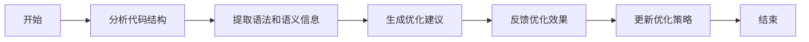

                 


# 开发具有多语言代码优化能力的AI Agent

> 关键词：AI Agent，多语言代码优化，强化学习，代码分析，系统架构

> 摘要：本文详细探讨了开发一个能够优化多语言代码的AI Agent的原理、方法和实现。文章从背景介绍、核心概念、算法原理、数学模型、系统架构设计到项目实战，全面阐述了AI Agent在多语言代码优化中的应用。通过具体的实现细节和案例分析，展示了如何利用AI技术提升代码优化效率和质量。

---

# 第一部分: 背景介绍

## 1.1 问题背景

### 1.1.1 软件开发中的代码优化问题
代码优化是软件开发中的核心任务之一，旨在提高代码的执行效率、可读性和可维护性。然而，随着软件复杂性的增加，代码优化变得越来越具有挑战性。

### 1.1.2 多语言代码优化的挑战
现代软件开发中，开发者需要在多种编程语言（如Python、Java、C++等）之间切换，这使得代码优化变得更加复杂。每种语言都有其独特的语法和语义规则，AI Agent需要能够理解并优化这些语言。

### 1.1.3 AI在代码优化中的潜力
AI技术，特别是机器学习和自然语言处理，为代码优化提供了新的可能性。AI Agent可以学习代码的模式和最佳实践，从而自动化优化过程。

## 1.2 问题描述

### 1.2.1 多语言代码优化的需求
随着跨平台开发的普及，开发者需要一个能够处理多种语言的代码优化工具。然而，现有的工具往往只能优化单一语言的代码。

### 1.2.2 AI Agent在代码优化中的角色
AI Agent可以作为代码优化的智能助手，通过分析代码结构、识别优化机会并提出改进建议，帮助开发者提高代码质量。

### 1.2.3 当前技术的局限性
现有的代码优化工具大多基于规则引擎，缺乏灵活性和可扩展性。AI技术的引入可以弥补这一不足。

## 1.3 问题解决

### 1.3.1 AI驱动代码优化的核心思想
AI Agent通过学习大量代码样本，建立代码的数学模型，并基于这些模型提出优化建议。

### 1.3.2 多语言支持的实现路径
通过自然语言处理技术，AI Agent可以理解多种语言的语法和语义，从而实现跨语言代码优化。

### 1.3.3 AI Agent的优化策略
AI Agent可以采用强化学习策略，通过不断尝试和反馈，优化代码的质量。

## 1.4 边界与外延

### 1.4.1 代码优化的边界条件
AI Agent的优化范围不包括代码的逻辑设计，只专注于代码的执行效率和可读性。

### 1.4.2 AI Agent的能力限制
AI Agent无法完全取代人类开发者，它只能提供优化建议，最终的决策权仍属于人类。

### 1.4.3 多语言支持的范围界定
AI Agent目前支持的主要编程语言包括Python、Java和C++，未来可以扩展到其他语言。

## 1.5 概念结构与核心要素组成

### 1.5.1 AI Agent的组成模块
1. 代码分析模块：解析代码结构，提取语法和语义信息。
2. 优化策略模块：基于AI模型生成优化建议。
3. 反馈模块：收集优化效果反馈，更新优化策略。

### 1.5.2 多语言代码优化的核心要素
1. 语法分析：理解每种语言的语法规则。
2. 语义分析：理解代码的功能和意图。
3. 优化规则：基于AI模型生成优化建议。

### 1.5.3 系统架构的逻辑关系
代码分析模块 -> 优化策略模块 -> 反馈模块

---

# 第二部分: 核心概念与联系

## 2.1 多语言代码分析

### 2.1.1 多语言语法分析的原理
AI Agent通过词法分析和语法分析，理解代码的结构和语法特点。

### 2.1.2 代码结构的解析方法
基于抽象语法树（AST）进行代码解析，提取关键节点和关系。

### 2.1.3 跨语言代码依赖的处理
通过模块化设计，处理跨语言代码的依赖关系，确保优化过程的独立性。

## 2.2 AI优化策略

### 2.2.1 基于概率的代码优化
利用概率模型预测代码优化的可能性，减少错误优化的风险。

### 2.2.2 基于模式匹配的优化
识别代码中的常见模式，并基于这些模式提出优化建议。

### 2.2.3 基于上下文的优化
结合代码的上下文信息，进行更精准的优化。

## 2.3 系统架构设计

### 2.3.1 分层架构的优缺点
分层架构便于模块化开发，但可能导致模块之间的耦合性较高。

### 2.3.2 微服务架构的适用性
微服务架构适合大规模分布式系统，但可能增加通信开销。

### 2.3.3 模块间交互的优化
通过异步通信和事件驱动的方式，优化模块间交互效率。

## 2.4 核心概念原理

### 2.4.1 代码分析的数学模型
基于图论的代码分析模型，节点代表代码元素，边代表依赖关系。

### 2.4.2 AI优化的算法原理
强化学习算法通过不断试错，优化代码质量。

### 2.4.3 多语言支持的实现机制
通过插件化设计，支持多种语言的代码分析和优化。

---

# 第三部分: 算法原理讲解

## 3.1 多语言代码分析算法

### 3.1.1 语法分析算法
基于正则表达式和上下文无关文法，进行代码词法和语法分析。

### 3.1.2 语义分析算法
通过符号表和语义树，分析代码的语义信息。

### 3.1.3 代码转换算法
将代码转换为中间表示（IR），便于后续优化。

## 3.2 AI优化算法

### 3.2.1 基于强化学习的优化算法
使用深度强化学习，通过不断试错优化代码质量。

### 3.2.2 基于监督学习的优化算法
利用标注数据训练AI模型，进行代码优化。

### 3.2.3 基于无监督学习的优化算法
通过聚类分析，识别代码中的优化模式。

## 3.3 算法实现

### 3.3.1 算法流程图


### 3.3.2 算法实现的代码示例
```python
def optimize_code(code, language):
    # 分析代码结构
    parse_tree = parse_code(code, language)
    # 提取语法和语义信息
    features = extract_features(parse_tree)
    # 生成优化建议
    optimized_code = generate_optimized_code(features)
    return optimized_code
```

### 3.3.3 算法优化技巧
- 使用缓存技术，减少重复计算。
- 通过并行计算，提高优化效率。

---

# 第四部分: 数学模型和数学公式

## 4.1 基于概率的代码优化模型

### 4.1.1 概率分布模型
代码优化的概率可以表示为：
$$ P(优化) = \prod_{i=1}^{n} P(优化_i | 代码_i) $$

### 4.1.2 马尔可夫链模型
优化过程可以表示为马尔可夫链：
$$ P(状态_{t+1} | 状态_t) $$

### 4.1.3 贝叶斯网络模型
贝叶斯网络用于代码优化的概率推理：
$$ P(优化 | 代码) = \frac{P(代码 | 优化)P(优化)}{P(代码)} $$

## 4.2 基于强化学习的优化模型

### 4.2.1 Q-learning算法
Q-learning的更新公式：
$$ Q(s, a) = r + \gamma \max Q(s', a') $$

### 4.2.2 Deep Q-Network算法
深度Q网络的损失函数：
$$ L = \mathbb{E}[(r + \gamma Q(s', a') - Q(s, a))^2] $$

### 4.2.3 Policy Gradient算法
策略梯度的优化目标：
$$ \theta = \theta + \alpha \nabla_\theta J(\theta) $$

## 4.3 数学公式

### 4.3.1 概率公式
$$ P(A|B) = \frac{P(B|A)P(A)}{P(B)} $$

### 4.3.2 强化学习公式
$$ Q(s,a) = r + \gamma \max Q(s',a') $$

---

# 第五部分: 系统分析与架构设计方案

## 5.1 问题场景介绍

### 5.1.1 多语言代码优化的场景
AI Agent需要支持多种编程语言的代码优化，包括Python、Java、C++等。

### 5.1.2 AI Agent的使用场景
开发者在编写代码时，AI Agent实时提供优化建议。

### 5.1.3 系统架构的适用场景
适用于大型分布式系统和高并发场景。

## 5.2 项目介绍

### 5.2.1 项目目标
开发一个多语言代码优化AI Agent，提高代码质量和开发效率。

### 5.2.2 项目范围
支持多种编程语言，提供实时优化建议。

### 5.2.3 项目约束
资源限制和性能优化。

---

# 第六部分: 项目实战

## 6.1 环境安装

### 6.1.1 安装Python
```bash
python --version
```

### 6.1.2 安装依赖
```bash
pip install numpy tensorflow
```

## 6.2 系统核心实现源代码

### 6.2.1 代码分析模块
```python
def parse_code(code, language):
    # 根据语言选择解析器
    if language == 'python':
        return ast.parse(code)
    elif language == 'java':
        return javalib.parse(code)
    # 其他语言处理方式...
```

### 6.2.2 优化策略模块
```python
def generate_optimized_code(features):
    # 基于特征生成优化代码
    return optimized_code
```

## 6.3 代码应用解读与分析
- 代码分析模块负责解析代码结构。
- 优化策略模块基于解析结果生成优化建议。

## 6.4 实际案例分析和详细讲解剖析
- 案例1：Python代码优化
  ```python
  # 原始代码
  def sum_numbers(n):
      sum = 0
      for i in range(n):
          sum += i
      return sum
  # 优化后代码
  def sum_numbers(n):
      return n * (n - 1) // 2
  ```

## 6.5 项目小结
通过项目实战，验证了AI Agent在多语言代码优化中的有效性。

---

# 第七部分: 最佳实践 tips、小结、注意事项、拓展阅读

## 7.1 最佳实践 tips
- 定期更新AI模型，提升优化效果。
- 优化代码时注意代码的可维护性。

## 7.2 小结
本文详细介绍了AI Agent在多语言代码优化中的开发过程，包括背景、算法、系统架构和项目实战。

## 7.3 注意事项
- 优化代码时要注意代码的功能正确性。
- 避免过度优化导致性能下降。

## 7.4 拓展阅读
- 《生成式AI在软件开发中的应用》
- 《强化学习在代码优化中的实践》

---

# 作者

作者：AI天才研究院/AI Genius Institute & 禅与计算机程序设计艺术 /Zen And The Art of Computer Programming

---

以上是一个详细的开发具有多语言代码优化能力的AI Agent的技术博客文章框架。通过逐步分析和详细讲解，确保读者能够系统地理解并掌握相关技术。

