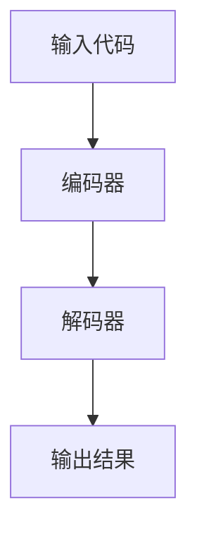
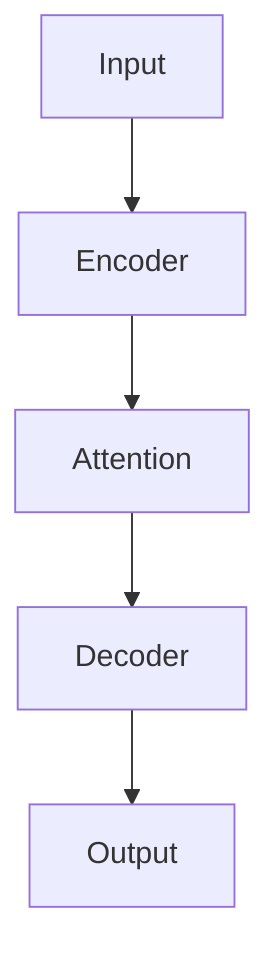
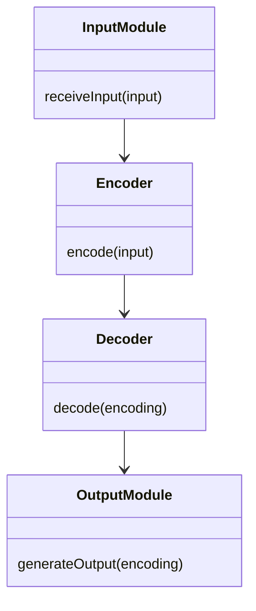

                 


# 开发具有多语言代码理解与生成能力的AI Agent

> 关键词：AI Agent，多语言代码理解，代码生成，自然语言处理，机器学习，深度学习

> 摘要：本文详细探讨了开发具有多语言代码理解与生成能力的AI Agent的关键技术，从背景、核心概念、算法原理到系统架构设计，再到项目实战和最佳实践，全面解析了实现这一目标的各个方面。

---

## 第一部分: AI Agent与多语言代码理解概述

### 第1章: AI Agent的基本概念

#### 1.1 AI Agent的定义与特点
##### 1.1.1 AI Agent的定义
AI Agent（人工智能代理）是一种能够感知环境、自主决策并执行任务的智能体。它可以理解、处理和生成多种语言的代码，帮助开发者提高效率并解决复杂问题。

##### 1.1.2 AI Agent的核心特点
- **智能性**：能够理解上下文并做出合理决策。
- **多语言支持**：能够处理多种编程语言，如Python、Java、C++等。
- **自适应性**：根据反馈不断优化自身的代码生成能力。

##### 1.1.3 多语言代码理解与生成能力的必要性
随着软件开发的全球化和多样化，支持多语言的AI Agent能够满足不同开发者的多样化需求，提升开发效率和代码质量。

---

#### 1.2 多语言代码理解与生成的背景
##### 1.2.1 当前AI技术的发展现状
自然语言处理（NLP）和机器学习技术的快速发展为AI Agent的理解和生成能力提供了坚实的基础。

##### 1.2.2 多语言代码处理的挑战与机遇
- **挑战**：不同语言的语法和语义差异较大，增加了理解和生成的复杂性。
- **机遇**：通过多语言模型可以提高AI Agent的通用性和适用性。

##### 1.2.3 企业级AI Agent的应用前景
AI Agent在企业级开发中的应用将极大提升代码开发效率，降低维护成本。

---

#### 1.3 多语言代码理解与生成的核心概念
##### 1.3.1 核心概念与原理
AI Agent通过自然语言处理技术和机器学习模型，实现对多种编程语言代码的理解和生成。

##### 1.3.2 多语言模型的结构特点
- **统一编码器**：将不同语言的代码统一编码。
- **语言特定解码器**：针对每种语言生成相应的代码。

##### 1.3.3 AI Agent的自主学习能力
通过监督学习和强化学习，AI Agent能够不断优化自身的理解和生成能力。

---

## 第二部分: AI Agent的核心算法与数学模型

### 第2章: 多语言代码理解的算法原理

#### 2.1 多语言模型的编码器-解码器结构
##### 图2-1: 编码器-解码器结构的Mermaid流程图


##### 2.1.1 编码器的作用
编码器将输入的代码转换为统一的向量表示。

##### 2.1.2 解码器的作用
解码器根据编码向量生成目标语言的代码。

---

#### 2.2 注意力机制
##### 图2-2: 注意力机制的Mermaid流程图


##### 2.2.1 注意力机制的作用
注意力机制帮助模型聚焦于输入代码的关键部分，提高理解和生成的准确性。

---

#### 2.3 生成模型的数学模型
##### 2.3.1 生成模型的损失函数
交叉熵损失函数：
$$ \mathcal{L} = -\sum_{i=1}^{n} y_i \log(p(y_i)) $$

##### 2.3.2 生成概率的计算
生成概率：
$$ P(y|x) = \text{模型}(x) $$

---

## 第三部分: AI Agent的系统架构设计

### 第3章: 系统功能设计

#### 3.1 系统功能模块
##### 图3-1: 系统功能模块的Mermaid类图


---

## 第四部分: 项目实战

### 第4章: 项目实战与代码实现

#### 4.1 环境安装
- 安装Python和相关库（如TensorFlow、Keras等）。

#### 4.2 核心代码实现
##### 4.2.1 编码器实现
```python
def encode(input):
    return model.encode(input)
```

##### 4.2.2 解码器实现
```python
def decode(encoding):
    return model.decode(encoding)
```

#### 4.3 代码应用解读
通过实际案例分析，展示AI Agent在多语言代码理解与生成中的应用。

---

## 第五部分: 最佳实践与总结

### 第5章: 最佳实践

#### 5.1 开发经验总结
- **模块化设计**：提高系统的可维护性和扩展性。
- **持续优化**：通过反馈不断优化模型性能。

#### 5.2 注意事项
- 确保数据质量，避免过拟合。
- 定期更新模型，适应新的语言和语法变化。

#### 5.3 拓展阅读
推荐相关技术书籍和论文，供读者深入学习。

---

## 作者：AI天才研究院/AI Genius Institute & 禅与计算机程序设计艺术 /Zen And The Art of Computer Programming

---

以上是关于“开发具有多语言代码理解与生成能力的AI Agent”的技术博客文章。文章详细介绍了AI Agent的基本概念、算法原理、系统架构设计以及项目实战，为开发者提供了全面的技术指导。

