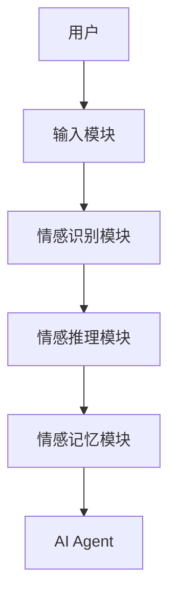

                 


# 开发具有情感计算能力的AI Agent

> 关键词：情感计算，AI Agent，机器学习，深度学习，情感识别，情感推理，情感记忆

> 摘要：本文探讨了如何开发具有情感计算能力的AI Agent，结合情感计算和人工智能技术，详细讲解了情感识别、情感推理、情感记忆的核心技术，以及在AI Agent中的实现方法，通过实际项目案例，展示了情感计算在AI Agent中的应用和开发过程。

---

## 第一章 情感计算与AI Agent的背景与概念

### 1.1 情感计算的基本概念

#### 1.1.1 情感计算的定义
情感计算（Affective Computing）是一种通过计算机技术识别、理解、分析和响应人类情感状态的新兴领域。它不仅关注用户的输入内容，还关注用户的情感状态，从而提供更智能、更人性化的服务。

#### 1.1.2 情感计算的核心要素
- **情感识别**：识别用户的情感状态，包括情绪类型（如快乐、悲伤、愤怒）和强度。
- **情感推理**：基于情感数据，推断用户的意图或潜在需求。
- **情感记忆**：记录和存储用户的情感历史，用于后续的个性化服务。

#### 1.1.3 情感计算的应用场景
- **健康医疗**：监测患者情绪变化，辅助诊断和治疗。
- **教育领域**：根据学生情绪调整教学策略。
- **人机交互**：提升用户体验，使交互更加自然和智能。

### 1.2 AI Agent的基本概念

#### 1.2.1 AI Agent的定义
AI Agent（人工智能代理）是指能够感知环境、理解任务需求，并采取适当行动以实现目标的智能实体。它可以是一个软件程序，也可以是一个物理设备。

#### 1.2.2 AI Agent的分类
- **简单反射型AI Agent**：基于预定义规则执行任务，适用于简单场景。
- **基于模型的反射型AI Agent**：使用内部模型表示环境和任务，能够处理复杂场景。
- **目标驱动型AI Agent**：以特定目标为导向，主动采取行动。

#### 1.2.3 AI Agent的核心功能
- **感知环境**：通过传感器或数据输入感知环境状态。
- **决策与推理**：基于感知信息进行推理和决策。
- **执行行动**：根据决策结果采取行动。

### 1.3 情感计算与AI Agent的结合

#### 1.3.1 情感计算在AI Agent中的作用
- 提高人机交互的自然性。
- 增强AI Agent的理解能力，使其能够感知用户情绪。

#### 1.3.2 情感计算与AI Agent的融合方式
- **数据层面**：将情感数据作为输入，供AI Agent处理。
- **算法层面**：在AI Agent的决策算法中融入情感计算模型。
- **系统层面**：构建专门的情感计算模块，与AI Agent协同工作。

#### 1.3.3 情感计算对AI Agent性能的提升
- 提高用户体验，使交互更加个性化和贴心。
- 增强AI Agent的情境理解能力，使其能够处理复杂的情感场景。

### 1.4 本章小结
本章介绍了情感计算和AI Agent的基本概念，并探讨了它们的结合方式和意义。情感计算为AI Agent增添了情感维度，使其能够更好地理解和响应用户需求。

---

## 第二章 情感计算的核心技术

### 2.1 情感识别技术

#### 2.1.1 文本情感分析
- **定义**：通过分析文本内容，判断文本的情感倾向（正面、负面、中性）。
- **实现方法**：
  1. 数据预处理：分词、去除停用词。
  2. 特征提取：使用词袋模型或词嵌模型。
  3. 情感分类：基于机器学习或深度学习模型进行分类。

#### 2.1.2 声音情感识别
- **定义**：通过分析语音特征（如音调、语速、音量）来识别说话人的情感状态。
- **实现方法**：
  1. 音频信号处理：提取特征如MFCC。
  2. 声纹分析：通过声学特征建模情感。
  3. 情感分类：使用深度学习模型进行分类。

#### 2.1.3 面部表情识别
- **定义**：通过分析面部表情（如眼神、面部肌肉运动）来识别情绪。
- **实现方法**：
  1. 图像采集与预处理。
  2. 特征提取：使用面部关键点检测。
  3. 表情分类：基于深度学习模型进行分类。

### 2.2 情感推理技术

#### 2.2.1 情感推理的定义
情感推理是指在已知情感信息的基础上，推断出更深层次的情感状态或潜在意图。

#### 2.2.2 基于规则的情感推理
- **定义**：通过预定义的规则和逻辑进行情感推理。
- **实现方法**：
  1. 建立情感规则库。
  2. 根据输入情感数据匹配规则，得出推理结果。

#### 2.2.3 基于机器学习的情感推理
- **定义**：利用机器学习模型（如SVM、随机森林）进行情感推理。
- **实现方法**：
  1. 数据收集与标注。
  2. 特征提取与模型训练。
  3. 模型部署与推理。

### 2.3 情感记忆技术

#### 2.3.1 情感记忆的定义
情感记忆是指将用户的情感数据存储起来，用于后续的个性化服务。

#### 2.3.2 情感记忆的实现方式
- **数据库存储**：将情感数据存储在数据库中，便于查询和管理。
- **知识图谱构建**：将情感数据构建为知识图谱，用于复杂情感推理。

#### 2.3.3 情感记忆的应用场景
- **个性化推荐**：根据用户历史情感数据，推荐相关内容。
- **情感反馈优化**：根据用户情感历史，优化系统响应。

### 2.4 本章小结
本章详细讲解了情感计算的核心技术，包括情感识别、情感推理和情感记忆。这些技术为AI Agent的情感计算能力提供了坚实的基础。

---

## 第三章 AI Agent的情感计算实现

### 3.1 情感特征提取

#### 3.1.1 文本特征提取
- **词袋模型**：统计文本中的词频。
- **词嵌模型**：提取词语的语义表示。

#### 3.1.2 声音特征提取
- **MFCC特征**：提取语音的频域特征。
- **声学特征**：提取音调、语速等特征。

#### 3.1.3 非结构化数据特征提取
- **图像特征提取**：提取图像的视觉特征。
- **文本特征提取**：提取文本的语义特征。

### 3.2 情感计算模型

#### 3.2.1 基于规则的情感计算模型
- **规则定义**：建立情感规则库。
- **模型实现**：根据输入数据匹配规则，输出情感结果。

#### 3.2.2 基于机器学习的情感计算模型
- **数据预处理**：清洗、标注数据。
- **特征提取**：提取情感相关特征。
- **模型训练**：训练分类器（如SVM、随机森林）。

#### 3.2.3 基于深度学习的情感计算模型
- **模型结构**：使用RNN、LSTM、Transformer等结构。
- **训练方法**：端到端训练模型，自动提取特征。

### 3.3 情感计算与AI Agent的结合

#### 3.3.1 情感计算模块设计
- **模块划分**：情感识别、情感推理、情感记忆。
- **数据流设计**：输入数据→情感计算→AI Agent处理。

#### 3.3.2 AI Agent的系统架构
- **分层架构**：感知层、计算层、执行层。
- **模块交互**：情感计算模块与AI Agent其他模块协同工作。

### 3.4 本章小结
本章详细讲解了情感计算在AI Agent中的实现，包括情感特征提取、情感计算模型以及系统架构设计。

---

## 第四章 情感计算的算法实现与优化

### 4.1 情感分类算法

#### 4.1.1 基于机器学习的情感分类算法
- **算法流程**：
  1. 数据预处理。
  2. 特征提取。
  3. 模型训练。
  4. 模型测试。
- **代码实现**：
  ```python
  from sklearn.svm import SVC
  model = SVC()
  model.fit(X_train, y_train)
  y_pred = model.predict(X_test)
  ```

#### 4.1.2 基于深度学习的情感分类算法
- **算法流程**：
  1. 数据预处理。
  2. 模型构建。
  3. 模型训练。
  4. 模型测试。
- **代码实现**：
  ```python
  import tensorflow as tf
  model = tf.keras.Sequential([
      tf.keras.layers.Dense(64, activation='relu'),
      tf.keras.layers.Dense(1, activation='sigmoid')
  ])
  model.compile(optimizer='adam', loss='binary_crossentropy', metrics=['accuracy'])
  model.fit(X_train, y_train, epochs=10, batch_size=32)
  ```

### 4.2 情感计算的数学模型

#### 4.2.1 情感空间模型
- **定义**：将情感状态映射到多维空间中。
- **公式**：
  $$ \text{情感向量} = (v_1, v_2, \ldots, v_n) $$
  其中，$v_i$ 表示第i个情感维度的值。

#### 4.2.2 情感相似度计算
- **余弦相似度**：
  $$ \text{相似度} = \frac{\vec{a} \cdot \vec{b}}{|\vec{a}| |\vec{b}|} $$
- **欧氏距离**：
  $$ \text{距离} = \sqrt{(a_1 - b_1)^2 + (a_2 - b_2)^2 + \ldots + (a_n - b_n)^2} $$

### 4.3 算法优化

#### 4.3.1 参数优化
- **超参数调优**：使用网格搜索或随机搜索优化模型参数。
- **模型剪枝**：减少模型复杂度，防止过拟合。

#### 4.3.2 数据增强
- **文本数据增强**：同义词替换、句式变化。
- **图像数据增强**：旋转、缩放、翻转。

### 4.4 本章小结
本章详细讲解了情感计算的算法实现与优化方法，包括基于机器学习和深度学习的情感分类算法，以及情感空间模型和相似度计算方法。

---

## 第五章 情感计算的系统设计与实现

### 5.1 项目背景与目标

#### 5.1.1 项目背景
随着人工智能技术的发展，情感计算在各个领域的应用越来越广泛。开发具有情感计算能力的AI Agent能够提升用户体验，使交互更加智能化和个性化。

#### 5.1.2 项目目标
- 实现情感计算功能。
- 集成到AI Agent系统中，提升其情感理解能力。

### 5.2 系统功能设计

#### 5.2.1 系统模块划分
- **情感识别模块**：识别用户情感状态。
- **情感推理模块**：推断用户潜在需求。
- **情感记忆模块**：存储用户情感历史。

#### 5.2.2 系统功能流程
1. 用户输入：文本、语音或图像。
2. 情感识别：识别用户情感状态。
3. 情感推理：推断用户潜在需求。
4. 情感记忆：存储用户情感数据。
5. AI Agent处理：根据情感数据采取相应行动。

### 5.3 系统架构设计

#### 5.3.1 系统架构图


#### 5.3.2 数据流设计
- 用户输入→输入模块→情感识别模块→情感推理模块→情感记忆模块→AI Agent处理。

### 5.4 系统实现

#### 5.4.1 环境配置
- **开发工具**：Python、TensorFlow、Keras。
- **运行环境**：Windows、Linux。

#### 5.4.2 核心代码实现
```python
# 情感识别模块
def emotional_analysis(text):
    # 文本预处理
    # 文本分析
    return emotion

# 情感推理模块
def emotional_reasoning(emotion):
    # 根据情感数据进行推理
    return intent

# 情感记忆模块
def emotional_memory(emotion):
    # 存储情感数据
    pass
```

### 5.5 功能测试与优化

#### 5.5.1 功能测试
- 测试情感识别模块的准确率。
- 测试情感推理模块的推理能力。
- 测试情感记忆模块的存储能力。

#### 5.5.2 系统优化
- 优化算法性能。
- 提高系统稳定性。

### 5.6 本章小结
本章详细讲解了情感计算的系统设计与实现，包括系统架构设计、功能模块实现以及系统测试与优化。

---

## 第六章 情感计算在AI Agent中的应用与展望

### 6.1 情感计算的实际应用案例

#### 6.1.1 情感支持AI Agent
- **应用场景**：为用户提供情感支持，帮助缓解压力。
- **实现方式**：集成情感识别和情感推理模块，与用户进行自然交互。

#### 6.1.2 情感教育AI Agent
- **应用场景**：辅助学生学习，根据情绪调整教学策略。
- **实现方式**：结合情感识别和个性化推荐。

### 6.2 情感计算的未来展望

#### 6.2.1 技术进步
- **更精准的情感识别**：利用更先进的算法和数据。
- **更智能的情感推理**：结合知识图谱和增强学习。

#### 6.2.2 应用场景扩展
- **医疗健康**：更精准的患者情绪监测。
- **智能家居**：更个性化的家居控制。

### 6.3 本章小结
本章探讨了情感计算在AI Agent中的实际应用，并展望了未来的发展方向。情感计算将推动AI Agent技术的进一步发展，使其在更多领域发挥重要作用。

---

## 作者：AI天才研究院 & 禅与计算机程序设计艺术

---

以上是《开发具有情感计算能力的AI Agent》的技术博客文章目录大纲和部分章节内容。每一章的内容都详细讲解了相关知识点，并结合实际案例进行分析，帮助读者系统地理解和掌握情感计算在AI Agent中的开发与应用。

