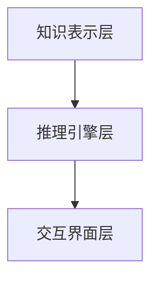
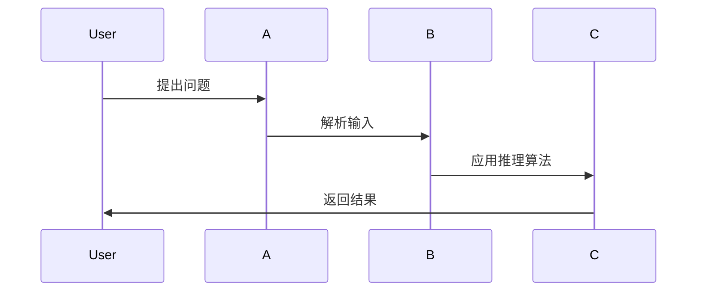

                 


# 开发具有抽象思维与推理能力的AI Agent

> 关键词：AI Agent，抽象思维，推理能力，符号推理，知识图谱，概率推理

> 摘要：本文深入探讨了开发具有抽象思维与推理能力的AI Agent的核心概念、算法原理和系统架构。通过符号推理、知识图谱和概率推理等方法，结合实际项目案例，详细讲解了如何实现具备抽象思维与推理能力的AI Agent，并探讨了其在智能问答系统中的应用。

---

## 第1章：背景介绍

### 1.1 问题背景

#### 1.1.1 人工智能的发展现状
人工智能（AI）技术近年来取得了显著进展，特别是在计算机视觉、自然语言处理和机器人技术等领域。然而，大多数AI系统仍然局限于基于数据的模式识别和任务执行，缺乏真正的抽象思维和推理能力。

#### 1.1.2 当前AI Agent的局限性
现有的AI Agent在处理复杂问题时，往往依赖大量的训练数据和预定义规则，难以理解抽象概念和进行逻辑推理。这种局限性使得AI Agent在处理需要创造性思维和深层理解的任务时表现不佳。

#### 1.1.3 抽象思维与推理能力的重要性
抽象思维和推理能力是人类智能的核心，使我们能够理解复杂概念、解决未见问题并进行创新。赋予AI Agent这些能力将显著提升其在复杂场景中的应用价值。

### 1.2 问题描述

#### 1.2.1 AI Agent的核心目标
AI Agent的目标是通过感知环境、理解和推理问题，做出合理决策并执行行动。具备抽象思维和推理能力的AI Agent能够更好地理解任务的本质，而非仅仅依赖数据模式。

#### 1.2.2 抽象思维与推理能力的定义
抽象思维是指从具体事物中提炼出一般概念和规律的能力。推理能力是基于已有知识和逻辑规则，推导出新结论的能力。

#### 1.2.3 实现抽象思维与推理能力的必要性
在复杂和动态的环境中，AI Agent需要能够理解抽象概念、处理不确定性并做出合理决策。这需要结合抽象思维和推理能力。

### 1.3 问题解决

#### 1.3.1 抽象思维与推理能力的实现路径
- **符号推理**：通过逻辑规则和知识库进行推理。
- **知识图谱**：构建领域知识图谱，支持语义理解和推理。
- **概率推理**：基于概率模型处理不确定性。

#### 1.3.2 相关技术的现状与挑战
- **符号推理**：传统方法，但在复杂场景中表现有限。
- **知识图谱**：依赖高质量知识库的构建。
- **概率推理**：处理不确定性，但计算复杂。

### 1.4 边界与外延

#### 1.4.1 抽象思维与推理能力的边界
AI Agent的抽象思维和推理能力应聚焦于特定领域，避免超越其知识范围。

#### 1.4.2 与其他AI能力的关系
- **感知能力**：提供输入数据，支持推理。
- **学习能力**：增强知识库，提升推理效果。
- **决策能力**：基于推理结果做出决策。

#### 1.4.3 应用场景的外延
- **智能问答系统**：帮助用户解答复杂问题。
- **自动驾驶**：处理道路规则和情境理解。
- **医疗诊断**：分析症状和诊断逻辑。

### 1.5 概念结构与核心要素

#### 1.5.1 抽象思维与推理能力的组成要素
- **知识表示**：符号、概念、规则。
- **推理机制**：符号推理、逻辑推理、概率推理。
- **上下文理解**：情境感知和语境理解。

#### 1.5.2 核心要素之间的关系
- 知识表示为推理提供基础，推理能力增强抽象思维的深度。

---

## 第2章：抽象思维与推理能力的核心概念

### 2.1 抽象思维的类型

#### 2.1.1 概念形成
- **定义**：从具体实例中提取一般概念。
- **示例**：从“鸟”中提取“会飞的动物”。

#### 2.1.2 逻辑推理
- **定义**：基于逻辑规则进行推理。
- **示例**：如果所有鸟都会飞，且鸽子是鸟，那么鸽子会飞。

#### 2.1.3 类比推理
- **定义**：通过类比进行推理。
- **示例**：如果汽车有轮子，那么自行车也有轮子。

### 2.2 推理能力的层次

#### 2.2.1 基于规则的推理
- **符号表示**：使用逻辑符号表示规则。
- **推理过程**：通过规则库进行推理。
- **示例**：专家系统。

#### 2.2.2 基于知识图谱的推理
- **知识表示**：使用图结构表示知识。
- **推理过程**：通过图遍历进行推理。
- **示例**：知识图谱问答。

#### 2.2.3 基于概率的推理
- **概率模型**：贝叶斯网络。
- **推理过程**：计算概率分布。
- **示例**：医疗诊断系统。

### 2.3 抽象思维与推理能力的联系

#### 2.3.1 抽象思维为推理提供基础
- **知识表示**：抽象概念作为推理的基础。
- **推理过程**：基于抽象概念进行推理。

#### 2.3.2 推理能力增强抽象思维的深度
- **知识扩展**：通过推理扩展抽象概念。
- **概念深化**：推理结果反哺抽象思维。

---

## 第3章：抽象思维与推理能力的算法实现

### 3.1 符号推理算法

#### 3.1.1 基于规则的符号推理
- **定义**：使用逻辑规则进行推理。
- **算法流程**：
  1. 确定推理规则。
  2. 输入初始事实。
  3. 应用规则进行推理。
  4. 得出结论。

#### 3.1.2 知识图谱的构建与推理
- **知识表示**：使用图结构表示知识。
- **推理过程**：通过图遍历进行推理。
- **示例代码**：
  ```python
  def infer_relation(subject, predicate, object):
      # 在知识图谱中查找subject与object之间的关系
      pass
  ```

#### 3.1.3 算法实现
- **符号推理的实现**：使用逻辑编程语言或框架。
- **知识图谱推理的实现**：使用图数据库和查询语言。

### 3.2 概率推理算法

#### 3.2.1 贝叶斯网络
- **定义**：有向无环图，表示变量之间的概率关系。
- **推理过程**：计算变量的后验概率。

#### 3.2.2 马尔可夫链
- **定义**：描述系统状态转移的概率。
- **推理过程**：计算状态转移概率。

#### 3.2.3 证据推理
- **定义**：基于已有证据更新概率分布。
- **推理过程**：更新信念网络。

### 3.3 抽象思维与推理能力的结合

#### 3.3.1 抽象概念的符号化
- **符号化**：将抽象概念转化为符号表示。
- **示例**：将“鸟类”表示为`Bird`。

#### 3.3.2 抽象推理的数学模型
- **逻辑模型**：命题逻辑和谓词逻辑。
- **概率模型**：贝叶斯网络和马尔可夫链。

#### 3.3.3 抽象推理的实现
- **符号推理**：基于规则的推理。
- **概率推理**：基于贝叶斯网络的推理。

---

## 第4章：系统架构与交互流程

### 4.1 系统架构设计

#### 4.1.1 系统功能模块
- **知识表示层**：符号、概念、规则。
- **推理引擎层**：符号推理、概率推理。
- **交互界面层**：用户输入、结果输出。

#### 4.1.2 系统架构图


### 4.2 交互流程设计

#### 4.2.1 用户输入
- **自然语言输入**：用户提出问题。
- **符号输入**：输入符号表达式。

#### 4.2.2 系统处理
- **解析输入**：将输入转换为符号或概率模型。
- **推理过程**：应用推理算法进行推理。
- **输出结果**：返回推理结果。

#### 4.2.3 系统交互流程图


---

## 第5章：项目实战

### 5.1 项目介绍

#### 5.1.1 项目背景
- **目标**：开发一个智能问答系统。
- **功能**：回答用户提出的问题。

#### 5.1.2 项目需求
- **知识库**：领域知识图谱。
- **推理引擎**：符号推理和概率推理。

### 5.2 核心代码实现

#### 5.2.1 环境配置
- **编程语言**：Python。
- **库依赖**：networkx、numpy。

#### 5.2.2 核心代码
```python
import networkx as nx
from numpy import random

def symbol_inference(rules, facts):
    # 符号推理算法
    pass

def bayesian_inference(bayesian_network, evidence):
    # 贝叶斯推理算法
    pass

def main():
    rules = {
        'Bird': ['can-fly', 'has-wings'],
        'Mammal': ['can-fly', 'has-four-limbs']
    }
    facts = ['pigeon', 'has-wings']
    result = symbol_inference(rules, facts)
    print(result)

if __name__ == '__main__':
    main()
```

#### 5.2.3 代码解读
- **symbol_inference**：符号推理函数。
- **bayesian_inference**：贝叶斯推理函数。
- **main**：主函数，配置规则和事实，调用推理函数。

### 5.3 系统测试与优化

#### 5.3.1 系统测试
- **测试用例**：多个问题测试系统。
- **测试结果**：记录推理结果。

#### 5.3.2 系统优化
- **知识库优化**：增加领域知识。
- **推理算法优化**：改进推理效率。

---

## 第6章：总结与展望

### 6.1 核心内容回顾

#### 6.1.1 重点回顾
- 抽象思维与推理能力的实现路径。
- 符号推理、知识图谱和概率推理的结合。

#### 6.1.2 核心算法总结
- 符号推理：基于规则的推理。
- 概率推理：基于贝叶斯网络的推理。

### 6.2 未来展望

#### 6.2.1 技术发展趋势
- **通用AI**：结合多种推理方法。
- **人机协作**：提升AI与人类协作能力。

#### 6.2.2 应用场景拓展
- **智能教育**：个性化学习。
- **智能医疗**：辅助诊断。

### 6.3 最佳实践 tips

#### 6.3.1 项目开发 tips
- **模块化设计**：便于维护和扩展。
- **选择合适算法**：根据需求选择推理方法。

#### 6.3.2 项目部署 tips
- **轻量化部署**：优化系统性能。
- **多语言支持**：提升用户体验。

#### 6.3.3 项目维护 tips
- **持续优化**：定期更新知识库。
- **监控反馈**：监控系统性能。

### 6.4 作者总结

开发具有抽象思维与推理能力的AI Agent是一项具有挑战性的任务，需要结合多种推理方法和领域知识。未来，随着技术的进步，AI Agent将在更多领域发挥重要作用。

---

## 作者

**作者：AI天才研究院/AI Genius Institute & 禅与计算机程序设计艺术 /Zen And The Art of Computer Programming**

