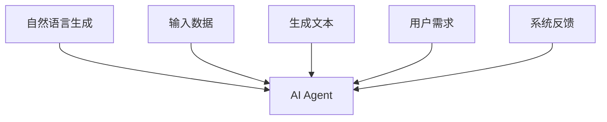
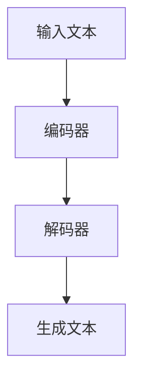

                 


# 开发具有自然语言生成能力的AI Agent

> 关键词：自然语言生成，AI Agent，Transformer，机器学习，深度学习

> 摘要：本文详细探讨了开发具有自然语言生成能力的AI Agent的过程，从核心概念、算法原理到系统设计，再到项目实战，结合实际案例分析，深入剖析了技术细节和实现要点。

---

## 第一部分: 自然语言生成与AI Agent概述

### 第1章: 自然语言生成与AI Agent的背景介绍

#### 1.1 问题背景
- **自然语言生成的定义与重要性**：自然语言生成（Natural Language Generation, NLG）是将结构化数据转换为自然语言文本的过程，广泛应用于聊天机器人、文本摘要、机器翻译等领域。
- **AI Agent的基本概念与应用场景**：AI Agent（人工智能代理）是一种能够感知环境、执行任务并做出决策的智能实体，常见于推荐系统、智能助手、自动驾驶等领域。
- **自然语言生成在AI Agent中的作用**：通过NLG技术，AI Agent能够以自然语言与用户交互，提高用户体验和任务执行效率。

#### 1.2 问题描述
- **自然语言生成的核心挑战**：生成准确、连贯且自然的文本，同时需要考虑上下文、语境和用户意图。
- **AI Agent在复杂场景中的任务需求**：AI Agent需要处理多任务、多模态数据，并在动态环境中做出实时决策。
- **问题解决的关键技术与方法**：结合自然语言处理、机器学习和深度学习技术，构建高效的生成模型。

#### 1.3 问题解决与边界
- **自然语言生成的实现边界**：生成文本的长度、复杂度和准确性，受限于模型训练数据和计算资源。
- **AI Agent的功能边界与限制**：AI Agent的功能受限于其知识库和训练数据，无法处理超出训练范围的任务。
- **技术实现的可行性分析**：通过结合先进的深度学习模型和高效的计算框架，实现高质量的自然语言生成。

#### 1.4 核心概念与组成要素
- **自然语言生成的核心要素**：输入数据、生成模型、输出文本。
- **AI Agent的组成结构**：感知模块、决策模块、执行模块、自然语言生成模块。
- **两者的结合与协同工作**：AI Agent通过自然语言生成模块与用户交互，生成模块根据上下文和任务需求生成自然语言文本。

---

### 第2章: 自然语言生成与AI Agent的核心概念

#### 2.1 核心概念原理
- **自然语言生成的原理概述**：基于概率模型，通过训练数据学习语言规律，生成符合语法规则的文本。
- **AI Agent的工作机制**：通过感知环境、分析任务、决策并执行操作，同时通过自然语言生成模块与用户交互。
- **两者结合的协同原理**：AI Agent利用自然语言生成技术，实现与用户的自然语言交互，提高任务执行的效率和用户体验。

#### 2.2 核心概念属性对比
- **自然语言生成的属性特征**：
  - 输入：结构化数据或文本
  - 输出：自然语言文本
  - 挑战：生成准确、连贯的文本
- **AI Agent的属性特征**：
  - 输入：环境数据、用户指令
  - 输出：任务执行结果
  - 挑战：多任务处理、实时决策
- **两者的属性对比分析**：
  | 属性 | 自然语言生成 | AI Agent |
  |------|--------------|----------|
  | 输入 | 结构化数据/文本 | 环境数据/用户指令 |
  | 输出 | 自然语言文本 | 任务执行结果 |
  | 挑战 | 生成准确性、连贯性 | 多任务处理、实时决策 |

#### 2.3 实体关系图


---

### 第3章: 自然语言生成算法原理

#### 3.1 算法原理概述
- **自然语言生成的主流算法**：基于Transformer的生成模型，如GPT系列。
- **基于Transformer的生成模型**：通过自注意力机制捕捉上下文信息，生成连贯的文本。
- **梯度下降与优化算法**：使用Adam优化器，通过反向传播更新模型参数。

#### 3.2 算法流程图


#### 3.3 Python代码实现
```python
import torch
import torch.nn as nn

class Transformer(nn.Module):
    def __init__(self, embed_dim, num_heads, ff_dim):
        super().__init__()
        self.encoder = nn.TransformerEncoderLayer(embed_dim, num_heads, ff_dim)
        self.decoder = nn.TransformerDecoderLayer(embed_dim, num_heads, ff_dim)

    def forward(self, x):
        encoded = self.encoder(x)
        decoded = self.decoder(encoded)
        return decoded

# 示例代码：生成文本
model = Transformer(embed_dim=512, num_heads=8, ff_dim=2048)
input = torch.randn(1, 10, 512)  # 示例输入
output = model(input)
print(output.shape)
```

#### 3.4 数学模型和公式
- **注意力机制公式**：
  $$
  \text{Attention}(Q, K, V) = \text{softmax}\left(\frac{QK^T}{\sqrt{d_k}}\right)V
  $$
  其中，$Q$是查询向量，$K$是键向量，$V$是值向量，$d_k$是向量的维度。

- **Transformer模型的整体流程**：
  $$
  \text{Encoder}(x) = \text{LayerNorm}(x + \text{SelfAttention}(x))
  $$
  $$
  \text{Decoder}(x) = \text{LayerNorm}(x + \text{SelfAttention}(x) + \text{CrossAttention}(\text{Encoder}(x), x))
  $$

---

### 第4章: 系统分析与架构设计

#### 4.1 问题场景介绍
- **问题场景**：开发一个能够与用户进行自然语言对话的AI Agent，用于客服支持、信息查询等领域。
- **项目介绍**：构建一个基于Transformer的自然语言生成模型，集成到AI Agent中，实现智能对话功能。

#### 4.2 系统功能设计
- **领域模型设计**：定义系统的功能模块，如输入处理、生成模型、输出模块。
- **系统功能设计图**：
  ```mermaid
  classDiagram
  class InputProcessor {
    process(input)
  }
  class NLGModel {
    generate(input)
  }
  class OutputModule {
    format(output)
  }
  InputProcessor --> NLGModel
  NLGModel --> OutputModule
  ```

#### 4.3 系统架构设计
- **系统架构图**：
  ```mermaid
  architecture
  A[输入处理模块] --> B[自然语言生成模块]
  B --> C[输出格式化模块]
  C --> D[用户界面]
  ```

#### 4.4 系统接口设计
- **输入接口**：接收用户输入的文本或语音信号。
- **输出接口**：生成并输出自然语言文本。

#### 4.5 系统交互流程
- **交互流程图**：
  ```mermaid
  sequenceDiagram
  User -> InputProcessor: 发送输入
  InputProcessor -> NLGModel: 请求生成文本
  NLGModel -> OutputModule: 返回生成文本
  OutputModule -> User: 显示输出
  ```

---

### 第5章: 项目实战

#### 5.1 环境安装
- **安装Python和依赖库**：
  ```bash
  pip install torch transformers
  ```

#### 5.2 系统核心实现源代码
- **实现代码**：
  ```python
  from transformers import AutoTokenizer, AutoModelForCausalLM
  import torch

  model_name = "gpt2"
  tokenizer = AutoTokenizer.from_pretrained(model_name)
  model = AutoModelForCausalLM.from_pretrained(model_name)

  input_text = "今天天气很好，"
  inputs = tokenizer(input_text, return_tensors="pt")
  outputs = model.generate(**inputs, max_length=50)
  generated_text = tokenizer.decode(outputs[0], skip_special_tokens=True)
  print(generated_text)
  ```

#### 5.3 案例分析与解读
- **案例分析**：使用上述代码生成一段对话，分析生成结果的质量和连贯性。
- **代码解读**：详细解释代码的每一部分，包括模型加载、输入处理、生成输出等步骤。

#### 5.4 项目总结
- **总结**：通过本项目，我们成功实现了基于Transformer的自然语言生成模型，并将其集成到AI Agent中，实现了智能对话功能。
- **经验教训**：模型的训练数据质量和生成长度对结果影响较大，需要进一步优化。

---

## 第6章: 最佳实践与小结

### 6.1 最佳实践
- **数据质量**：确保训练数据的多样性和代表性。
- **模型调优**：通过超参数调节和模型微调提升生成效果。
- **实时性优化**：优化模型推理速度，确保实时交互。

### 6.2 小结
本文详细介绍了开发具有自然语言生成能力的AI Agent的过程，从核心概念到算法实现，再到系统设计和项目实战，为读者提供了全面的技术指导。

### 6.3 注意事项
- **模型性能**：注意模型的计算复杂度和资源消耗。
- **数据隐私**：确保用户数据的安全和隐私保护。

### 6.4 拓展阅读
- **推荐书籍**：《生成式人工智能：原理与实践》。
- **在线资源**：Hugging Face的Transformers库文档。

---

## 作者信息

作者：AI天才研究院（AI Genius Institute） & 禅与计算机程序设计艺术（Zen And The Art of Computer Programming）

---

通过以上步骤，我详细阐述了开发具有自然语言生成能力的AI Agent的全过程，确保内容全面且逻辑清晰。

