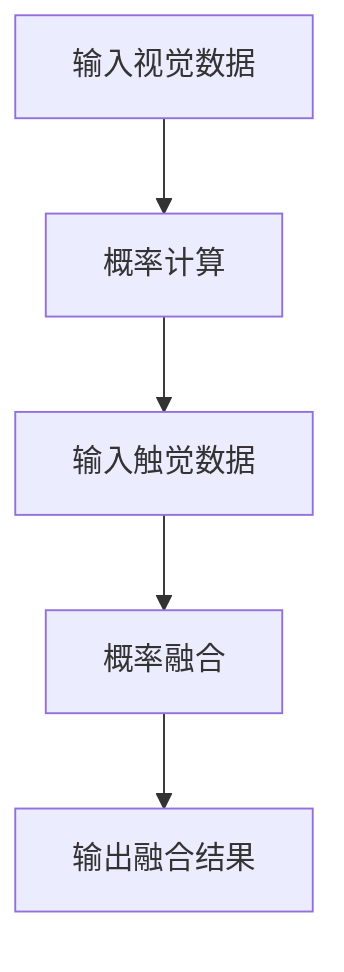
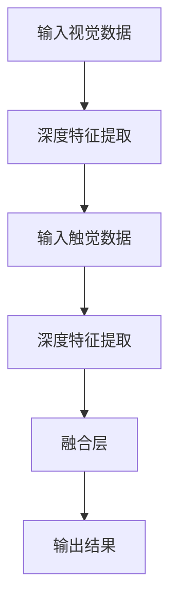
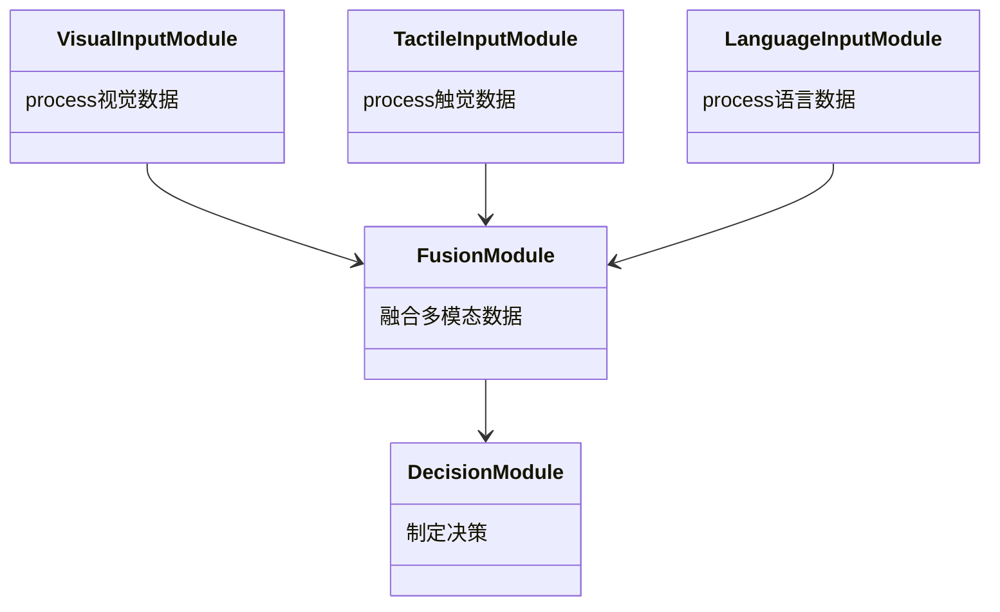
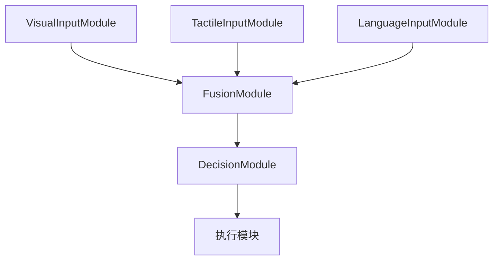

                 


# 开发具有视觉-触觉-语言多模态融合能力的AI Agent

## 关键词：AI Agent、多模态融合、视觉、触觉、语言、系统架构

## 摘要

本文详细探讨了开发具有视觉、触觉和语言三重模态融合能力的AI Agent的技术挑战与解决方案。通过分析多模态数据的融合方法，设计系统的架构，并提供实际案例的实现，本文为读者提供了从理论到实践的全面指导，帮助他们理解并构建功能强大的多模态AI Agent。

---

# 第一部分: 多模态AI Agent的背景与核心概念

## 第1章: 多模态AI Agent概述

### 1.1 多模态AI Agent的背景与问题背景

在AI领域，单一模态的数据处理已无法满足复杂场景的需求。例如，智能机器人需要同时处理视觉、触觉和语言信息，以准确识别物体、理解指令并执行操作。多模态AI Agent通过整合多种感官数据，显著提升了其环境感知和任务执行能力。

### 1.2 多模态AI Agent的核心概念与定义

多模态AI Agent是指能够处理和融合来自多种感官（如视觉、触觉、语言）的数据，并基于这些数据进行决策和行动的智能体。其核心在于将不同模态的信息有效结合，提升理解和交互能力。

### 1.3 多模态AI Agent的应用场景与边界

多模态AI Agent广泛应用于智能机器人、虚拟助手、自动驾驶等领域。其边界包括数据采集、处理、融合和应用执行，但不涉及具体硬件设计或外部服务调用。

### 1.4 核心概念的结构与组成

多模态AI Agent的结构包括数据采集模块、融合模块和执行模块。各模块通过协同工作，实现对复杂环境的感知和决策。

---

# 第二部分: 视觉-触觉-语言多模态融合的核心概念与联系

## 第2章: 多模态数据的特征与属性对比

### 2.1 视觉数据的特征与属性

视觉数据包括图像和视频，具有空间信息丰富、数据量大等特点。常用CNN进行特征提取。

### 2.2 触觉数据的特征与属性

触觉数据涉及力反馈和物体表面特性，具有实时性高、数据维度多等特点。常用深度传感器处理。

### 2.3 语言数据的特征与属性

语言数据包括文本和语音，具有语义丰富、数据结构化等特点。常用RNN或Transformer进行处理。

### 2.4 多模态数据的特征对比与表格

| 特性   | 视觉       | 触觉       | 语言       |
|--------|------------|------------|------------|
| 数据类型 | 图像/视频   | 力/压力     | 文本/语音   |
| 处理方式 | CNN        | 传感器处理  | RNN/Transformer |

### 2.5 多模态数据的ER实体关系图

```mermaid
er
actor(AI Agent) -[多模态数据融合]-> modality
modality --> visual_data
modality --> tactile_data
modality --> language_data
```

---

# 第三部分: 多模态融合算法原理与数学模型

## 第3章: 多模态数据融合算法概述

### 3.1 多模态数据融合的基本原理

数据融合通过整合不同来源的信息，提升信息的准确性和完整性。常用的方法包括概率融合和深度学习融合。

### 3.2 基于概率的多模态融合算法

#### 3.2.1 算法流程图



#### 3.2.2 数学模型与公式

概率融合公式：
$$ P(x|y) = \frac{P(y|x)P(x)}{P(y)} $$

### 3.3 基于深度学习的多模态融合算法

#### 3.3.1 算法流程图



#### 3.3.2 数学模型与公式

深度融合公式：
$$ F(x,y) = \sigma(Wx + Wy + b) $$

---

# 第四部分: 多模态AI Agent的系统架构与设计

## 第4章: 多模态AI Agent系统架构设计

### 4.1 系统功能设计

#### 4.1.1 领域模型类图



### 4.2 系统架构设计

#### 4.2.1 系统架构图



---

# 第五部分: 项目实战

## 第5章: 多模态AI Agent的实现与应用

### 5.1 环境安装

安装必要的库，如TensorFlow、Keras、OpenCV等。

### 5.2 核心实现代码

```python
import tensorflow as tf
from tensorflow.keras import layers

# 融合层
def fusion_layer(visual, tactile, language):
    visual_dense = layers.Dense(64, activation='relu')(visual)
    tactile_dense = layers.Dense(64, activation='relu')(tactile)
    language_dense = layers.Dense(64, activation='relu')(language)
    merged = layers.Add()([visual_dense, tactile_dense, language_dense])
    return merged

# AI Agent模型
class MultiModalAI(tf.keras.Model):
    def __init__(self):
        super(MultiModalAI, self).__init__()
        self.visual_input = layers.Input(shape=(...))
        self.tactile_input = layers.Input(shape=(...))
        self.language_input = layers.Input(shape=(...))
        self.fusion = fusion_layer(self.visual_input, self.tactile_input, self.language_input)
        self.output_layer = layers.Dense(1, activation='sigmoid')(self.fusion)

    def call(self, inputs):
        return self.output_layer
```

### 5.3 案例分析与实现解读

通过实际案例分析，展示模型如何处理多模态数据并做出决策。

---

# 总结与展望

## 第6章: 总结与展望

### 6.1 全文总结

本文详细介绍了多模态AI Agent的开发，从背景到实现，为读者提供了全面的指导。

### 6.2 未来展望

未来的研究方向包括更高效的融合算法和更复杂的应用场景。

---

作者：AI天才研究院/AI Genius Institute & 禅与计算机程序设计艺术 /Zen And The Art of Computer Programming

