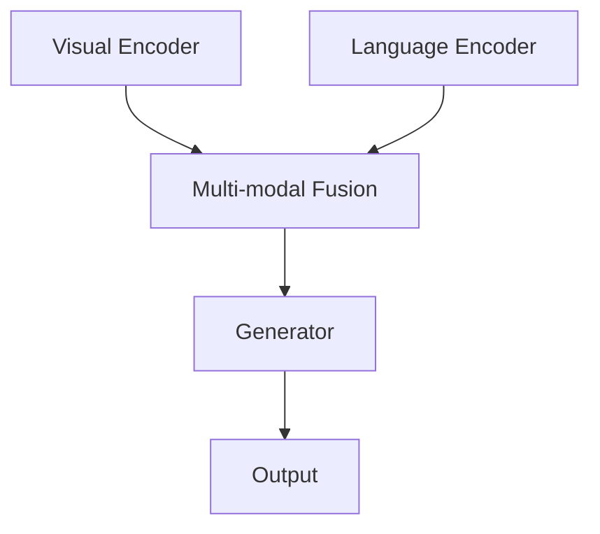
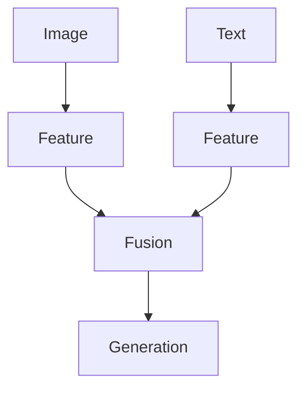
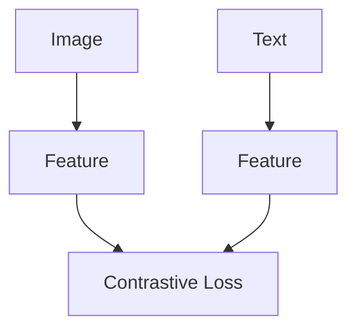
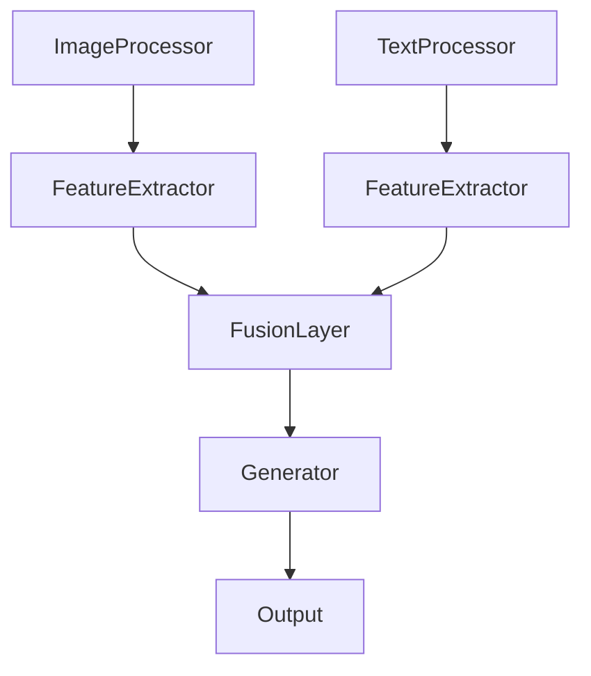
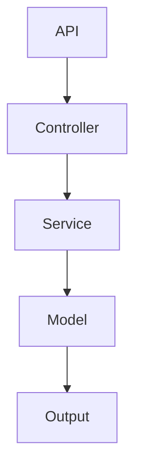
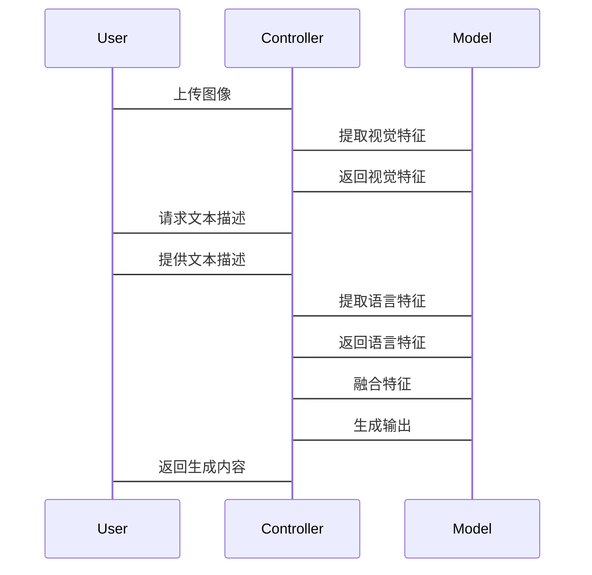

                 


# 开发具有视觉-语言多模态生成能力的AI Agent

> 关键词：视觉-语言多模态生成，AI Agent，多模态模型，生成式AI，深度学习

> 摘要：本文将详细介绍如何开发具有视觉-语言多模态生成能力的AI Agent。从核心概念到算法原理，从系统设计到项目实战，逐步解析实现过程。文章将涵盖视觉与语言的表示方法、多模态模型的训练策略、系统架构设计以及实际案例分析，帮助读者全面掌握相关技术。

---

# 第一部分: 背景与核心概念

## 第1章: 视觉-语言多模态生成AI Agent概述

### 1.1 问题背景与描述

#### 1.1.1 多模态AI的定义与特点
多模态AI是指能够处理和理解多种信息形式（如文本、图像、语音、视频等）的人工智能系统。与单一模态AI相比，多模态AI能够更全面地感知和理解真实世界，从而在复杂场景中提供更智能的服务。视觉-语言多模态生成AI Agent的核心目标是通过整合视觉和语言信息，生成与输入内容相关且有意义的输出。

#### 1.1.2 视觉-语言生成任务的核心问题
视觉-语言生成任务的核心问题是将输入的视觉信息（如图像）与语言信息（如文本描述）进行融合，并生成符合语境的新内容。例如，给定一张图片，生成与图片内容相关的描述性文本或标题。这种任务需要模型同时理解视觉和语言信息，并在生成过程中实现两者的协同工作。

#### 1.1.3 AI Agent的定义与目标
AI Agent（智能体）是一种能够感知环境、执行任务并做出决策的智能系统。视觉-语言多模态生成AI Agent的目标是通过整合视觉和语言信息，提供更智能、更自然的交互方式，从而在多种场景中为用户提供服务。

### 1.2 核心概念与联系

#### 1.2.1 视觉与语言的表示方法对比
视觉信息通常以图像或视频的形式存在，可以表示为二维或三维数据；语言信息则是以文本形式存在，表示为序列数据。视觉信息的处理通常涉及特征提取和编码，而语言信息的处理则依赖于词嵌入和上下文建模。

| 对比维度 | 视觉信息 | 语言信息 |
|----------|----------|----------|
| 表示形式 | 图像/视频 | 文本序列 |
| 处理方式 | 特征提取 | 词嵌入+上下文 |
| 空间维度 | 二维/三维 | 一维序列 |

#### 1.2.2 多模态模型的核心要素与关系
多模态模型的核心要素包括：视觉模态编码器、语言模态编码器、多模态融合模块、生成器。这些模块通过协同工作，实现视觉和语言信息的融合与生成。



#### 1.2.3 ER实体关系图架构
以下是视觉-语言多模态生成任务的实体关系图：



---

# 第二部分: 算法原理与数学模型

## 第2章: 多模态生成模型的算法原理

### 2.1 主流多模态模型原理

#### 2.1.1 BERT与ViT模型原理
BERT（Bidirectional Encoder Representations from Transformers）是一种基于Transformer的预训练语言模型，广泛应用于文本理解任务。ViT（Vision Transformer）是将图像分割为块并使用Transformer进行处理的视觉模型。

#### 2.1.2 CLIP模型的工作流程
CLIP模型通过对比学习将图像和文本特征对齐，具体流程如下：



#### 2.1.3 T5与视觉-语言生成任务
T5（Text-to-Text）是一种基于Transformer的多任务模型，通过将视觉-语言生成任务转化为文本生成任务来实现。

### 2.2 多模态模型的训练方法

#### 2.2.1 对比学习流程
对比学习通过最大化正样本对的相似性来对齐视觉和语言特征。

$$ \text{Loss} = \frac{1}{N} \sum_{i=1}^N \text{CE}(x_i, y_i) $$

#### 2.2.2 多任务学习策略
多任务学习通过共享特征提取部分，同时优化多个任务。

$$ \text{Loss} = \lambda_1 L_1 + \lambda_2 L_2 + \dots $$
其中，$\lambda$ 是调节系数。

#### 2.2.3 知识蒸馏方法
知识蒸馏通过教师模型指导学生模型的训练，减少对标注数据的依赖。

---

## 第3章: 数学模型与公式推导

### 3.1 多模态生成模型的数学基础

#### 3.1.1 语言模型的数学公式
语言模型的生成概率可以表示为：

$$ P(y|x) = \prod_{i=1}^n P(y_i | y_{<i}, x) $$

#### 3.1.2 视觉模型的数学表达
视觉模型的特征提取可以表示为：

$$ f(x) = \text{Encoder}(x) $$

#### 3.1.3 多模态联合生成的数学模型
多模态生成模型的联合分布可以表示为：

$$ P(y|x) = \text{Generator}(x, z) $$

### 3.2 生成模型的数学推导

#### 3.2.1 变分自编码器（VAE）公式
VAE的目标是最小化下界：

$$ \mathcal{L} = \text{KL}(q(z|x) || p(z)) - \mathbb{E}_{q(z|x)}[\log p(x|z)] $$

#### 3.2.2 GAN模型的生成过程
GAN模型的生成器和判别器的目标函数分别为：

$$ G \text{的目标} = \min_{G} \mathbb{E}_{z}[ \log D(G(z))] $$
$$ D \text{的目标} = \min_{D} \mathbb{E}_{x}[ \log D(x)] + \mathbb{E}_{z}[ \log (1 - D(G(z)))] $$

#### 3.2.3 梯度下降优化算法
常用Adam优化器，优化目标函数：

$$ \theta \leftarrow \theta - \eta \nabla_{\theta} \mathcal{L} $$

---

# 第三部分: 系统分析与架构设计

## 第4章: 系统分析与设计

### 4.1 问题场景介绍

#### 4.1.1 任务目标与需求分析
任务目标：开发一个能够处理视觉和语言信息的AI Agent，实现图像描述生成、图像问答等功能。

#### 4.1.2 系统功能模块划分
- 视觉处理模块
- 语言处理模块
- 多模态融合模块
- 生成模块

#### 4.1.3 系统性能指标
- 响应时间
- 准确率
- 模型参数规模

### 4.2 系统架构设计

#### 4.2.1 领域模型设计（Mermaid类图）



#### 4.2.2 系统架构图（Mermaid架构图）



#### 4.2.3 系统接口设计
- 输入接口：接收图像和文本输入
- 输出接口：生成描述性文本或标题
- API接口：提供RESTful服务

#### 4.2.4 系统交互流程（Mermaid序列图）



---

## 第5章: 项目实战

### 5.1 环境安装与配置

#### 5.1.1 安装依赖
- Python 3.8+
- PyTorch
- Transformers库
- Mermaid工具

#### 5.1.2 配置环境
```bash
pip install torch transformers mermaid4jupyter
```

### 5.2 系统核心实现源代码

#### 5.2.1 视觉处理模块
```python
class ImageProcessor:
    def __init__(self, model_name):
        self.model = ViTModel.from_pretrained(model_name)
    
    def process_image(self, image_path):
        # 处理图像并返回特征
        pass
```

#### 5.2.2 语言处理模块
```python
class TextProcessor:
    def __init__(self, model_name):
        self.model = BertModel.from_pretrained(model_name)
    
    def process_text(self, text):
        # 处理文本并返回特征
        pass
```

#### 5.2.3 多模态融合模块
```python
class FusionLayer(nn.Module):
    def __init__(self, input_dim, output_dim):
        super().__init__()
        self.fc = nn.Linear(input_dim, output_dim)
    
    def forward(self, x):
        return self.fc(x)
```

#### 5.2.4 生成模块
```python
class Generator(nn.Module):
    def __init__(self, input_dim, output_dim):
        super().__init__()
        self.fc = nn.Linear(input_dim, output_dim)
        self.softmax = nn.Softmax(dim=-1)
    
    def forward(self, x):
        return self.softmax(self.fc(x))
```

### 5.3 案例分析与详细解读

#### 5.3.1 实际案例分析
假设输入一张猫的图像，生成描述性文本。

### 5.4 项目小结
通过本项目，我们实现了一个简单的视觉-语言多模态生成系统，验证了多模态模型在实际应用中的潜力。

---

## 第6章: 总结与展望

### 6.1 总结
本文详细介绍了开发具有视觉-语言多模态生成能力的AI Agent的过程，从核心概念到算法原理，再到系统设计和项目实战，为读者提供了全面的技术指导。

### 6.2 展望
未来，视觉-语言多模态生成技术将在更多领域得到应用，如教育、医疗、娱乐等。

---

## 第7章: 最佳实践与注意事项

### 7.1 最佳实践
- 合理选择模型参数
- 充分利用预训练模型
- 定期进行模型调优

### 7.2 注意事项
- 数据质量对模型性能影响重大
- 模型训练需要大量计算资源
- 生成结果需进行内容审核

---

## 第8章: 拓展阅读与参考文献

### 8.1 拓展阅读
- 《Transformers: Pre-training of Self-attentional Neural Networks》
- 《Vision Transformers Are Strong at Few-Shot Learning》

### 8.2 参考文献
- Radford, A., et al. "Language Models are Few-Shot Learners." arXiv preprint arXiv:1909.08899 (2019).

---

# 作者：AI天才研究院/AI Genius Institute & 禅与计算机程序设计艺术 /Zen And The Art of Computer Programming

