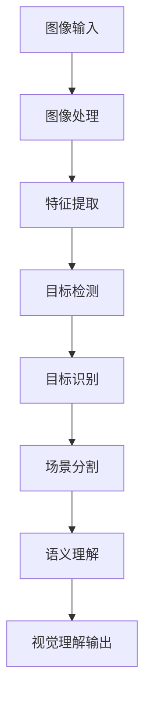
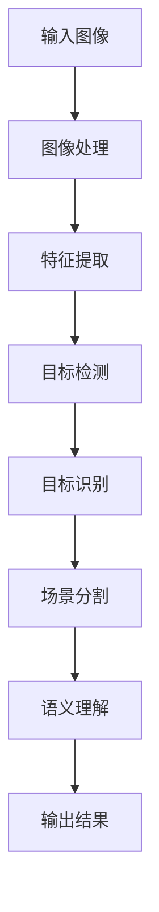
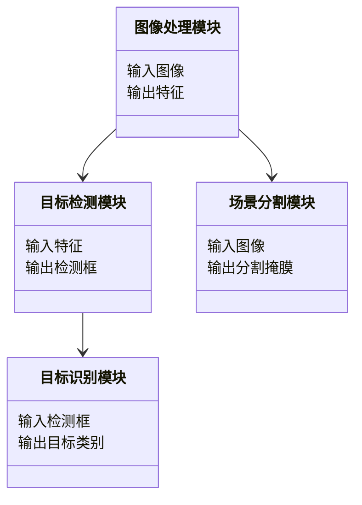
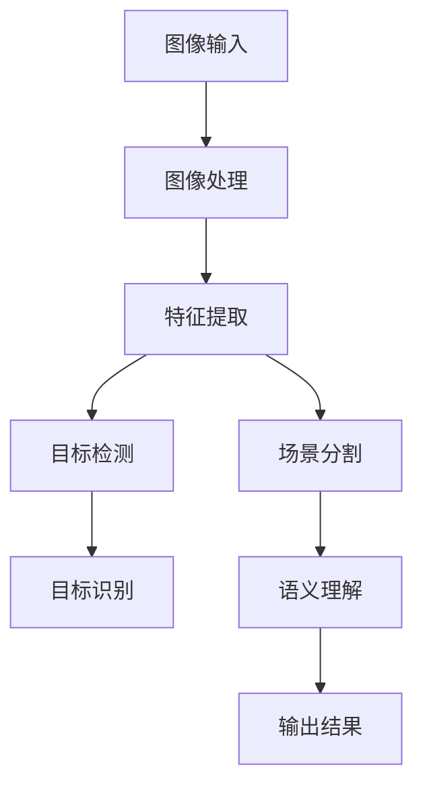

                 


# 开发具有视觉场景理解能力的AI Agent

> 关键词：AI Agent，视觉场景理解，图像处理，深度学习，目标检测，系统架构

> 摘要：本文详细探讨了开发具有视觉场景理解能力的AI Agent的过程，从核心概念到算法实现，再到系统架构设计，旨在帮助读者全面理解并掌握相关技术。

---

## 第一章: 视觉场景理解与AI Agent概述

### 1.1 视觉场景理解的基本概念

#### 1.1.1 什么是视觉场景理解
视觉场景理解是指AI系统能够识别和解析图像或视频中的场景信息，包括物体识别、场景分割、语义理解等。它是计算机视觉领域的重要组成部分，旨在让AI能够像人类一样理解复杂的视觉信息。

#### 1.1.2 AI Agent的基本概念
AI Agent（智能体）是指能够感知环境、做出决策并采取行动的智能系统。AI Agent可以通过传感器获取信息，利用算法处理信息，并根据结果与环境互动。

#### 1.1.3 视觉场景理解在AI Agent中的作用
视觉场景理解是AI Agent的重要能力之一，它使AI能够通过视觉信息感知环境，理解场景中的物体、关系和语义，从而做出更智能的决策和行动。

### 1.2 视觉场景理解的演进与应用

#### 1.2.1 从图像识别到视觉场景理解的演进
图像识别主要关注单个物体的识别，而视觉场景理解则更注重整体场景的理解，包括多个物体之间的关系和上下文信息。

#### 1.2.2 视觉场景理解在不同领域的应用
- **自动驾驶**：识别道路、车辆、行人等元素，理解交通场景。
- **智能安防**：监控视频中的异常行为检测，场景分割等。
- **机器人技术**：帮助机器人理解周围环境，执行复杂任务。

#### 1.2.3 AI Agent在视觉场景理解中的新趋势
随着深度学习和大模型的发展，AI Agent的视觉理解能力逐渐从单一任务转向多任务联合学习，强调实时性和高效性。

### 1.3 本书的核心目标与结构

#### 1.3.1 本书的核心目标
通过系统化的讲解，帮助读者掌握AI Agent的视觉场景理解技术，从理论到实践，全面理解开发过程。

#### 1.3.2 本书的章节结构
- 第1章：背景介绍
- 第2章：核心概念与技术
- 第3章：算法原理
- 第4章：数学模型
- 第5章：系统架构设计
- 第6章：项目实战
- 第7章：总结与展望

#### 1.3.3 学习本书的必要性
随着AI技术的发展，视觉场景理解能力是未来AI Agent的核心竞争力之一，掌握相关技术对从事AI开发的工程师至关重要。

---

## 第二章: 视觉场景理解的核心概念与技术

### 2.1 视觉场景理解的关键技术

#### 2.1.1 图像处理与特征提取
- **图像处理**：包括图像增强、滤波等预处理步骤，提升图像质量。
- **特征提取**：利用CNN等深度学习模型提取图像中的高层次特征。

#### 2.1.2 目标检测与识别
- **目标检测**：通过滑动窗口或区域建议网络（RPN）定位图像中的目标。
- **目标识别**：基于检测结果，利用分类器识别目标类别。

#### 2.1.3 场景分割与语义理解
- **场景分割**：将图像分割为不同区域，每个区域对应不同的语义信息。
- **语义理解**：理解场景中的物体关系、上下文信息等。

### 2.2 AI Agent中的视觉理解模块

#### 2.2.1 视觉理解模块的功能与作用
- **功能**：接收输入图像，输出场景解析结果（如物体位置、类别等）。
- **作用**：为AI Agent提供环境感知能力，支持决策和行动。

#### 2.2.2 视觉理解模块与整体AI Agent的交互
- 视觉理解模块接收环境输入，处理后将结果传递给决策模块，供其做出下一步行动。

#### 2.2.3 视觉理解模块的挑战与解决方案
- **挑战**：复杂场景下的泛化能力不足，实时性要求高等。
- **解决方案**：结合多任务学习、轻量化模型等技术优化性能。

### 2.3 核心概念的联系与对比

#### 2.3.1 核心概念的属性特征对比表格

| 概念         | 输入形式 | 输出形式 | 主要任务 | 关键技术 |
|--------------|----------|----------|----------|----------|
| 图像处理     | 原始图像  | 增强图像  | 提升图像质量 | 滤波、边缘检测 |
| 目标检测     | 图像      | 检测框     | 定位目标   | RPN、Faster R-CNN |
| 场景分割     | 图像      | 分割掩膜   | 划分区域   | U-Net、Mask R-CNN |
| 语义理解     | 分割结果  | 语义标签   | 理解场景   | Transformer、注意力机制 |

#### 2.3.2 ER实体关系图架构的Mermaid流程图



---

## 第三章: 视觉场景理解的算法原理

### 3.1 基于深度学习的视觉理解算法

#### 3.1.1 CNN在视觉理解中的应用
- **CNN结构**：卷积层、池化层、全连接层的组合，提取图像特征。
- **经典模型**：AlexNet、VGG、ResNet等。

#### 3.1.2 Transformer在视觉理解中的应用
- **Transformer结构**：编码器-解码器架构，适用于序列建模和全局关系捕捉。
- **视觉应用**：ViT（Vision Transformer）模型。

#### 3.1.3 图像分割算法的原理与实现
- **全卷积网络（FCN）**：将CNN输出转换为分割结果。
- **U-Net架构**：用于医学图像分割，具有跳跃连接。

### 3.2 算法流程图的Mermaid图



### 3.3 算法实现的代码示例

```python
import tensorflow as tf
from tensorflow.keras import layers

def build_model():
    inputs = layers.Input(shape=(224, 224, 3))
    x = layers.Conv2D(32, (3, 3), activation='relu')(inputs)
    x = layers.MaxPooling2D((2, 2))(x)
    x = layers.Conv2D(64, (3, 3), activation='relu')(x)
    x = layers.MaxPooling2D((2, 2))(x)
    x = layers.Flatten()(x)
    x = layers.Dense(128, activation='relu')(x)
    outputs = layers.Dense(10, activation='softmax')(x)
    return tf.keras.Model(inputs=inputs, outputs=outputs)
```

---

## 第四章: 视觉场景理解的数学模型

### 4.1 基于CNN的图像分类模型

#### 4.1.1 模型结构
- 输入：224x224x3的图像
- 输出：10个类别概率

#### 4.1.2 模型公式
$$
\text{输出概率} = \text{softmax}(Wx + b)
$$

### 4.2 Transformer的数学模型

#### 4.2.1 注意力机制
$$
\text{注意力权重} = \text{softmax}\left(\frac{QK^T}{\sqrt{d_k}}\right)
$$
$$
\text{输出} = \text{Attention}(Q, K, V)
$$

---

## 第五章: 系统架构设计

### 5.1 系统功能设计（领域模型）



### 5.2 系统架构设计（架构图）



---

## 第六章: 项目实战

### 6.1 环境配置
- **Python 3.8+**
- **TensorFlow 2.5+**
- **OpenCV 4.5+**

### 6.2 系统核心实现源代码

```python
import tensorflow as tf
from tensorflow.keras import layers

def build_model():
    inputs = layers.Input(shape=(224, 224, 3))
    x = layers.Conv2D(32, (3, 3), activation='relu')(inputs)
    x = layers.MaxPooling2D((2, 2))(x)
    x = layers.Conv2D(64, (3, 3), activation='relu')(x)
    x = layers.MaxPooling2D((2, 2))(x)
    x = layers.Flatten()(x)
    x = layers.Dense(128, activation='relu')(x)
    outputs = layers.Dense(10, activation='softmax')(x)
    return tf.keras.Model(inputs=inputs, outputs=outputs)

model = build_model()
model.compile(optimizer='adam', loss='sparse_categorical_crossentropy', metrics=['accuracy'])
model.fit(x_train, y_train, epochs=10, batch_size=32)
```

### 6.3 代码应用解读与分析
- **图像预处理**：将图像缩放、归一化等。
- **模型训练**：使用训练数据更新模型参数，优化损失函数。
- **模型评估**：在验证集上评估模型性能，调整超参数。

### 6.4 实际案例分析
- **案例1**：自动驾驶中的场景理解，识别道路上的车辆和行人。
- **案例2**：智能安防中的异常行为检测。

---

## 第七章: 总结与展望

### 7.1 本章总结
本文详细介绍了开发具有视觉场景理解能力的AI Agent的过程，从核心概念到算法实现，再到系统架构设计，为读者提供了全面的知识体系。

### 7.2 学习体会与最佳实践 tips
- **持续学习**：关注深度学习领域的最新进展。
- **实践应用**：通过实际项目巩固理论知识。
- **团队协作**：在团队中分工合作，提高开发效率。

### 7.3 未来展望
随着大模型和多模态技术的发展，AI Agent的视觉场景理解能力将更加智能化和多样化。

---

**作者：AI天才研究院 & 禅与计算机程序设计艺术**

