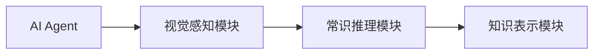
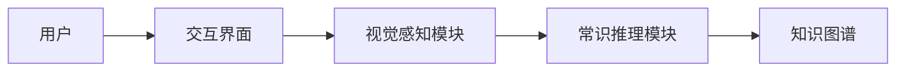
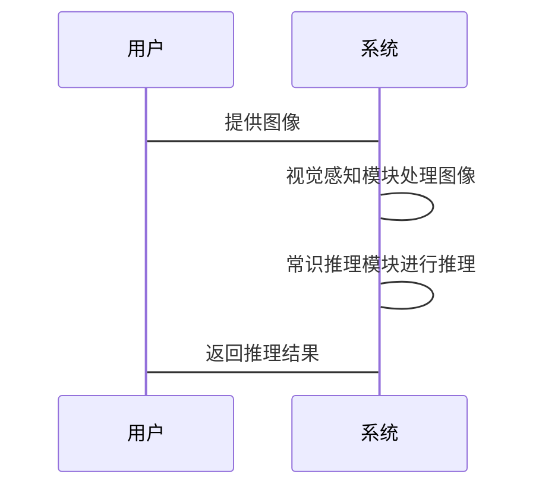

                 


# 开发具有视觉常识推理能力的AI Agent

## 关键词：AI Agent、视觉常识推理、人工智能、计算机视觉、知识图谱、机器学习

## 摘要：本文将详细探讨开发具有视觉常识推理能力的AI Agent的各个方面。从基本概念到算法实现，从系统设计到项目实战，我们将逐步分析如何构建一个能够理解视觉信息并具备常识推理能力的智能体。文章内容涵盖视觉理解、常识推理、系统架构、项目实现等关键环节，帮助读者全面掌握开发此类AI Agent的核心技术与方法。

---

# 目录

1. [引言](#引言)
2. [视觉常识推理的核心概念](#视觉常识推理的核心概念)
3. [视觉理解的算法原理](#视觉理解的算法原理)
4. [常识推理的算法原理](#常识推理的算法原理)
5. [系统设计](#系统设计)
6. [项目实战](#项目实战)
7. [优化与扩展](#优化与扩展)
8. [总结](#总结)

---

## 1. 引言

### 1.1 问题背景与重要性

#### 1.1.1 AI Agent的基本概念
AI Agent（智能体）是指在环境中能够感知并自主行动以实现目标的实体。它可以是一个软件程序，也可以是一个物理机器人。AI Agent的核心能力包括感知、决策、规划和执行。

#### 1.1.2 视觉常识推理的定义与特点
视觉常识推理是指AI Agent能够通过视觉信息（如图像或视频）理解和推理出与现实世界相关的常识性知识。其特点包括：
- **多模态融合**：结合视觉信息和常识知识。
- **场景理解**：能够理解复杂场景中的物体、关系和事件。
- **推理能力**：基于常识进行推理，解决视觉信息中的不确定性。

#### 1.1.3 开发具有视觉常识推理能力的AI Agent的意义
开发这种AI Agent可以广泛应用于多个领域，如智能助手、自动驾驶、智能安防等。它能够显著提升AI系统的理解和决策能力，使其更接近人类的智能水平。

### 1.2 问题描述与解决思路

#### 1.2.1 当前AI Agent的局限性
- **视觉理解的局限**：难以处理复杂场景中的语义信息。
- **常识推理的不足**：无法有效利用常识知识进行推理。
- **多模态数据的融合问题**：视觉信息与其他数据的融合不够充分。

#### 1.2.2 视觉常识推理的核心问题
- **如何有效融合视觉数据和常识知识？**
- **如何构建高效的推理机制？**
- **如何处理视觉信息中的不确定性？**

#### 1.2.3 解决方案与技术路线
- **技术路线**：基于深度学习的视觉理解 + 知识图谱的常识推理。
- **关键步骤**：
  1. 构建视觉数据集。
  2. 训练视觉理解模型。
  3. 构建常识知识图谱。
  4. 集成视觉理解和常识推理模块。

## 2. 视觉常识推理的核心概念

### 2.1 核心概念与原理

#### 2.1.1 视觉理解与常识推理的结合
- 视觉理解：从图像中提取物体、场景和事件信息。
- 常识推理：基于常识知识对视觉信息进行推理和解释。

#### 2.1.2 视觉常识推理的系统组成
- **视觉感知模块**：负责图像的特征提取和目标检测。
- **常识推理模块**：基于常识知识进行推理和决策。
- **知识表示模块**：存储和管理常识知识。

#### 2.1.3 知识表示与推理机制
- **知识表示**：使用知识图谱表示常识知识。
- **推理机制**：基于逻辑推理或概率推理进行推理。

### 2.2 核心概念的联系与对比

#### 2.2.1 知识图谱与视觉数据的关系
- 知识图谱提供常识知识，视觉数据提供场景信息。
- 两者通过语义对齐进行融合。

#### 2.2.2 不同推理方法的对比分析
| 推理方法 | 描述 | 优缺点 |
|----------|------|--------|
| 基于规则的推理 | 使用预定义的规则进行推理 | 易理解，但灵活性差 |
| 基于逻辑的推理 | 使用逻辑表达式进行推理 | 表达能力强，但计算复杂 |
| 基于概率的推理 | 使用概率模型进行推理 | 能处理不确定性，但计算量大 |

#### 2.2.3 系统架构的实体关系图


---

## 3. 视觉理解的算法原理

### 3.1 视觉理解的核心算法

#### 3.1.1 目标检测算法
- **YOLO算法**：一种高效的实时目标检测算法。
- **Faster R-CNN**：基于区域建议的检测算法。

#### 3.1.2 语义分割算法
- **U-Net**：经典的医学图像分割算法。
- **Mask R-CNN**：结合目标检测和语义分割的算法。

#### 3.1.3 图像描述生成算法
- **Caption-Net**：基于图像生成描述文本的模型。

### 3.2 算法原理的数学模型

#### 3.2.1 目标检测的损失函数
$$
\text{损失函数} = \text{分类损失} + \text{定位损失}
$$

### 3.3 算法实现的Python代码示例

#### 3.3.1 使用YOLO进行目标检测的代码
```python
import numpy as np
from tensorflow.keras.models import Model
from tensorflow.keras.layers import Input, Dense, Activation

# 定义YOLO模型
def build_model():
    input_tensor = Input(shape=(416, 416, 3))
    x = input_tensor
    x = Conv2D(32, (3,3), strides=(1,1), padding='same')(x)
    x = Activation('relu')(x)
    # ... 其他层 ...
    model = Model(inputs=input_tensor, outputs=x)
    return model

model = build_model()
model.compile(optimizer='adam', loss='binary_crossentropy')
```

## 4. 常识推理的算法原理

### 4.1 常识推理的核心算法

#### 4.1.1 知识图谱构建
- **知识抽取**：从文本中抽取实体和关系。
- **知识存储**：将实体和关系存储到知识图谱中。

#### 4.1.2 基于知识图谱的推理算法
- **路径查询**：通过查询知识图谱中的路径进行推理。
- **基于图神经网络的推理**：利用图神经网络进行推理。

#### 4.1.3 基于神经网络的推理模型
- **TransE**：通过嵌入表示进行推理。
- **KG-Transformer**：基于Transformer的常识推理模型。

### 4.2 算法原理的数学模型

#### 4.2.1 知识图谱的表示方法
$$
\text{实体表示} = \text{向量表示}
$$

#### 4.2.2 基于图神经网络的推理公式
$$
h = \text{GCN}(x, A)
$$
其中，\( x \) 是输入向量，\( A \) 是图的邻接矩阵，\( h \) 是输出向量。

### 4.3 算法实现的Python代码示例

#### 4.3.1 知识图谱构建的代码
```python
from kgneo import KG

kg = KG()
kg.add_entity("猫", "动物")
kg.add_relation("属于", "猫", "动物")
```

---

## 5. 系统设计

### 5.1 系统架构设计

#### 5.1.1 系统功能设计
- **视觉感知**：目标检测、语义分割。
- **常识推理**：基于知识图谱的推理。
- **交互接口**：人机交互界面。

#### 5.1.2 系统架构图


### 5.2 系统接口设计

#### 5.2.1 接口定义
- **输入接口**：图像输入。
- **输出接口**：推理结果输出。

### 5.3 系统交互流程

#### 5.3.1 交互流程图


---

## 6. 项目实战

### 6.1 环境配置

#### 6.1.1 安装依赖
```bash
pip install tensorflow keras numpy matplotlib
```

### 6.2 系统核心实现

#### 6.2.1 视觉理解模块实现
```python
import tensorflow as tf
from tensorflow.keras import layers

def visual_understanding_model():
    input_tensor = layers.Input(shape=(224, 224, 3))
    x = layers.Conv2D(64, (3,3), activation='relu')(input_tensor)
    x = layers.MaxPooling2D((2,2))(x)
    # ... 其他层 ...
    model = Model(inputs=input_tensor, outputs=x)
    return model
```

#### 6.2.2 常识推理模块实现
```python
from kgneo import KG, infer

kg = KG()
kg.add_entity("猫", "动物")
kg.add_relation("属于", "猫", "动物")

def infer_model():
    result = infer("猫", "属于")
    return result
```

### 6.3 实际案例分析

#### 6.3.1 案例分析
给定一张猫的图像，系统能够识别出猫，并推理出“猫属于动物”这一常识。

---

## 7. 优化与扩展

### 7.1 性能优化

#### 7.1.1 模型压缩
- **剪枝**：去除冗余参数。
- **量化**：降低模型参数的精度。

### 7.2 模型扩展

#### 7.2.1 多模态扩展
- **文本与视觉结合**：进一步提升推理能力。

### 7.3 伦理问题

#### 7.3.1 数据隐私
- 确保数据的隐私和安全。

---

## 8. 总结

开发具有视觉常识推理能力的AI Agent是一项具有挑战性的任务，但其应用前景广阔。通过本文的详细讲解，读者可以系统地了解从概念到实现的全过程。未来的研究方向包括更高效的推理算法和更强大的多模态融合技术。

---

## 作者：AI天才研究院 & 禅与计算机程序设计艺术

作者简介：
- **AI天才研究院**：专注于人工智能领域的研究与实践，致力于推动AI技术的发展。
- **禅与计算机程序设计艺术**：以禅的思维方式探索计算机程序设计的美学与哲学。

---

通过本文，读者可以掌握开发具有视觉常识推理能力的AI Agent的核心技术，为后续的研究和实践奠定坚实的基础。

