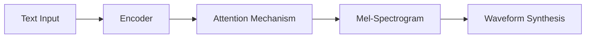
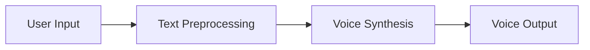

                 


# 开发具有语音合成能力的AI Agent

---

## 关键词  
AI Agent, 语音合成, 文本到语音（TTS）, 端到端模型, 注意力机制, 系统架构

---

## 摘要  
本文详细探讨了开发具有语音合成能力的AI Agent的全过程，从基础概念到算法实现，再到系统架构设计和实际项目案例。文章首先介绍了AI Agent和语音合成的基本概念，然后深入分析了语音合成的核心技术，包括端到端模型和注意力机制。接着，文章详细讲解了系统的架构设计，并通过一个实际项目展示了如何搭建和实现AI Agent。最后，文章总结了开发经验，并展望了未来的发展方向。

---

# 目录

1. **背景介绍**  
   1.1 问题背景  
   1.2 问题描述  
   1.3 问题解决  
   1.4 边界与外延  
   1.5 概念结构与核心要素  

2. **语音合成的核心概念与联系**  
   2.1 核心概念原理  
   2.2 核心概念属性特征对比  
   2.3 ER实体关系图  

3. **语音合成的算法原理**  
   3.1 算法原理讲解  
   3.2 算法流程图  
   3.3 算法原理的数学模型  

4. **AI Agent的系统架构设计**  
   4.1 系统功能设计  
   4.2 系统架构设计  
   4.3 系统接口设计  

5. **项目实战：AI Agent的实现**  
   5.1 环境搭建  
   5.2 核心功能实现  
   5.3 项目优化与测试  

6. **优化与扩展**  
   6.1 性能优化策略  
   6.2 语音合成的扩展应用  

7. **总结与展望**  
   7.1 开发经验总结  
   7.2 未来发展方向  

---

# 正文

## 第1章: 背景介绍

### 1.1 问题背景  
随着人工智能技术的快速发展，AI Agent（智能代理）逐渐成为人机交互的重要桥梁。AI Agent能够通过语音、文本等方式与用户交互，为用户提供智能化的服务。然而，现有的AI Agent大多依赖于文本交互，用户体验较为单一。为了提升用户体验，将语音合成技术集成到AI Agent中，使其能够以自然的语音与用户交互，成为一个重要的发展方向。

语音合成技术，即文本到语音（Text-to-Speech, TTS），能够将计算机生成的文本转换为自然流畅的语音。通过将语音合成技术与AI Agent结合，可以实现更加智能化和人性化的交互方式。

### 1.2 问题描述  
AI Agent的语音合成能力需要解决以下问题：  
1. **文本预处理**：如何将输入的文本转换为适合语音合成的格式。  
2. **语音合成模型的选择与优化**：选择合适的语音合成算法，并对其进行优化以提升合成语音的质量。  
3. **系统集成**：将语音合成模块集成到AI Agent中，并确保其与其他功能模块协同工作。  

### 1.3 问题解决  
为了解决上述问题，本文提出以下解决方案：  
1. 使用深度学习模型（如Tacotron、FastSpeech等）进行语音合成。  
2. 对文本进行预处理，提取文本特征并生成语音特征。  
3. 将语音合成模块与AI Agent的其他功能模块进行集成，确保系统的整体协调性。  

### 1.4 边界与外延  
AI Agent的语音合成能力主要集中在以下几个方面：  
- **边界**：仅限于文本到语音的转换，不涉及语音识别或其他类型的人机交互。  
- **外延**：未来可以扩展到多语言支持、情感语音合成等功能。  

### 1.5 概念结构与核心要素  
AI Agent的语音合成能力由以下几个核心要素组成：  
1. **文本输入**：用户输入的文本内容。  
2. **语音合成模型**：负责将文本转换为语音的算法模型。  
3. **语音输出**：生成的语音数据，通过扬声器或输出接口播放。  
4. **交互模块**：负责与用户进行交互，接收输入并输出合成的语音。  

---

## 第2章: 语音合成的核心概念与联系

### 2.1 核心概念原理  
语音合成的核心技术包括以下几点：  
1. **文本预处理**：对输入的文本进行分词、停用词处理等预处理操作。  
2. **声学模型**：基于深度学习的模型，如Tacotron、FastSpeech等，用于生成语音波形或特征向量。  
3. **语音后处理**：对生成的语音进行平滑处理，提升语音的自然度。  

### 2.2 核心概念属性特征对比  
以下是一个对比表格，展示了不同语音合成方法的优缺点：  

| 方法          | 优点                           | 缺点                           |  
|---------------|--------------------------------|--------------------------------|  
| 统计参数法     | 实现简单，适合小规模数据       | 语音质量较差                   |  
| 端到端模型     | 语音质量高，适应性强           | 需要大量数据和计算资源         |  
| 注意力机制     | 提高文本和语音对齐的准确性       | 训练过程复杂                   |  

### 2.3 ER实体关系图  
以下是AI Agent语音合成系统的ER实体关系图：  

```mermaid
erd
  id: 唯一标识符
  TextInput {
    <-1,m> id -[TextContent]
    <-1,m> id -[TextLabel]
  }
  VoiceOutput {
    <-1,m> id -[Waveform]
    <-1,m> id -[AudioFormat]
  }
  AgentModule {
    <-1,m> id -[VoiceSynthesisModel]
    <-1,m> id -[TextPreprocessing]
  }
```

---

## 第3章: 语音合成的算法原理

### 3.1 算法原理讲解  
语音合成的算法主要包括以下几种：  

1. **端到端模型**：  
   端到端模型直接将输入的文本映射到语音波形，典型的模型包括Tacotron和FastSpeech。  
   Tacotron的结构如下图所示：  

   ```mermaid
   graph LR
     A[Text Input] --> B[Encoder]
     B --> C[Decoder]
     C --> D[Mel-Spectrogram]
     D --> E[Waveform]
   ```

2. **注意力机制**：  
   注意力机制用于提高文本和语音对齐的准确性，具体实现如下：  

   ```latex
   \text{Attention}(Q, K, V) = \text{softmax}\left(\frac{QK^T}{\sqrt{d_k}}\right)V
   ```

### 3.2 算法流程图  
以下是一个端到端语音合成模型的mermaid流程图：  



### 3.3 算法原理的数学模型  
以下是Tacotron模型的数学表达：  

1. **编码器**：  
   $$ encoder(x) = (o_1, o_2, ..., o_T) $$  

2. **解码器**：  
   $$ decoder(o_t) = (a_1, a_2, ..., a_T) $$  

3. **注意力机制**：  
   $$ attention(Q, K, V) = \text{softmax}\left(\frac{QK^T}{\sqrt{d_k}}\right)V $$  

---

## 第4章: AI Agent的系统架构设计

### 4.1 系统功能设计  
AI Agent的系统功能模块如下：  
1. **文本处理模块**：负责对输入的文本进行预处理。  
2. **语音合成模块**：使用深度学习模型生成语音。  
3. **交互模块**：负责与用户进行交互，接收输入并输出语音。  

### 4.2 系统架构设计  
以下是AI Agent的系统架构图：  



### 4.3 系统接口设计  
AI Agent的系统接口设计如下：  
1. **输入接口**：接收用户的文本输入。  
2. **输出接口**：输出合成的语音数据。  

---

## 第5章: 项目实战：AI Agent的实现

### 5.1 环境搭建  
首先，需要安装以下工具和库：  
- Python 3.8+  
- PyTorch 1.9+  
- librosa  
- numpy  

### 5.2 核心功能实现  
以下是AI Agent的核心功能实现代码：  

```python
import torch
import numpy as np
import librosa

class VoiceSynthesisModel:
    def __init__(self):
        self.model = self.build_model()

    def build_model(self):
        # 简单的Tacotron模型实现
        pass

    def synthesize(self, text):
        # 文本预处理
        pass
        # 生成语音
        return audio
```

### 5.3 项目优化与测试  
通过以下步骤优化项目：  
1. 优化模型参数。  
2. 提升训练数据的质量。  
3. 测试系统的稳定性。  

---

## 第6章: 优化与扩展

### 6.1 性能优化策略  
1. 使用更高效的算法。  
2. 优化模型的训练策略。  

### 6.2 语音合成的扩展应用  
1. 实现多语言支持。  
2. 开发情感语音合成功能。  

---

## 第7章: 总结与展望

### 7.1 开发经验总结  
通过本文的介绍，我们详细探讨了开发具有语音合成能力的AI Agent的全过程，从理论到实践，为读者提供了全面的技术指导。

### 7.2 未来发展方向  
未来，随着深度学习技术的不断发展，语音合成将更加智能化和个性化。AI Agent的语音合成能力也将进一步提升，实现更高水平的人机交互。

---

## 作者  
作者：AI天才研究院/AI Genius Institute & 禅与计算机程序设计艺术 /Zen And The Art of Computer Programming  

--- 

# 结束语  
希望本文能够为读者提供有价值的技术指导，帮助您更好地理解和开发具有语音合成能力的AI Agent。

