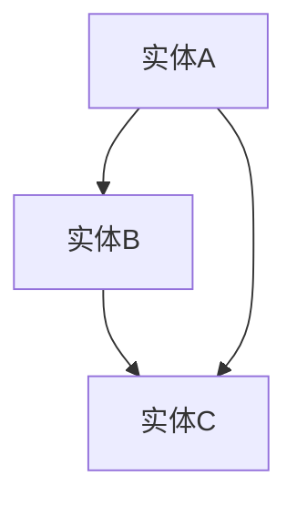
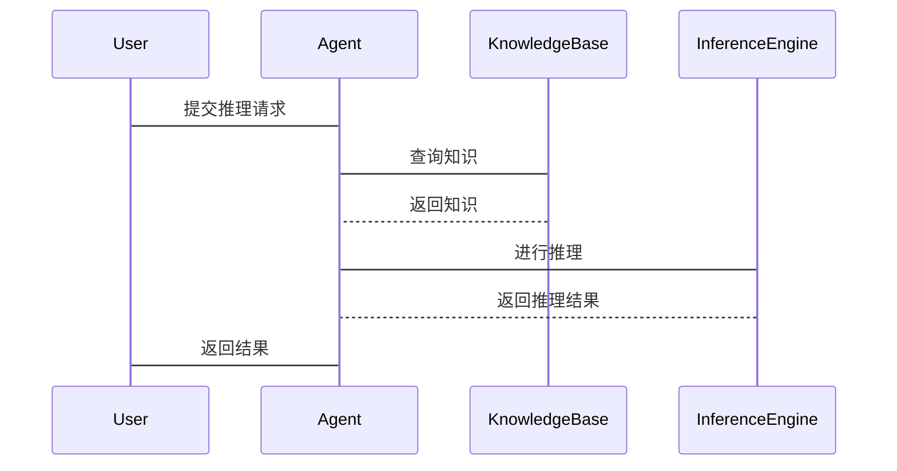

                 


# 开发具有跨域知识推理能力的AI Agent

## 关键词：
AI Agent、跨域知识推理、知识图谱、分布式表示、符号逻辑推理、系统架构设计

## 摘要：
本文详细探讨了开发具有跨域知识推理能力的AI Agent的关键技术与实现方法。从背景介绍到核心概念，再到算法原理和系统架构设计，最后通过项目实战和最佳实践，全面解析如何构建能够整合多领域知识、进行高效推理的智能代理系统。

---

## 第一部分: 背景介绍

### 第1章: 跨域知识推理能力的AI Agent概述

#### 1.1 问题背景
人工智能（AI）代理（Agent）是指在特定环境中感知信息并采取行动以实现目标的智能实体。传统AI Agent通常局限于单一领域，缺乏处理跨领域知识的能力，导致在复杂问题上的表现受限。例如，在医疗领域，AI Agent可能只能处理诊断数据，但无法结合患者的社会背景、生活习惯等多领域信息进行综合推理。

#### 1.2 问题描述
跨域知识推理的核心问题在于如何将来自不同领域的知识有效地整合，并在此基础上进行推理和决策。具体挑战包括：
1. **知识孤岛问题**：不同领域之间的知识难以有效整合。
2. **推理复杂性**：跨领域推理需要处理多种类型的数据和逻辑关系。
3. **数据异构性**：不同领域的数据格式和语义差异较大。

#### 1.3 问题解决
为了解决上述问题，跨域知识推理AI Agent需要实现以下目标：
1. **知识整合**：将来自不同领域的知识进行统一表示和管理。
2. **推理能力**：基于跨领域知识进行逻辑推理和决策。
3. **多模态数据处理**：同时处理结构化、半结构化和非结构化数据。

#### 1.4 边界与外延
跨域知识推理AI Agent的边界主要在于其知识整合和推理能力的范围。它不同于单一领域AI Agent，也不同于通用人工智能（AGI），而是介于两者之间的一种特定能力。其外延包括但不限于：
1. **领域扩展性**：支持多个领域的知识整合。
2. **推理深度**：能够进行多层次的逻辑推理。

#### 1.5 概念结构与核心要素
跨域知识推理AI Agent的核心要素包括：
1. **知识表示层**：负责知识的存储和表示。
2. **推理引擎层**：负责基于知识进行推理和决策。
3. **交互接口层**：负责与用户或其他系统的交互。

---

## 第二部分: 核心概念与联系

### 第2章: 知识表示与推理模型

#### 2.1 知识表示方法
知识表示是跨域知识推理的基础，常用的表示方法包括：
1. **符号表示法**：使用符号和规则表示知识，例如谓词逻辑。
2. **图表示法**：使用图结构表示实体及其关系，例如知识图谱。
3. **分布式表示法**：使用向量表示知识，例如Word2Vec。

#### 2.2 推理模型原理
推理模型是跨域知识推理的核心，常见的推理模型包括：
1. **基于规则的推理**：通过预定义的规则进行推理，例如专家系统。
2. **基于概率的推理**：通过概率模型进行推理，例如贝叶斯网络。
3. **基于深度学习的推理**：通过神经网络进行推理，例如图神经网络。

#### 2.3 知识图谱构建
知识图谱是一种将结构化知识表示为图数据的模型，其构建过程包括：
1. **知识抽取**：从文本或数据库中抽取实体和关系。
2. **知识整合**：将不同来源的知识进行整合和统一。
3. **知识存储**：将整合后的知识存储为图结构。

#### 2.4 实体关系图（ER图）
以下是实体关系图的示例：


---

## 第三部分: 算法原理讲解

### 第3章: 跨域知识融合与推理算法

#### 3.1 基于图的推理
基于图的推理算法通过构建知识图谱进行推理，例如：
- **路径查询**：通过查询图中的路径来验证推理。
- **图神经网络**：使用图神经网络进行推理和预测。

#### 3.2 符号逻辑推理
符号逻辑推理通过预定义的规则进行推理，例如：
- **一阶逻辑推理**：通过一阶逻辑公式进行推理。
- **规则引擎**：通过规则引擎进行推理和决策。

#### 3.3 算法实现
以下是符号逻辑推理算法的伪代码实现：
```python
def symbolical_reasoning(knowledge_base, query):
    for rule in knowledge_base:
        if matches(rule, query):
            return apply_rule(rule, query)
    return None
```

#### 3.4 数学模型
符号逻辑推理的数学模型可以表示为：
$$
\text{结论} = \text{推理规则} \times \text{前提}
$$

---

## 第四部分: 系统架构设计

### 第4章: 系统架构设计与实现

#### 4.1 问题场景介绍
跨域知识推理AI Agent的应用场景包括医疗、金融、教育等领域。例如，在医疗领域，AI Agent需要结合患者的病历数据、生活习惯、药物信息等多领域知识进行诊断推理。

#### 4.2 系统功能设计
系统功能设计包括：
1. **知识抽取模块**：从多种数据源抽取知识。
2. **知识整合模块**：将抽取的知识进行整合和统一。
3. **推理引擎模块**：基于整合的知识进行推理和决策。

#### 4.3 系统架构设计
以下是系统架构的类图：
```mermaid
classDiagram
    class Agent {
        - knowledge_base
        - inference_engine
        + reason()
    }
    class KnowledgeBase {
        - entities
        - relations
        + get_entity()
        + get_relation()
    }
    class InferenceEngine {
        - rules
        + infer()
    }
    Agent o KnowledgeBase
    Agent o InferenceEngine
```

#### 4.4 系统接口设计
系统接口设计包括：
1. **知识抽取接口**：用于从数据源抽取知识。
2. **推理接口**：用于进行推理和决策。
3. **结果解释接口**：用于解释推理结果。

#### 4.5 系统交互流程
以下是系统交互流程的序列图：


---

## 第五部分: 项目实战

### 第5章: 项目实战与分析

#### 5.1 环境安装
项目实战需要安装以下环境：
1. Python 3.8+
2. PyTorch 1.9+
3. NetworkX 2.6+

#### 5.2 系统核心实现
以下是知识图谱构建的Python代码实现：
```python
import networkx as nx

def build_knowledge_graph(entities, relations):
    graph = nx.Graph()
    for entity in entities:
        graph.add_node(entity)
    for relation in relations:
        graph.add_edge(relation[0], relation[1])
    return graph

# 示例
entities = ['A', 'B', 'C']
relations = [('A', 'B'), ('B', 'C'), ('A', 'C')]
graph = build_knowledge_graph(entities, relations)
print(graph.nodes())
print(graph.edges())
```

#### 5.3 代码解读
1. **知识图谱构建**：通过NetworkX库构建知识图谱。
2. **推理引擎实现**：基于符号逻辑进行推理。

#### 5.4 实际案例分析
实际案例分析包括：
1. **医疗领域**：结合患者的病历数据、生活习惯等信息进行诊断推理。
2. **金融领域**：结合财务数据、市场趋势等信息进行投资决策。

#### 5.5 项目小结
项目小结包括：
1. 项目实现的关键技术。
2. 项目实现的经验与教训。

---

## 第六部分: 最佳实践

### 第6章: 最佳实践与总结

#### 6.1 开发建议
1. **选择合适的知识表示方法**：根据具体需求选择符号表示、图表示或分布式表示。
2. **优化推理算法**：根据推理需求选择合适的推理算法，并进行性能优化。

#### 6.2 注意事项
1. **数据质量**：确保数据的准确性和完整性。
2. **知识更新**：定期更新知识库，保持知识的时效性。

#### 6.3 未来趋势
跨域知识推理AI Agent的未来发展趋势包括：
1. **多模态数据处理**：结合文本、图像、语音等多种数据类型进行推理。
2. **自适应推理**：实现动态调整推理策略的能力。

---

## 结语

开发具有跨域知识推理能力的AI Agent是一项具有挑战性的任务，但也具有广阔的应用前景。通过本文的系统介绍和详细讲解，希望能够帮助读者掌握跨域知识推理的核心技术，并在实际应用中发挥其潜力。

---

## 作者：AI天才研究院 & 禅与计算机程序设计艺术

作者简介：
AI天才研究院（AI Genius Institute）专注于人工智能领域的研究与实践，致力于推动AI技术的创新与应用。禅与计算机程序设计艺术（Zen And The Art of Computer Programming）关注程序设计的哲学与艺术，探索技术与人类智慧的结合。

---

希望这篇博客文章能够为读者提供有价值的内容和启发。

