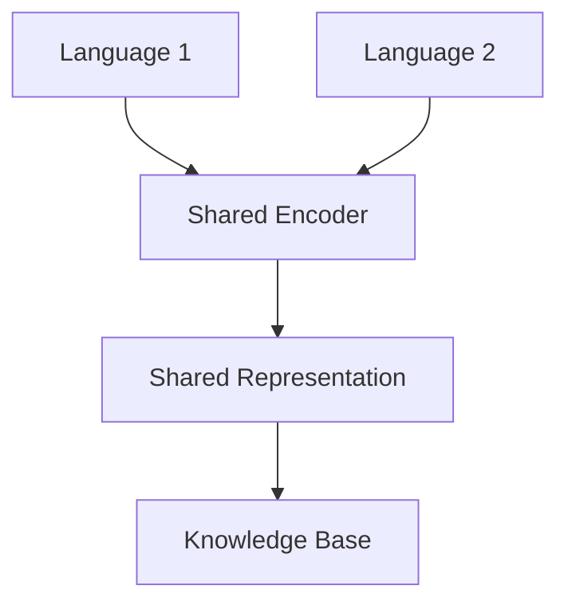
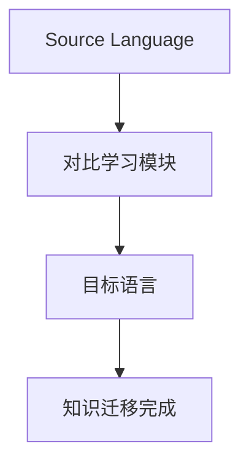
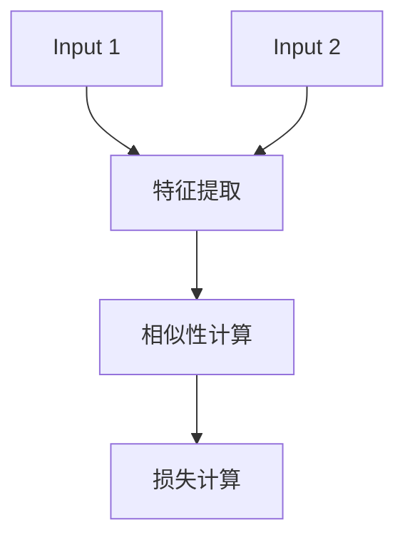
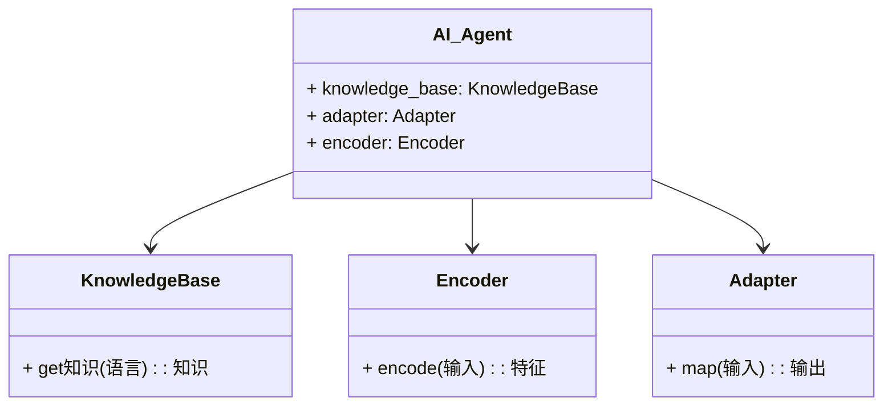
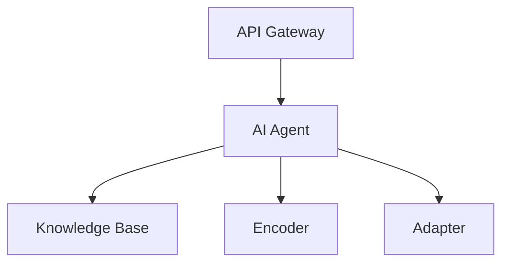
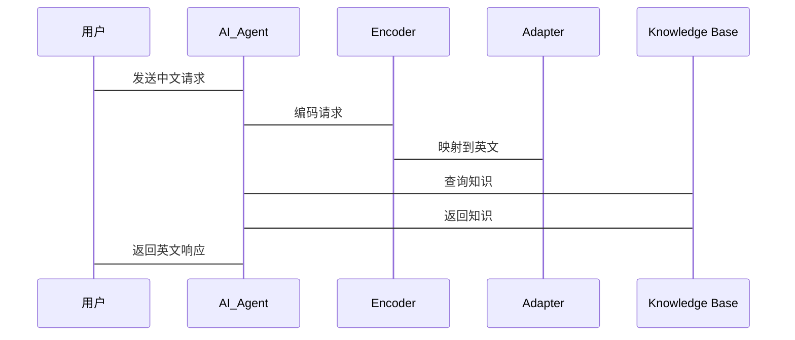

                 


# 开发具有跨语言知识迁移能力的AI Agent

> 关键词：AI Agent, 跨语言知识迁移, 多语言模型, 对比学习, 知识图谱, 自适应映射

> 摘要：本文系统地探讨了开发具有跨语言知识迁移能力的AI Agent的关键技术。首先，我们从问题背景出发，分析了跨语言知识迁移的必要性。接着，详细阐述了核心概念与理论，包括对比学习、自适应映射等算法原理。然后，我们从系统架构的角度，设计了一个多语言AI Agent的框架，并通过实际案例展示了知识迁移的实现过程。最后，我们总结了当前技术的局限性，并展望了未来的发展方向。

---

# 第一部分: 背景介绍

## 第1章: 问题背景与核心概念

### 1.1 问题背景

#### 1.1.1 多语言环境下的AI Agent需求
在当今的全球化背景下，AI Agent需要能够处理多种语言的输入和输出。例如，一个多语言客服系统需要理解用户的多种语言请求，并以适当的语言进行回应。然而，现有的AI Agent往往局限于单一语言环境，难以在跨语言场景中有效工作。

#### 1.1.2 知识迁移的必要性
知识迁移是指将一种语言的知识和经验应用到另一种语言的能力。在多语言环境中，AI Agent需要通过知识迁移来快速适应不同的语言环境。例如，在学习中文后，AI Agent需要能够快速适应英文，而不需要从头开始训练。

#### 1.1.3 当前技术的局限性
当前的AI Agent在跨语言知识迁移方面存在以下问题：
- 语言间的语义差异难以建模。
- 知识表示缺乏统一性。
- 迁移学习的效果不稳定。

### 1.2 核心概念

#### 1.2.1 跨语言知识迁移的定义
跨语言知识迁移是指将一种语言的知识和经验迁移到另一种语言，以提高AI Agent在目标语言环境下的性能。

#### 1.2.2 AI Agent的基本概念
AI Agent是一种智能体，能够感知环境、执行任务并做出决策。AI Agent的核心能力包括自然语言处理、知识表示和推理能力。

#### 1.2.3 知识迁移的核心要素
- **知识表示**：知识的存储和表达方式。
- **语义对齐**：不同语言之间的语义对齐。
- **迁移策略**：知识迁移的具体方法。

### 1.3 跨语言知识迁移的必要性

#### 1.3.1 多语言场景下的挑战
- 多语言环境下的数据稀疏性。
- 不同语言之间的语义差异。

#### 1.3.2 知识迁移的优势
- 节省训练时间。
- 提高模型的泛化能力。

#### 1.3.3 应用场景分析
- 多语言客服系统。
- 跨语言信息检索。

---

## 第2章: 跨语言知识迁移的核心概念与联系

### 2.1 跨语言表示学习

#### 2.1.1 表示学习的定义
表示学习是一种通过学习数据的低维表示来捕捉数据本质特征的方法。

#### 2.1.2 跨语言表示的核心原理
- 将不同语言的词汇或句子映射到一个共享的向量空间。
- 通过对比学习实现不同语言之间的语义对齐。

#### 2.1.3 表示学习的数学模型
$$ \text{损失函数} = \sum_{i=1}^n (y_i - y_i')^2 $$

### 2.2 多语言模型架构

#### 2.2.1 多语言模型的架构类型
- **共享编码器**：多个语言共享一个编码器。
- **独立编码器**：每种语言都有独立的编码器。

#### 2.2.2 各种架构的优缺点对比
| 架构类型 | 优点 | 缺点 |
|----------|------|------|
| 共享编码器 | 参数共享，节省资源 | 可能无法捕捉语言间的差异 |
| 独立编码器 | 更精准的语义表示 | 参数量大 |

#### 2.2.3 实体关系图（ER图）分析


### 2.3 知识迁移机制

#### 2.3.1 知识迁移的基本原理
- 通过对比学习实现不同语言之间的知识对齐。
- 使用自适应映射技术将源语言的知识迁移到目标语言。

#### 2.3.2 不同迁移策略的对比
| 迁移策略 | 描述 |
|----------|------|
| 直接迁移 | 直接使用源语言模型迁移到目标语言 |
| 对比迁移 | 通过对比学习实现知识对齐 |

#### 2.3.3 知识迁移的流程图（Mermaid）


---

## 第3章: 对比学习与自适应映射

### 3.1 对比学习原理

#### 3.1.1 对比学习的定义
对比学习是一种通过比较不同数据点的相似性来学习特征表示的方法。

#### 3.1.2 对比学习的数学模型
$$ \text{损失函数} = \sum_{i=1}^n \log(\frac{1}{1 + e^{-y_i}}) $$

#### 3.1.3 对比学习的流程图（Mermaid）


### 3.2 自适应映射机制

#### 3.2.1 自适应映射的定义
自适应映射是一种动态调整映射关系的技术，用于实现不同语言之间的知识迁移。

#### 3.2.2 自适应映射的实现方法
- 使用神经网络进行映射关系的学习。
- 通过对比学习实现映射关系的优化。

#### 3.2.3 自适应映射的代码实现（Python示例）
```python
class Adapter(nn.Module):
    def __init__(self, input_dim, output_dim):
        super(Adapter, self).__init__()
        self.mapping = nn.Linear(input_dim, output_dim)
        
    def forward(self, x):
        return self.mapping(x)
```

### 3.3 对比学习与自适应映射的结合

#### 3.3.1 结合原理
通过对比学习实现不同语言之间的语义对齐，再通过自适应映射实现知识的迁移。

#### 3.3.2 结合的数学模型
$$ y = f(x) + \text{Adapter}(f(x)) $$

#### 3.3.3 结合的代码实现（Python示例）
```python
def contrastive_loss(x1, x2, adapter):
    x1_embed = encoder(x1)
    x2_embed = encoder(x2)
    x2_mapped = adapter(x2_embed)
    loss = torch.mean(torch.abs(x1_embed - x2_mapped))
    return loss
```

---

## 第4章: 知识迁移的数学模型与公式

### 4.1 对比学习的损失函数
对比学习的损失函数用于衡量不同数据点之间的相似性。

$$ \text{损失函数} = \sum_{i=1}^n \log(\frac{1}{1 + e^{-y_i}}) $$

### 4.2 自适应映射的数学模型
自适应映射通过线性变换实现特征空间的映射。

$$ y = Wx + b $$

---

# 第二部分: 系统架构与设计

## 第5章: 系统架构设计

### 5.1 项目介绍
我们开发了一个多语言AI Agent系统，能够实现跨语言知识迁移。

### 5.2 系统功能设计

#### 5.2.1 领域模型（Mermaid类图）


### 5.3 系统架构设计（Mermaid架构图）


### 5.4 系统接口设计
- **输入接口**：接收多语言输入。
- **输出接口**：输出目标语言的响应。

### 5.5 系统交互（Mermaid序列图）


---

## 第6章: 项目实战

### 6.1 环境安装
安装必要的依赖：
```bash
pip install torch transformers
```

### 6.2 核心代码实现

#### 6.2.1 编码器实现
```python
class Encoder(nn.Module):
    def __init__(self, input_dim, hidden_dim):
        super(Encoder, self).__init__()
        self.l1 = nn.Linear(input_dim, hidden_dim)
        
    def forward(self, x):
        return torch.relu(self.l1(x))
```

#### 6.2.2 自适应映射实现
```python
class Adapter(nn.Module):
    def __init__(self, input_dim, output_dim):
        super(Adapter, self).__init__()
        self.mapping = nn.Linear(input_dim, output_dim)
        
    def forward(self, x):
        return self.mapping(x)
```

### 6.3 案例分析
一个简单的跨语言知识迁移案例：
```python
# 中文输入
input_zh = "你好"

# 编码
encoder_zh = Encoder(100, 50)
encoded_zh = encoder_zh(input_zh)

# 自适应映射到英文
adapter = Adapter(50, 100)
mapped_zh = adapter(encoded_zh)

# 查询知识库
knowledge_base = KnowledgeBase()
knowledge = knowledge_base.get知识("英文")
```

### 6.4 项目总结
通过对比学习和自适应映射，我们成功实现了跨语言知识迁移。

---

## 第7章: 总结与展望

### 7.1 总结
本文详细探讨了开发具有跨语言知识迁移能力的AI Agent的关键技术。

### 7.2 当前技术的局限性
- 语言间的语义差异难以完全消除。
- 自适应映射的效果依赖于对比学习的质量。

### 7.3 未来的发展方向
- 提高对比学习的效果。
- 研究更高效的自适应映射方法。

### 7.4 最佳实践Tips
- 在实际应用中，建议使用高质量的对比学习模型。
- 定期更新知识库，以保持知识迁移的效果。

---

作者：AI天才研究院/AI Genius Institute & 禅与计算机程序设计艺术 /Zen And The Art of Computer Programming

